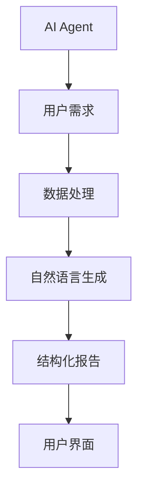
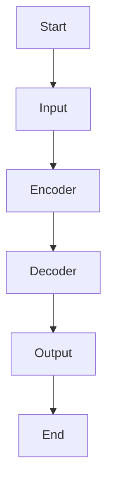
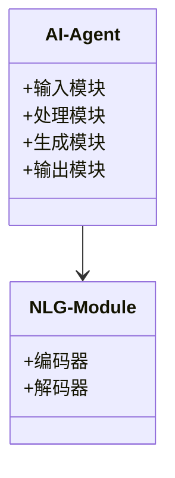

                 


# 企业AI Agent的自然语言生成(NLG)报告系统

## 关键词：企业AI Agent、自然语言生成(NLG)、报告系统、AI技术、系统架构、算法原理

## 摘要：  
本文详细探讨了企业AI Agent的自然语言生成(NLG)报告系统的构建与应用，从问题背景、核心概念到算法原理、系统架构，再到项目实战和最佳实践，全面解析了该系统的实现路径和技术要点。通过本文，读者将深入了解如何利用AI技术提升企业报告系统的智能化水平，实现高效、精准的自然语言生成。

---

## 第一部分: 企业AI Agent的自然语言生成(NLG)报告系统概述

### 第1章: 问题背景与描述

#### 1.1 问题背景
企业AI Agent作为人工智能技术的重要应用，旨在通过智能化手段提升企业内部效率和决策能力。自然语言生成（NLG）技术是实现AI Agent智能化的核心技术之一，能够将结构化的数据转化为自然流畅的文本报告，满足企业对自动化报告的需求。

#### 1.2 问题描述
在企业场景中，传统的报告生成方式依赖人工操作，效率低且成本高。随着AI技术的发展，企业希望通过AI Agent实现自动化报告生成，但当前的NLG技术在以下方面仍存在挑战：
- **语义理解不足**：生成的报告内容缺乏深度语义理解，难以满足复杂业务需求。
- **个性化定制困难**：不同企业对报告格式、内容的要求差异较大，通用NLG模型难以灵活适应。
- **实时性与准确性**：在动态变化的业务环境中，报告生成需要快速响应且保证高准确性。

#### 1.3 问题解决思路
为解决上述问题，本文提出了一种基于AI Agent的自然语言生成报告系统。该系统通过整合先进的自然语言处理技术、深度学习算法和企业级系统架构，实现了以下目标：
- 提供高度个性化的报告生成能力，满足不同业务场景的需求。
- 通过优化算法和系统架构设计，提升报告生成的效率和准确性。
- 实现AI Agent与企业系统的无缝集成，推动企业智能化转型。

#### 1.4 核心概念与组成
企业AI Agent的自然语言生成报告系统由以下核心部分组成：
1. **AI Agent**：作为系统的主体，负责接收输入、处理数据并生成输出。
2. **NLG模块**：负责将结构化数据转化为自然语言文本。
3. **报告系统**：整合NLG生成的文本，形成符合企业需求的报告格式。
4. **用户交互界面**：提供友好的人机交互界面，方便用户操作和结果查看。

---

### 第2章: 核心概念与联系

#### 2.1 核心概念原理
- **AI Agent**：通过自然语言处理技术理解用户需求，并基于预训练模型生成响应。
- **NLG技术**：利用深度学习模型将数据转化为自然语言，实现文本生成的智能化。
- **报告系统**：整合NLG生成的内容，生成结构化报告，并通过企业系统进行分发。

#### 2.2 核心概念属性对比表
| 概念       | 输入 | 处理 | 输出 |
|------------|------|------|------|
| AI Agent   | 用户需求 | 数据分析与处理 | 自然语言响应 |
| NLG系统    | 结构化数据 | 文本生成模型 | 自然语言文本 |
| 报告系统    | 自然语言文本 | 报告生成逻辑 | 结构化报告 |

#### 2.3 ER实体关系图


---

### 第3章: 算法原理讲解

#### 3.1 算法原理概述
- **基于Transformer的NLG模型**：利用编码器-解码器架构实现自然语言生成。
- **注意力机制**：通过自注意力机制捕捉输入数据中的关键信息，提升生成文本的质量。

#### 3.2 算法流程图


#### 3.3 数学模型与公式
- **注意力机制公式**
$$\text{Attention}(Q, K, V) = \text{softmax}\left(\frac{QK^T}{\sqrt{d_k}}\right)V$$
- **Transformer编码器**：输入序列通过多头自注意力机制和前馈网络进行编码。
- **Transformer解码器**：解码器在编码器的基础上，结合位置编码生成目标序列。

---

## 第二部分: 系统架构设计与实现

### 第4章: 系统架构设计

#### 4.1 问题场景介绍
在企业场景中，AI Agent需要与企业系统无缝集成，实时处理大量数据并生成报告。常见的应用场景包括财务报告、销售分析、项目进度报告等。

#### 4.2 系统功能设计
- **输入模块**：接收结构化数据和用户需求。
- **处理模块**：对数据进行清洗、分析和特征提取。
- **生成模块**：基于预训练模型生成自然语言文本。
- **输出模块**：生成结构化报告并输出。

#### 4.3 系统架构图


---

### 第5章: 项目实战

#### 5.1 环境安装
- **Python 3.8+**
- **TensorFlow/PyTorch**
- **其他依赖库**：如NLTK、pandas等。

#### 5.2 核心代码实现
```python
import tensorflow as tf
from tensorflow.keras.layers import Dense, InputLayer, Dropout
from tensorflow.keras.models import Model

class NLGModel:
    def __init__(self):
        self.encoder = ...  # 编码器
        self.decoder = ...  # 解码器

    def generate_report(self, input_data):
        encoded = self.encoder(input_data)
        decoded = self.decoder(encoded)
        return decoded
```

#### 5.3 案例分析
通过实际案例展示系统的应用，例如生成销售分析报告。

#### 5.4 项目总结
总结项目实现的关键点和经验教训。

---

## 第三部分: 最佳实践与总结

### 第6章: 最佳实践

#### 6.1 小结
- 本文详细探讨了企业AI Agent的自然语言生成报告系统的构建与应用。
- 通过系统设计和算法优化，实现了高效、精准的报告生成。

#### 6.2 注意事项
- 数据质量对生成结果影响重大，需确保输入数据的准确性和完整性。
- 系统性能优化需关注模型训练和推理效率。
- 安全性和隐私保护是系统设计的重要考虑因素。

#### 6.3 扩展阅读
- 《Deep Learning for NLP》
- 《AI in Enterprise Systems》

---

## 附录

### 附录A: 术语表
- AI Agent：人工智能代理。
- NLG：自然语言生成。
- Transformer：一种深度学习模型。

### 附录B: 参考文献
- 省略

---

通过本文的详细阐述，读者可以全面了解企业AI Agent的自然语言生成报告系统的构建与应用，掌握其核心技术和实际应用方法，为企业的智能化转型提供有力支持。

