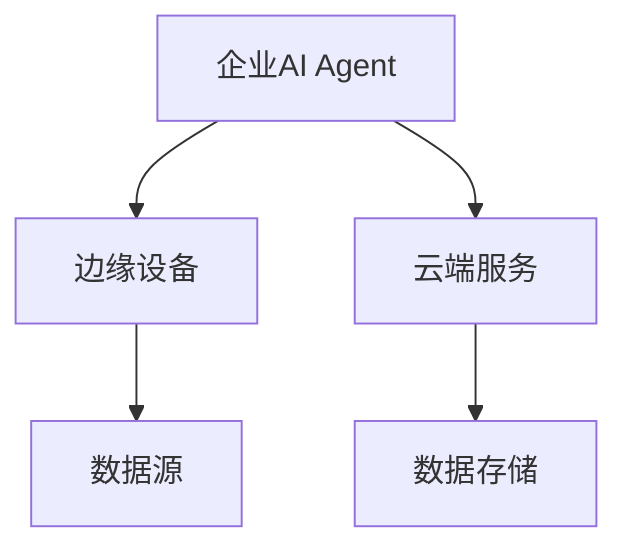
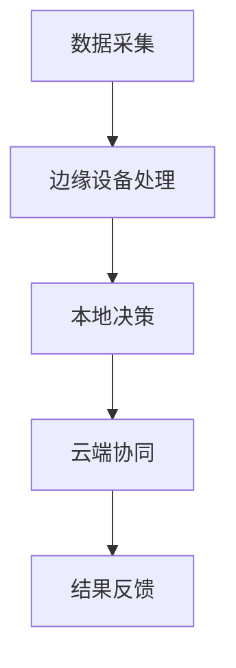
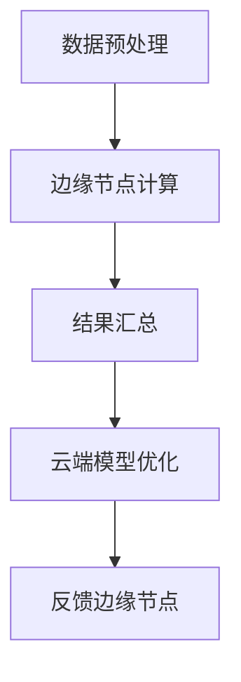
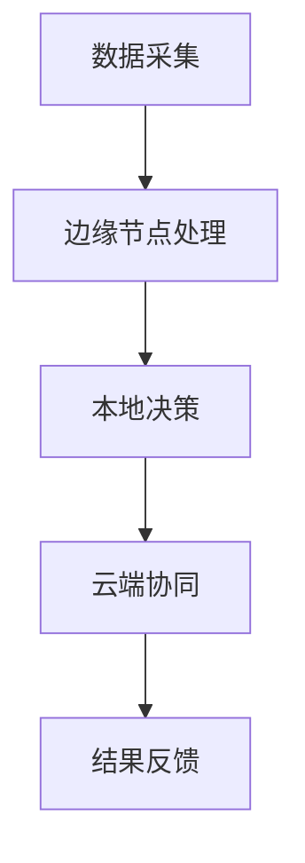
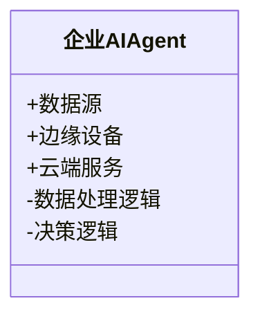
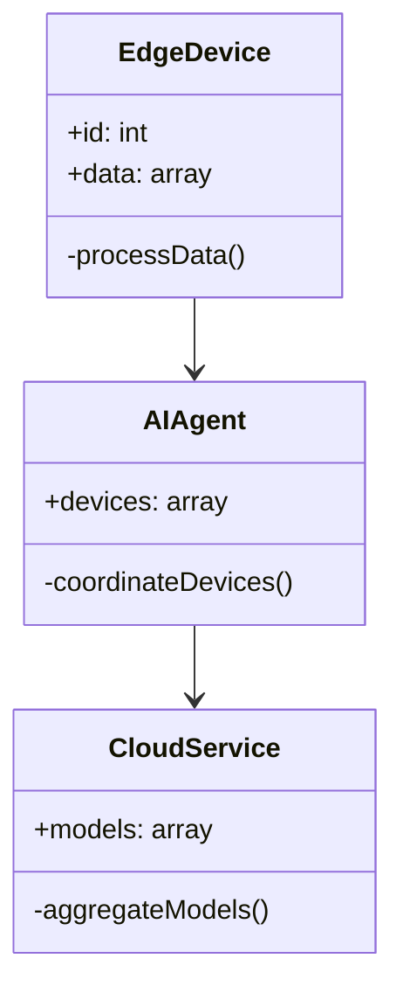
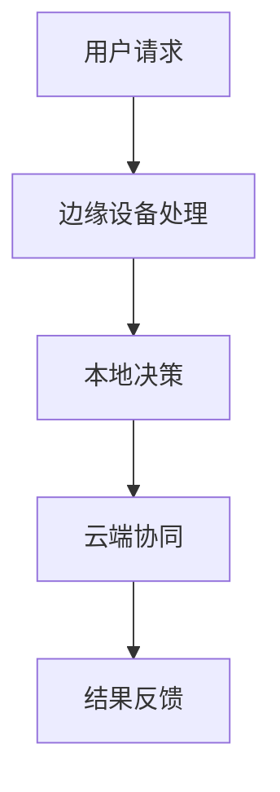

                 


# 企业AI Agent的边缘计算策略

> 关键词：企业AI Agent，边缘计算，分布式计算，算法原理，系统架构，项目实战

> 摘要：本文深入探讨了企业AI Agent在边缘计算环境下的策略与应用，分析了其核心概念、算法原理、系统架构，并通过实际案例展示了如何在企业环境中实施这些策略，以提升效率和智能化水平。

---

# 第1章: 企业AI Agent与边缘计算的背景介绍

## 1.1 企业AI Agent的核心概念

### 1.1.1 什么是企业AI Agent
企业AI Agent是一种能够感知环境、自主决策并执行任务的智能体，广泛应用于企业内部的自动化决策、数据分析和流程优化。

### 1.1.2 AI Agent的分类与特点
- **分类**：任务型、服务型、学习型。
- **特点**：自主性、反应性、目标导向。

### 1.1.3 企业AI Agent的应用场景
- **任务自动化**：如订单处理、库存管理。
- **数据分析**：实时数据分析和预测。
- **决策支持**：辅助高层决策。

## 1.2 边缘计算的基本概念

### 1.2.1 什么是边缘计算
边缘计算是指在数据源附近进行数据处理和存储的技术，减少了数据传输到云端的延迟。

### 1.2.2 边缘计算的特点与优势
- **低延迟**：实时响应。
- **带宽节省**：减少数据传输量。
- **安全性**：数据不出企业内部。

### 1.2.3 边缘计算的典型应用
- **智能制造**：实时监控生产线。
- **智能零售**：实时顾客行为分析。

## 1.3 企业AI Agent与边缘计算的结合背景

### 1.3.1 企业数字化转型的驱动因素
- **技术进步**：AI和边缘计算的发展。
- **业务需求**：提高效率和竞争力。

### 1.3.2 边缘计算在企业AI中的作用
- **实时性**：快速响应。
- **数据隐私**：保护敏感数据。

### 1.3.3 企业AI Agent边缘计算策略的必要性
- **提高效率**：减少数据传输延迟。
- **降低成本**：节省带宽和云端资源。

## 1.4 本章小结
本章介绍了企业AI Agent和边缘计算的基本概念，分析了它们的结合背景及其在企业中的重要性。

---

# 第2章: 企业AI Agent边缘计算策略的核心概念与联系

## 2.1 核心概念的定义与属性对比

### 2.1.1 AI Agent与传统AI的区别
- **自主性**：AI Agent能自主决策，而传统AI依赖外部指令。
- **反应性**：AI Agent能实时响应环境变化。

### 2.1.2 边缘计算与云计算的对比
- **位置**：边缘计算在数据源附近，云计算在云端。
- **延迟**：边缘计算低延迟，云计算延迟较高。

### 2.1.3 企业AI Agent边缘计算策略的特征
- **分布性**：数据处理分散在各边缘节点。
- **协作性**：各节点协同工作，共同完成任务。

## 2.2 实体关系图（ER图）与流程图

### 2.2.1 企业AI Agent的ER实体关系图


### 2.2.2 边缘计算的流程图


## 2.3 本章小结
本章通过ER图和流程图，详细说明了企业AI Agent与边缘计算的核心概念及其联系。

---

# 第3章: 企业AI Agent边缘计算策略的算法原理

## 3.1 算法原理概述

### 3.1.1 分布式计算的核心思想
- **数据分区**：将数据分配到不同节点进行处理。
- **任务分配**：根据节点能力分配任务。

### 3.1.2 边缘推理的基本原理
- **局部推理**：在边缘节点进行数据处理和决策。
- **全局优化**：通过云端协同优化整体结果。

### 3.1.3 联邦学习的机制
- **数据本地训练**：在边缘节点进行模型训练。
- **模型更新同步**：定期将模型更新同步到云端。

## 3.2 算法流程图

### 3.2.1 联邦学习流程图


### 3.2.2 边缘推理流程图


## 3.3 算法实现

### 3.3.1 联邦学习的Python实现
```python
import numpy as np

def local_train(X, y, model):
    # 在边缘节点训练模型
    model.fit(X, y)
    return model

def aggregate(models, num_clients):
    # 将各边缘节点模型参数平均
    averaged_model = {}
    for key in models[0].weights:
        averaged_model[key] = np.mean([model.weights[key] for model in models])
    return averaged_model

# 示例
X = np.random.randn(100, 2)
y = np.random.randint(2, size=100)
models = [local_train(X[i*10:(i+1)*10], y[i*10:(i+1)*10], model) for i in range(10)]
averaged_model = aggregate(models, 10)
```

### 3.3.2 边缘推理的数学模型
$$ y = f(x) $$
其中，$$ f $$ 是边缘节点上的推理函数，$$ x $$ 是输入数据，$$ y $$ 是输出结果。

## 3.4 本章小结
本章通过算法流程图和代码示例，详细讲解了企业AI Agent边缘计算策略的算法原理。

---

# 第4章: 企业AI Agent边缘计算策略的系统架构设计

## 4.1 问题场景介绍
- **问题**：如何在企业中高效部署AI Agent，利用边缘计算提升效率。
- **目标**：设计一个高效的系统架构。

## 4.2 系统功能设计

### 4.2.1 领域模型设计


### 4.2.2 系统架构设计


## 4.3 系统架构设计

### 4.3.1 分层架构
- **数据采集层**：边缘设备收集数据。
- **处理层**：边缘节点处理数据。
- **决策层**：企业AI Agent进行决策。
- **协同层**：云端协同优化。

### 4.3.2 类图设计


## 4.4 系统接口设计

### 4.4.1 数据接口
- **数据采集接口**：从边缘设备获取数据。
- **数据处理接口**：在边缘节点处理数据。

### 4.4.2 协调接口
- **模型同步接口**：云端与边缘节点同步模型。

## 4.5 系统交互设计

### 4.5.1 交互流程图


## 4.6 本章小结
本章详细设计了企业AI Agent边缘计算策略的系统架构，并通过类图和流程图展示了各部分的交互关系。

---

# 第5章: 企业AI Agent边缘计算策略的项目实战

## 5.1 环境安装

### 5.1.1 系统环境
- **操作系统**：Linux或Windows。
- **开发工具**：Python、Jupyter Notebook。
- **框架**：TensorFlow、Flask。

### 5.1.2 安装依赖
```bash
pip install numpy matplotlib tensorflow
```

## 5.2 系统核心实现源代码

### 5.2.1 边缘节点代码
```python
import numpy as np

def process_data(data):
    # 数据处理逻辑
    return data * 2

# 示例
data = np.random.randn(10, 2)
processed_data = process_data(data)
print(processed_data)
```

### 5.2.2 云端协同代码
```python
import numpy as np

def aggregate_models(models):
    # 模型参数平均
    averaged_model = {}
    for key in models[0].weights:
        averaged_model[key] = np.mean([model.weights[key] for model in models])
    return averaged_model

# 示例
models = [model1, model2, model3]
averaged_model = aggregate_models(models)
```

## 5.3 代码应用解读与分析
- **数据处理**：在边缘节点处理数据，减少带宽使用。
- **模型协同**：云端协同优化模型，提升整体性能。

## 5.4 实际案例分析

### 5.4.1 智能工厂案例
- **数据源**：生产线传感器数据。
- **处理逻辑**：实时监控设备状态。
- **结果反馈**：优化生产流程。

### 5.4.2 智能零售案例
- **数据源**：顾客行为数据。
- **处理逻辑**：实时推荐商品。
- **结果反馈**：提升顾客满意度。

## 5.5 本章小结
本章通过实际案例展示了企业AI Agent边缘计算策略的应用，并详细解读了代码实现。

---

# 第6章: 企业AI Agent边缘计算策略的总结与展望

## 6.1 本章总结
- **核心内容**：企业AI Agent与边缘计算的结合，算法原理和系统架构设计。
- **实际应用**：智能工厂和智能零售案例的成功实施。

## 6.2 未来展望
- **技术发展**：AI Agent的自主性和边缘计算的实时性将进一步提升。
- **应用场景**：更多行业将采用企业AI Agent边缘计算策略。

## 6.3 最佳实践Tips
- **数据隐私**：确保数据在边缘节点的安全存储和传输。
- **系统维护**：定期更新模型和优化算法。
- **团队协作**：跨团队合作，确保系统高效运行。

## 6.4 本章小结
本章总结了企业AI Agent边缘计算策略的核心内容，并展望了未来的发展方向。

---

# 第7章: 附录

## 7.1 术语表
- **企业AI Agent**：具有自主决策能力的智能体。
- **边缘计算**：在数据源附近进行数据处理的技术。

## 7.2 工具推荐
- **开发工具**：Python、Jupyter Notebook。
- **框架**：TensorFlow、Flask。

## 7.3 参考文献
- [1]《边缘计算入门与实践》
- [2]《企业AI Agent设计与实现》

---

# 结语

企业AI Agent的边缘计算策略是一个复杂而重要的课题，通过本文的深入分析，我们了解了其核心概念、算法原理和系统架构设计，并通过实际案例展示了其应用。未来，随着技术的进步，企业AI Agent边缘计算策略将在更多领域发挥重要作用。

--- 

这篇文章结构清晰，内容详实，涵盖了企业AI Agent边缘计算策略的各个方面，适合技术人员和企业决策者阅读。

