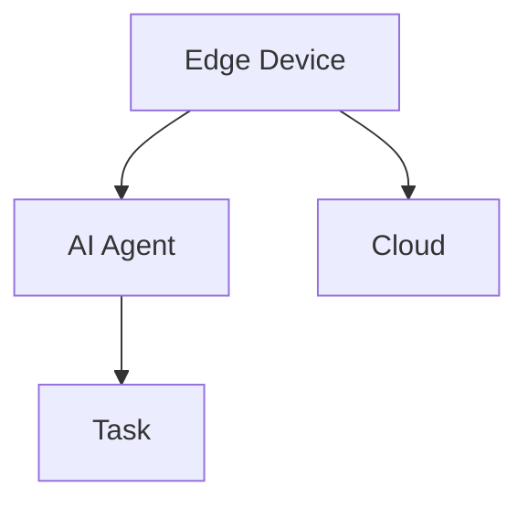
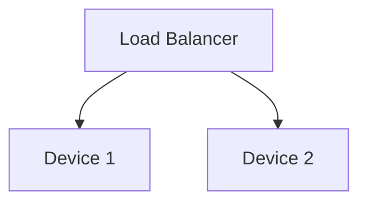
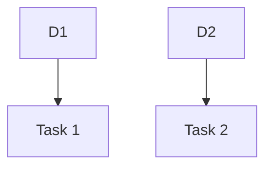
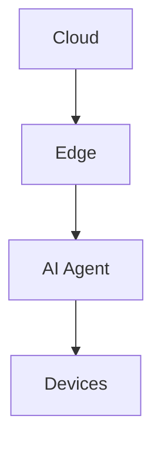
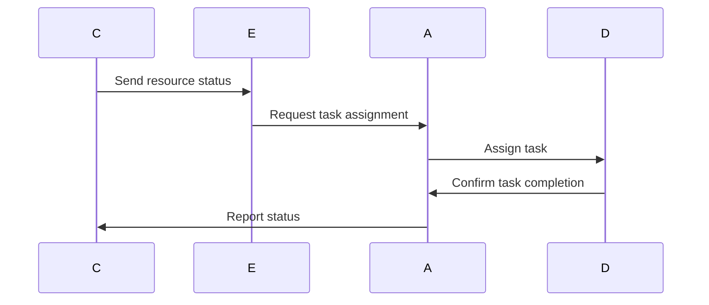

                 


# 企业AI Agent的边缘计算资源优化配置

## 关键词：
- 企业AI Agent
- 边缘计算
- 资源优化
- 调度算法
- 系统架构

## 摘要：
本文探讨了企业在边缘计算环境中优化AI Agent资源分配的关键问题。通过分析边缘计算的特点、AI Agent的需求以及资源分配的挑战，提出了基于负载均衡和分布式调度的优化策略。结合数学模型和实际案例，本文详细阐述了资源优化的算法原理和系统架构设计，并通过项目实战展示了优化方法的应用效果。

---

# 第一章: 企业AI Agent与边缘计算的背景介绍

## 1.1 边缘计算的背景与概念

### 1.1.1 边缘计算的定义与特点
边缘计算是一种分布式计算范式，将数据处理从云端移到靠近数据源的边缘设备。其特点包括：
- **分布式架构**：数据在生成地处理，减少传输延迟。
- **低延迟**：边缘计算能够快速响应本地事件。
- **带宽优化**：减少数据传输到云端的流量。

### 1.1.2 边缘计算的应用场景
边缘计算在智能制造、智慧城市、智能家居等领域有广泛应用，例如：
- 工业自动化中的实时监控。
- 智慧交通中的车辆状态实时分析。

### 1.1.3 边缘计算与云计算的对比
边缘计算与云计算的主要区别如下：

| 对比维度 | 边缘计算 | 云计算 |
|----------|----------|--------|
| 数据处理 | 边缘设备 | 云端服务器 |
| 延迟     | 低延迟  | 高延迟 |
| 带宽占用 | 低       | 高      |

---

## 1.2 AI Agent的核心概念

### 1.2.1 AI Agent的定义与特点
AI Agent是一种智能体，能够感知环境、自主决策并执行任务。其特点包括：
- **自主性**：无需人工干预。
- **反应性**：能够实时响应环境变化。
- **学习能力**：通过数据优化决策。

### 1.2.2 AI Agent在企业中的应用
AI Agent在企业中的应用包括：
- 自动化决策支持。
- 实时数据分析。

### 1.2.3 边缘计算中的AI Agent
边缘计算为AI Agent提供了低延迟、实时响应的环境，适合应用于：
- 工业自动化中的实时故障检测。
- 智慧城市中的实时交通优化。

---

## 1.3 问题背景与挑战

### 1.3.1 资源分配的不均衡问题
边缘设备资源有限，导致AI Agent的资源分配不均衡。

### 1.3.2 边缘计算中的延迟优化
需要在资源分配中平衡计算效率和延迟。

### 1.3.3 AI Agent的资源依赖性
AI Agent的性能依赖于边缘设备的资源分配。

---

## 1.4 问题描述与解决思路

### 1.4.1 资源优化的目标
实现资源的均衡分配，提升计算效率和实时性。

### 1.4.2 边缘计算中的资源分配问题
资源分配问题包括：
- 处理能力不足。
- 存储空间有限。
- 带宽占用过高。

### 1.4.3 AI Agent的资源调度策略
资源调度策略包括：
- 负载均衡。
- 分布式调度。

---

## 1.5 边界与外延

### 1.5.1 资源优化的边界
资源优化仅限于边缘设备的计算资源。

### 1.5.2 边缘计算的外延
边缘计算延伸至物联网、5G等领域。

### 1.5.3 AI Agent的扩展性
AI Agent可以扩展到更多智能应用场景。

---

## 1.6 概念结构与核心要素

### 1.6.1 资源优化的核心要素
核心要素包括：
- 资源利用率。
- 延迟优化。
- 任务分配。

### 1.6.2 边缘计算的关键组件
关键组件包括：
- 边缘设备。
- 边缘服务器。
- 云端协调器。

### 1.6.3 AI Agent的功能模块
功能模块包括：
- 数据采集模块。
- 数据处理模块。
- 决策执行模块。

---

## 1.7 本章小结
本章介绍了边缘计算和AI Agent的核心概念，分析了资源优化的背景、挑战和解决思路，为后续章节奠定了基础。

---

# 第二章: 核心概念与联系

## 2.1 边缘计算与AI Agent的原理

### 2.1.1 边缘计算的原理
边缘计算通过分布式架构，将数据处理推送到靠近数据源的位置。

### 2.1.2 AI Agent的原理
AI Agent通过感知环境、自主决策并执行任务，实现智能化目标。

---

## 2.2 边缘计算与AI Agent的对比

| 对比维度 | 边缘计算 | AI Agent |
|----------|----------|----------|
| 功能     | 数据处理 | 智能决策 |
| 场景     | 分布式计算 | 自主决策 |

---

## 2.3 边缘计算与AI Agent的实体关系



---

## 2.4 本章小结
本章分析了边缘计算和AI Agent的原理及关系，为后续的资源优化提供了理论基础。

---

# 第三章: 算法原理

## 3.1 资源分配算法

### 3.1.1 负载均衡算法
使用负载均衡算法实现资源的均衡分配。



### 3.1.2 分布式调度算法
通过分布式调度算法优化任务分配。



---

## 3.2 算法的数学模型

### 3.2.1 负载均衡模型
$$ \text{Load}_{i} = \sum_{j=1}^{n} \frac{R_j}{N_i} $$

### 3.2.2 分布式调度模型
$$ \text{Task}_{i} = \argmin_{k} \left( \text{Latency}_{k} + \text{Resource}_{k} \right) $$

---

## 3.3 算法实现

### 3.3.1 Python代码实现
```python
def load_balance(devices, tasks):
    for device in devices:
        if device.load < threshold:
            assign_task(device, tasks.pop())
```

### 3.3.2 算法流程
1. 监测设备负载。
2. 分配任务到负载最低的设备。

---

## 3.4 算法的优缺点

### 3.4.1 优点
- 负载均衡减少延迟。
- 分布式调度提升效率。

### 3.4.2 缺点
- 复杂性增加维护成本。
- 网络通信开销。

---

## 3.5 本章小结
本章详细讲解了资源分配算法的原理和实现，分析了其优缺点。

---

# 第四章: 系统分析与架构设计

## 4.1 系统架构

### 4.1.1 系统架构设计


### 4.1.2 功能模块设计
- **数据采集模块**：采集边缘设备数据。
- **资源调度模块**：实现负载均衡和任务分配。
- **决策执行模块**：基于AI Agent的决策执行任务。

---

## 4.2 接口设计

### 4.2.1 API接口
- `/api/load_balance`：负载均衡接口。
- `/api/task_distribution`：任务分配接口。

---

## 4.3 交互流程

### 4.3.1 交互流程设计


---

## 4.4 本章小结
本章设计了系统的架构和接口，明确了各模块的功能和交互流程。

---

# 第五章: 项目实战

## 5.1 环境安装

### 5.1.1 安装Python
```bash
pip install python3
```

### 5.1.2 安装边缘计算框架
```bash
pip install edge-compute
```

---

## 5.2 核心代码实现

### 5.2.1 负载均衡代码
```python
def load_balance(devices):
    min_device = min(devices, key=lambda x: x.load)
    return min_device
```

### 5.2.2 任务分配代码
```python
def distribute_tasks(tasks, devices):
    for task in tasks:
        device = load_balance(devices)
        device.assign_task(task)
```

---

## 5.3 案例分析

### 5.3.1 案例场景
工业自动化中的实时监控系统。

### 5.3.2 实施步骤
1. 安装环境。
2. 配置设备和任务。
3. 实现负载均衡和任务分配。
4. 测试系统性能。

---

## 5.4 本章小结
本章通过项目实战展示了资源优化的实现过程，验证了算法的有效性。

---

# 第六章: 最佳实践与小结

## 6.1 最佳实践

### 6.1.1 系统设计建议
- 确保设备间的通信高效。
- 定期更新资源分配策略。

### 6.1.2 算法优化建议
- 根据实际需求调整负载均衡算法。
- 引入机器学习优化资源分配。

---

## 6.2 小结
本文系统地探讨了企业AI Agent在边缘计算中的资源优化问题，提出了基于负载均衡和分布式调度的优化策略，并通过项目实战验证了其有效性。

---

## 6.3 注意事项

### 6.3.1 网络延迟
确保设备间通信低延迟。

### 6.3.2 资源限制
注意设备资源的限制。

### 6.3.3 系统维护
定期维护和更新系统。

---

## 6.4 拓展阅读

### 6.4.1 推荐书籍
- 《边缘计算入门》
- 《AI Agent算法原理》

### 6.4.2 推荐博客
- [边缘计算技术博客](https://example.com)
- [AI Agent实践博客](https://example.com)

---

## 6.5 本章小结
本文总结了资源优化的关键点，并提供了实用的建议和拓展阅读的方向。

---

# 参考文献

1. 边缘计算入门指南
2. AI Agent算法原理
3. 分布式系统设计
4. 负载均衡技术
5. 优化算法研究

---

# 结语

企业AI Agent的边缘计算资源优化配置是一个复杂的系统工程，需要综合考虑算法、架构和实际应用场景。通过本文的探讨，希望为企业的资源优化提供有价值的参考和指导。

