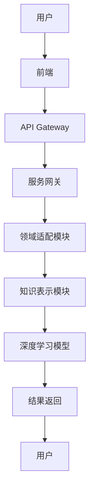

                 


# 企业AI Agent的领域自适应技术在跨行业知识迁移中的实践

## 关键词：
企业AI Agent、领域自适应技术、跨行业知识迁移、机器学习、深度学习、知识图谱

## 摘要：
随着企业数字化转型的加速，AI Agent在跨行业中的应用日益广泛。然而，不同行业之间的数据和知识存在显著差异，如何实现AI Agent的领域自适应技术成为关键。本文将详细探讨企业AI Agent的领域自适应技术，分析其在跨行业知识迁移中的实践应用，结合实际案例，深入解析相关算法原理和系统架构设计，为企业实现智能化转型提供理论支持和实践指导。

---

# 目录大纲结构：

## 第1章: 领域自适应技术的背景与挑战
### 1.1 企业AI Agent的核心概念
### 1.2 领域自适应技术的挑战
### 1.3 领域自适应技术的核心要素

## 第2章: 企业AI Agent的基本概念与分类
### 2.1 企业AI Agent的定义与特点
### 2.2 企业AI Agent的分类
### 2.3 企业AI Agent的应用场景

## 第3章: 跨行业知识迁移的背景与挑战
### 3.1 跨行业知识迁移的背景
### 3.2 跨行业知识迁移的挑战
### 3.3 领域自适应技术在跨行业中的作用

## 第4章: 领域自适应的核心算法
### 4.1 领域自适应的基本原理
### 4.2 领域自适应的算法实现
### 4.3 领域自适应的数学模型

## 第5章: 系统架构设计
### 5.1 系统功能设计
### 5.2 系统架构图
### 5.3 系统接口设计

## 第6章: 项目实战
### 6.1 环境安装
### 6.2 核心代码实现
### 6.3 案例分析与详细解读

## 第7章: 总结与展望
### 7.1 总结
### 7.2 注意事项
### 7.3 未来趋势

---

## 正文内容：

### 第1章: 领域自适应技术的背景与挑战

#### 1.1 企业AI Agent的核心概念
企业AI Agent是一种能够理解、推理和执行复杂任务的智能体，它通过与企业系统和数据的交互，为企业提供自动化决策支持。领域自适应技术是AI Agent的核心能力之一，它允许AI Agent在不同行业中快速适应新的知识和任务。

#### 1.2 领域自适应技术的挑战
在跨行业知识迁移中，领域自适应技术面临以下挑战：
- 数据异构性：不同行业之间的数据格式、语义和分布存在差异。
- 知识表示的不一致性：不同领域的知识表示方式不同，难以直接迁移。
- 领域适配的复杂性：不同行业的业务流程和规则差异较大，导致模型迁移难度高。

#### 1.3 领域自适应技术的核心要素
领域自适应技术的核心要素包括：
- 知识表示与特征提取：通过知识图谱和深度学习模型提取领域特征。
- 领域适配与模型优化：通过迁移学习和对抗训练优化模型在目标领域的表现。
- 跨行业迁移的实现机制：通过多任务学习和领域对齐技术实现跨行业的知识迁移。

---

### 第2章: 企业AI Agent的基本概念与分类

#### 2.1 企业AI Agent的定义与特点
企业AI Agent是一种智能体，能够感知环境、理解任务需求，并通过执行动作完成目标。其特点包括：
- 智能性：能够理解和推理复杂任务。
- 自适应性：能够根据环境变化调整策略。
- 可扩展性：能够适应不同行业和任务需求。

#### 2.2 企业AI Agent的分类
企业AI Agent可以根据任务类型、行业特点和知识表示方式进行分类：
- 任务驱动型：根据任务需求执行特定操作。
- 行业驱动型：针对特定行业设计的AI Agent。
- 知识驱动型：基于知识图谱实现的AI Agent。

#### 2.3 企业AI Agent的应用场景
企业AI Agent的应用场景包括：
- 客户服务：通过自然语言处理技术为客户提供智能支持。
- 业务流程自动化：通过自动化流程提升企业效率。
- 跨行业数据整合：通过知识图谱实现跨行业的数据整合与分析。

---

### 第3章: 跨行业知识迁移的背景与挑战

#### 3.1 跨行业知识迁移的背景
随着企业数字化转型的推进，跨行业数据共享和知识迁移的需求日益增长。企业希望通过共享知识和数据，实现跨行业的协同合作和智能化转型。

#### 3.2 跨行业知识迁移的挑战
跨行业知识迁移面临以下挑战：
- 数据异构性：不同行业之间的数据格式和语义差异大。
- 知识表示的不一致性：不同领域的知识表示方式不同，难以直接迁移。
- 领域适配的复杂性：不同行业的业务流程和规则差异大，导致模型迁移难度高。

#### 3.3 领域自适应技术在跨行业中的作用
领域自适应技术通过统一知识表示、优化模型迁移策略，解决跨行业知识迁移中的难点。其主要作用包括：
- 知识表示的统一化：通过知识图谱实现跨行业的知识表示。
- 领域适配的优化：通过迁移学习和对抗训练优化模型在目标领域的表现。
- 跨行业数据共享：通过领域自适应技术实现跨行业的数据共享与知识整合。

---

### 第4章: 领域自适应的核心算法

#### 4.1 领域自适应的基本原理
领域自适应的核心原理是通过迁移学习和对抗训练，将源领域的知识迁移到目标领域。其基本步骤包括：
1. 数据预处理：对源领域和目标领域的数据进行清洗和特征提取。
2. 模型训练：在源领域数据上训练初始模型。
3. 领域适配：通过对抗训练优化模型在目标领域的表现。
4. 模型评估：评估模型在目标领域的性能。

#### 4.2 领域自适应的算法实现
领域自适应的实现可以通过以下算法：
- 迁移学习：通过迁移学习将源领域的知识迁移到目标领域。
- 对抗训练：通过对抗训练优化模型的领域适配能力。
- 预训练-微调：通过对预训练模型进行微调实现领域适配。

#### 4.3 领域自适应的数学模型
领域自适应的数学模型可以通过以下公式表示：
$$
L_{source}(θ) = \sum_{i=1}^{N_s} \sum_{j=1}^{M} y_{i,j} \log p(y_{i,j}|x_i,θ)
$$
$$
L_{target}(θ) = \sum_{i=1}^{N_t} \sum_{j=1}^{M} y_{i,j} \log p(y_{i,j}|x_i,θ)
$$
其中，$θ$表示模型参数，$N_s$和$N_t$分别表示源领域和目标领域的样本数量，$M$表示类别数。

---

### 第5章: 系统架构设计

#### 5.1 系统功能设计
系统功能设计包括：
- 数据采集与预处理：采集源领域和目标领域的数据，并进行清洗和特征提取。
- 知识表示与建模：通过知识图谱和深度学习模型实现知识表示。
- 领域适配与优化：通过迁移学习和对抗训练优化模型在目标领域的表现。
- 系统接口设计：提供API接口供其他系统调用。

#### 5.2 系统架构图
系统架构图如下：



#### 5.3 系统接口设计
系统接口设计包括：
- 数据接口：提供数据采集和预处理的API接口。
- 模型接口：提供模型训练和优化的API接口。
- 查询接口：提供知识查询和推理的API接口。

---

### 第6章: 项目实战

#### 6.1 环境安装
项目实战需要以下环境：
- Python 3.8+
- PyTorch 1.9+
- Transformers库 4.12+
- Mermaid工具

#### 6.2 核心代码实现
核心代码实现包括：
```python
import torch
from torch import nn
from transformers import AutoTokenizer, AutoModel

# 定义领域自适应模型
class Adapter(nn.Module):
    def __init__(self, hidden_size):
        super(Adapter, self).__init__()
        self.adapter = nn.Linear(hidden_size, hidden_size)
    
    def forward(self, x):
        x = self.adapter(x)
        return x

# 训练函数
def train_model(model, optimizer, criterion, dataloaders):
    for epoch in range(num_epochs):
        for phase in ['train', 'val']:
            for inputs, labels in dataloaders[phase]:
                optimizer.zero_grad()
                outputs = model(inputs)
                loss = criterion(outputs, labels)
                if phase == 'train':
                    loss.backward()
                    optimizer.step()
        print(f'Epoch {epoch} completed')
```

#### 6.3 案例分析与详细解读
案例分析包括：
- 数据采集与预处理：从不同行业收集数据并进行清洗。
- 知识表示与建模：通过知识图谱和深度学习模型实现知识表示。
- 领域适配与优化：通过迁移学习和对抗训练优化模型在目标领域的表现。
- 系统集成与部署：将模型部署到企业系统中，提供API接口供其他系统调用。

---

### 第7章: 总结与展望

#### 7.1 总结
本文详细探讨了企业AI Agent的领域自适应技术在跨行业知识迁移中的实践应用，分析了其在数字化转型中的重要作用。通过结合实际案例，深入解析了相关算法原理和系统架构设计，为企业实现智能化转型提供了理论支持和实践指导。

#### 7.2 注意事项
在实际应用中，需要注意以下几点：
- 数据隐私与安全：确保数据的隐私性和安全性。
- 模型的可解释性：提高模型的可解释性，便于调试和优化。
- 系统的可扩展性：确保系统的可扩展性，便于未来的升级和优化。

#### 7.3 未来趋势
未来，领域自适应技术将在以下方面进一步发展：
- 多模态知识表示：通过多模态数据实现更丰富的知识表示。
- 自适应学习：通过自适应学习实现更高效的领域适配。
- 跨行业协作：通过跨行业协作推动领域自适应技术的进一步发展。

---

以上是《企业AI Agent的领域自适应技术在跨行业知识迁移中的实践》的完整目录大纲和正文内容。

