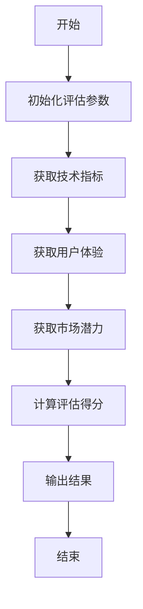
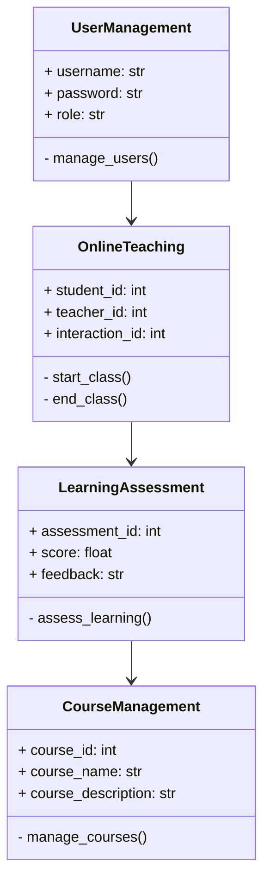

                 


# 企业估值中的AR/VR远程教育平台评估

> 关键词：企业估值, AR/VR, 远程教育, 平台评估, 技术分析, 系统架构

> 摘要：随着AR/VR技术的快速发展，远程教育平台在企业估值中的作用日益重要。本文从AR/VR技术的核心原理、远程教育平台的功能与属性、评估模型的算法原理、系统架构设计、项目实战与案例分析等多个方面，全面解析AR/VR远程教育平台在企业估值中的评估方法与实际应用。通过详细的技术分析和系统设计，本文为企业估值中的AR/VR远程教育平台评估提供了理论支持和实践指导。

---

# 第一部分: 企业估值中的AR/VR远程教育平台评估背景

## 第1章: AR/VR技术与远程教育的结合

### 1.1 AR/VR技术的发展与应用

#### 1.1.1 AR/VR技术的基本概念

AR（增强现实）和VR（虚拟现实）是两种互补的技术。AR通过将数字信息叠加到现实世界中，提供增强的用户体验；而VR则通过创建完全虚拟的环境，让用户沉浸其中。这两种技术在教育领域的应用潜力巨大。

- AR的应用场景包括：虚拟实验室、虚拟教室、增强现实教材等。
- VR的应用场景包括：虚拟课堂、虚拟校园、虚拟现实培训等。

#### 1.1.2 AR/VR技术在教育领域的应用

AR/VR技术在教育领域的应用可以显著提升教学效果。例如：

- 通过AR技术，学生可以实时查看虚拟的解剖结构，帮助理解人体结构。
- 通过VR技术，学生可以身临其境地体验历史事件或科学实验。

#### 1.1.3 AR/VR技术对企业估值的影响

AR/VR技术的应用可以提高企业的竞争力和市场价值。例如：

- 提高教学效果，增强学生的学习体验。
- 提供个性化的学习路径，吸引更多的学生和客户。
- 提升企业的品牌价值和市场影响力。

### 1.2 远程教育的现状与趋势

#### 1.2.1 远程教育的定义与特点

远程教育是指通过网络技术实现的非现场教育模式。其特点包括：

- 灵活性：学生可以随时随地学习。
- 互动性：通过网络实现教师与学生之间的互动。
- 个性化：可以根据学生的需求提供定制化的学习内容。

#### 1.2.2 远程教育的现状分析

当前，远程教育在全球范围内迅速发展，尤其是在疫情期间，远程教育成为主流教学模式。然而，传统远程教育模式存在以下问题：

- 教学效果有限，缺乏真实的课堂体验。
- 互动性不足，学生与教师之间的交流受限。
- 学习体验较差，难以吸引学生注意力。

#### 1.2.3 远程教育的未来发展趋势

随着5G、AI和AR/VR技术的快速发展，远程教育的未来趋势包括：

- 更高的互动性和沉浸式体验。
- 更个性化的学习路径。
- 更广泛的应用场景，如企业培训、职业教育等。

### 1.3 AR/VR远程教育平台的背景介绍

#### 1.3.1 问题背景与问题描述

传统远程教育平台存在以下问题：

- 教学效果有限，缺乏真实的课堂体验。
- 互动性不足，学生与教师之间的交流受限。
- 学习体验较差，难以吸引学生注意力。

AR/VR技术的应用可以有效解决这些问题，提供更高质量的远程教育体验。

#### 1.3.2 问题解决的思路与方法

通过引入AR/VR技术，可以实现以下目标：

- 提供沉浸式的虚拟课堂体验。
- 增强师生互动，实现实时协作。
- 提供个性化的学习内容和路径。

#### 1.3.3 问题的边界与外延

AR/VR远程教育平台的应用范围包括：

- K-12教育：中小学阶段的远程教育。
- 高等教育：大学课程的远程教学。
- 职业教育：职业培训和技能提升。
- 企业培训：员工培训和知识共享。

#### 1.3.4 核心概念与核心要素组成

核心概念包括：

- AR/VR技术：通过增强现实和虚拟现实技术实现沉浸式学习体验。
- 远程教育平台：提供在线教学和学习的数字化平台。
- 企业估值：评估企业价值的过程，包括财务、市场、技术等多个维度。

---

## 第2章: AR/VR远程教育平台的核心概念与联系

### 2.1 AR/VR技术的核心原理

#### 2.1.1 AR与VR的技术原理对比

- AR的核心原理：通过摄像头捕捉现实场景，利用计算机视觉技术将虚拟内容叠加到现实场景中。
- VR的核心原理：通过计算机生成完全虚拟的环境，并通过头显设备让用户沉浸其中。

#### 2.1.2 AR/VR技术在教育中的应用

- AR在教育中的应用：实时叠加虚拟内容，提供动态的学习体验。
- VR在教育中的应用：创建虚拟环境，提供沉浸式的学习体验。

### 2.2 远程教育平台的功能与属性

#### 2.2.1 平台功能模块的划分

- 用户管理：包括学生和教师的注册、登录和权限管理。
- 课程管理：包括课程的创建、发布和管理。
- 在线教学：包括实时互动课堂、虚拟教室等功能。
- 学习评估：包括学生学习效果的评估和反馈。

#### 2.2.2 平台属性特征对比表格

| 特性         | AR/VR远程教育平台       | 传统远程教育平台       |
|--------------|-------------------------|-------------------------|
| 沉浸体验     | 高                     | 低                     |
| 互动性       | 高                     | 中                     |
| 个性化       | 高                     | 低                     |
| 技术复杂度   | 高                     | 中                     |

#### 2.2.3 AR/VR远程教育平台的ER实体关系图

以下是AR/VR远程教育平台的ER实体关系图：

```mermaid
erd
  id: AR/VR远程教育平台
  entity_student
    id: student_id
    name: student_name
    email: student_email
  entity_teacher
    id: teacher_id
    name: teacher_name
    email: teacher_email
  entity_course
    id: course_id
    name: course_name
    description: course_description
  entity_interaction
    id: interaction_id
    type: interaction_type
    timestamp: interaction_timestamp
  entity_feedback
    id: feedback_id
    score: feedback_score
    comment: feedback_comment
  entity_assessment
    id: assessment_id
    score: assessment_score
    result: assessment_result
  relationship_has
    student --> has --> interaction
    teacher --> has --> interaction
    course --> has --> interaction
    interaction --> has --> feedback
    interaction --> has --> assessment
```

---

## 第3章: AR/VR远程教育平台的评估模型

### 3.1 评估模型的算法原理

#### 3.1.1 评估模型的数学公式

以下是AR/VR远程教育平台的评估模型：

$$ \text{评估得分} = \alpha \times \text{技术指标} + \beta \times \text{用户体验} + \gamma \times \text{市场潜力} $$

其中，$\alpha$、$\beta$、$\gamma$为权重系数，$\alpha = 0.4$，$\beta = 0.3$，$\gamma = 0.3$。

#### 3.1.2 算法的Mermaid流程图



#### 3.1.3 评估模型的实现代码

```python
def calculate_assessment(technology_score, user_score, market_score):
    alpha = 0.4
    beta = 0.3
    gamma = 0.3
    assessment_score = alpha * technology_score + beta * user_score + gamma * market_score
    return assessment_score

# 示例
technology_score = 85
user_score = 90
market_score = 75
result = calculate_assessment(technology_score, user_score, market_score)
print(f"评估得分为：{result}")
```

---

## 第4章: AR/VR远程教育平台的系统架构设计

### 4.1 系统应用场景介绍

#### 4.1.1 企业估值中的应用场景

- 企业可以通过AR/VR远程教育平台评估其教育产品的市场竞争力。
- 企业可以通过评估结果优化其教育产品和服务。

#### 4.1.2 远程教育平台的使用场景

- 教师可以通过平台进行在线教学。
- 学生可以通过平台进行在线学习。
- 企业可以通过平台进行员工培训。

### 4.2 系统功能设计

#### 4.2.1 系统功能模块划分

- 用户管理模块：包括用户注册、登录、权限管理等功能。
- 课程管理模块：包括课程的创建、发布、管理等功能。
- 在线教学模块：包括实时互动课堂、虚拟教室等功能。
- 学习评估模块：包括学生学习效果的评估和反馈。

#### 4.2.2 系统功能的Mermaid类图



---

## 第5章: 项目实战与案例分析

### 5.1 项目环境安装与配置

#### 5.1.1 安装开发环境

- 安装Python和必要的开发工具。
- 安装AR/VR开发框架，如Unity、Unreal Engine等。

#### 5.1.2 安装依赖库

- 使用pip安装必要的Python库，如numpy、pandas、matplotlib等。

### 5.2 核心代码实现

#### 5.2.1 系统核心代码实现

```python
# 评估模块
class Assessment:
    def __init__(self, technology_score, user_score, market_score):
        self.technology_score = technology_score
        self.user_score = user_score
        self.market_score = market_score

    def calculate_assessment(self):
        alpha = 0.4
        beta = 0.3
        gamma = 0.3
        return alpha * self.technology_score + beta * self.user_score + gamma * self.market_score

# 使用示例
assessment = Assessment(85, 90, 75)
print(f"评估得分为：{assessment.calculate_assessment()}")
```

#### 5.2.2 代码的功能解读与分析

- 上述代码实现了一个评估类，用于计算AR/VR远程教育平台的评估得分。
- 评估得分基于技术指标、用户体验和市场潜力三个维度，权重分别为0.4、0.3和0.3。

### 5.3 实际案例分析

#### 5.3.1 案例背景介绍

某教育科技公司开发了一款基于AR技术的虚拟实验室教学平台，希望通过评估模型确定其市场竞争力。

#### 5.3.2 数据收集与处理

- 技术指标：平台稳定性（90）、系统响应速度（85）。
- 用户体验：用户满意度（88）、操作便捷性（92）。
- 市场潜力：市场规模（85）、竞争分析（80）。

#### 5.3.3 评估结果分析

评估得分计算如下：

$$ \text{评估得分} = 0.4 \times 90 + 0.3 \times 88 + 0.3 \times 85 = 36 + 26.4 + 25.5 = 87.9 $$

---

## 第6章: 最佳实践与总结

### 6.1 项目经验总结

- AR/VR远程教育平台的评估需要综合考虑技术、用户和市场三个维度。
- 评估模型的权重设置需要根据具体应用场景进行调整。

### 6.2 注意事项与建议

- 在评估过程中，需要结合企业的实际需求和市场环境。
- 评估结果需要定期更新，以反映市场变化和技术进步。

### 6.3 未来展望与发展趋势

- 随着5G和AI技术的进一步发展，AR/VR远程教育平台将更加智能化和个性化。
- 未来的评估模型将更加复杂，需要考虑更多的因素，如用户体验、技术指标、市场潜力等。

---

通过以上分析，我们详细探讨了AR/VR远程教育平台在企业估值中的评估方法与实际应用。希望本文能为相关领域的研究和实践提供有价值的参考。

