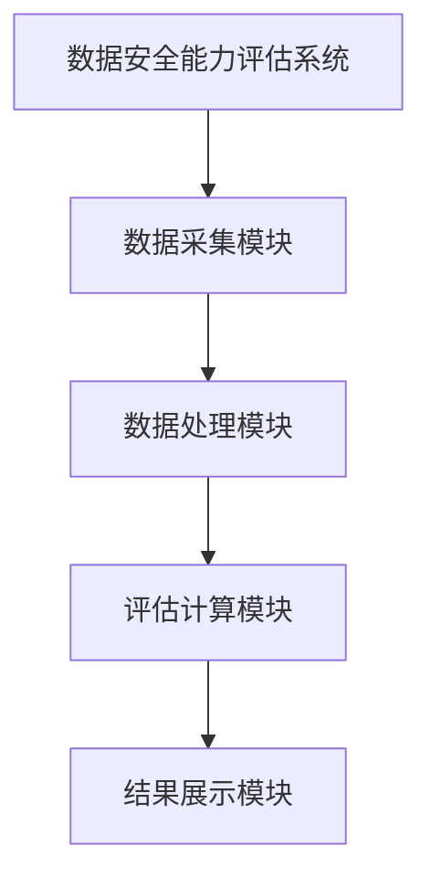
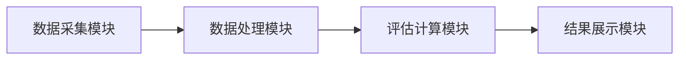

                 


# 企业估值中的数据安全能力评估

> 关键词：企业估值，数据安全，能力评估，数据资产，安全风险

> 摘要：随着数据成为企业的重要资产，数据安全能力在企业估值中的作用日益显著。本文从数据安全能力的定义、评估框架、算法原理、系统架构、项目实战、最佳实践等方面，详细探讨如何将数据安全能力纳入企业估值体系，为企业提供科学的评估方法和实践指导。

---

## 第一章：数据安全与企业估值的背景介绍

### 1.1 数据安全的重要性

#### 1.1.1 数据在企业中的价值
数据是企业的核心资产，广泛应用于决策支持、业务优化和创新。例如，零售企业通过分析销售数据优化库存管理；金融企业通过客户数据进行风险评估。

#### 1.1.2 数据安全对企业的影响
数据泄露可能导致财务损失、法律责任和声誉损害。根据 Verizon 的数据泄露报告，2022 年超过 80% 的数据泄露事件涉及人为因素，如内部员工失误或外部攻击。

#### 1.1.3 数据安全的法律与合规性
数据保护法规（如GDPR、CCPA）要求企业保护用户数据，违规将面临巨额罚款和法律责任。

### 1.2 企业估值的基本概念

#### 1.2.1 企业估值的定义
企业估值是通过财务指标、市场表现和资产价值等多维度评估企业整体价值的过程。

#### 1.2.2 企业估值的方法与模型
常用方法包括DCF模型、可比公司分析和交易案例法。数据作为无形资产，其价值需通过安全性和可用性评估。

#### 1.2.3 数据在企业估值中的作用
数据资产的价值不仅体现在其直接贡献，还体现在其安全性和稳定性。数据泄露会降低企业估值，而数据安全能力则能提升估值。

### 1.3 数据安全能力评估的必要性

#### 1.3.1 数据安全对企业估值的影响
数据安全能力影响企业的运营风险和市场信任，进而影响估值。例如，强大的数据安全能力可降低风险溢价，提升估值。

#### 1.3.2 数据安全能力评估的定义
通过量化企业数据保护能力，评估其对数据资产的管理能力，帮助投资者和管理层了解数据风险。

#### 1.3.3 数据安全能力评估的目标与意义
目标是识别数据安全风险，优化数据管理策略，提升企业估值。意义在于将数据安全能力转化为可量化的价值贡献。

---

## 第二章：数据安全能力评估的核心概念

### 2.1 数据安全能力评估的框架

#### 2.1.1 数据安全能力评估的维度
包括技术能力、管理能力、合规能力、应急响应能力等方面。

| 维度 | 描述 | 示例指标 |
|------|------|----------|
| 技术能力 | 数据加密、访问控制 | 数据加密技术采用率 |
| 管理能力 | 政策、流程 | 数据安全政策覆盖率 |
| 合规能力 | 符合法规 | GDPR合规性 |
| 应急响应 | 应急计划 | 数据泄露响应时间 |

#### 2.1.2 数据安全能力评估的指标
- 技术指标：数据加密强度、访问控制有效性
- 管理指标：安全策略覆盖范围、培训频率
- 合规指标：法规符合性、审计结果

#### 2.1.3 数据安全能力评估的流程
1. 数据收集：收集企业的数据资产、技术措施、管理流程等信息。
2. 风险评估：识别潜在的安全威胁和漏洞。
3. 量化评估：将风险和控制措施转化为可量化的指标。
4. 综合评分：根据各维度评分，得出总体数据安全能力评分。

### 2.2 数据安全能力评估的模型

#### 2.2.1 数据安全能力评估的数学模型
数据安全能力评分（DSC）模型：
$$ DSC = \sum_{i=1}^{n} w_i \cdot S_i $$
其中，$w_i$ 是第i个维度的权重，$S_i$ 是第i个维度的评分。

例如，权重分配为技术能力40%，管理能力30%，合规能力20%，应急响应10%。

#### 2.2.2 数据安全能力评估的系统架构
使用 mermaid 绘制系统架构图：



#### 2.2.3 数据安全能力评估的系统架构
系统架构包括数据采集、处理、评估和展示四个模块，每个模块负责特定功能。

---

## 第三章：数据安全能力评估的算法原理

### 3.1 数据安全能力评估的数学模型

#### 3.1.1 数据安全能力评估的数学公式
$$ DSC = \sum_{i=1}^{n} w_i \cdot S_i $$
其中，权重 $w_i$ 反映各维度的重要性，评分 $S_i$ 反映各维度的实现情况。

#### 3.1.2 数据安全能力评估的变量定义
- $DSC$：数据安全能力评分，范围0-100分。
- $w_i$：各维度权重，总和为1。
- $S_i$：各维度评分，范围0-10分。

#### 3.1.3 数据安全能力评估的数学推导
假设某企业技术能力得8分，管理能力得7分，合规能力得6分，应急响应得5分，权重分别为0.4、0.3、0.2、0.1。
$$ DSC = 0.4 \times 8 + 0.3 \times 7 + 0.2 \times 6 + 0.1 \times 5 = 3.2 + 2.1 + 1.2 + 0.5 = 7.0 $$

### 3.2 数据安全能力评估的算法实现

#### 3.2.1 数据预处理
- 数据清洗：去除重复数据、处理缺失值。
- 数据转换：将定性指标转化为定量指标。

#### 3.2.2 特征提取
- 从企业数据中提取关键特征，如数据加密技术采用率、安全事件响应时间等。

#### 3.2.3 模型训练
使用Python实现数据安全能力评分模型：

```python
def calculate_dsc(tech_score, manage_score, compliance_score, response_score):
    weights = [0.4, 0.3, 0.2, 0.1]
    dsc = 0
    for i in range(len(weights)):
        dsc += weights[i] * locals()[f'score_{i+1}']
    return round(dsc, 1)

# 示例
tech_score = 8
manage_score = 7
compliance_score = 6
response_score = 5
dsc = calculate_dsc(tech_score, manage_score, compliance_score, response_score)
print(f"数据安全能力评分：{dsc}")
```

---

## 第四章：数据安全能力评估的系统架构

### 4.1 系统设计概述

#### 4.1.1 系统设计目标
- 实现数据安全能力的自动化评估。
- 提供可视化的评估结果展示。

#### 4.1.2 系统设计原则
- 可扩展性：支持不同企业规模和行业的评估需求。
- 易用性：用户友好的界面设计。
- 实时性：及时反映数据安全状态。

### 4.2 系统功能设计

#### 4.2.1 数据采集模块
- 收集企业的数据资产、技术措施、管理流程等信息。

#### 4.2.2 数据处理模块
- 清洗、转换数据，提取特征。

#### 4.2.3 评估计算模块
- 计算各维度评分，得出总体数据安全能力评分。

#### 4.2.4 结果展示模块
- 可视化展示评估结果，生成报告。

### 4.3 系统架构设计

#### 4.3.1 系统架构图
使用 mermaid 绘制系统架构图：



---

## 第五章：项目实战

### 5.1 环境搭建

#### 5.1.1 环境需求
- Python 3.8+
- 数据处理库（Pandas、NumPy）
- 数据可视化库（Matplotlib、Seaborn）

### 5.2 核心实现

#### 5.2.1 数据采集
从企业安全日志中提取数据，记录访问控制、数据加密等信息。

#### 5.2.2 模型训练
使用历史数据训练数据安全能力评分模型，优化权重分配。

#### 5.2.3 结果展示
生成数据安全能力评分报告，展示各维度评分和总体评分。

### 5.3 案例分析

#### 5.3.1 案例背景
某互联网企业面临多次数据泄露事件，影响估值。

#### 5.3.2 实施步骤
1. 数据采集：收集数据资产、安全措施、历史事件。
2. 数据处理：清洗、转换数据。
3. 模型计算：计算各维度评分，得出总体评分。
4. 结果分析：识别主要风险点，提出改进建议。

---

## 第六章：最佳实践与案例分析

### 6.1 最佳实践

#### 6.1.1 定期评估
建议每季度进行一次数据安全能力评估，及时发现和解决问题。

#### 6.1.2 技术创新
采用新兴技术如AI、区块链提升数据安全能力。

#### 6.1.3 员工培训
定期进行安全意识培训，减少人为失误。

### 6.2 案例分析

#### 6.2.1 成功案例
某银行通过提升数据安全能力评分，降低了数据泄露风险，提升了市场估值。

#### 6.2.2 失败案例
某电商企业因未能及时发现数据泄露事件，导致估值大幅下降。

### 6.3 数据安全的法律与合规性

#### 6.3.1 合规要求
确保数据处理符合GDPR、CCPA等法规要求。

#### 6.3.2 法律责任
数据泄露可能导致罚款、诉讼和声誉损失。

### 6.4 未来发展趋势

#### 6.4.1 技术进步
AI和自动化技术将提升数据安全能力评估的效率和准确性。

#### 6.4.2 数据共享
数据安全能力评估将推动企业间数据共享，提升整体数据利用效率。

---

## 第七章：总结与展望

### 7.1 总结

数据安全能力评估是企业估值的重要组成部分，通过量化数据安全能力，帮助企业识别风险、优化管理、提升估值。

### 7.2 展望

未来，随着技术进步和法规完善，数据安全能力评估将更加精确和智能化，成为企业风险管理的核心工具。

---

## 参考文献

1. Verizon 数据泄露调查报告 (2022)
2. ISO/IEC 27001 标准
3. GDPR 合规指南
4. 《数据安全与企业价值》，某某出版社，2023年

