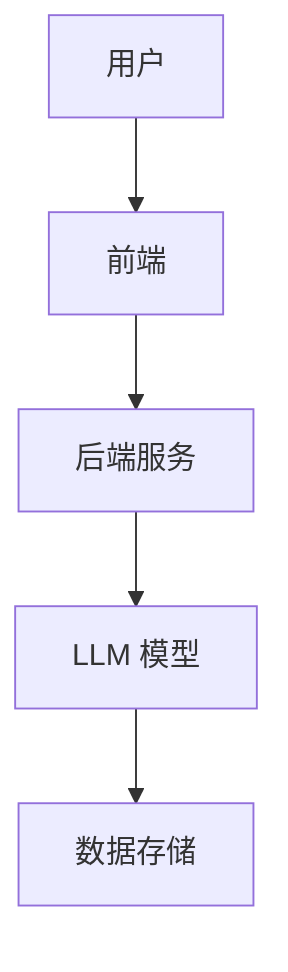
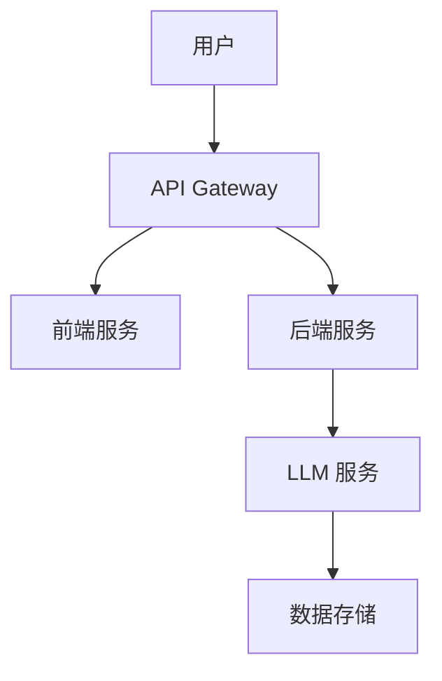
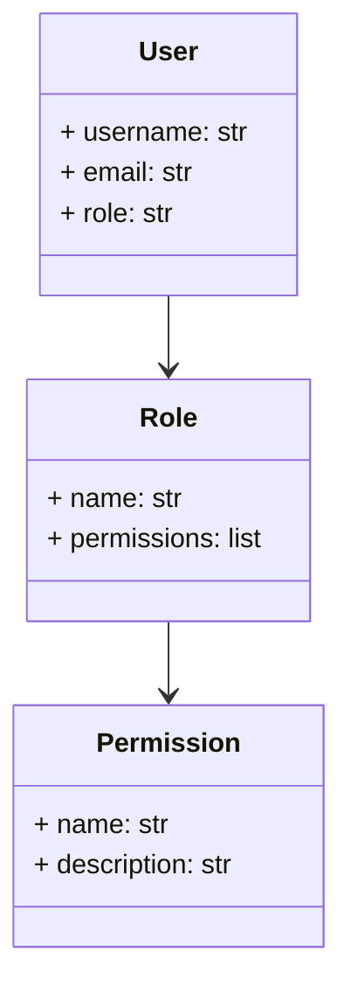
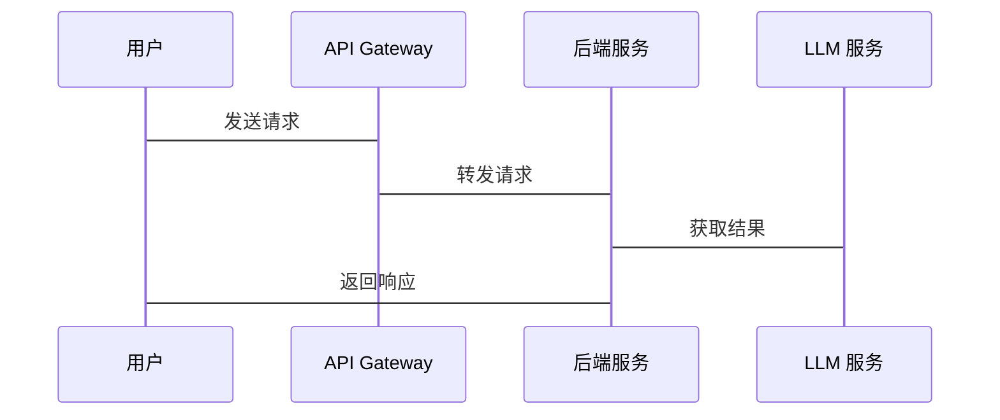

                 

# 企业级 AI Agent 开发：LLM 在商业场景中的落地

## 关键词：
企业级 AI Agent, 大语言模型, 商业场景, 系统架构, 实践案例

## 摘要：
本文深入探讨了企业级 AI Agent 的开发过程，特别是大语言模型（LLM）在商业场景中的落地应用。文章从 LLM 的基本原理出发，分析了其在企业级 AI Agent 中的角色和作用，并详细介绍了系统架构设计、功能实现、实际案例以及落地挑战。通过理论与实践相结合的方式，为读者提供了从概念理解到实际应用的全面指导。

---

# 第一部分: 企业级 AI Agent 开发基础

# 第1章: 企业级 AI Agent 概述

## 1.1 什么是企业级 AI Agent
### 1.1.1 AI Agent 的定义与核心概念
AI Agent（人工智能代理）是指能够感知环境、自主决策并执行任务的智能实体。企业级 AI Agent 是一种专门为企业场景设计的高级 AI 系统，旨在通过自动化和智能化的方式提升企业的运营效率和决策能力。

### 1.1.2 企业级 AI Agent 的特点与优势
- **智能化**：基于 LLM 等先进算法，具备强大的自然语言处理和理解能力。
- **可扩展性**：能够适应不同企业规模和复杂场景的需求。
- **高可用性**：系统架构设计确保了高可靠性和稳定性。
- **实时性**：能够快速响应用户需求，提供实时服务。

### 1.1.3 企业级 AI Agent 的应用场景与边界
企业级 AI Agent 广泛应用于客户服务、内部管理、供应链优化等领域。其边界包括数据安全、模型泛化能力以及法律法规的合规性。

## 1.2 LLM 在企业级 AI Agent 中的角色
### 1.2.1 LLM 的基本概念与技术特点
大语言模型（LLM）是基于Transformer架构的深度学习模型，具有强大的文本生成和理解能力。其核心特点包括并行计算、自注意力机制和预训练-微调范式。

### 1.2.2 LLM 在 AI Agent 中的应用价值
- **提升用户体验**：通过自然语言交互提供更智能的服务。
- **优化业务流程**：自动化处理重复性任务，提升效率。
- **降低运营成本**：通过智能化决策减少人工干预。

### 1.2.3 企业级 AI Agent 中的 LLM 模型选择与优化
选择合适的 LLM 模型需要考虑任务需求、计算资源和数据规模。优化策略包括参数调整、模型蒸馏和量化技术。

## 1.3 企业级 AI Agent 的核心要素
### 1.3.1 数据驱动的特征
企业级 AI Agent 的性能高度依赖高质量的数据，包括训练数据和推理数据的管理。

### 1.3.2 智能决策的能力
通过 LLM 的推理能力，AI Agent 能够在复杂场景中做出最优决策。

### 1.3.3 系统集成的复杂性
企业级 AI Agent 需要与现有系统无缝集成，确保数据流和业务流程的连通性。

### 1.3.4 人机交互的体验优化
设计直观、友好的人机交互界面，提升用户体验。

## 1.4 本章小结
本章介绍了企业级 AI Agent 的基本概念、特点、应用场景以及 LLM 在其中的角色。企业级 AI Agent 的成功落地依赖于 LLM 的强大能力，同时也需要考虑数据、系统集成和用户体验等多个方面。

---

# 第二部分: LLM 的原理与企业级应用

# 第2章: LLM 的基本原理与技术架构

## 2.1 大语言模型的数学基础
### 2.1.1 从 NLP 到 Transformer 的发展
自然语言处理（NLP）经历了从基于规则的模型到深度学习的转变。Transformer 模型的引入彻底改变了 NLP 的研究方向。

### 2.1.2 注意力机制的数学公式
注意力机制是 Transformer 的核心组件，其数学公式如下：
$$
\text{Attention}(Q, K, V) = \text{softmax}\left(\frac{QK^T}{\sqrt{d_k}}\right)V
$$

### 2.1.3 梯度下降与优化算法
常见的优化算法包括随机梯度下降（SGD）、Adam 等。优化算法的选择和调优直接影响模型的训练效果。

## 2.2 LLM 的训练与推理过程
### 2.2.1 预训练阶段的损失函数
预训练的目标是优化模型的参数，使其在大规模数据上达到最优表示。损失函数通常采用交叉熵损失：
$$
\mathcal{L} = -\sum_{i=1}^{n}\sum_{j=i+1}^{n} \text{log}p(\theta_j|\theta_{<j})
$$

### 2.2.2 微调阶段的策略优化
微调阶段的目标是在特定任务上优化模型性能。策略优化方法包括强化学习、迁移学习等。

### 2.2.3 推理阶段的生成策略
生成策略包括贪心搜索、采样等方法。例如，温度采样的公式为：
$$
p_{\text{new}} = \text{softmax}(\frac{\log p}{\text{temperature}})
$$

## 2.3 LLM 的企业级应用挑战
### 2.3.1 模型的可解释性问题
可解释性是企业级应用中至关重要的一环，需要通过可视化和分解技术提升模型的透明度。

### 2.3.2 模型的泛化能力与鲁棒性
在企业场景中，模型需要处理多样化的输入，提升泛化能力和鲁棒性是关键。

### 2.3.3 模型的可扩展性与性能优化
随着数据规模的扩大，模型的可扩展性和计算效率需要不断提升。

## 2.4 本章小结
本章详细介绍了 LLM 的基本原理和训练推理过程，并分析了其在企业级应用中的挑战。理解这些原理对于开发高效可靠的企业级 AI Agent 至关重要。

---

# 第三部分: 企业级 AI Agent 的系统架构与设计

# 第3章: 企业级 AI Agent 的系统架构

## 3.1 系统架构设计
### 3.1.1 分层架构设计
分层架构将系统划分为数据层、计算层和应用层，每一层都有明确的功能划分。

### 3.1.2 微服务架构设计
微服务架构将系统分解为多个独立的服务模块，通过 API Gateway 进行通信。

## 3.2 系统功能设计
### 3.2.1 领域模型设计
领域模型的设计需要结合企业的具体业务需求，构建合理的实体关系。

### 3.2.2 功能模块设计
功能模块包括用户认证、任务管理、数据处理和结果展示等部分。

### 3.2.3 接口设计与交互流程
接口设计需要考虑 RESTful API 的规范，交互流程通过序列图进行详细描述。

## 3.3 本章小结
本章详细介绍了企业级 AI Agent 的系统架构设计，包括分层架构和微服务架构，并通过领域模型和序列图展示了系统的功能模块和交互流程。

---

# 第四部分: 实际案例与最佳实践

# 第4章: 企业级 AI Agent 的实际案例

## 4.1 案例背景
以某电商平台的客服系统为例，介绍企业级 AI Agent 在客户服务中的应用。

## 4.2 系统实现
详细描述系统的实现过程，包括数据准备、模型训练、接口开发和测试优化。

## 4.3 案例分析
通过数据分析和用户反馈，评估系统的性能和效果。

## 4.4 最佳实践
总结项目中的经验和教训，提出优化建议和未来发展方向。

---

# 总结

企业级 AI Agent 的开发离不开 LLM 的强大支持，但也面临着诸多挑战。通过合理的设计和优化，可以充分发挥 LLM 的潜力，为企业带来显著的效益。未来，随着技术的进步和场景的扩展，企业级 AI Agent 将在更多领域发挥重要作用。

---

# 附录

## 附录A: 相关工具与框架
列出常用的 LLM 框架和开发工具，如 TensorFlow、PyTorch 等。

## 附录B: API 接口规范
详细描述 API 的接口定义和使用方法，方便开发者调用。

## 附录C: 源代码示例
提供关键代码片段，如模型训练和接口开发的代码示例。

---

以上是《企业级 AI Agent 开发：LLM 在商业场景中的落地》的技术博客文章的完整大纲和内容。希望这篇文章能够为企业级 AI Agent 的开发提供有价值的参考和指导。

