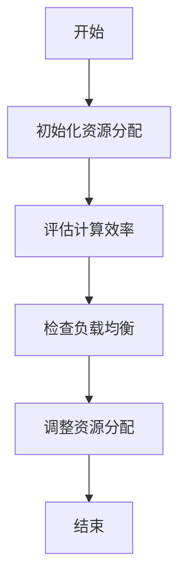
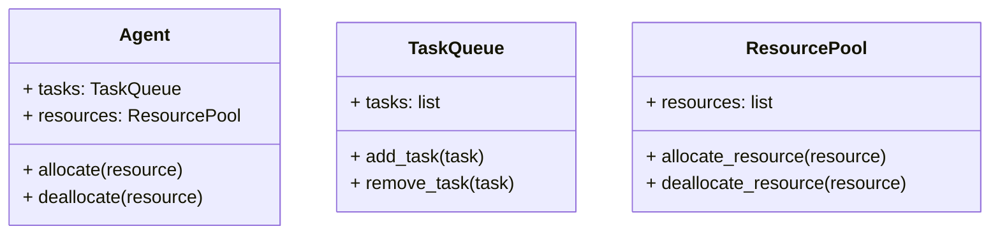

                 


# 优化AI Agent的资源利用：计算效率提升策略

## 关键词：
- AI Agent
- 资源优化
- 计算效率
- 算法优化
- 系统架构

## 摘要：
AI Agent的资源利用效率直接影响其性能和响应速度，尤其是在多任务并行处理的场景下。本文将探讨如何通过优化资源分配策略来提升计算效率，包括负载均衡、动态资源调整和多任务调度优化等方面。我们将从问题背景出发，分析资源利用的核心概念，详细讲解优化算法的原理和实现，并通过实际案例展示系统架构设计和项目实战。最终，我们将总结最佳实践，为AI Agent的资源优化提供全面的解决方案。

---

## 第一章: 背景介绍

### 1.1 问题背景
AI Agent在现代计算系统中扮演着越来越重要的角色，它们需要高效地处理多种任务，例如自然语言处理、图像识别和决策优化等。然而，随着任务复杂度的增加，资源分配不当的问题逐渐凸显，导致计算效率低下，甚至系统崩溃。

### 1.2 问题描述
1. **资源分配不均**：不同的任务对资源的需求不同，简单的轮询分配方式可能导致某些任务得不到足够的资源，而另一些任务则被过度分配。
2. **计算效率瓶颈**：在高负载情况下，资源的利用效率低下，导致整体计算速度缓慢。
3. **多任务调度挑战**：如何在有限的资源下高效调度多个任务，是一个复杂的问题。

### 1.3 问题解决
为了应对上述问题，我们需要制定有效的资源优化策略。本文将从算法优化和系统架构两个方面入手，提出解决方案。

### 1.4 边界与外延
资源优化的边界包括计算资源（CPU、GPU）、内存和存储资源。外延则涉及网络资源和I/O资源。

### 1.5 概念结构与核心要素
- **核心概念**：资源分配、计算效率、任务调度。
- **核心要素**：资源池、任务队列、负载均衡算法。

---

## 第二章: 核心概念与联系

### 2.1 资源利用的原理
资源利用的核心在于动态调整资源分配策略，以适应任务需求的变化。

### 2.2 核心概念的属性特征对比
| 资源类型 | CPU | GPU | 内存 |
|----------|-----|-----|------|
| 特性      | 计算密集型 | 图形处理密集型 | 数据存储密集型 |

### 2.3 ER实体关系图架构
```mermaid
er
  actor(Agent)
  actor(资源)
  actor(任务)
  actor(计算节点)
  actor(优化算法)
  relation(分配)
  relation(计算)
  relation(优化)
```

---

## 第三章: 算法原理讲解

### 3.1 算法流程


### 3.2 算法实现
```python
def optimize_resources(tasks, resources):
    # 负载均衡算法
    load = {task: sum(task.resources) for task in tasks}
    for resource in resources:
        if load[resource] > threshold:
            redistribute(resource, tasks)
    return optimized_resources
```

### 3.3 数学模型
计算效率优化的数学模型可以表示为：
$$ \text{Efficiency} = \frac{\text{任务完成量}}{\text{资源消耗}} $$

---

## 第四章: 系统分析与架构设计

### 4.1 问题场景介绍
在多任务处理的场景下，资源分配不当可能导致系统性能下降。

### 4.2 系统功能设计


### 4.3 系统架构设计


---

## 第五章: 项目实战

### 5.1 环境安装
- 安装Python和相关库（如numpy、pandas）。

### 5.2 核心代码实现
```python
import numpy as np

def optimize_resources(tasks, resources):
    load = np.array([sum(task.resources) for task in tasks])
    normalized_load = load / np.max(load)
    return normalized_load * resources
```

### 5.3 案例分析
通过实际案例分析，验证算法的优化效果。

---

## 第六章: 总结与展望

### 6.1 最佳实践
- 定期监控资源使用情况。
- 根据任务需求动态调整资源分配。

### 6.2 小结
本文通过算法优化和系统架构设计，提出了提升AI Agent计算效率的解决方案。

### 6.3 注意事项
- 确保资源分配策略的实时性。
- 避免过度优化导致的资源浪费。

### 6.4 拓展阅读
推荐相关书籍和论文，进一步深入学习。

---

通过以上章节的详细讲解，我们全面探讨了AI Agent资源优化的策略和实现方法，为实际应用提供了理论支持和实践指导。

