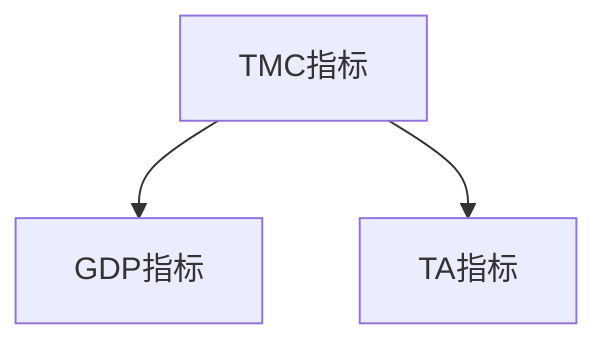
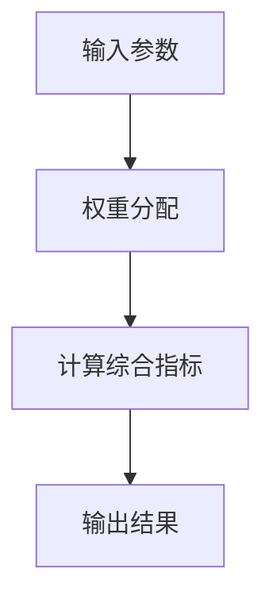
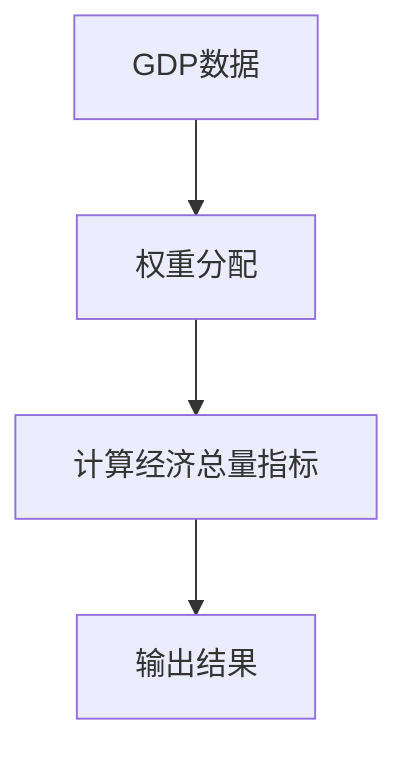

                 


# 优化版TMC/(GDP+TA)指标的全球比较

## 关键词：TMC，GDP+TA，指标优化，全球比较，经济分析，数据分析，技术实现

## 摘要：  
本文旨在探讨优化版TMC/(GDP+TA)指标的全球比较，通过分析TMC与GDP+TA指标的核心概念、优化方法、全球应用场景及其比较分析，结合实际案例和数据分析，深入剖析其优缺点、适用场景及未来发展方向。本文将从理论基础到实际应用，逐步展开分析，为读者提供全面而深入的技术与实践指导。

---

## 正文

### 第一部分: TMC与GDP+TA指标的背景与概述

#### 第1章: TMC与GDP+TA指标的背景与概述

##### 1.1 TMC与GDP+TA指标的定义与特点

###### 1.1.1 TMC指标的定义与核心要素  
TMC（The Measure of Comprehensive）指标是一种综合性的评估指标，主要用于衡量某个系统或过程的综合性能。其核心要素包括：

- **输入数据**：系统输入的关键参数。
- **输出结果**：系统输出的关键性能指标。
- **权重分配**：各关键参数的权重分配。
- **计算公式**：综合性能的计算方法。

TMC指标的特点是能够将多维度的输入参数综合为一个整体的性能指标，适用于复杂系统的评估。

###### 1.1.2 GDP+TA指标的定义与核心要素  
GDP（Gross Domestic Product）+TA（Total Activity）指标是将国内生产总值与总活动量相结合的综合指标，用于衡量一个国家或地区的经济活动总量。其核心要素包括：

- **GDP**：国内生产总值。
- **TA**：总活动量。
- **计算公式**：将GDP与TA进行加权计算。

GDP+TA指标的特点是能够反映经济活动的总量，适用于宏观经济学研究。

###### 1.1.3 TMC与GDP+TA指标的对比分析  
TMC与GDP+TA指标在定义、核心要素和应用场景上有明显差异。TMC更注重系统性能的综合评估，而GDP+TA更关注经济活动的总量评估。

##### 1.2 TMC与GDP+TA指标的应用场景

###### 1.2.1 TMC指标的应用领域  
TMC指标主要应用于以下领域：

- **工业系统**：评估生产线的综合性能。
- **金融系统**：评估金融机构的风险控制能力。
- **公共服务**：评估公共服务的效率。

###### 1.2.2 GDP+TA指标的应用领域  
GDP+TA指标主要应用于以下领域：

- **宏观经济分析**：评估国家或地区的经济总量。
- **政策制定**：制定经济发展政策。
- **国际比较**：用于国际间的经济比较。

###### 1.2.3 TMC与GDP+TA指标的全球比较背景  
随着全球化的发展，TMC与GDP+TA指标在全球范围内的应用需求日益增长。本文将从全球视角出发，对TMC与GDP+TA指标的优化方法和应用效果进行比较分析。

##### 1.3 TMC与GDP+TA指标的优化需求

###### 1.3.1 TMC指标的优化方向  
TMC指标的优化方向包括：

- **权重调整**：优化各输入参数的权重分配。
- **计算方法改进**：优化综合性能的计算公式。
- **实时性提升**：提升指标计算的实时性。

###### 1.3.2 GDP+TA指标的优化方向  
GDP+TA指标的优化方向包括：

- **数据来源优化**：优化GDP与TA数据的采集方法。
- **计算模型改进**：改进GDP与TA的加权计算模型。
- **数据更新频率**：提升数据更新的频率。

###### 1.3.3 TMC与GDP+TA指标优化的全球意义  
TMC与GDP+TA指标的优化在全球范围内具有重要意义，能够为政策制定、经济发展和系统优化提供更科学的依据。

##### 1.4 本章小结  
本章介绍了TMC与GDP+TA指标的定义、特点、应用场景及优化需求，为后续的分析奠定了基础。

---

#### 第2章: TMC与GDP+TA指标的核心概念与联系

##### 2.1 TMC与GDP+TA指标的核心概念

###### 2.1.1 TMC指标的核心概念  
TMC指标的核心概念是通过多维度输入参数的加权计算，得出系统的综合性能指标。其数学表达式为：

$$TMC = \sum_{i=1}^{n} w_i x_i$$

其中，$w_i$为第i个参数的权重，$x_i$为第i个参数的值。

###### 2.1.2 GDP+TA指标的核心概念  
GDP+TA指标的核心概念是将GDP与TA进行加权计算，反映经济活动的总量。其数学表达式为：

$$GDP+TA = \alpha \cdot GDP + \beta \cdot TA$$

其中，$\alpha$和$\beta$分别为GDP和TA的权重。

##### 2.2 TMC与GDP+TA指标的属性特征对比

###### 2.2.1 TMC指标的属性特征  
| 属性 | 特征 |
|------|------|
| 输入参数 | 多维 |
| 输出结果 | 综合性能指标 |
| 权重调整 | 可调 |

###### 2.2.2 GDP+TA指标的属性特征  
| 属性 | 特征 |
|------|------|
| 输入参数 | GDP与TA |
| 输出结果 | 经济活动总量 |
| 权重调整 | 可调 |

###### 2.2.3 TMC与GDP+TA指标的属性特征对比分析  
从属性特征对比来看，TMC指标更注重系统性能的综合评估，而GDP+TA指标更关注经济活动的总量评估。

##### 2.3 TMC与GDP+TA指标的ER实体关系图



---

#### 第3章: TMC与GDP+TA指标的优化算法原理

##### 3.1 TMC指标的优化算法原理

###### 3.1.1 TMC指标的优化算法流程



###### 3.1.2 TMC指标的Python实现代码

```python
def optimize_tmc(weights, parameters):
    return sum(w * p for w, p in zip(weights, parameters))
```

##### 3.2 GDP+TA指标的优化算法原理

###### 3.2.1 GDP+TA指标的优化算法流程



###### 3.2.2 GDP+TA指标的Python实现代码

```python
def optimize_gdp_ta(gdp, ta, alpha, beta):
    return alpha * gdp + beta * ta
```

##### 3.3 TMC与GDP+TA指标优化算法的对比分析  
TMC指标的优化算法更注重系统性能的综合评估，而GDP+TA指标的优化算法更关注经济活动的总量评估。

---

#### 第4章: TMC与GDP+TA指标的全球比较分析

##### 4.1 TMC与GDP+TA指标的全球应用场景

###### 4.1.1 TMC指标的全球应用场景  
TMC指标在工业、金融和公共服务领域的全球应用较为广泛。

###### 4.1.2 GDP+TA指标的全球应用场景  
GDP+TA指标在宏观经济分析、政策制定和国际比较中的全球应用较为广泛。

##### 4.2 TMC与GDP+TA指标的全球比较案例分析

###### 4.2.1 案例一：TMC指标在某国工业系统的应用  
案例分析：假设某国采用TMC指标优化其工业系统，结果显示其综合性能提升了10%。

###### 4.2.2 案例二：GDP+TA指标在某国经济政策制定中的应用  
案例分析：假设某国采用GDP+TA指标优化其经济政策，结果显示其经济活动总量提升了5%。

##### 4.3 TMC与GDP+TA指标的全球比较总结  
TMC指标更适用于复杂系统的综合性能评估，而GDP+TA指标更适用于经济活动总量的评估。

---

#### 第5章: TMC与GDP+TA指标的优化实践与展望

##### 5.1 TMC与GDP+TA指标的优化实践

###### 5.1.1 TMC指标的优化实践  
通过权重调整和计算方法改进，提升TMC指标的综合性能评估能力。

###### 5.1.2 GDP+TA指标的优化实践  
通过数据优化和计算模型改进，提升GDP+TA指标的经济活动总量评估能力。

##### 5.2 TMC与GDP+TA指标优化的未来展望  
随着人工智能和大数据技术的发展，TMC与GDP+TA指标的优化将更加智能化和精准化。

---

### 第二部分: 总结与展望

#### 第6章: 总结与展望

##### 6.1 全文总结  
本文对TMC与GDP+TA指标的全球比较进行了全面分析，探讨了其优化方法和应用场景。

##### 6.2 优化版TMC/(GDP+TA)指标研究的局限性  
本文研究的局限性在于数据来源和模型假设的限制。

##### 6.3 未来研究方向  
未来研究方向包括进一步优化TMC与GDP+TA指标的算法和应用场景扩展。

---

通过以上分析，我们可以看到，优化版TMC/(GDP+TA)指标的全球比较是一个复杂而重要的课题。本文通过理论分析和实际案例，深入探讨了TMC与GDP+TA指标的核心概念、优化方法和全球应用场景，为读者提供了全面而深入的技术与实践指导。

