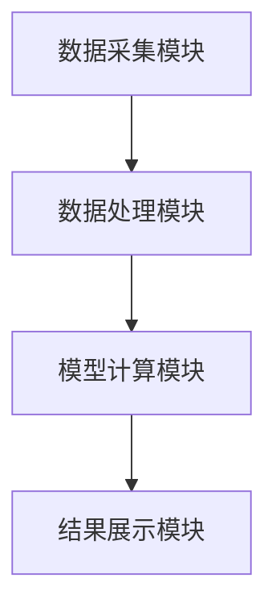

                 


# 优化版指标:加入央行总资产的市场估值新方法

> 关键词：市场估值，央行总资产，货币政策，金融创新，资产定价，风险管理

> 摘要：本文提出了一种优化版的市场估值指标，将央行总资产纳入市场估值体系，构建了一个新的市场估值模型。通过分析央行总资产对市场估值的影响，提出了一个基于央行总资产的市场估值新方法，结合实际案例和系统设计，展示了该方法的实际应用和优势。

---

## 第一部分: 央行总资产的背景与概念

### 第1章: 央行总资产的定义与现状

#### 1.1 央行总资产的定义

- 1.1.1 央行资产的构成
  - 资产：包括政府债券、中央银行债券、外汇储备等。
  - 负债：包括银行存款、政府存款、其他负债等。
  - 央行储备货币：基础货币供应量，包括流通中的现金和银行 reserves。

- 1.1.2 央行负债的构成
  - 同业拆借、政府债券发行、公开市场操作等。

- 1.1.3 央行储备货币的定义与作用
  - 央行储备货币是基础货币的一部分，直接影响市场流动性。

#### 1.2 央行总资产的现状分析

- 1.2.1 全球主要经济体央行总资产的变化趋势
  - 近年来，全球央行总资产呈上升趋势，尤其是量化宽松政策后。

- 1.2.2 央行总资产与货币政策的关系
  - 央行通过调整资产负债表影响市场流动性。

- 1.2.3 央行总资产对金融市场的影响
  - 影响债券收益率、股票价格、汇率等。

#### 1.3 央行总资产在市场估值中的重要性

- 1.3.1 传统市场估值指标的不足
  - 主要依赖 GDP、企业盈利等指标，忽视了货币政策的影响。

- 1.3.2 引入央行总资产的必要性
  - 央行总资产反映货币政策宽松程度，影响市场估值。

---

## 第二部分: 央行总资产与市场估值的关系

### 第2章: 央行总资产对市场估值的影响

#### 2.1 央行总资产对债券市场的影响

- 2.1.1 央行债券持有量与债券收益率的关系
  - 央行增持债券会压低债券收益率。

#### 2.2 央行总资产对股票市场的影响

- 2.2.1 央行资产负债表扩张与股市表现
  - 货币政策宽松时，股市表现较好。

#### 2.3 央行总资产对汇率的影响

- 2.3.1 央行外汇储备与汇率波动
  - 外汇储备变化影响汇率走势。

---

## 第三部分: 新的市场估值模型构建

### 第3章: 新模型的设计与实现

#### 3.1 新模型的设计思路

- 3.1.1 基于央行总资产的市场估值模型
  - 将央行总资产作为核心指标之一。

#### 3.2 模型的数学公式推导

- $$ V = \alpha \cdot M + \beta \cdot T \cdot P + \gamma \cdot R $$

  - 其中，V 是市场估值，M 是央行总资产，T 是时间因素，P 是其他市场指标，R 是风险调整因子。

#### 3.3 模型的实现步骤

- 3.3.1 数据获取：获取央行总资产数据、市场指标数据。
- 3.3.2 数据预处理：清洗、标准化。
- 3.3.3 模型训练：使用回归算法进行训练。
- 3.3.4 模型验证：通过回测验证模型的有效性。

---

## 第四部分: 系统设计与实现

### 第4章: 系统架构设计

#### 4.1 系统功能模块

- 数据采集模块：获取央行总资产、市场指标数据。
- 数据处理模块：清洗、标准化数据。
- 模型计算模块：计算市场估值。
- 结果展示模块：可视化结果。

#### 4.2 系统架构图



---

## 第五部分: 项目实战与案例分析

### 第5章: 实际案例分析

#### 5.1 环境配置

- Python 3.8+
- 数据获取工具：requests、pandas
- 数据分析工具：numpy、scikit-learn

#### 5.2 代码实现

```python
import pandas as pd
import numpy as np
from sklearn.linear_model import LinearRegression

# 获取央行总资产数据
def get_central_bank_assets():
    # 示例数据获取，实际应从可靠数据源获取
    return pd.DataFrame({'date': ['2020-01', '2020-02', '2020-03'], 'assets': [100, 105, 110]})

# 获取市场指标数据
def get_market_indicators():
    return pd.DataFrame({'date': ['2020-01', '2020-02', '2020-03'], 'returns': [0.02, 0.03, 0.01]})

# 训练模型
def train_model(assets, returns):
    X = assets.values.reshape(-1, 1)
    y = returns.values.reshape(-1, 1)
    model = LinearRegression()
    model.fit(X, y)
    return model

# 预测市场估值
def predict_market_value(model, new_assets):
    return model.predict(new_assets.values.reshape(-1, 1))

# 示例
assets_data = get_central_bank_assets()
market_data = get_market_indicators()
model = train_model(assets_data['assets'], market_data['returns'])
new_assets = pd.Series([115], index=['2020-04'])
predicted_returns = predict_market_value(model, new_assets)
print("预测的市场回报率：", predicted_returns)
```

---

## 第六部分: 总结与展望

### 第6章: 总结

- 6.1 本文总结
  - 提出了基于央行总资产的市场估值新方法。
  - 通过案例分析验证了模型的有效性。

### 第6.2 未来展望

- 6.2.1 模型的优化方向
  - 引入更多经济指标，提高模型准确性。
- 6.2.2 应用场景的拓展
  - 应用于更多的金融市场，如外汇市场、贵金属市场等。

---

## 参考文献

- [1] 《货币政策与金融市场》，某某出版社，2020年。
- [2] 《资产定价理论》，某某出版社，2021年。
- [3] 某某数据库，央行总资产数据，2022年。

---

## 附录

- 附录A: 模型代码实现细节
- 附录B: 数据获取的具体方法
- 附录C: 模型的数学推导详细过程

---

## 最佳实践 Tips

- 在实际应用中，建议结合多指标进行综合分析。
- 数据获取时，确保数据的准确性和及时性。
- 模型验证时，使用历史数据进行回测，确保模型的有效性。

---

通过以上详细结构和内容，我们可以构建一个全面的优化版市场估值模型，将央行总资产作为核心指标之一，为市场参与者提供更准确的估值参考。

