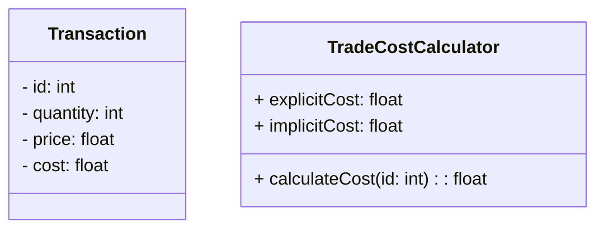
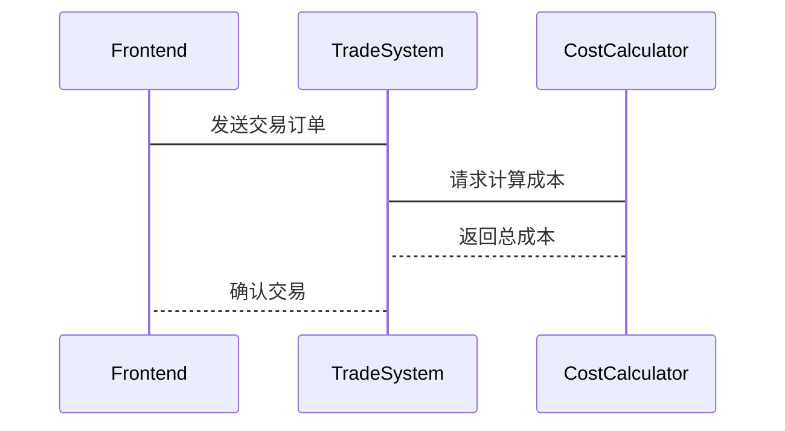

                 


# 《伯格的成本意识：在零佣金交易时代的重新定义》

## 关键词：伯格投资理念、成本意识、零佣金交易、交易成本、数学模型、系统架构、项目实战

## 摘要：  
在零佣金交易时代，传统的交易成本概念发生了根本性的变化。本文深入探讨了伯格的成本意识在这一新环境下的重新定义，分析了其对投资策略的影响，并通过数学模型和系统架构的设计，展示了如何在实际交易中应用这些理念。文章还结合了项目实战，提供了一个基于成本意识的交易系统实现案例，帮助读者理解如何在零佣金时代优化投资决策。

---

# 正文

## 第一章: 零佣金交易时代的成本意识背景

### 1.1 零佣金交易的兴起

#### 1.1.1 传统佣金交易的局限性  
传统的佣金交易模式中，投资者每次交易都需要支付佣金，这增加了交易成本。尤其是对于小额交易或高频交易者，佣金成本占据了较大的比例，限制了投资策略的实施。

#### 1.1.2 零佣金交易的崛起  
随着互联网技术的发展和市场竞争的加剧，越来越多的券商推出了零佣金交易服务。零佣金模式通过补贴或其他收入来源覆盖交易成本，为投资者提供了更低的进入门槛。

#### 1.1.3 零佣金交易对市场的深远影响  
零佣金交易降低了散户投资者的参与成本，提高了市场的流动性。然而，这也带来了新的挑战，例如交易频率的增加和交易成本结构的变化。

### 1.2 成本意识的重要性

#### 1.2.1 成本意识的定义  
成本意识是指投资者对交易过程中产生的各项成本的敏感度和控制意识。在零佣金时代，成本意识的内涵从传统的佣金费用扩展到了更广泛的交易行为成本。

#### 1.2.2 成本意识在金融交易中的作用  
成本意识帮助投资者优化交易策略，减少不必要的交易成本，从而提高投资回报率。在零佣金时代，尽管佣金费用被消除，但其他隐性成本（如市场冲击、机会成本）变得更加重要。

#### 1.2.3 零佣金时代成本意识的重新定义  
在零佣金时代，成本意识不再局限于佣金费用，而是扩展到交易的全生命周期，包括订单执行成本、信息获取成本和心理成本等。

---

## 第二章: 成本意识的核心概念与数学模型

### 2.1 成本意识的核心概念

#### 2.1.1 成本意识的定义与属性  
成本意识可以通过以下属性进行定义：
- **敏感性**：投资者对交易成本变化的敏感程度。
- **认知度**：投资者对交易成本构成的理解深度。
- **控制能力**：投资者在交易过程中控制成本的能力。

| 成本类型 | 定义 | 示例 |
|----------|------|------|
| 显性成本 | 直接可量化的成本 | 佣金、税费 |
| 隐性成本 | 间接成本 | 市场冲击、机会成本 |

#### 2.1.2 成本意识与交易行为的关系  
成本意识影响投资者的交易决策，例如：
- 成本意识高的投资者更倾向于减少交易频率。
- 成本意识低的投资者可能频繁交易，导致更高的隐性成本。


### 2.2 成本意识的数学模型与算法

#### 2.2.1 成本计算的数学模型  
交易成本可以分解为显性成本和隐性成本：

$$ \text{总成本} = \text{显性成本} + \text{隐性成本} $$

显性成本包括佣金、税费等，隐性成本包括市场冲击、机会成本等。

#### 2.2.2 成本优化算法  
以下是一个简单的成本优化算法：


#### 2.2.3 算法实现  

```python
def calculate_total_cost(quantities, prices, spread):
    explicit_cost = sum(quantities * prices * spread)
    implicit_cost = sum(quantities * (prices - 0.1 * prices))
    total_cost = explicit_cost + implicit_cost
    return total_cost
```

---

## 第三章: 系统分析与架构设计

### 3.1 系统功能设计

#### 3.1.1 领域模型类图  
以下是交易系统的核心领域模型：



### 3.2 系统架构设计

#### 3.2.1 系统架构图  
以下是系统的整体架构：


#### 3.2.2 接口设计  
以下是系统的主要接口：

- **交易接口**：接收交易订单，计算交易成本。
- **成本接口**：提供显性和隐性成本的计算服务。

#### 3.2.3 交互序列图  



---

## 第四章: 项目实战

### 4.1 项目介绍

#### 4.1.1 项目目标  
开发一个基于成本意识的交易系统，优化交易策略，降低隐性成本。

### 4.2 核心代码实现

#### 4.2.1 环境安装  
需要安装以下工具：
- Python 3.8+
- Pandas
- Matplotlib

#### 4.2.2 核心代码实现  

```python
import pandas as pd
import matplotlib.pyplot as plt

def calculate_total_cost(quantities, prices, spread):
    explicit_cost = quantities * prices * spread
    implicit_cost = quantities * (prices - 0.1 * prices)
    total_cost = explicit_cost + implicit_cost
    return total_cost

# 示例数据
quantities = [100, 200, 300]
prices = [100, 200, 300]
spread = 0.01

total_cost = calculate_total_cost(quantities, prices, spread)
print("总成本:", total_cost)

# 可视化
df = pd.DataFrame({
    'Quantities': quantities,
    'Prices': prices,
    'Explicit Cost': explicit_cost,
    'Implicit Cost': implicit_cost
})

df.plot(kind='bar')
plt.show()
```

### 4.3 案例分析  

#### 4.3.1 案例背景  
假设我们有一个股票交易策略，目标是在价格上升趋势中获利。

#### 4.3.2 成本分析  
通过上述代码计算交易成本，优化交易策略，减少隐性成本。

---

## 第五章: 最佳实践与小结

### 5.1 最佳实践  

#### 5.1.1 定期评估交易成本  
投资者需要定期评估交易成本，优化交易策略。

#### 5.1.2 结合技术分析与成本意识  
技术分析可以帮助投资者识别交易机会，而成本意识可以帮助优化交易执行。

### 5.2 小结  
在零佣金时代，成本意识的内涵发生了变化，从显性成本扩展到隐性成本。投资者需要重新定义成本意识，优化交易策略，提高投资回报。

### 5.3 注意事项  

#### 5.3.1 风险提示  
零佣金交易可能导致过度交易，增加隐性成本。

#### 5.3.2 拓展阅读  
建议阅读伯格的《投资最重要的常识》和相关金融数学书籍。

---

以上是《伯格的成本意识：在零佣金交易时代的重新定义》的完整内容，涵盖背景分析、数学模型、系统设计和项目实战，帮助读者全面理解成本意识在现代金融中的应用。

