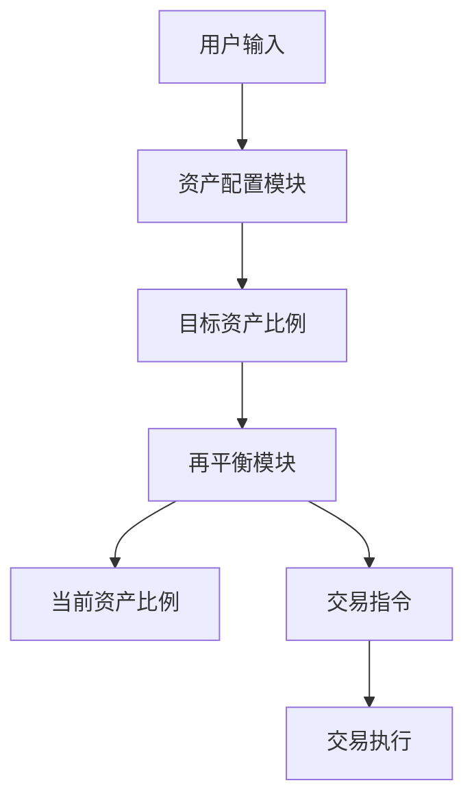
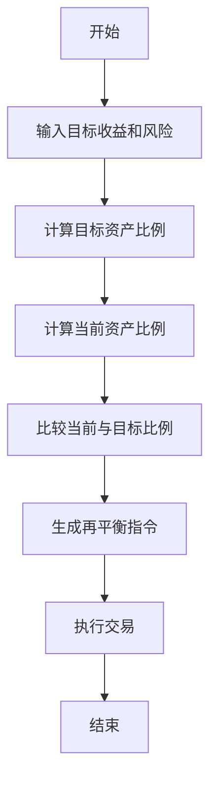
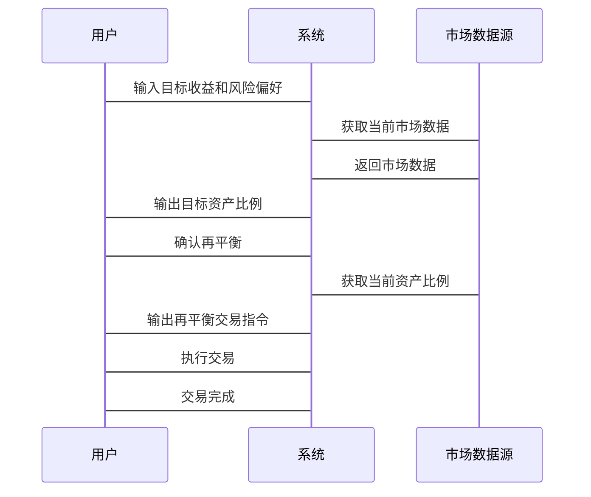

                 


# 伯格的投资组合再平衡：保持风险水平

> 关键词：投资组合再平衡，伯格，风险控制，动态调整，资产配置

> 摘要：投资组合再平衡是维护投资组合健康和风险控制的关键策略。本文详细探讨了伯格的投资组合再平衡方法，分析了其核心原理、实施策略和系统架构，提供了丰富的数学模型和实际案例，帮助读者全面理解并有效应用这一策略。

---

# 第一部分: 投资组合再平衡的背景与基础

## 第1章: 投资组合再平衡的背景与意义

### 1.1 投资组合再平衡的定义与概念

#### 1.1.1 投资组合的基本概念
投资组合是指将一定资金按照特定比例分配到不同的资产类别（如股票、债券、房地产等）中，以实现风险分散和收益最大化。投资组合的健康状态直接影响投资收益和风险水平。

#### 1.1.2 再平衡的定义与目的
再平衡是指定期调整投资组合的资产配置比例，以维持预期的风险水平和收益目标。其目的是应对市场波动、个人风险承受能力的变化或投资目标的调整。

#### 1.1.3 投资组合再平衡的重要性
- 防止投资组合偏离预期目标。
- 优化风险与收益的平衡。
- 提高投资组合的长期稳定性。

### 1.2 伯格的投资理念与风险控制

#### 1.2.1 伯格的投资哲学
- 长期投资，价值投资。
- 风险控制是投资成功的基石。
- 通过资产配置实现风险分散。

#### 1.2.2 风险管理的核心地位
- 风险是投资收益的来源，但过度风险会破坏投资组合的稳定性。
- 通过再平衡策略动态调整风险暴露程度。

#### 1.2.3 投资组合再平衡在伯格策略中的作用
- 保持投资组合的稳定性。
- 在市场波动中捕捉收益机会。
- 实现长期投资目标。

### 1.3 投资组合再平衡的背景与现状

#### 1.3.1 当前金融市场环境分析
- 市场波动加剧，投资者风险偏好变化。
- 传统投资策略的局限性。
- 再平衡策略的市场需求增长。

#### 1.3.2 投资者行为与市场波动
- 投资者情绪对市场波动的影响。
- 非理性行为对投资组合的影响。
- 再平衡策略在应对投资者行为中的作用。

#### 1.3.3 再平衡策略的演变与趋势
- 从静态到动态再平衡的转变。
- 技术驱动的再平衡策略创新。
- 全球化背景下的再平衡策略调整。

---

## 第2章: 投资组合再平衡的核心概念与原理

### 2.1 投资组合再平衡的原理

#### 2.1.1 投资组合的风险与收益平衡
- 风险与收益的正相关关系。
- 通过资产配置实现收益与风险的平衡。

#### 2.1.2 资产配置与再平衡的关系
- 资产配置是再平衡的基础。
- 再平衡是对资产配置的动态调整。

#### 2.1.3 再平衡的数学模型与公式
- 投资组合的收益计算：
  $$ \text{收益} = \sum_{i=1}^{n} w_i \times r_i $$
  其中，\( w_i \) 是第 \( i \) 个资产的权重，\( r_i \) 是第 \( i \) 个资产的收益率。
- 风险调整后的收益：
  $$ \text{夏普比率} = \frac{E[r_p] - r_f}{\sigma_p} $$
  其中，\( E[r_p] \) 是投资组合的期望收益，\( r_f \) 是无风险利率，\( \sigma_p \) 是投资组合的波动率。

### 2.2 动态再平衡策略

#### 2.2.1 定期再平衡的频率选择
- 按季度、半年或年度进行再平衡。
- 频率选择与交易成本和市场波动相关。

#### 2.2.2 基于市场波动的动态调整
- 根据市场波动调整再平衡频率。
- 利用技术指标（如波动率、趋势指标）触发再平衡。

#### 2.2.3 事件驱动的再平衡策略
- 市场重大事件（如金融危机、战争）触发再平衡。
- 个人财务状况变化（如收入增加、家庭变化）触发再平衡。

### 2.3 投资组合再平衡的实施方法

#### 2.3.1 确定再平衡的触发条件
- 投资组合偏离目标比例。
- 市场环境变化。
- 投资目标调整。

#### 2.3.2 计算再平衡的具体步骤
1. 计算当前投资组合的资产权重。
2. 比较当前权重与目标权重。
3. 调整偏离较大的资产权重。
4. 执行交易，完成再平衡。

#### 2.3.3 再平衡过程中的成本控制
- 交易成本（佣金、买卖价差）。
- 税务成本。
- 时间成本。

---

## 第3章: 投资组合再平衡的数学模型与算法

### 3.1 投资组合优化的数学公式

#### 3.1.1 投资组合的收益与风险模型
- 均值-方差优化模型：
  $$ \min_{w} w^T \Sigma w $$
  $$ \text{subject to} \quad w^T \mu = \text{目标收益} $$
  其中，\( w \) 是权重向量，\( \Sigma \) 是协方差矩阵，\( \mu \) 是收益向量。

#### 3.1.2 马科维茨的有效前沿理论
- 有效前沿是所有可能的投资组合中收益-风险最优的集合。
- 再平衡策略是在有效前沿上动态调整位置。

#### 3.1.3 再平衡的优化目标函数
- 最小化偏离成本：
  $$ \min_{w} \sum_{i=1}^{n} |w_i - w_i^{target}| $$

### 3.2 风险调整后的收益计算

#### 3.2.1 夏普比率的计算公式
- 夏普比率衡量投资组合的风险调整后收益：
  $$ \text{夏普比率} = \frac{E[r_p] - r_f}{\sigma_p} $$

#### 3.2.2 特雷诺比率的应用
- 特雷诺比率衡量投资组合相对于无风险资产的超额收益：
  $$ \text{特雷诺比率} = \frac{E[r_p] - r_f}{\sigma_p} $$

#### 3.2.3 风险调整后的收益优化
- 通过调整资产权重优化夏普比率或特雷诺比率。

### 3.3 投资组合再平衡的算法实现

#### 3.3.1 基于动态规划的再平衡算法
1. 确定目标资产配置比例。
2. 计算当前资产权重与目标权重的偏离。
3. 调整偏离较大的资产权重，确保总权重不变。
4. 执行交易，完成再平衡。

#### 3.3.2 基于随机优化的再平衡方法
- 使用蒙特卡洛模拟优化资产配置比例。
- 根据模拟结果动态调整再平衡策略。

#### 3.3.3 基于机器学习的再平衡策略
- 使用机器学习算法预测市场波动。
- 根据预测结果动态调整资产配置比例。

---

## 第4章: 投资组合再平衡的系统分析与架构设计

### 4.1 系统功能设计

#### 4.1.1 资产配置模块
- 输入目标收益和风险偏好。
- 输出目标资产配置比例。

#### 4.1.2 风险评估模块
- 计算投资组合的波动率、夏普比率等风险指标。
- 输出风险评估结果。

#### 4.1.3 再平衡模块
- 计算当前资产权重与目标权重的偏离。
- 输出再平衡交易指令。

### 4.2 系统架构设计

#### 4.2.1 系统模块架构图


#### 4.2.2 系统流程图


### 4.3 系统接口设计

#### 4.3.1 API接口
- 输入：目标收益、风险偏好。
- 输出：目标资产比例、再平衡交易指令。

#### 4.3.2 数据接口
- 输入：市场数据、历史数据。
- 输出：波动率、夏普比率等风险指标。

### 4.4 系统交互序列图



---

## 第5章: 投资组合再平衡的项目实战

### 5.1 环境配置

#### 5.1.1 安装必要的库
```bash
pip install numpy pandas matplotlib
```

#### 5.1.2 环境配置说明
- Python 3.8或更高版本。
- 安装上述库用于数据处理和可视化。

### 5.2 系统核心实现源代码

#### 5.2.1 计算目标资产比例
```python
import numpy as np
import pandas as pd

def compute_target_weights(risk_preference):
    # 示例：根据风险偏好计算目标资产比例
    if risk_preference == '低':
        return {'股票': 30, '债券': 70}
    elif risk_preference == '中':
        return {'股票': 50, '债券': 50}
    else:
        return {'股票': 70, '债券': 30}
```

#### 5.2.2 计算当前资产比例
```python
def compute_current_weights(portfolio_value):
    # 示例：计算当前资产比例
    return {'股票': portfolio_value * 0.5, '债券': portfolio_value * 0.5}
```

#### 5.2.3 实现再平衡逻辑
```python
def rebalance_portfolio(target_weights, current_weights):
    # 示例：根据目标和当前权重计算再平衡交易指令
    trades = {}
    for asset in target_weights:
        target = target_weights[asset]
        current = current_weights[asset]
        deviation = target - current
        if deviation != 0:
            trades[asset] = deviation
    return trades
```

### 5.3 代码应用解读与分析

#### 5.3.1 代码功能分析
- `compute_target_weights`：根据风险偏好计算目标资产比例。
- `compute_current_weights`：计算当前资产比例。
- `rebalance_portfolio`：根据目标和当前权重计算再平衡交易指令。

#### 5.3.2 代码实现细节
- 使用字典存储资产比例。
- 计算资产偏离并生成交易指令。
- 返回需要调整的资产和调整量。

### 5.4 实际案例分析

#### 5.4.1 案例背景
- 投资者初始资金：100万元。
- 风险偏好：中等。
- 目标资产比例：股票50%，债券50%。

#### 5.4.2 市场波动导致的偏离
- 股票上涨20%，债券下跌5%。
- 当前资产比例：股票60%，债券40%。

#### 5.4.3 再平衡操作
- 计算偏离：股票偏离10%（60% - 50%），债券偏离-10%（40% - 50%）。
- 交易指令：卖出股票10%，买入债券10%。
- 再平衡后比例：股票50%，债券50%。

### 5.5 项目小结

#### 5.5.1 项目总结
- 成功实现再平衡逻辑。
- 提供了实际案例分析。
- 突出了代码实现的细节。

#### 5.5.2 项目注意事项
- 交易成本会影响实际收益。
- 市场波动会影响再平衡频率。
- 代码实现需考虑实际市场数据。

---

## 第6章: 总结与展望

### 6.1 总结

#### 6.1.1 核心内容回顾
- 投资组合再平衡的背景与意义。
- 伯格的再平衡策略与风险控制。
- 数学模型与算法实现。

#### 6.1.2 实践中的注意事项
- 定期审查和调整再平衡策略。
- 选择合适的再平衡频率。
- 控制交易成本和税务成本。

### 6.2 未来展望

#### 6.2.1 研究热点
- 结合机器学习的再平衡策略。
- 利用大数据技术优化再平衡算法。
- 跨资产类别再平衡策略研究。

#### 6.2.2 技术趋势
- 智能投顾平台的再平衡自动化。
- 区块链技术在再平衡中的应用。
- 人工智能驱动的动态再平衡策略。

### 6.3 最佳实践 tips

#### 6.3.1 投资者建议
- 根据自身风险偏好选择再平衡策略。
- 定期审查投资组合，确保符合目标。
- 学习相关知识，提高投资能力。

#### 6.3.2 从业者建议
- 不断优化再平衡算法。
- 关注市场变化，调整策略。
- 提供透明化的再平衡服务。

#### 6.3.3 读者建议
- 深入理解再平衡原理。
- 学习相关数学模型和算法。
- 实践应用，积累经验。

---

# 结语

投资组合再平衡是投资成功的关键策略。通过本文的详细讲解，读者可以全面理解伯格的投资组合再平衡方法，并在实际操作中灵活运用。希望本文能为投资者和从业者提供有价值的参考和启示。

