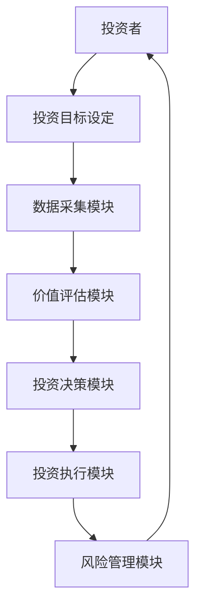
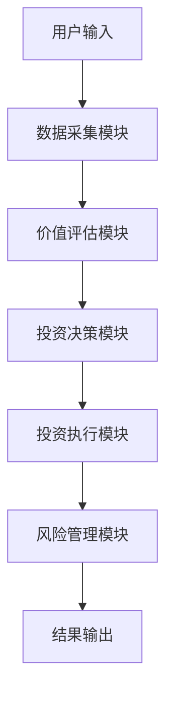

                 


# 伯格的投资者教育理念：应对金融素养差距的挑战

## 关键词：
- 伯格投资理念
- 金融素养
- 价值投资
- 长期投资
- 理性投资

## 摘要：
本文探讨了伯格的投资者教育理念，特别是如何通过价值投资、长期投资和理性投资来应对当前的金融素养差距挑战。文章详细分析了伯格的投资策略，包括其数学模型和系统架构，并通过实际案例展示了如何将这些理念应用于投资实践中。此外，本文还总结了投资者教育的最佳实践，为普通投资者提供了实用的建议。

---

## 第1章：金融素养差距的现状与挑战

### 1.1 什么是金融素养
#### 1.1.1 金融素养的定义
金融素养是指个体在金融知识、技能和行为方面的综合能力，包括理解金融市场、投资工具、风险管理等。

#### 1.1.2 金融素养的重要性
在现代社会，金融素养是个人财务健康的关键。具备良好金融素养的投资者能够做出明智的财务决策，避免盲目跟风和投机行为。

#### 1.1.3 金融素养差距的现状
全球范围内，许多投资者缺乏基本的金融知识，导致他们在投资过程中容易受到市场波动和情绪影响，难以实现长期稳定的收益。

### 1.2 投资者教育的必要性
#### 1.2.1 投资者教育的目标
帮助投资者理解投资的基本原理，掌握科学的投资方法，避免常见的投资误区。

#### 1.2.2 投资者教育的现状
目前，投资者教育在全球范围内受到重视，但普及程度和效果参差不齐，尤其是在发展中国家，金融素养水平较低。

#### 1.2.3 金融素养差距对个人和市场的危害
金融素养差距可能导致个人投资失败，同时影响市场的稳定性和健康发展。

---

## 第2章：伯格投资理念的核心思想

### 2.1 价值投资的定义与特点
#### 2.1.1 价值投资的核心理念
价值投资强调以低于内在价值的价格买入优质资产，长期持有，等待市场重新认识其价值。

#### 2.1.2 价值投资与短期投资的区别
价值投资注重长期持有和内在价值，而短期投资关注短期价格波动和市场趋势。

#### 2.1.3 价值投资的长期视角
伯格认为，投资的目的是通过长期持有优质资产，获得稳定的复利收益，而不是追求短期暴利。

### 2.2 长期投资的重要性
#### 2.2.1 长期投资的优势
长期投资能够平滑市场波动的影响，降低交易成本，同时利用复利效应实现财富增长。

#### 2.2.2 长期投资的风险管理
通过分散投资和严格的风险评估，长期投资可以有效降低单一资产的风险。

#### 2.2.3 长期投资与市场波动的关系
市场波动是长期投资的敌人，但也是机会。投资者应避免被短期波动干扰，坚持长期投资策略。

### 2.3 理性投资的原则
#### 2.3.1 理性投资的定义
理性投资强调基于基本面分析和逻辑判断，避免情绪化和非理性决策。

#### 2.3.2 理性投资与情绪化投资的对比
理性投资者能够冷静面对市场波动，而情绪化投资者容易被市场情绪左右，做出错误决策。

#### 2.3.3 理性投资的决策框架
伯格提出，投资者应基于以下三个要素做出决策：内在价值、市场价格和安全边际。

---

## 第3章：伯格投资理念的数学模型与分析

### 3.1 价值评估模型
#### 3.1.1 市盈率模型
市盈率（P/E）= 股价 / 每股收益

#### 3.1.2 市净率模型
市净率（P/B）= 股价 / 每股净资产

#### 3.1.3 股息率模型
股息率 = 每股股息 / 股价

### 3.2 投资组合优化模型
#### 3.2.1 马科维茨投资组合理论
马科维茨理论认为，最优投资组合是使风险最小化的同时实现收益最大化。

#### 3.2.2 现实中的投资组合优化
在实际操作中，投资者需要考虑流动性、税收和交易成本等因素。

#### 3.2.3 伯格投资理念的数学表达
伯格的长期投资策略可以用以下公式表示：
$$ 累计收益 = (1 + 收益率_1)(1 + 收益率_2)...(1 + 收益率_n) - 1 $$

---

## 第4章：伯格投资理念的系统分析与架构设计

### 4.1 投资系统架构
#### 4.1.1 系统目标
构建一个能够实现长期价值投资的自动化投资系统。

#### 4.1.2 系统功能模块
- 数据采集模块：收集市场数据和公司基本面信息。
- 价值评估模块：计算股票的内在价值。
- 投资决策模块：基于价值评估和市场状况做出投资决策。
- 风险管理模块：监控和管理投资组合的风险。

#### 4.1.3 系统架构图（Mermaid）



### 4.2 投资决策流程
#### 4.2.1 信息收集与分析
投资者需要收集市场数据、公司财务报表和行业分析报告。

#### 4.2.2 价值评估与风险评估
基于基本面分析和数学模型，评估股票的内在价值和投资风险。

#### 4.2.3 投资决策与调整
根据价值评估和市场状况，制定投资策略并定期调整投资组合。

---

## 第5章：伯格投资理念的项目实战

### 5.1 环境安装与数据准备
#### 5.1.1 数据来源
使用Yahoo Finance获取历史数据，使用公司财报获取基本面信息。

#### 5.1.2 数据清洗与处理
清洗数据中的缺失值和异常值，确保数据的准确性和完整性。

#### 5.1.3 数据分析工具安装
安装Python和必要的库（如Pandas、NumPy、Matplotlib）。

### 5.2 投资策略实现
#### 5.2.1 价值评估代码实现
```python
import pandas as pd

def calculate_intrinsic_value(stock_data):
    # 假设 stock_data 是包含股价和每股收益的数据框
    pe_ratio = stock_data['price'] / stock_data['eps']
    return pe_ratio.mean()
```

#### 5.2.2 投资组合优化代码实现
```python
import numpy as np

def optimize_portfolio(returns):
    # 计算最优投资组合
    mu = returns.mean()
    sigma = returns.std()
    cov_matrix = returns.cov()
    inv_cov = np.linalg.inv(cov_matrix)
    w = inv_cov @ mu
    w = w / w.sum()
    return w
```

#### 5.2.3 系统交互流程图（Mermaid）



### 5.3 实际案例分析
#### 5.3.1 案例背景
以苹果公司为例，分析其基本面和市场表现。

#### 5.3.2 数据分析与策略制定
基于市盈率和市净率模型，评估苹果的内在价值。

#### 5.3.3 策略实施与结果分析
根据价值评估结果，制定投资策略并监控其执行效果。

---

## 第6章：伯格投资理念的最佳实践与小结

### 6.1 投资者的最佳实践
#### 6.1.1 建立长期投资理念
坚持长期投资，避免频繁交易。

#### 6.1.2 提高金融素养
通过学习和实践，提升自身的金融知识和投资技能。

#### 6.1.3 理性投资
基于基本面分析和逻辑判断，避免情绪化决策。

### 6.2 小结
伯格的投资者教育理念为应对金融素养差距提供了有效的解决方案。通过价值投资、长期投资和理性投资，投资者可以实现稳健的财务增长。

### 6.3 注意事项
投资者在实际操作中应结合市场环境和个人情况，灵活调整投资策略。

### 6.4 拓展阅读
建议读者阅读伯格的《证券分析》和《聪明的投资者》，深入理解价值投资的精髓。

---

通过本文的分析，读者可以全面了解伯格的投资理念，并将其应用于实际投资中。希望本文能帮助投资者提升金融素养，实现长期稳健的投资回报。

