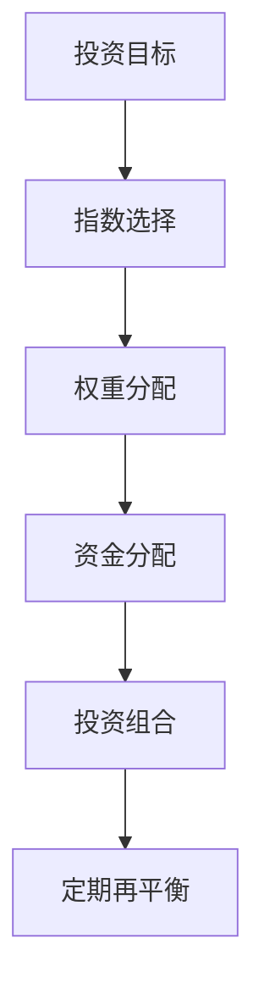

                 


# 伯格的指数基金理念：应对市场集中度上升的挑战

---

## 关键词：
- 指数基金
- 市场集中度
- 投资策略
- 伯格
- 风险管理

---

## 摘要：
本文深入探讨了伯格的指数基金理念及其在应对市场集中度上升挑战中的应用。通过分析指数基金的核心概念、数学模型和系统架构，结合实际案例，展示了指数基金如何通过分散投资和低成本策略帮助投资者在市场集中度上升的环境中实现稳健投资。文章还提供了系统设计和实战指导，帮助读者更好地理解和应用指数基金理念。

---

# 第一部分：指数基金概述

## 第1章：指数基金的核心概念

### 1.1 指数基金的定义与特点

指数基金是一种被动管理型基金，旨在复制特定市场指数的表现。其特点包括：
- **被动管理**：跟踪指数，减少主动操作。
- **分散投资**：投资于指数成分股，降低风险。
- **低成本**：管理费用低，适合长期投资。

### 1.2 市场集中度上升的背景

随着市场竞争加剧，市场集中度上升，大公司占据更大市场份额。这种趋势增加了投资风险，传统主动管理型基金难以应对。

---

## 第2章：伯格的指数基金理念

### 2.1 伯格的投资哲学

伯格认为市场难以预测，指数基金通过分散投资降低风险。其核心理念是：
- **长期投资**：避免短期波动，追求长期收益。
- **低成本**：降低费用，提高净收益。

### 2.2 指数基金的优势

- **分散风险**：投资多样化，降低单一资产风险。
- **透明度高**：投资者清楚基金的构成。
- **费用低**：管理费用低，提升长期收益。

---

## 第3章：指数基金的数学模型

### 3.1 收益计算公式

指数基金的收益公式：
$$
R_{fund} = R_{index} \times (1 - \tau)
$$
其中，$R_{index}$是指数收益，$\tau$是费用率。

### 3.2 成本影响分析

费用对收益的影响：
$$
\text{总收益} = R_{index} \times (1 - \tau) - \text{其他费用}
$$

---

## 第4章：系统架构与设计

### 4.1 系统架构图



### 4.2 系统功能模块

- **投资组合管理**：选择指数成分股，分配权重。
- **风险管理**：监控市场风险，调整投资组合。
- **成本控制**：优化交易成本，降低费用。

---

## 第5章：项目实战

### 5.1 环境安装

安装Python和相关库：
```bash
pip install pandas numpy matplotlib
```

### 5.2 核心代码实现

```python
import pandas as pd
import numpy as np

def calculate_return(index_return, fees):
    return index_return * (1 - fees)

index_data = pd.DataFrame({'return': [0.1, 0.05, 0.08, 0.02]}, index=['2020', '2021', '2022', '2023'])
index_return = index_data['return'].mean()
fees = 0.02
fund_return = calculate_return(index_return, fees)
print(f"基金收益率：{fund_return:.2f}")
```

### 5.3 实际案例分析

分析过去五年的指数基金表现，计算其收益率和费用影响。

---

## 第6章：最佳实践与小结

### 6.1 最佳实践

- **定期再平衡**：保持投资组合与指数一致。
- **费用控制**：选择低成本指数基金。
- **长期投资**：避免短期波动影响收益。

### 6.2 小结

伯格的指数基金理念在市场集中度上升的背景下，提供了分散风险和低成本投资的有效策略。通过系统设计和实战应用，投资者可以更好地应对市场挑战，实现稳健投资回报。

---

## 第7章：注意事项与拓展阅读

### 7.1 注意事项

- 市场集中度上升可能增加系统性风险。
- 指数基金表现受市场整体影响，无法避免市场下跌。

### 7.2 拓展阅读

- 《The Intelligent Investor》：巴菲特的投资理念。
- 《The Index Investor’s Handbook》：深入探讨指数投资策略。

---

通过本文的详细分析和实战指导，读者可以全面理解伯格的指数基金理念，并在实际投资中应用这些策略，应对市场集中度上升带来的挑战。

