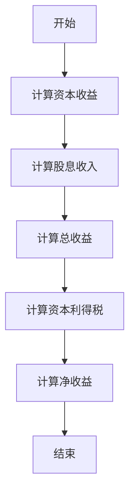
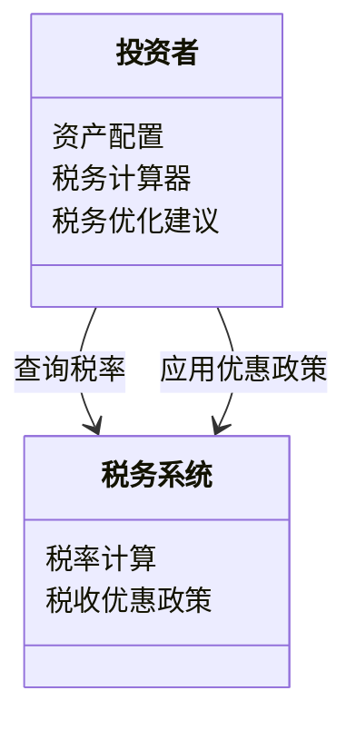

                 


# 伯格的税收效率投资：如何减少投资税负

**关键词**：税收效率投资，税负优化，伯格投资策略，税收优惠，资本收益，股息收入，净收益

**摘要**：  
本文深入探讨了伯格的税收效率投资策略，分析了如何通过优化投资结构和利用税收优惠政策来减少投资税负。文章从背景介绍、核心概念、算法原理、系统分析到项目实战，层层递进地阐述了税收效率投资的理论与实践。通过详细的数学模型、Mermaid图表和实际案例，本文为读者提供了全面的理解和实用的指导。

---

## 第1章 税收效率投资的背景与概念

### 1.1 税收效率投资的背景
#### 1.1.1 税收与投资的关系
投资与税收密切相关。投资者在追求收益的同时，必须考虑税负的影响。税负过重会降低实际收益，因此优化税后收益是投资策略的重要组成部分。

#### 1.1.2 税收对投资收益的影响
税收对投资收益的影响主要体现在资本收益和股息收入上。资本收益可能需要缴纳资本利得税，而股息收入可能需要缴纳所得税。税负的高低直接影响净收益。

#### 1.1.3 税收效率投资的定义与目标
税收效率投资是指通过优化投资结构和利用税收优惠政策，以最小化税负，最大化净收益的投资策略。其目标是实现收益最大化的同时，减少税负支出。

### 1.2 税收效率投资的核心概念
#### 1.2.1 投资收益的税务计算
投资收益包括资本收益和股息收入。资本收益可能需要缴纳资本利得税，而股息收入可能需要缴纳所得税。不同投资类型和地区的税法规定不同。

#### 1.2.2 税收优惠政策与投资策略
税收优惠政策是降低税负的重要工具。例如，某些地区提供税收减免、税收抵免或优惠税率。投资者应充分利用这些政策。

#### 1.2.3 税收效率投资的边界与外延
税收效率投资的边界在于合法合规的前提下优化税负。外延包括不同资产类别、投资地区和税务规划策略。

---

## 第2章 税收效率投资的核心概念原理

### 2.1 税收效率投资的原理
#### 2.1.1 税收效率的核心原理
税收效率投资的核心在于通过优化资产配置和税务规划，降低税负，提高净收益。

#### 2.1.2 投资收益与税负的关系
投资收益越高，税负可能越高，但通过优化税务结构可以降低整体税负。

#### 2.1.3 税收优惠政策的应用
利用税收优惠政策是降低税负的关键。例如，某些地区提供税收减免，投资者应优先考虑这些地区。

### 2.2 核心概念的属性特征对比
#### 2.2.1 投资类型与税负对比表格
以下是一个简单的对比表格：

| 投资类型 | 资本收益 | 股息收入 | 税率 |
|----------|----------|----------|------|
| 股票     | 高       | 中       | 15%  |
| 债券     | 中       | 低       | 10%  |
| 不动产   | 高       | 低       | 20%  |

#### 2.2.2 不同投资方式的税负计算
例如，股票投资的资本收益税率为15%，而债券投资的税率较低，适合低风险投资者。

---

## 第3章 税收效率投资的算法原理

### 3.1 税后收益计算的数学模型
#### 3.1.1 总收益计算公式
$$ \text{总收益} = \text{资本收益} + \text{股息收入} $$

#### 3.1.2 税负计算公式
$$ \text{税负} = \text{资本利得税率} \times \text{资本收益} $$

#### 3.1.3 净收益计算公式
$$ \text{净收益} = \text{总收益} - \text{税负} $$

### 3.2 税收效率投资的算法流程
#### 3.2.1 算法流程图的Mermaid展示


---

## 第4章 税收效率投资的系统分析

### 4.1 税收效率投资的系统功能设计
#### 4.1.1 领域模型的Mermaid类图


---

## 第5章 项目实战：基于伯格的税收效率投资策略

### 5.1 项目介绍
以股票投资为例，展示如何优化税负。

### 5.2 环境安装
需要安装财务分析工具和税务计算器软件。

### 5.3 核心代码实现
```python
def calculate_taxable_income(capital_gains, dividends):
    tax_rate = 0.15  # 假设资本利得税率为15%
    taxable_income = capital_gains * tax_rate
    return taxable_income

capital_gains = 10000
dividends = 5000
taxable_income = calculate_taxable_income(capital_gains, dividends)
net_income = capital_gains + dividends - taxable_income
print("税后净收入为：", net_income)
```

### 5.4 代码应用解读
计算税后净收入，展示如何通过代码实现税负计算。

### 5.5 实际案例分析
分析一个具体的投资案例，展示税后净收入的计算过程。

---

## 第6章 最佳实践与总结

### 6.1 关键点总结
税收效率投资的关键在于优化资产配置和利用税收优惠政策。

### 6.2 注意事项
避免非法避税，确保合规性。

### 6.3 误区提示
不要仅关注短期税负，忽视长期收益。

### 6.4 未来趋势
随着税法的变化，税收效率投资将更加复杂，需要动态调整策略。

---

## 结语
通过本文的分析，读者可以全面理解伯格的税收效率投资策略，并在实际投资中应用这些方法，减少税负，提高收益。

