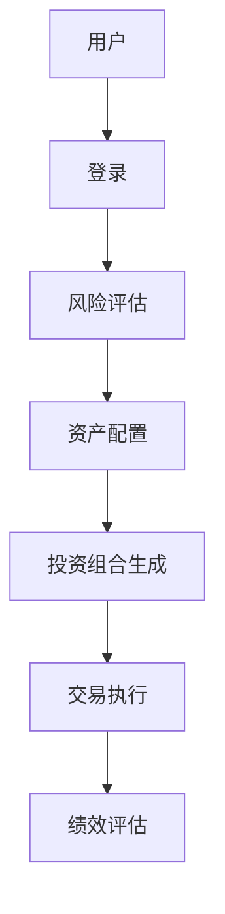

                 


# 伯格的被动投资理念：智能投顾时代的新发展

> 关键词：被动投资，智能投顾，指数基金，机器学习，大数据，投资策略

> 摘要：本文深入探讨了伯格的被动投资理念及其在智能投顾时代的应用与发展。通过分析被动投资与智能投顾的结合，展示了如何利用技术手段优化投资策略，降低投资成本，提高投资效率。文章从理论到实践，详细阐述了系统的架构设计、算法实现和实际案例，为投资者和技术开发者提供了深刻的见解和实践指导。

---

## 第1章: 被动投资的基本概念

### 1.1 被动投资的定义与特点

#### 1.1.1 被动投资的定义
被动投资是一种投资策略，强调长期持有特定的指数基金或股票组合，以跟踪市场表现，而非试图通过预测市场波动来主动获利。其核心理念是通过分散投资降低风险，追求市场平均收益。

#### 1.1.2 被动投资的核心特点
- **分散投资**：通过投资指数基金或 ETF，投资者可以分散投资于多个资产，降低单一资产的风险。
- **低成本**：被动投资避免了频繁交易和主动管理的高费用，降低了投资成本。
- **长期持有**：被动投资者通常长期持有投资组合，不频繁调整，以避免短期市场波动的影响。
- **低维护**：被动投资策略管理简单，适合长期投资者。

#### 1.1.3 被动投资与主动投资的区别
| 属性         | 被动投资                | 主动投资                |
|--------------|-------------------------|-------------------------|
| 投资目标      | 追踪市场指数            | 超越市场指数            |
| 管理方式      | 买入并持有              | 积极交易和调整          |
| 成本          | 低                     | 高                     |
| 风险          | 较低                   | 较高                   |

### 1.2 被动投资的历史与发展

#### 1.2.1 被动投资的起源
被动投资的概念可以追溯到20世纪30年代，但真正的发展始于20世纪70年代，指数基金的出现为被动投资提供了实现工具。

#### 1.2.2 被动投资的发展历程
- **早期阶段**：20世纪70年代，伯格公司推出第一只指数基金。
- **发展阶段**：随着技术进步，指数基金种类增多，覆盖更多市场和行业。
- **现代阶段**：被动投资成为主流，尤其是在机构投资者和个人投资者中。

#### 1.2.3 被动投资在现代金融中的地位
被动投资已成为全球资产管理的重要组成部分，尤其是在近年来，低成本指数基金的兴起使得被动投资越来越受欢迎。

---

## 第2章: 智能投顾的基本概念

### 2.1 智能投顾的定义与特点

#### 2.1.1 智能投顾的定义
智能投顾是一种基于人工智能和大数据技术的财富管理服务，通过算法分析用户需求，提供个性化的投资建议和组合管理。

#### 2.1.2 智能投顾的核心特点
- **自动化**：通过算法自动调整投资组合。
- **个性化**：根据用户风险偏好、财务状况提供定制化建议。
- **实时性**：利用大数据和机器学习实时跟踪市场变化。

#### 2.1.3 智能投顾与传统投顾的区别
| 属性         | 智能投顾                | 传统投顾                |
|--------------|-------------------------|-------------------------|
| 服务方式      | 全自动                  | 人工为主                |
| 成本          | 低                     | 高                     |
| 服务效率      | 高                     | 低                     |
| 服务对象      | 大量用户                | 少量高净值客户          |

### 2.2 智能投顾的技术基础

#### 2.2.1 大数据在智能投顾中的应用
大数据技术用于分析市场数据、用户行为数据，帮助智能投顾系统做出更精准的投资决策。

#### 2.2.2 机器学习在智能投顾中的应用
机器学习算法用于预测市场趋势、优化投资组合和风险控制。

#### 2.2.3 自然语言处理在智能投顾中的应用
自然语言处理技术用于分析新闻、报告等文本数据，提取市场信息。

---

## 第3章: 伯格的被动投资理念

### 3.1 伯格的投资理念概述

#### 3.1.1 伯格的投资哲学
伯格认为市场是有效的，试图通过主动投资战胜市场的难度较大，而被动投资通过跟踪市场指数，能够以较低的成本实现长期稳定的收益。

#### 3.1.2 伯格的长期投资策略
伯格强调长期投资的重要性，认为短期市场波动无法预测，长期持有指数基金能够平滑波动，获得市场平均收益。

#### 3.1.3 伯格对市场有效性的看法
伯格是有效市场假说的坚定支持者，认为市场难以被预测，被动投资是更为可靠的投资方式。

### 3.2 伯格的指数基金策略

#### 3.2.1 指数基金的定义与特点
指数基金是一种跟踪特定市场指数的基金，其收益与指数表现一致。

#### 3.2.2 伯格对指数基金的贡献
伯格是指数基金的先驱，他的研究和实践推动了指数基金的发展和普及。

#### 3.2.3 指数基金的优势与局限性
| 优势         | 低成本                 | 分散风险               |
|--------------|------------------------|------------------------|
| 简单         | 适合长期投资           | 无法超越市场指数        |

---

## 第4章: 被动投资与智能投顾的结合

### 4.1 被动投资与智能投顾的契合点

#### 4.1.1 被动投资的成本优势
被动投资通过降低管理费用和交易成本，为投资者节省资金。

#### 4.1.2 智能投顾的技术优势
智能投顾利用技术手段实现自动化管理，提高投资效率。

#### 4.1.3 两者的结合如何优化投资体验
通过智能投顾平台，投资者可以以较低的成本享受被动投资的长期收益。

### 4.2 智能投顾时代被动投资的新发展

#### 4.2.1 智能投顾如何实现被动投资
智能投顾通过算法优化投资组合，确保组合与市场指数一致。

#### 4.2.2 被动投资在智能投顾中的应用案例
例如，智能投顾可以根据用户的财务状况和风险偏好，自动配置合适的指数基金组合。

#### 4.2.3 未来被动投资与智能投顾的融合发展
随着技术进步，被动投资将更加智能化、个性化，投资体验将不断提升。

---

## 第5章: 被动投资与智能投顾的系统架构

### 5.1 系统功能设计

#### 5.1.1 用户需求分析
用户需求包括风险评估、资产配置、投资组合管理等。

#### 5.1.2 系统功能模块划分
- 用户模块
- 风险评估模块
- 投资组合管理模块
- 交易执行模块
- 绩效评估模块

#### 5.1.3 系统功能流程图


### 5.2 系统架构设计

#### 5.2.1 分层架构设计


#### 5.2.2 微服务架构设计
```mermaid
service-diagram
    user-service
    risk-assessment-service
    portfolio-service
    trading-service
    performance-service
```

#### 5.2.3 系统扩展性设计
系统设计应模块化，便于后续功能扩展和性能优化。

---

## 第6章: 智能投顾系统的核心算法实现

### 6.1 算法原理

#### 6.1.1 基于机器学习的投资策略
利用机器学习模型预测市场趋势，优化投资组合。

#### 6.1.2 基于大数据的市场预测
通过大数据分析市场数据，发现潜在投资机会。

#### 6.1.3 基于优化模型的投资组合构建
使用数学模型优化投资组合，降低风险，提高收益。

### 6.2 算法实现

#### 6.2.1 数据预处理
对市场数据进行清洗、归一化等处理。

#### 6.2.2 模型训练与优化
训练机器学习模型，调整参数以提高预测精度。

#### 6.2.3 系统接口设计
设计API接口，实现系统各模块之间的通信。

---

## 第7章: 项目实战与案例分析

### 7.1 项目环境安装

#### 7.1.1 开发工具安装
安装Python、Jupyter Notebook等开发工具。

#### 7.1.2 数据库安装
安装MySQL或MongoDB等数据库。

#### 7.1.3 依赖库安装
安装Pandas、Scikit-learn等数据处理库。

### 7.2 核心代码实现

#### 7.2.1 数据处理代码
```python
import pandas as pd

data = pd.read_csv('market_data.csv')
```

#### 7.2.2 算法实现代码
```python
from sklearn.linear_model import LinearRegression

model = LinearRegression()
model.fit(X, y)
```

#### 7.2.3 系统接口代码
```python
from flask import Flask

app = Flask(__name__)

@app.route('/')
def home():
    return "Hello, World!"
```

### 7.3 案例分析与解读

#### 7.3.1 案例背景介绍
以某智能投顾系统为例，分析其在被动投资中的应用。

#### 7.3.2 系统运行结果分析
分析投资组合的表现，比较被动投资与主动投资的收益。

#### 7.3.3 案例总结与经验分享
总结经验，提出改进建议。

---

## 第8章: 最佳实践与未来展望

### 8.1 投资策略优化

#### 8.1.1 如何优化被动投资策略
选择合适的指数基金，定期调整投资组合。

#### 8.1.2 智能投顾中的风险管理
通过分散投资和风险评估降低投资风险。

#### 8.1.3 投资者教育的重要性
加强对投资者的教育，帮助其理解被动投资的优势。

### 8.2 未来发展趋势

#### 8.2.1 被动投资与智能投顾的进一步融合
技术进步将推动被动投资与智能投顾进一步结合，提供更优质的服务。

#### 8.2.2 新技术对智能投顾的影响
人工智能、区块链等新技术将对智能投顾产生深远影响。

---

## 结语

伯格的被动投资理念为智能投顾时代提供了重要的理论基础和技术支持。通过技术手段优化投资策略，降低投资成本，提高投资效率，被动投资在智能投顾时代焕发出新的活力。未来，随着技术的进一步发展，被动投资与智能投顾的结合将更加紧密，为投资者带来更好的投资体验。

--- 

* 本文内容基于理论分析与实践总结，不构成具体的投资建议。

