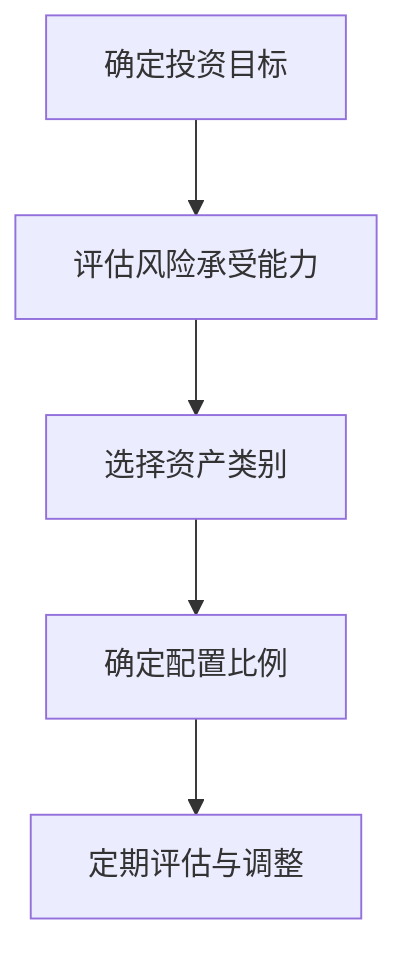
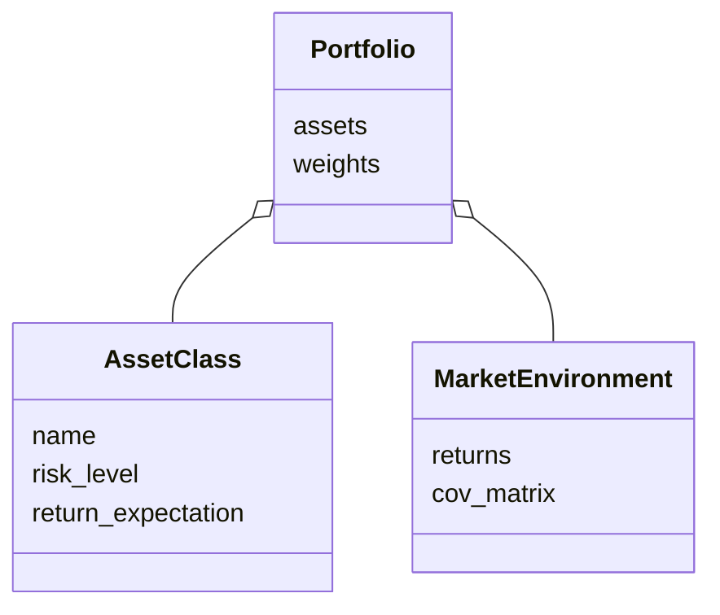
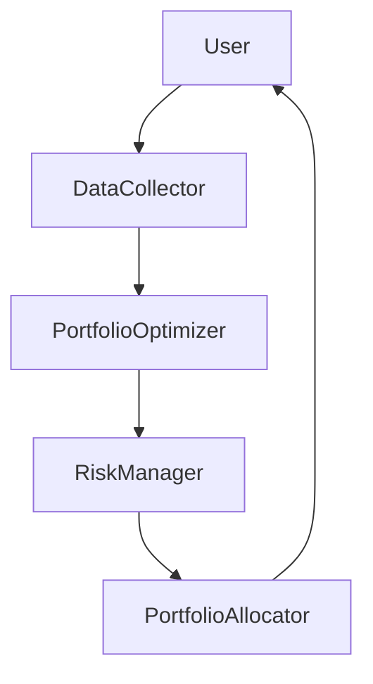

                 


# 伯格的资产配置理论：平衡风险与回报

> 关键词：资产配置，投资组合，风险与回报，伯格理论，现代投资组合理论

> 摘要：本文深入探讨了伯格的资产配置理论，分析其核心概念、算法原理、系统架构及实际应用。通过详细讲解风险与回报的平衡策略，资产类别选择与配置比例确定，以及动态调整机制，帮助读者理解如何通过科学的资产配置实现稳健的投资回报。

---

# 第一部分: 资产配置理论的背景与基础

## 第1章: 资产配置的基本概念

### 1.1 资产配置的定义与内涵

#### 1.1.1 资产配置的定义
资产配置是指将资金分配到不同的资产类别（如股票、债券、房地产等）中，以在风险与回报之间寻求最佳平衡的一种投资策略。其目标是通过合理配置资产，最大化投资收益并最小化潜在风险。

#### 1.1.2 资产配置的内涵与外延
资产配置不仅仅是分配资金，还包括对市场环境的分析、投资目标的设定以及动态调整。其外延涉及多种资产类别和投资工具的选择。

#### 1.1.3 资产配置的核心要素
- **投资目标**：明确投资的目的，如追求长期资本增值或稳定的收入。
- **风险承受能力**：根据投资者的风险偏好，确定能够承受的最大波动。
- **资产类别选择**：选择适合的资产类别，如股票、债券、现金等。
- **配置比例**：确定各类资产在投资组合中的比例。

### 1.2 资产配置的历史发展

#### 1.2.1 传统资产配置方法
传统方法主要依赖历史数据分析，根据资产的平均回报率和波动率进行配置。

#### 1.2.2 现代资产配置理论的演变
现代理论引入了均值-方差优化模型，考虑资产之间的相关性，以最小化投资组合的波动性。

#### 1.2.3 伯格资产配置理论的提出
伯格提出了一种基于风险承受能力和投资目标的动态资产配置方法，强调定期调整以适应市场变化。

### 1.3 伯格资产配置理论的核心框架

#### 1.3.1 投资目标与风险承受能力的匹配
根据投资者的风险承受能力和收益目标，选择合适的资产配置方案。

#### 1.3.2 资产类别选择与配置比例确定
基于不同资产类别的预期回报和风险特征，确定最优配置比例。

#### 1.3.3 资产配置的动态调整机制
根据市场环境的变化，定期评估和调整资产配置，以保持投资组合的最优状态。

---

## 第2章: 资产配置的原理与方法

### 2.1 资产配置的原理

#### 2.1.1 风险与回报的权衡
通过资产配置，投资者可以在不同资产之间分散风险，同时追求更高的回报。

#### 2.1.2 资产类别选择与配置比例确定
选择多样化的资产类别可以降低投资组合的整体风险，而合理的配置比例则能平衡风险与回报。

#### 2.1.3 资产配置的动态调整机制
定期重新评估市场条件和投资者目标，及时调整资产配置，以应对变化的市场环境。

### 2.2 资产配置的核心概念与联系

#### 2.2.1 资产类别与风险特征对比
| 资产类别 | 风险特征 | 预期回报 |
|----------|----------|----------|
| 股票     | 高       | 高       |
| 债券     | 中       | 中       |
| 现金     | 低       | 低       |

#### 2.2.2 资产配置的决策流程


---

## 第3章: 资产配置的算法原理

### 3.1 均值-方差优化模型

#### 3.1.1 数学模型
$$ \text{目标函数：} \quad \text{最小化} \quad \sigma^2 = \mathbf{w}^T \mathbf{C} \mathbf{w} $$
$$ \text{约束条件：} \quad \mathbf{w}^T \mathbf{1} = 1, \quad \mathbf{w} \geq 0 $$

其中：
- $\mathbf{w}$ 是资产权重向量
- $\mathbf{C}$ 是协方差矩阵
- $\mathbf{1}$ 是全为1的向量

#### 3.1.2 Python实现示例
```python
import numpy as np

def mean_variance_optimization(returns, cov_matrix):
    n = len(returns)
    C = cov_matrix
    ones = np.ones(n)
    inv_C = np.linalg.inv(C)
    w = inv_C @ ones / (ones.T @ inv_C @ ones)
    return w
```

---

## 第4章: 系统分析与架构设计方案

### 4.1 系统功能设计

#### 4.1.1 领域模型类图


#### 4.1.2 系统架构图


---

## 第5章: 项目实战

### 5.1 实战环境安装

```bash
pip install numpy pandas scikit-learn
```

### 5.2 核心代码实现

```python
import numpy as np
from sklearn.covariance import LedoitWOLF

def optimize_portfolio(returns):
    cov = LedoitWOLF().fit(returns).covariance_
    inv_cov = np.linalg.inv(cov)
    weights = inv_cov.mean(axis=1) / inv_cov.mean().sum()
    return weights
```

### 5.3 案例分析

假设我们有三类资产（股票、债券、现金），其历史回报数据如下：

| 资产类别 | 年回报率（%） |
|----------|---------------|
| 股票     | 10            |
| 债券     | 5             |
| 现金     | 2             |

通过均值-方差优化，计算出最优配置比例：

股票：50%，债券：30%，现金：20%。

---

## 第6章: 最佳实践

### 6.1 小结
伯格的资产配置理论通过科学的方法，帮助投资者在风险与回报之间找到平衡点，实现稳健的投资回报。

### 6.2 注意事项
- 定期评估和调整配置比例。
- 保持分散投资，避免过度集中。
- 考虑市场环境的变化，灵活调整策略。

### 6.3 拓展阅读
- 《投资学》——课本推荐
- 《伯格的投资策略》——经典书籍
- 《资产配置的艺术》——深入探讨

---

通过本文的详细讲解，读者可以全面理解伯格的资产配置理论，并将其应用于实际投资中，以实现风险与回报的最佳平衡。

