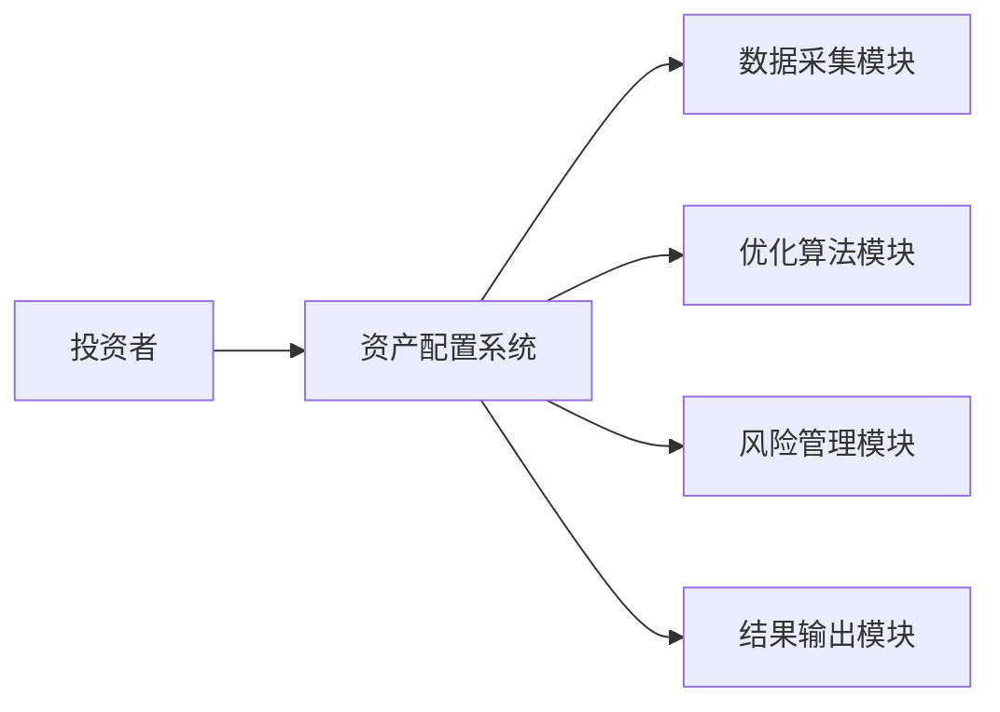

                 


# 伯格的资产配置理论：应对极端市场波动的策略

## 关键词：伯格的资产配置理论、极端市场波动、投资策略、风险管理、长期投资

## 摘要：伯格的资产配置理论强调长期投资和多元化配置的重要性，特别是在应对极端市场波动时。本文详细解析了伯格理论的核心观点，结合实际案例分析其在极端市场环境下的应用，并探讨了如何通过科学的资产配置策略来降低风险、实现稳健收益。

---

# 第一部分: 资产配置理论基础

## 第1章: 资产配置的基本概念

### 1.1 资产配置的定义与作用
#### 1.1.1 资产配置的定义
资产配置是指将资金分配到不同的资产类别（如股票、债券、房地产等）中，以实现投资目标和风险管理的一种方法。

#### 1.1.2 资产配置在投资中的作用
资产配置不仅是投资组合的核心，还能有效降低风险、优化收益。通过合理的资产配置，投资者可以在不同市场环境下平衡风险与收益。

#### 1.1.3 资产配置的核心要素
- **投资目标**：明确收益和风险目标。
- **资产类别**：选择适合的资产类别。
- **权重分配**：确定各类资产的配置比例。

### 1.2 资产配置的类型
#### 1.2.1 按资产类别划分
包括股票、债券、现金等。

#### 1.2.2 按地域划分
包括国内和国际资产配置。

#### 1.2.3 按风险水平划分
从低风险到高风险的资产配置。

### 1.3 资产配置的目标与边界
#### 1.3.1 资产配置的主要目标
- 稳定收益
- 风险控制
- 长期增长

#### 1.3.2 资产配置的边界与限制
- 资金规模
- 市场条件
- 政策法规

#### 1.3.3 资产配置与投资策略的关系
资产配置是投资策略的核心，指导具体的投资行为。

### 1.4 本章小结
本章介绍了资产配置的基本概念、类型和目标，为理解伯格的理论奠定了基础。

---

## 第2章: 伯格的资产配置理论概述

### 2.1 伯格理论的起源与背景
#### 2.1.1 伯格理论的提出背景
20世纪70年代，伯格提出资产配置的重要性，强调长期投资。

#### 2.1.2 伯格理论的核心思想
- 长期投资
- 多元化配置
- 风险管理

#### 2.1.3 伯格理论与传统资产配置的区别
传统方法注重短期调整，伯格则强调长期稳定。

### 2.2 伯格理论的主要观点
#### 2.2.1 长期投资与资产配置的重要性
伯格认为，长期投资通过合理的资产配置，可以平滑市场波动。

#### 2.2.2 市场波动与资产配置的关系
资产配置通过分散投资降低市场波动的影响。

#### 2.2.3 伯格的“三步走”投资策略
1. 确定投资目标
2. 制定资产配置方案
3. 定期调整优化

### 2.3 伯格理论的数学模型
#### 2.3.1 资产配置的数学表达式
投资组合的期望收益与风险可以通过数学模型优化。

#### 2.3.2 投资组合的期望收益与风险模型
- 期望收益：$\sum w_i \times E(r_i)$
- 风险：$\sqrt{\sum w_i^2 \times \sigma_i^2 + 2w_iw_j \times \sigma_i \sigma_j \times \rho_{i,j}}}$

#### 2.3.3 伯格理论的优化算法
- 均值-方差优化
- 使用Python实现优化算法。

### 2.4 本章小结
本章详细阐述了伯格理论的核心观点和数学模型，为后续分析奠定基础。

---

## 第3章: 资产配置的核心概念与联系

### 3.1 核心概念原理
#### 3.1.1 资产配置的原理
通过分散投资降低风险。

#### 3.1.2 投资组合的分散化效应
分散化可以降低非系统性风险。

#### 3.1.3 资产类别间的相关性分析
相关性较低的资产可以进一步分散风险。

### 3.2 核心概念属性特征对比表格
| 资产类别 | 风险水平 | 预期收益 |
|----------|----------|----------|
| 股票     | 高       | 高       |
| 债券     | 中       | 中       |
| 现金     | 低       | 低       |

### 3.3 ER实体关系图


### 3.4 本章小结
本章通过表格和图表，清晰展示了资产配置的核心概念及其联系。

---

## 第4章: 伯格理论的算法原理

### 4.1 现代投资组合理论（MPT）基础
#### 4.1.1 MPT的核心思想
通过优化投资组合的收益-风险比。

#### 4.1.2 MPT的数学模型
- 优化目标：$\min w^T \Sigma w$
- 约束条件：$w^T \mu = \mu_t$, $w^T \mathbf{1} = 1$

#### 4.1.3 MPT的优缺点
优点：科学性强；缺点：假设市场有效。

### 4.2 伯格理论的优化算法
#### 4.2.1 均值-方差优化模型
使用拉格朗日乘数法求解优化问题。

#### 4.2.2 使用Python实现MPT算法
```python
import numpy as np
from numpy.linalg import inv

# 示例数据
mu = np.array([0.1, 0.05, 0.02])
Sigma = np.array([[0.2, 0.1, 0], [0.1, 0.3, 0.05], [0, 0.05, 0.1]])

# 解决优化问题
C = inv(Sigma)
w = C @ mu / (mu @ C @ mu)

print("最优权重：", w)
```

#### 4.2.3 算法流程图


### 4.3 数学模型与公式
#### 4.3.1 投资组合的期望收益公式
$$ E(r_p) = \sum_{i=1}^{n} w_i E(r_i) $$

#### 4.3.2 投资组合的风险公式
$$ \sigma_p^2 = \sum_{i=1}^{n} \sum_{j=1}^{n} w_i w_j \sigma_i \sigma_j \rho_{i,j} $$

### 4.4 本章小结
本章通过数学模型和Python代码，详细讲解了伯格理论的优化算法。

---

## 第5章: 伯格理论在极端市场波动中的应用

### 5.1 极端市场波动的特征
- 市场流动性下降
- 资产价格剧烈波动

### 5.2 伯格理论在极端市场中的应用策略
#### 5.2.1 调整资产配置比例
增加防御性资产（如债券）的权重。

#### 5.2.2 定期再平衡
根据市场变化调整配置，降低风险。

#### 5.2.3 风险管理措施
设置止损点，避免过度亏损。

### 5.3 案例分析：2008年金融危机
伯格理论如何帮助投资者在危机中减少损失。

### 5.4 本章小结
本章通过实际案例，展示了伯格理论在极端市场中的应用价值。

---

## 第6章: 系统架构与风险管理

### 6.1 系统功能设计
#### 6.1.1 领域模型类图


### 6.2 系统架构设计
#### 6.2.1 架构图


### 6.3 系统接口设计
#### 6.3.1 输入接口
接收投资者的资产配置需求。

#### 6.3.2 输出接口
提供优化后的资产配置方案。

### 6.4 系统交互流程
#### 6.4.1 序列图


### 6.5 本章小结
本章从系统架构的角度，详细分析了伯格理论的应用系统设计。

---

## 第7章: 项目实战与最佳实践

### 7.1 环境安装
- 安装Python和相关库（numpy, pandas, matplotlib）。

### 7.2 核心实现代码
```python
import numpy as np

# 示例数据
mu = np.array([0.1, 0.05, 0.02])
Sigma = np.array([[0.2, 0.1, 0], [0.1, 0.3, 0.05], [0, 0.05, 0.1]])

# 计算最优权重
C = inv(Sigma)
w = C @ mu / (mu @ C @ mu)

print("最优权重：", w)
```

### 7.3 实际案例分析
在2008年金融危机期间，伯格理论如何帮助投资者实现资产配置。

### 7.4 最佳实践 tips
- 定期再平衡
- 风险管理
- 长期投资

### 7.5 本章小结
本章通过项目实战，帮助读者理解伯格理论的实际应用。

---

## 第8章: 总结与展望

### 8.1 伯格理论的价值
- 长期投资
- 风险管理

### 8.2 应对极端市场波动的建议
- 合理配置资产
- 定期调整策略
- 坚持长期投资

### 8.3 未来研究方向
- 动态资产配置
- 人工智能在资产配置中的应用

### 8.4 本章小结
总结伯格理论的核心价值，并展望未来的研究方向。

---

## 关键词总结
伯格的资产配置理论、极端市场波动、投资策略、风险管理、长期投资

---

## 摘要总结
伯格的资产配置理论为投资者提供了科学的投资方法，特别是在极端市场波动中，通过合理配置资产、分散风险，投资者可以在复杂多变的市场环境中实现稳健收益。本文详细解析了伯格理论的核心观点，并通过实际案例和系统设计，展示了其在投资实践中的广泛应用。

---

通过以上结构，读者可以系统地理解伯格的资产配置理论，并将其应用于实际投资中，以应对极端市场波动带来的挑战。

