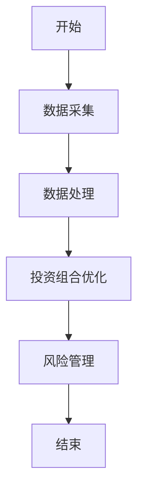

                 


# 伯格的长期投资理念：应对市场短期主义的挑战

**关键词**：长期投资理念、短期主义、价值投资、投资策略、市场波动、投资纪律、投资组合优化

**摘要**：  
本文系统阐述了伯格的长期投资理念及其在应对市场短期主义挑战中的重要作用。通过分析短期主义的成因与影响，探讨了伯格投资理念的核心思想、策略及其实证效果。文章还结合数学模型和系统架构设计，详细解读了长期投资与短期波动的对比，并通过实际案例分析，展示了如何在实际投资中应用伯格的理念。最后，总结了长期投资的最佳实践和未来展望。

---

## 第1章：投资的基本概念

### 1.1 投资的基本定义

#### 1.1.1 投资的定义与分类  
投资是指将资金用于购买资产，以期在未来获得收益或资本增值的行为。根据资产类型，投资可以分为股票、债券、基金、房地产等多种形式。  

#### 1.1.2 投资的基本原则  
- **分散投资**：通过投资不同类型的资产降低风险。  
- **长期持有**：避免频繁交易以减少成本和失误。  
- **价值投资**：选择具有长期增长潜力的优质资产。  

#### 1.1.3 投资与投机的区别  
- **投资**：基于基本面分析，注重长期价值。  
- **投机**：基于市场情绪，追求短期价格波动收益。  

---

### 1.2 股票市场的基本运作

#### 1.2.1 股票市场的功能与作用  
股票市场是企业融资和投资者资产配置的重要平台，具有价格发现、流动性提供和风险管理的功能。  

#### 1.2.2 股票价格的决定因素  
股票价格受供需关系、公司基本面、宏观经济环境、市场情绪等多种因素影响。  

#### 1.2.3 股票市场的波动性分析  
股票市场的波动性是短期主义的直接体现，投资者的短期行为加剧了市场的波动。  

---

## 第2章：伯格的长期投资理念

### 2.1 伯格投资理念的核心思想

#### 2.1.1 长期投资的核心理念  
伯格强调长期持有优质资产，避免频繁交易，以降低交易成本并捕捉长期增长收益。  

#### 2.1.2 价值投资的基本原则  
价值投资的核心是寻找被市场低估的优质企业，关注公司的基本面、盈利能力和发展潜力。  

#### 2.1.3 投资的长期性与稳定性  
长期投资注重资产的内在价值，而非短期价格波动，能够在市场波动中保持投资的稳定性。  

---

### 2.2 伯格的投资策略

#### 2.2.1 长期持有优质股票的策略  
选择具有竞争优势和良好管理的公司，长期持有，分享其成长收益。  

#### 2.2.2 分批投资与定投策略  
通过分批投资或定投，分散投资风险，降低市场波动对投资组合的影响。  

#### 2.2.3 风险控制与投资组合管理  
通过分散投资、定期再平衡和风险管理，降低投资组合的整体风险。  

---

## 第3章：短期主义的成因与影响

### 3.1 短期主义的定义与表现

#### 3.1.1 短期主义的定义  
短期主义是指投资者过于关注短期市场波动，追求短期收益，忽视长期投资价值的行为。  

#### 3.1.2 短期主义在股票市场的表现  
- 过度交易：投资者频繁买卖股票，增加交易成本。  
- 追涨杀跌：盲目跟随市场热点，忽视基本面分析。  

#### 3.1.3 短期主义对市场的影响  
短期主义加剧了市场的波动性，降低了市场的长期配置效率。  

---

### 3.2 短期主义的成因分析

#### 3.2.1 投资者心理因素  
- **贪婪与恐惧**：投资者在市场上涨时过于乐观，在市场下跌时过于悲观。  
- **短视效应**：投资者更关注短期收益，忽视长期投资价值。  

#### 3.2.2 市场信息不对称  
- 信息的不透明性导致投资者难以做出理性决策。  

#### 3.2.3 短期绩效压力  
- 投资机构和基金经理面临短期绩效压力，可能采取短期投资策略。  

---

### 3.3 短期主义对投资的影响

#### 3.3.1 短期波动对长期收益的影响  
频繁交易和短期决策可能导致投资收益的损失，增加交易成本。  

#### 3.3.2 短期决策的潜在风险  
短期决策可能错过长期投资机会，导致资产配置不合理。  

#### 3.3.3 短期主义对市场效率的破坏  
短期主义加剧了市场的波动性，降低了市场的资源配置效率。  

---

## 第4章：伯格理念与短期主义的对比分析

### 4.1 长期投资与短期投资的对比

#### 4.1.1 投资目标的差异  
- 长期投资注重资产的长期增长，短期投资关注短期价格波动。  

#### 4.1.2 投资策略的差异  
- 长期投资采用买入并持有策略，短期投资则采取高频交易策略。  

#### 4.1.3 风险承受能力的差异  
- 长期投资者能够承受短期波动，短期投资者对波动更为敏感。  

---

### 4.2 伯格理念应对短期主义的策略

#### 4.2.1 长期视角下的投资选择  
- 选择具有长期增长潜力的优质资产，避免短期市场波动的干扰。  

#### 4.2.2 如何在短期波动中保持长期投资纪律  
- 通过制定投资计划和纪律性执行，避免情绪化决策。  

#### 4.2.3 长期投资与短期市场的平衡  
- 在市场波动中保持冷静，坚持长期投资策略，同时关注短期市场的变化。  

---

## 第5章：伯格理念的数学模型与实证分析

### 5.1 伯格投资理念的数学模型

#### 5.1.1 价值投资模型的构建  
价值投资模型基于企业的基本面分析，计算内在价值与市场价格的差异。  

#### 5.1.2 长期复利计算公式  
$$\text{复利公式：} \quad FV = PV \times (1 + r)^n$$  
其中，$FV$ 是终值，$PV$ 是现值，$r$ 是年化收益率，$n$ 是投资期限。  

#### 5.1.3 投资组合的收益与风险模型  
投资组合的收益可以用均值-方差模型进行分析：  
$$\text{投资组合收益：} \quad \mu_p = \sum_{i=1}^{n} w_i \mu_i$$  
$$\text{投资组合风险：} \quad \sigma_p = \sqrt{\sum_{i=1}^{n} \sum_{j=1}^{n} w_i w_j \sigma_i \sigma_j \rho_{ij}}$$  
其中，$w_i$ 是资产$i$的权重，$\mu_i$ 是资产$i$的期望收益，$\sigma_i$ 是资产$i$的标准差，$\rho_{ij}$ 是资产$i$和$j$的相关系数。  

---

### 5.2 实证分析与数据支持

#### 5.2.1 长期投资的实证结果  
长期投资策略在长期中表现优于短期投资策略，尤其是在市场波动较大的情况下。  

#### 5.2.2 短期投资的实证结果  
短期投资策略在短期中可能表现较好，但长期来看，其收益不稳定且交易成本较高。  

#### 5.2.3 长期与短期投资的对比分析  
长期投资在市场波动中表现更为稳定，而短期投资则面临更高的风险和不确定性。  

---

## 第6章：系统分析与架构设计

### 6.1 投资决策系统的构建

#### 6.1.1 系统目标与范围  
系统旨在帮助投资者制定长期投资策略，优化投资组合，并监控市场波动。  

#### 6.1.2 系统功能需求  
- 数据采集与处理：获取市场数据和公司基本面信息。  
- 投资组合优化：基于长期投资理念，优化投资组合。  
- 风险管理：监控市场波动，制定风险管理策略。  

#### 6.1.3 系统架构设计  
使用分层架构，包括数据层、业务逻辑层和用户界面层。  

---

### 6.2 投资组合管理系统的实现

#### 6.2.1 系统模块划分  
- 数据处理模块：处理市场数据和公司基本面信息。  
- 投资组合优化模块：基于长期投资理念，优化投资组合。  
- 风险管理模块：监控市场波动，制定风险管理策略。  

#### 6.2.2 系统功能流程图  


#### 6.2.3 系统接口设计  
- 数据接口：与数据源对接，获取市场数据和公司基本面信息。  
- 用户接口：提供用户友好的操作界面，展示投资组合和风险管理信息。  

---

## 第7章：项目实战与案例分析

### 7.1 环境安装与配置

#### 7.1.1 投资分析工具的安装  
安装必要的投资分析工具，如Python、Pandas、Matplotlib等。  

#### 7.1.2 数据获取与处理  
使用API获取市场数据，清洗和预处理数据。  

#### 7.1.3 系统运行环境配置  
配置运行环境，确保系统正常运行。  

---

### 7.2 核心实现与代码解读

#### 7.2.1 投资组合优化算法  
基于长期投资理念，优化投资组合的代码如下：  
```python
import numpy as np
import pandas as pd

# 假设data为资产的收益矩阵
def optimize_portfolio(data):
    n = data.shape[1]
    returns = data.mean(axis=0)
    cov_matrix = data.cov()
    
    # 使用均值-方差模型优化投资组合
    inv_cov = np.linalg.inv(cov_matrix)
    weights = inv_cov.dot(np.ones(n)) / np.sum(inv_cov.dot(np.ones(n)))
    return weights
```

#### 7.2.2 长期收益计算代码  
计算长期复利收益的代码如下：  
```python
def calculate_future_value(present_value, rate, years):
    return present_value * (1 + rate) ** years
```

#### 7.2.3 短期波动模拟代码  
模拟短期市场波动的代码如下：  
```python
import numpy as np

def simulate_market_fluctuations(prices, volatility):
    return prices * (1 + np.random.normal(0, volatility))
```

---

### 7.3 实际案例分析

#### 7.3.1 案例背景介绍  
选择一个具有代表性的市场环境，分析长期投资与短期投资的对比。  

#### 7.3.2 投资策略的实施过程  
基于伯格的长期投资理念，制定投资策略并实施。  

#### 7.3.3 实证结果与分析  
通过实证分析，验证长期投资策略的有效性，并总结经验教训。  

---

## 第8章：总结与展望

### 8.1 本章小结  
伯格的长期投资理念强调长期持有优质资产，避免短期波动的干扰。通过系统的数学模型和实证分析，证明了长期投资策略的有效性。  

### 8.2 未来展望  
未来，随着市场环境的变化和技术的进步，长期投资理念将与更多创新工具和策略相结合，为投资者提供更优的投资选择。  

---

通过本文的系统分析，读者可以深入了解伯格的长期投资理念，并在实际投资中应用这些策略，应对市场短期主义的挑战。

