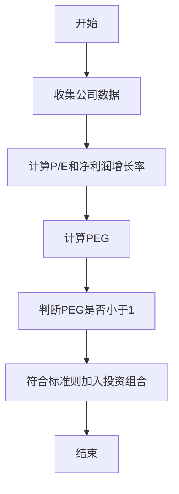

                 

# 低估值高成长：彼得林奇的选股标准

> 关键词：彼得·林奇，价值投资，低估值，高成长，选股标准，投资策略，数学模型

> 摘要：本文深入分析了彼得·林奇的低估值高成长选股标准，从理论基础到数学模型，从实战案例到风险管理，全面解析了这一经典投资策略的核心思想和实际应用。通过详细阐述低估值与高成长的定义、衡量指标以及它们之间的平衡关系，结合具体选股模型和实际案例分析，帮助读者掌握如何在复杂多变的市场中找到具有长期投资价值的优质标的。

---

## 第一部分：价值投资与彼得·林奇的选股理念

### 第1章：价值投资的起源与核心理念

#### 1.1 价值投资的定义与起源
- **1.1.1 价值投资的定义**  
  价值投资是一种以内在价值为核心的投资策略，强调以低于内在价值的价格买入优质资产，长期持有，等待价格回归其内在价值。这种策略的核心在于寻找市场先生的错误定价。

- **1.1.2 价值投资的起源与发展**  
  价值投资的理论基础可以追溯到本杰明·格雷厄姆和戴维·多德的著作。格雷厄姆提出了“安全边际”和“内在价值”等核心概念，为价值投资奠定了理论基础。彼得·林奇作为格雷厄姆的忠实追随者，将价值投资的理念进一步发扬光大。

- **1.1.3 彼得·林奇与价值投资的结合**  
  彼得·林奇是富达投资集团的传奇经理人，他将价值投资的理念应用于实践，创造出了一套独特的选股标准，尤其是低估值与高成长的结合，使其在投资界独树一帜。

---

### 第2章：低估值与高成长的定义与衡量标准

#### 2.1 低估值的定义与衡量指标
- **2.1.1 市盈率（P/E）的计算与应用**  
  市盈率是股票价格与每股净利润的比值，公式为：
  $$ P/E = \frac{\text{股价}}{\text{每股净利润}} $$
  低市盈率通常意味着股票价格相对于其盈利能力较低，可能具有投资价值。

- **2.1.2 市净率（P/B）的计算与应用**  
  市净率是股票价格与每股净资产的比值，公式为：
  $$ P/B = \frac{\text{股价}}{\text{每股净资产}} $$
  低市净率表明资产可能被低估，尤其是在银行、房地产等净资产驱动型行业。

- **2.1.3 市盈率合理区间与行业比较**  
  不同行业的市盈率合理区间不同，投资者需要结合行业特性进行横向比较，避免仅看绝对数值。

#### 2.2 高成长的定义与衡量指标
- **2.2.1 净利润增长率的计算与应用**  
  净利润增长率是衡量公司盈利能力增长的核心指标，公式为：
  $$ \text{净利润增长率} = \frac{\text{本期净利润} - \text{上期净利润}}{\text{上期净利润}} \times 100\% $$

- **2.2.2 营收增长率的计算与应用**  
  营收增长率是衡量公司业务扩展能力的重要指标，公式为：
  $$ \text{营收增长率} = \frac{\text{本期营收} - \text{上期营收}}{\text{上期营收}} \times 100\% $$

- **2.2.3 行业增长潜力与公司规模的匹配**  
  高成长公司的选择需要结合行业前景和公司规模，避免选择过于小众或不具持续增长潜力的行业。

#### 2.3 低估值与高成长的平衡与矛盾
- **2.3.1 低估值与高成长的矛盾分析**  
  低估值通常意味着市场对公司前景的悲观预期，而高成长则需要市场对公司未来盈利的乐观预期。这种矛盾需要通过合理的选股标准来平衡。

- **2.3.2 平衡低估值与高成长的策略选择**  
  彼得·林奇提出的PEG指标（市盈率相对盈利增长比率）有效地解决了这一问题，公式为：
  $$ PEG = \frac{P/E}{\text{净利润增长率}} $$
  当PEG < 1时，表明股票价格相对其成长性被低估。

- **2.3.3 行业周期与公司生命周期的影响**  
  行业周期和公司生命周期也会影响低估值与高成长的平衡。例如，在经济衰退期，某些行业可能处于低估值状态，但具有高成长潜力。

---

### 第3章：彼得·林奇的选股标准与实战案例

#### 3.1 彼得·林奇的核心选股标准
- **3.1.1 低PEG选股法**  
  PEG指标是彼得·林奇的核心工具之一，它结合了估值和成长性，公式为：
  $$ PEG = \frac{P/E}{\text{净利润增长率}} $$
  当PEG < 1时，表明股票价格被低估。

- **3.1.2 避免高市盈率陷阱的策略**  
  高市盈率并不总是意味着高成长，许多情况下可能是市场情绪的反映。彼得·林奇建议投资者避免投资于高市盈率且净利润增长率不高的股票。

- **3.1.3 高ROE的选股标准**  
  净资产收益率（ROE）是衡量公司盈利能力的重要指标，公式为：
  $$ ROE = \frac{\text{净利润}}{\text{净资产}} $$
  高ROE通常意味着公司具有较强的盈利能力。

#### 3.2 彼得·林奇选股模型的数学公式与流程图
- **3.2.1 PEG指标的计算公式**：
  $$ PEG = \frac{P/E}{\text{净利润增长率}} $$
- **3.2.2 选股流程图**：

#### 3.3 实战案例分析
- **3.3.1 微软公司案例分析**  
  微软在2000年互联网泡沫破裂后股价大幅下跌，市盈率低于行业平均水平，但其净利润增长率保持高位。彼得·林奇认为微软的PEG < 1，具有投资价值。

- **3.3.2 谷歌公司案例分析**  
  谷歌的高成长性体现在其营收和净利润的持续高速增长，同时其市盈率相对合理，PEG < 1，符合彼得·林奇的选股标准。

- **3.3.3 亚马逊公司案例分析**  
  亚马逊的高成长性与其云计算和电子商务业务密切相关，尽管市盈率较高，但其净利润增长率远高于行业平均水平，PEG < 1，具有投资价值。

---

### 第4章：价值投资中的风险管理与组合管理

#### 4.1 风险管理的核心原则
- **4.1.1 避免过度集中投资**  
  过度集中投资会增加风险，彼得·林奇建议将投资分散到多个行业和公司。

- **4.1.2 设置止损点的策略**  
  尽管价值投资者通常会长期持有，但设定合理的止损点可以在市场出现意外情况时保护资本。

- **4.1.3 保持投资组合的分散化**  
  通过分散投资不同行业和地区的股票，可以降低整体投资组合的风险。

#### 4.2 投资组合管理的数学模型
- **4.2.1 投资组合的期望收益计算**：
  $$ E(R_p) = \sum w_i R_i $$
  其中，\( w_i \) 是第 \( i \) 只股票的投资比例，\( R_i \) 是第 \( i \) 只股票的期望收益。

- **4.2.2 投资组合的风险计算**：
  $$ \text{投资组合的方差} = \sum \sum w_i w_j \sigma_i \sigma_j \rho_{ij} $$
  其中，\( \sigma_i \) 和 \( \sigma_j \) 是第 \( i \) 和第 \( j \) 只股票的收益率标准差，\( \rho_{ij} \) 是它们的相关系数。

---

## 第五部分：总结与最佳实践

### 5.1 总结
彼得·林奇的低估值高成长选股标准是一种结合了价值投资和成长投资的选股策略，通过PEG指标平衡了估值与成长性。这种策略在长期实践中表现出色，尤其是在市场波动较大的情况下，能够帮助投资者找到具有长期增长潜力的优质股票。

### 5.2 最佳实践 tips
- **长期持有，避免短期波动干扰**  
  价值投资的核心在于长期持有，避免因短期市场波动而做出错误决策。

- **定期调整，保持组合平衡**  
  市场变化和公司基本面的变化都需要投资者定期调整投资组合，确保符合低估值高成长的标准。

- **注重基本面研究，避免跟风**  
  投资者需要深入研究公司的财务报表和行业前景，避免盲目跟风市场热点。

### 5.3 小结
彼得·林奇的选股标准不仅是一种投资策略，更是一种思维方式。通过深入分析公司的估值和成长性，投资者可以在市场中找到具有长期增长潜力的优质股票，实现财富的稳健增长。

---

通过以上详细的分析和解读，我们可以看到，彼得·林奇的低估值高成长选股标准不仅是一种有效的投资策略，更是一种需要深入理解和实践的投资哲学。希望本文能够为投资者提供有价值的参考和启发，帮助他们在复杂多变的市场中找到成功的投资路径。

