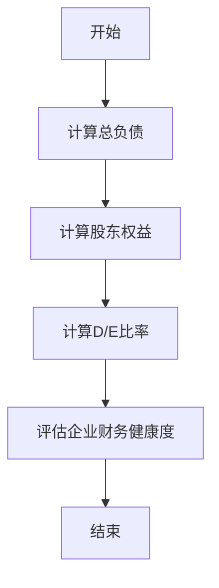
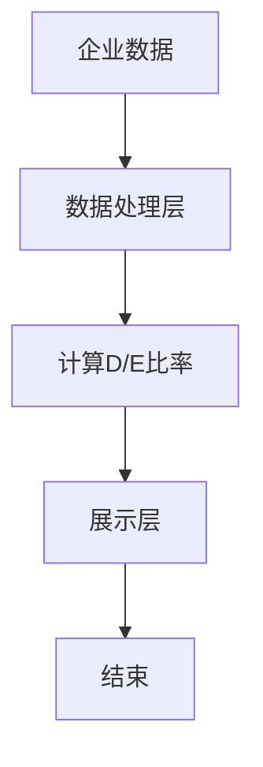

                 


# 债务股本比率：衡量公司健康度的关键

## 关键词：债务股本比率、财务健康度、财务杠杆、资本结构优化、企业风险管理

## 摘要：债务股本比率是衡量企业财务健康度的重要指标，通过分析债务与股本的比例，可以帮助投资者和债权人评估企业的偿债能力和财务风险。本文详细探讨债务股本比率的定义、计算方法、实际应用及其对企业资本结构优化和风险管理的影响，提供丰富的案例分析和系统设计，帮助读者全面理解这一关键指标。

---

## 第一部分：债务股本比率的背景与概念

### 第1章：债务股本比率概述

#### 1.1 什么是债务股本比率
##### 1.1.1 财务杠杆的基本概念
财务杠杆是企业通过借债来放大股东收益的策略。债务股本比率衡量了企业债务与股本的比例，反映了企业的财务杠杆程度。

##### 1.1.2 债务股本比率的定义
债务股本比率（Debt-to-Equity Ratio，简称D/E）是公司总负债与股东权益的比率。公式为：
$$ D/E = \frac{\text{总负债}}{\text{股东权益}} $$

##### 1.1.3 债务股本比率的解决方法
通过分析D/E比率，投资者和债权人可以评估企业的偿债能力、财务风险和资本结构的合理性。

##### 1.1.4 债务股本比率的边界与外延
D/E比率适用于上市公司和非上市公司，但需结合行业特性进行分析。其外延包括流动负债、长期负债和所有者权益的分类。

---

### 第2章：债务股本比率的核心概念与联系

#### 2.1 债务股本比率的原理
##### 2.1.1 债务与股本的结构分析
债务和股本是企业资本结构的两大组成部分，合理的比例有助于优化资本成本。

##### 2.1.2 财务杠杆对股东收益的影响
使用财务杠杆，当息税前利润（EBIT）增长时，股东权益收益可能增加，但风险也会上升。

##### 2.1.3 债务股本比率的数学模型
$$ \text{财务杠杆系数} = \frac{\text{息税前利润}}{\text{净利润}} $$

#### 2.2 核心概念的属性对比
##### 2.2.1 债务与股本的属性特征对比表格
| 属性       | 债务                   | 股本                   |
|------------|------------------------|------------------------|
| 性质       | 负债                  | 所有者权益            |
| 利息       | 固定                   | 无                     |
| 偿还期限     | 短期或长期             | 长期（除非回购）        |

##### 2.2.2 债务股本比率的ER图
```mermaid
erDiagram
    DEBT
    +-----+
    | ID  |
    | Name|
    +-----+
    DEBT..
    EQUITY
    +-----+
    | ID  |
    | Name|
    +-----+
    EQUITY..
```

##### 2.2.3 债务股本比率的流程图


---

## 第二部分：债务股本比率的计算与分析

### 第3章：债务股本比率的计算方法

#### 3.1 债务股本比率的计算公式
$$ D/E = \frac{\text{总负债}}{\text{股东权益}} $$

#### 3.2 债务股本比率的数学模型
$$ \text{财务杠杆系数} = \frac{\text{息税前利润}}{\text{净利润}} $$

#### 3.3 债务股本比率的动态变化分析
通过时间序列分析，观察D/E比率的变化趋势，判断企业的财务风险。

---

### 第4章：债务股本比率在企业中的应用

#### 4.1 企业财务健康度的评估
##### 4.1.1 债务股本比率对企业偿债能力的影响
低D/E比率表示企业依赖股本融资，风险较低；高D/E比率表示企业依赖债务融资，风险较高。

##### 4.1.2 债务股本比率与企业资本结构优化
通过调整D/E比率，优化资本成本，平衡债务和股本的比例。

##### 4.1.3 债务股本比率与企业风险控制的关系
合理控制D/E比率，降低企业的财务风险和违约风险。

#### 4.2 投资者与债权人的视角分析
##### 4.2.1 债务股本比率对投资者决策的影响
低D/E比率吸引风险厌恶型投资者，高D/E比率吸引风险偏好型投资者。

##### 4.2.2 债务股本比率对债权人决策的影响
债权人更关注企业的偿债能力，低D/E比率通常更受债权人青睐。

##### 4.2.3 不同利益相关者的偏好
投资者和债权人对D/E比率的偏好存在差异，需综合考虑企业的整体情况。

---

## 第三部分：系统分析与架构设计

### 第5章：系统分析与架构设计

#### 5.1 问题场景介绍
##### 5.1.1 企业财务健康度评估的典型场景
分析某制造企业的D/E比率，评估其财务健康度。

##### 5.1.2 债务股本比率在企业融资中的应用
评估企业的融资能力，合理设计资本结构。

##### 5.1.3 债务股本比率在企业并购中的作用
评估目标企业的财务风险，制定并购决策。

#### 5.2 系统功能设计
##### 5.2.1 领域模型Mermaid类图
```mermaid
classDiagram
    class 企业 {
        总负债
        股东权益
    }
    class D/E比率 {
        计算结果
    }
    企业 --> D/E比率
```

##### 5.2.2 系统架构设计Mermaid架构图


##### 5.2.3 系统接口设计与交互序列图
```mermaid
sequenceDiagram
    actor 用户
    节点 数据处理层
    节点 计算层
    用户 -> 数据处理层: 提供企业数据
    数据处理层 -> 计算层: 计算D/E比率
    计算层 -> 数据处理层: 返回D/E比率
    数据处理层 -> 用户: 显示结果
```

---

## 第四部分：项目实战

### 第6章：项目实战

#### 6.1 环境安装与配置
##### 6.1.1 数据分析工具的安装
安装Python和Pandas库。

##### 6.1.2 数据库的搭建与配置
使用MySQL数据库存储企业财务数据。

##### 6.1.3 开发环境的设置与测试
配置Jupyter Notebook，安装必要的Python包。

#### 6.2 核心实现源代码
##### 6.2.1 债务股本比率计算的Python代码
```python
import pandas as pd

# 加载数据
data = pd.read_csv('financial_data.csv')

# 计算债务股本比率
data['D/E Ratio'] = data['Total Liabilities'] / data['Shareholders Equity']

# 显示结果
print(data[['Company', 'D/E Ratio']])
```

##### 6.2.2 数据分析与可视化的代码实现
```python
import matplotlib.pyplot as plt

data['D/E Ratio'].plot.hist(bins=10)
plt.title('D/E Ratio Distribution')
plt.xlabel('D/E Ratio')
plt.ylabel('Frequency')
plt.show()
```

##### 6.2.3 系统交互的代码实现
```python
from flask import Flask, request, jsonify

app = Flask(__name__)

@app.route('/calculate_de_ratio', methods=['POST'])
def calculate_de_ratio():
    data = request.json
    de_ratio = data['total_liabilities'] / data['shareholders_equity']
    return jsonify({'D/E Ratio': de_ratio})

if __name__ == '__main__':
    app.run(debug=True)
```

#### 6.3 案例分析与详细解读
##### 6.3.1 某制造企业的D/E比率分析
计算得出该企业的D/E比率为1.5，属于中等风险。

##### 6.3.2 行业横向对比
与同行业其他公司相比，该企业的D/E比率处于中游水平。

##### 6.3.3 历史变化分析
过去五年中，企业的D/E比率从1.2增长到1.8，表明财务杠杆逐渐增加。

#### 6.4 项目小结
通过项目实战，掌握了D/E比率的计算方法和系统实现，能够帮助企业评估财务健康度。

---

## 第五部分：总结与最佳实践

### 第7章：总结与最佳实践

#### 7.1 最佳实践Tips
##### 7.1.1 债务股本比率的合理区间
不同行业有不同的合理区间，需结合行业特性进行分析。

##### 7.1.2 不同行业债务股本比率的参考值
制造业的合理D/E比率通常在1.0到2.0之间，而高科技行业的D/E比率可能更低。

##### 7.1.3 定期评估与调整
企业应定期评估D/E比率，根据市场变化和企业战略进行调整。

#### 7.2 小结
债务股本比率是衡量企业财务健康度的关键指标，合理运用有助于优化资本结构和控制财务风险。

#### 7.3 注意事项
- 避免单独依赖D/E比率进行决策，需结合其他财务指标。
- 考虑行业特性和经济周期的影响。

#### 7.4 拓展阅读
建议进一步阅读《财务报表分析》和《资本结构优化》相关书籍。

---

通过本文的详细讲解和案例分析，读者能够全面理解债务股本比率的重要性和实际应用，为企业财务管理和投资决策提供有力支持。

