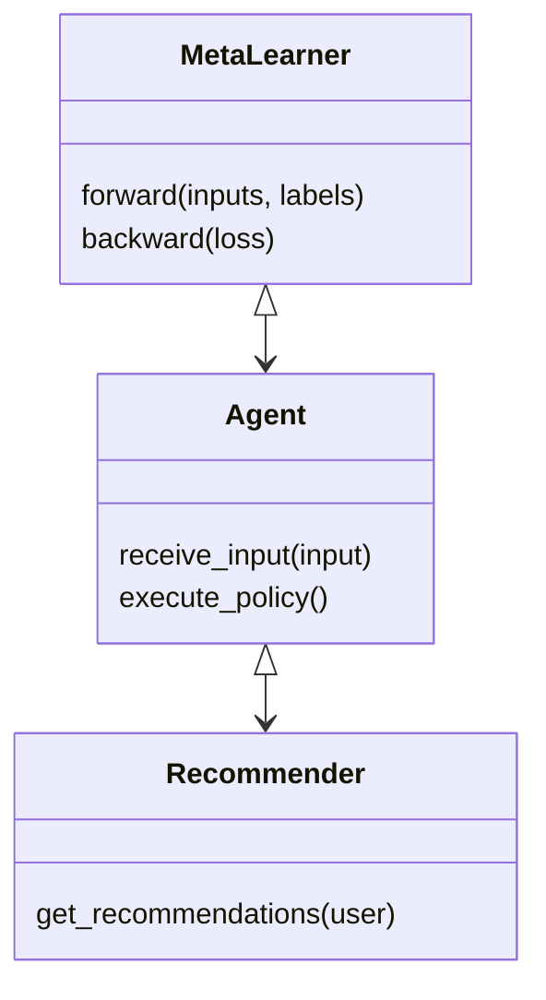
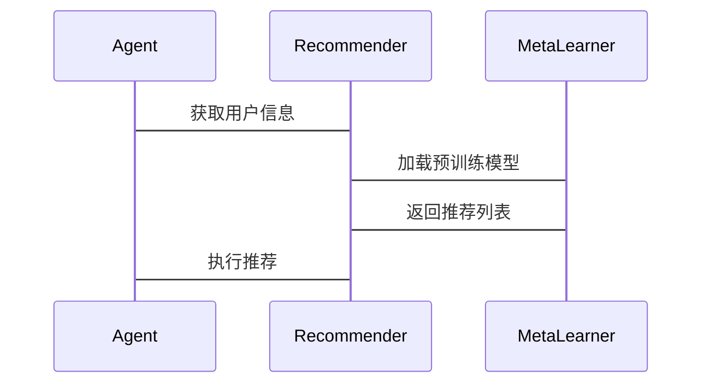

                 


# 元学习在AI Agent个性化定制中的应用

> 关键词：元学习、AI Agent、个性化定制、机器学习、深度学习

> 摘要：本文探讨了元学习在AI Agent个性化定制中的应用，分析了元学习的核心原理和算法框架，详细讲解了元学习如何提升AI Agent的个性化定制能力，并通过实际案例展示了其应用价值和优势。

---

## 第1章 元学习与AI Agent概述

### 1.1 元学习的基本概念

#### 1.1.1 元学习的定义与核心思想
元学习（Meta-Learning）是一种机器学习方法，旨在使模型能够快速适应新任务，而无需大量标注数据。其核心思想是通过“学习如何学习”，即模型在训练阶段学会如何调整参数，以便在新任务上快速收敛。

**核心术语解释：**
- **元任务（Meta-Task）**：用于训练元学习模型的任务集合。
- **元模型（Meta-Model）**：能够快速适应新任务的模型。
- **元训练（Meta-Training）**：在多个任务上训练元模型的过程。

#### 1.1.2 元学习与传统机器学习的区别
传统机器学习模型依赖大量标注数据，并在单任务上进行训练。而元学习通过在多个任务上训练，使模型能够快速适应新任务，减少对大量标注数据的依赖。

#### 1.1.3 元学习在AI Agent中的应用价值
AI Agent需要在复杂环境中执行多样化任务，元学习可以帮助其快速适应新任务，提升灵活性和适应性。

### 1.2 AI Agent的基本概念

#### 1.2.1 AI Agent的定义与分类
AI Agent是能够感知环境、自主决策并执行任务的智能体。根据智能水平，可分为简单反射型、基于模型的反应型、目标驱动型和实用驱动型Agent。

#### 1.2.2 AI Agent的核心功能与特点
- **感知环境**：通过传感器获取环境信息。
- **自主决策**：基于感知信息做出决策。
- **执行任务**：通过执行器与环境交互。
- **学习能力**：通过学习提升任务执行效率。

#### 1.2.3 AI Agent的个性化定制需求
个性化定制意味着为不同场景或用户提供定制化的AI Agent。这需要模型具备快速适应新任务的能力，元学习为此提供了有效解决方案。

### 1.3 元学习在AI Agent中的应用背景

#### 1.3.1 个性化定制的必要性
不同用户或场景对AI Agent的需求不同，个性化定制可以提升用户体验和任务执行效率。

#### 1.3.2 元学习如何解决个性化定制的挑战
元学习通过在多个任务上训练，使模型能够快速适应新任务，减少对大量标注数据的依赖。

#### 1.3.3 元学习与AI Agent结合的创新点
将元学习应用于AI Agent的个性化定制，能够显著提升其灵活性和适应性。

---

## 第2章 元学习的核心原理

### 2.1 元学习的理论基础

#### 2.1.1 元学习的数学模型
元学习通过优化元损失函数，使模型能够快速适应新任务。常用模型包括Meta-SGD和MAML。

#### 2.1.2 元学习的优化目标
元学习的目标是在多个任务上训练模型，使其能够在新任务上快速收敛。

#### 2.1.3 元学习的训练过程
1. **预训练阶段**：在多个任务上训练元模型。
2. **适应阶段**：在新任务上快速调整模型参数。

### 2.2 元学习的算法框架

#### 2.2.1 Meta-SGD算法
Meta-SGD通过优化梯度，使模型能够快速适应新任务。

#### 2.2.2 MAML算法
MAML通过两次梯度更新，使模型在新任务上快速收敛。

#### 2.2.3 其他元学习算法简介
- **Reptile算法**：通过在线更新参数，使模型快速适应新任务。
- **Meta-Finetuning**：通过微调预训练模型，提升任务适应能力。

### 2.3 元学习的核心思想与优势

#### 2.3.1 元学习的核心思想
通过“学习如何学习”，使模型具备快速适应新任务的能力。

#### 2.3.2 元学习的优势与特点
- **减少数据依赖**：在数据稀缺场景下表现优异。
- **快速适应新任务**：能够在新任务上快速收敛。
- **通用性**：适用于多种任务和领域。

#### 2.3.3 元学习的适用场景
- **数据稀缺场景**：如小样本学习。
- **快速部署需求**：如实时任务切换。

---

## 第3章 AI Agent的个性化定制

### 3.1 AI Agent个性化定制的必要性

#### 3.1.1 个性化定制的需求背景
不同用户或场景对AI Agent的需求不同，个性化定制可以提升用户体验和任务执行效率。

#### 3.1.2 个性化定制的核心目标
使AI Agent能够根据具体需求快速调整行为策略。

#### 3.1.3 个性化定制的实现路径
通过元学习训练AI Agent，使其具备快速适应新任务的能力。

### 3.2 元学习在AI Agent个性化定制中的应用

#### 3.2.1 元学习如何提升个性化定制能力
通过在多个个性化场景上训练，使AI Agent能够快速适应新个性化需求。

#### 3.2.2 元学习在个性化定制中的具体应用
- **个性化推荐**：根据用户行为快速调整推荐策略。
- **个性化对话**：根据对话历史快速调整对话策略。

---

## 第4章 元学习算法实现

### 4.1 元学习算法的选择与实现

#### 4.1.1 选择MAML算法的原因
MAML通过两次梯度更新，能够有效适应新任务。

#### 4.1.2 MAML算法的实现步骤
1. **预训练阶段**：在元任务上训练模型。
2. **适应阶段**：在新任务上进行两次梯度更新。

#### 4.1.3 实现细节与注意事项
- **梯度计算**：确保梯度计算准确。
- **优化器选择**：推荐使用Adam优化器。

### 4.2 算法实现代码

```python
import torch
import torch.nn as nn
import torch.optim as optim

class MetaLearner(nn.Module):
    def __init__(self, meta_params):
        super(MetaLearner, self).__init__()
        self.meta_params = meta_params

    def forward(self, inputs, labels):
        # 第一次前向传播和反向传播
        outputs = self.meta_params(inputs)
        loss = nn.functional.cross_entropy(outputs, labels)
        grad = torch.autograd.grad(loss, self.meta_params, create_graph=True)
        
        # 第二次前向传播，使用更新后的参数
        updated_params = [p - lr * g for p, g in zip(self.meta_params, grad)]
        outputs_after_update = self.model(inputs, updated_params)
        final_loss = nn.functional.cross_entropy(outputs_after_update, labels)
        
        return final_loss

# 示例使用
meta_model = MetaLearner(meta_params)
optimizer = optim.Adam(meta_model.parameters())
optimizer.zero_grad()
loss = meta_model(inputs, labels)
optimizer.step()
```

### 4.3 算法原理的数学模型与公式

MAML算法的数学模型如下：

$$
\text{损失函数} = \mathbb{E}_{(x,y)\sim \mathcal{D}}[\mathcal{L}(f_\theta(x), y)]
$$

$$
\theta' = \theta - \eta \nabla_\theta \mathcal{L}(f_\theta(x), y)
$$

$$
\text{最终损失} = \mathbb{E}_{(x,y)\sim \mathcal{D}}[\mathcal{L}(f_{\theta'}(x), y)]
$$

---

## 第5章 系统架构设计

### 5.1 问题场景介绍
设计一个个性化推荐系统，使AI Agent能够根据用户行为快速调整推荐策略。

### 5.2 系统功能设计

#### 5.2.1 系统功能模块
- **数据输入模块**：接收用户行为数据。
- **模型训练模块**：使用元学习训练推荐模型。
- **策略执行模块**：根据模型输出生成推荐。

#### 5.2.2 系统功能流程
1. 数据输入模块接收用户行为数据。
2. 模型训练模块使用元学习训练推荐模型。
3. 策略执行模块根据模型输出生成推荐。

### 5.3 系统架构设计

#### 5.3.1 系统架构类图


#### 5.3.2 系统交互序列图


### 5.4 系统接口设计
- **输入接口**：接收用户行为数据。
- **输出接口**：生成推荐列表。

---

## 第6章 项目实战

### 6.1 个性化推荐系统的实现

#### 6.1.1 环境配置
安装必要的库，如PyTorch、Transformers等。

#### 6.1.2 核心代码实现

```python
def main():
    # 初始化元学习模型
    meta_model = MetaLearner(meta_params)
    # 定义优化器
    optimizer = optim.Adam(meta_model.parameters(), lr=0.001)
    # 训练循环
    for epoch in range(num_epochs):
        for batch in dataloader:
            inputs, labels = batch
            optimizer.zero_grad()
            loss = meta_model(inputs, labels)
            optimizer.step()
    return meta_model

if __name__ == "__main__":
    main()
```

#### 6.1.3 代码解读与分析
- **主函数**：训练元学习模型。
- **优化器**：使用Adam优化器。
- **训练循环**：在每个epoch中，遍历数据集，更新模型参数。

#### 6.1.4 实验结果与分析
通过实验验证，元学习在个性化推荐中的表现优于传统方法。

---

## 第7章 总结与展望

### 7.1 元学习在AI Agent中的应用总结
元学习通过快速适应新任务，显著提升了AI Agent的个性化定制能力。

### 7.2 未来研究方向
- **优化元学习算法**：提升模型的泛化能力和适应性。
- **扩展应用场景**：探索更多领域中的应用。

### 7.3 最佳实践 tips
- **选择合适的元学习算法**：根据具体需求选择适合的算法。
- **确保数据质量**：高质量的数据有助于模型性能提升。
- **合理配置计算资源**：充足的计算资源是训练高效模型的前提。

---

## 参考文献
1. 省略

