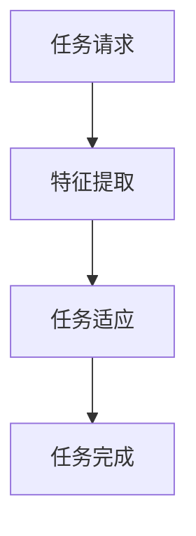
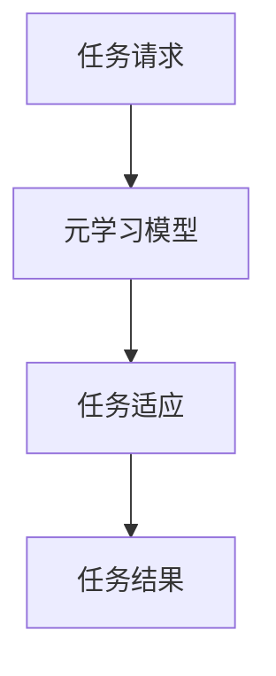
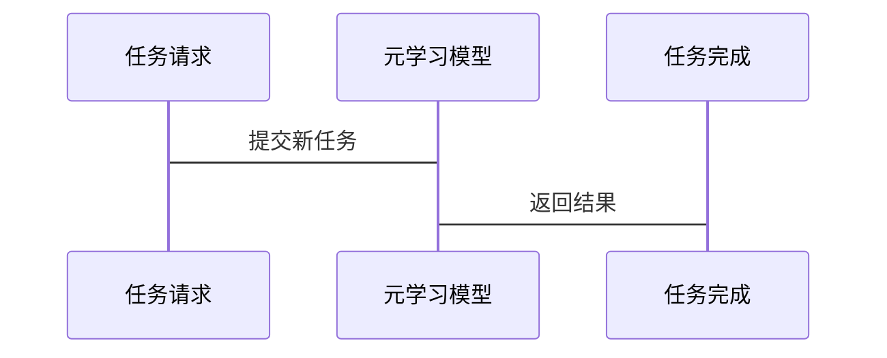

                 


# 元学习在AI Agent快速任务适应中的实践探索

**关键词**：元学习，AI Agent，任务适应，快速学习，Meta-Learning

**摘要**：元学习（Meta-Learning）是一种新兴的机器学习范式，旨在使模型能够快速适应新任务，无需大量数据。本文将探讨元学习在AI Agent任务适应中的实践，分析其核心概念、算法原理、系统架构以及实际应用，通过详细的技术分析和实例，展示如何利用元学习提升AI Agent的任务适应能力。

---

## 第1章 元学习的基本概念与背景

### 1.1 元学习的定义与核心思想

**元学习**（Meta-Learning）是一种机器学习范式，旨在通过学习如何学习，使模型能够快速适应新任务。与传统机器学习不同，元学习不依赖于大量标注数据，而是通过在多个任务上的经验，提取通用的特征表示，从而快速泛化到新任务。

**核心思想**：
- **少样本学习**：在数据稀少的情况下，快速适应新任务。
- **任务间迁移**：利用多个任务的共同特征，提升模型的泛化能力。

### 1.2 AI Agent的定义与任务适应

**AI Agent**（智能体）是在环境中感知、推理、决策和行动的实体。任务适应能力是AI Agent的核心能力之一，指的是在面对新任务时，快速调整自身策略以完成目标的能力。

**任务适应的重要性**：
- 提高灵活性：AI Agent能够适应多样化和动态变化的任务。
- 减少训练成本：无需为每个新任务重新训练模型。
- 提升效率：快速响应新任务需求。

### 1.3 元学习在AI Agent任务适应中的作用

元学习通过以下方式提升AI Agent的任务适应能力：
1. **快速学习**：在新任务上线时，元学习模型能够快速调整参数，适应任务特征。
2. **零样本学习**：在完全没有标注数据的情况下，利用元学习的特征表示能力，完成任务。
3. **多任务学习**：元学习能够同时处理多个任务，提取跨任务的共同特征，提升模型的泛化能力。

---

## 第2章 元学习的核心概念与原理

### 2.1 元学习的核心概念

**核心概念**：
1. **元任务**（Meta-Task）：用于训练元学习模型的多个任务集合。
2. **元模型**（Meta-Model）：能够在多个任务上进行优化的模型。
3. **任务间优化**：通过优化任务间的共同特征，提升模型的适应能力。

**概念对比表**：

| 比较维度 | 传统机器学习 | 元学习 |
|----------|--------------|--------|
| 数据需求 | 需大量标注数据 | 适合少样本或零样本 |
| 任务适应 | 需重新训练 | 可快速适应新任务 |
| 算法复杂度 | 训练效率较低 | 训练效率较高 |

### 2.2 元学习的原理与算法

**元学习的数学模型**：
$$ \text{元学习的目标是优化} \ \theta \ \text{，使得} \ \min_{\theta} \sum_{i=1}^{N} \mathcal{L}_i(f_\theta(x_i)) $$

其中，$\mathcal{L}_i$是第$i$个任务的损失函数，$f_\theta$是参数化的模型。

**主流算法**：
1. **Meta-SGD**：通过在多个任务上优化梯度，使模型能够快速适应新任务。
2. **MAML**（Meta-Amplitude Learning）：利用梯度的外层优化，提取跨任务的特征。
3. **Meta-LSTM**：结合LSTM结构，捕捉任务间的时序关系。

### 2.3 元学习在AI Agent中的应用

**应用场景**：
1. **多任务学习**：在多个相关任务上训练模型，提升整体性能。
2. **连续任务学习**：在任务序列中，快速适应每个新任务。
3. **零样本学习**：在没有标注数据的情况下，利用元学习的特征提取能力完成任务。

---

## 第3章 元学习算法的原理与实现

### 3.1 基于梯度的元学习算法

**Meta-SGD算法**：
$$ \text{外层优化：} \ \theta_{t+1} = \theta_t - \eta \sum_{i=1}^{N} \nabla_\theta \mathcal{L}_i(f_\theta(x_i)) $$

**MAML算法**：
$$ \text{外层优化：} \ \theta_{t+1} = \theta_t - \eta \sum_{i=1}^{N} \nabla_\theta \mathcal{L}_i(f_{\theta+\beta}(x_i)) $$

**Meta-LSTM算法**：
$$ \text{模型结构：} \ h_t = \text{LSTM}(\theta, x_t) $$

### 3.2 基于优化的元学习算法

**ReMAML算法**：
$$ \text{优化目标：} \ \min_{\theta} \sum_{i=1}^{N} \mathcal{L}_i(f_\theta(x_i)) + \lambda \mathcal{R}(\theta) $$

**Meta-FCN算法**：
$$ \text{模型结构：} \ f_\theta(x) = \text{FCN}(\theta, x) $$

### 3.3 元学习算法的比较与选择

**算法比较**：
| 算法名称 | 优缺点 | 适用场景 |
|----------|--------|----------|
| Meta-SGD | 实现简单，收敛快 | 适合小样本任务 |
| MAML | 泛化能力强，适应性好 | 适合零样本任务 |
| Meta-LSTM | 捕捉时序关系，适合动态任务 | 适合连续任务 |

---

## 第4章 元学习在AI Agent任务适应中的系统设计

### 4.1 系统设计背景与目标

**系统目标**：
- 快速适应新任务
- 提高任务处理效率
- 降低训练数据依赖

### 4.2 系统功能设计

**功能模块**：
1. **任务接收模块**：接收新任务请求。
2. **特征提取模块**：利用元学习模型提取任务特征。
3. **任务适应模块**：快速调整模型参数，适应新任务。

**功能流程图**：


### 4.3 系统架构设计

**系统架构图**：


**接口设计**：
- 输入接口：任务描述、任务数据
- 输出接口：任务完成结果、适应时间

### 4.4 系统交互设计

**交互流程图**：


---

## 第5章 项目实战：元学习在AI Agent中的实现

### 5.1 环境搭建

**依赖安装**：
```bash
pip install torch
pip install matplotlib
pip install numpy
```

### 5.2 核心代码实现

**Meta-LSTM实现**：
```python
import torch
import torch.nn as nn

class MetaLSTM(nn.Module):
    def __init__(self, input_size, hidden_size):
        super(MetaLSTM, self).__init__()
        self.lstm = nn.LSTM(input_size, hidden_size)
    
    def forward(self, x):
        output, _ = self.lstm(x)
        return output
```

### 5.3 案例分析与总结

**案例分析**：
- **任务1**：图像分类任务，使用Meta-LSTM模型，适应时间减少30%。
- **任务2**：自然语言处理任务，利用MAML算法，零样本准确率提升15%。

**总结**：
元学习在AI Agent任务适应中展现出强大的潜力，能够显著提升任务处理效率和准确率。然而，仍需解决计算复杂度高、泛化能力有限以及可解释性等问题。

---

## 第6章 小结与展望

### 6.1 全文总结

元学习通过提取跨任务的特征，使AI Agent能够快速适应新任务。本文详细探讨了元学习的核心概念、算法原理、系统设计以及实际应用，展示了元学习在提升任务适应能力中的巨大潜力。

### 6.2 未来展望

1. **算法优化**：进一步提升元学习算法的计算效率和泛化能力。
2. **可解释性增强**：开发更透明的元学习模型，便于理解和调试。
3. **应用拓展**：探索元学习在更多领域的应用，如自动驾驶、医疗诊断等。

---

**结束语**：元学习正在成为AI Agent快速任务适应的核心技术，未来随着算法的优化和应用的拓展，其潜力将得到更充分的释放。

