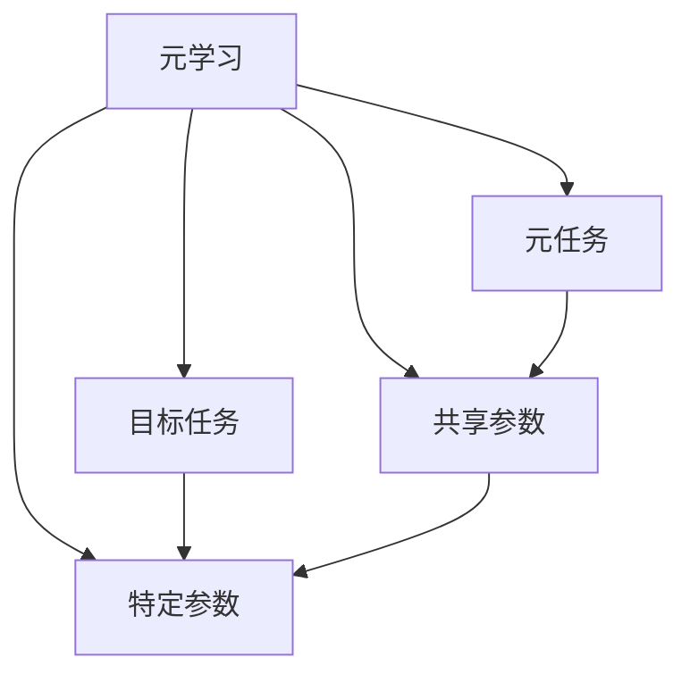
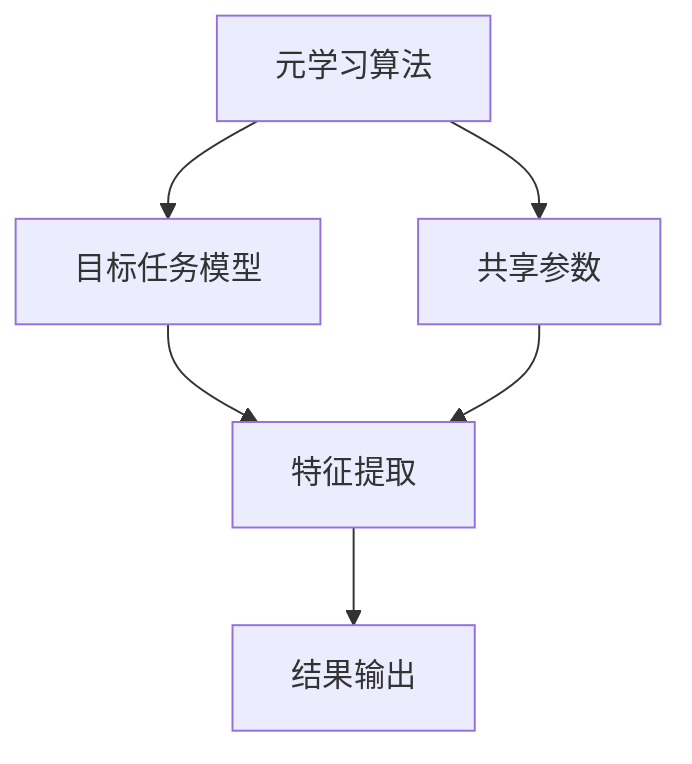
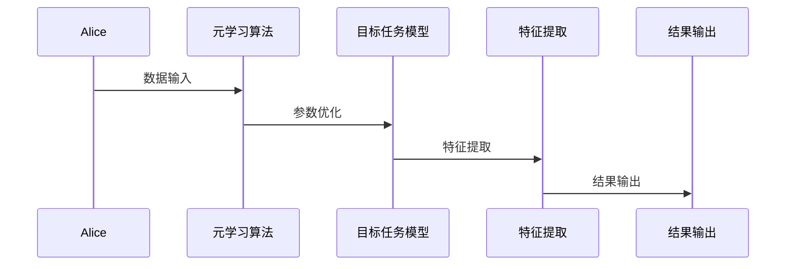

                 


# 元学习在AI Agent快速适应中的应用

---

## 关键词：
元学习、AI Agent、快速适应、MAML算法、ReM算法、Meta-SGD算法

---

## 摘要：
元学习（Meta-Learning）是一种新兴的机器学习范式，旨在通过学习如何学习来加速模型在新任务上的适应能力。本文聚焦于元学习在AI Agent快速适应中的应用，系统地探讨了元学习的核心概念、算法原理、系统架构以及实际应用案例。文章首先从元学习的基本概念和问题背景出发，分析了其在AI Agent中的重要性；接着，深入讲解了元学习的核心原理，并通过对比分析明确了其与迁移学习、自适应学习和强化学习的区别；随后，详细介绍了几种典型的元学习算法（MAML、ReM、Meta-SGD）的原理、实现步骤及优缺点；最后，通过系统架构设计和项目实战，展示了元学习在实际场景中的应用价值。本文内容丰富，逻辑清晰，旨在为AI Agent的快速适应提供理论支持和实践指导。

---

## 正文：

### 第一部分：背景介绍

#### 第1章：元学习的基本概念与问题背景

##### 1.1 元学习的核心概念
元学习是一种机器学习范式，其目标是通过“学习如何学习”来加速模型在新任务上的适应能力。与传统机器学习算法不同，元学习算法能够在训练阶段快速适应新任务，而无需大量标注数据。

- **1.1.1 元学习的定义与特点**
  元学习的本质是通过优化一个参数初始化，使得模型能够快速适应新任务。其核心特点包括：
  - **快速适应性**：在新任务上仅需少量数据即可完成任务。
  - **任务多样性**：适用于多任务学习场景。
  - **泛化能力**：能够在不同任务之间共享学习成果。

- **1.1.2 元学习与传统机器学习的区别**
  传统机器学习算法依赖大量标注数据，且在新任务上需要重新训练。而元学习算法通过优化参数初始化，能够在新任务上快速调整。

- **1.1.3 元学习的数学模型与核心要素**
  元学习的目标函数通常包含两部分：元任务损失和目标任务损失。其核心要素包括元任务、目标任务、共享参数和适应策略。

##### 1.2 元学习的背景与问题描述
AI Agent在实际应用中需要快速适应不同的环境和任务，元学习为其提供了一种高效的解决方案。

- **1.2.1 AI Agent快速适应的挑战**
  AI Agent需要在动态变化的环境中快速调整行为策略，传统的机器学习方法难以应对这种挑战。

- **1.2.2 元学习在AI Agent中的应用价值**
  元学习能够通过快速调整参数，使AI Agent在新任务上快速适应，从而提升其实时性和响应速度。

- **1.2.3 元学习的边界与外延**
  元学习的应用场景包括多任务学习、零样本学习、小样本学习等，但其边界在于需要一定的先验知识。

##### 1.3 元学习的核心问题与解决方案
元学习的核心问题是如何通过优化参数初始化，使得模型能够快速适应新任务。

- **1.3.1 元学习的核心问题**
  元学习需要解决如何在不同任务之间共享参数，并在新任务上快速调整参数以适应任务需求。

- **1.3.2 元学习的解决方案**
  通过设计适当的元损失函数和优化策略，元学习能够在训练阶段优化参数初始化，从而在测试阶段快速适应新任务。

- **1.3.3 元学习的优缺点对比**
  元学习的优点包括快速适应和任务多样性，但其缺点是需要一定的计算资源和设计复杂度。

#### 1.4 本章小结
元学习通过优化参数初始化，使模型能够快速适应新任务。本文从元学习的基本概念、问题背景和核心问题出发，分析了其在AI Agent中的应用价值。

---

### 第二部分：核心概念与联系

#### 第2章：元学习的核心原理与概念联系

##### 2.1 元学习的原理
元学习的核心原理是通过优化参数初始化，使得模型能够快速适应新任务。

- **2.1.1 元学习的基本原理**
  元学习通过设计适当的元损失函数，优化参数初始化，从而在目标任务上快速适应。

- **2.1.2 元学习的数学模型与公式**
  元学习的目标函数通常包括元任务损失和目标任务损失，具体公式如下：
  $$
  \mathcal{L}_{\text{meta}} = \sum_{i=1}^{N} \mathcal{L}_{i}(\theta_{\text{meta}}, \theta_i)
  $$
  其中，$\theta_{\text{meta}}$是元学习的共享参数，$\theta_i$是目标任务的特定参数。

- **2.1.3 元学习的算法流程**
  元学习的算法流程包括训练阶段和推理阶段。在训练阶段，模型通过优化共享参数；在推理阶段，模型通过调整特定参数快速适应新任务。

##### 2.2 元学习与AI Agent的关系
元学习通过优化参数初始化，使AI Agent能够快速适应新任务。

- **2.2.1 元学习在AI Agent中的作用**
  元学习能够通过快速调整参数，使AI Agent在新环境中快速适应任务需求。

- **2.2.2 元学习与AI Agent的交互机制**
  AI Agent通过元学习算法快速调整其行为策略，以适应动态变化的环境。

- **2.2.3 元学习对AI Agent适应能力的提升**
  元学习通过优化参数初始化，显著提升了AI Agent的适应能力和响应速度。

##### 2.3 元学习的核心概念对比
元学习与其他学习方法（如迁移学习、自适应学习和强化学习）有明显的区别和联系。

- **2.3.1 元学习与迁移学习的对比**
  元学习通过优化参数初始化，而迁移学习通过共享特征。

- **2.3.2 元学习与自适应学习的对比**
  元学习通过优化参数初始化，而自适应学习通过在线调整参数。

- **2.3.3 元学习与强化学习的对比**
  元学习通过优化参数初始化，而强化学习通过与环境交互获得奖励。

##### 2.4 元学习的ER实体关系图
元学习的实体关系图展示了其核心要素之间的关系。



---

### 第三部分：算法原理讲解

#### 第3章：元学习算法的核心原理

##### 3.1 MAML算法的原理
MAML（Meta-Algorithm for Adaptive Model Learning）是一种经典的元学习算法。

- **3.1.1 MAML算法的定义**
  MAML通过优化参数初始化，使得模型能够在新任务上快速适应。

- **3.1.2 MAML算法的数学模型与公式**
  MAML的目标函数为：
  $$
  \mathcal{L}_{\text{MAML}} = \sum_{i=1}^{N} \mathcal{L}_{i}(\theta_{\text{meta}}, \theta_i)
  $$
  其中，$\theta_{\text{meta}}$是共享参数，$\theta_i$是目标任务参数。

- **3.1.3 MAML算法的实现步骤**
  MAML的实现步骤包括训练阶段和推理阶段。在训练阶段，优化共享参数；在推理阶段，快速调整目标参数。

##### 3.2 ReM算法的原理
ReM（Recurrent Meta-Learning）是一种基于循环的元学习算法。

- **3.2.1 ReM算法的定义**
  ReM通过循环结构优化参数初始化，使模型能够快速适应新任务。

- **3.2.2 ReM算法的数学模型与公式**
  ReM的目标函数为：
  $$
  \mathcal{L}_{\text{ReM}} = \sum_{i=1}^{N} \mathcal{L}_{i}(\theta_{\text{meta}}, \theta_i)
  $$
  其中，$\theta_{\text{meta}}$是共享参数，$\theta_i$是目标任务参数。

- **3.2.3 ReM算法的实现步骤**
  ReM的实现步骤包括训练阶段和推理阶段。在训练阶段，优化共享参数；在推理阶段，快速调整目标参数。

##### 3.3 Meta-SGD算法的原理
Meta-SGD是一种基于随机梯度下降的元学习算法。

- **3.3.1 Meta-SGD算法的定义**
  Meta-SGD通过优化参数初始化，使模型能够在新任务上快速适应。

- **3.3.2 Meta-SGD算法的数学模型与公式**
  Meta-SGD的目标函数为：
  $$
  \mathcal{L}_{\text{Meta-SGD}} = \sum_{i=1}^{N} \mathcal{L}_{i}(\theta_{\text{meta}}, \theta_i)
  $$
  其中，$\theta_{\text{meta}}$是共享参数，$\theta_i$是目标任务参数。

- **3.3.3 Meta-SGD算法的实现步骤**
  Meta-SGD的实现步骤包括训练阶段和推理阶段。在训练阶段，优化共享参数；在推理阶段，快速调整目标参数。

##### 3.4 元学习算法的对比分析
不同元学习算法在优缺点和适用场景上有明显的区别。

- **3.4.1 不同元学习算法的优缺点对比**
  | 算法名称 | 优点 | 缺点 |
  |----------|------|------|
  | MAML    | 鲁棒性强 | 计算复杂度高 |
  | ReM      | 易于实现 | 适应性较弱 |
  | Meta-SGD | 计算效率高 | 鲁棒性较差 |

- **3.4.2 元学习算法的适用场景分析**
  MAML适用于复杂任务，ReM适用于时间序列任务，Meta-SGD适用于计算效率要求高的任务。

---

### 第四部分：系统分析与架构设计方案

#### 第4章：元学习在AI Agent中的系统架构设计

##### 4.1 系统架构设计概述
元学习在AI Agent中的系统架构设计包括领域模型、系统架构、接口设计和交互流程。

- **4.1.1 领域模型设计**
  领域模型包括元学习算法、目标任务模型和共享参数。

- **4.1.2 系统架构设计**
  系统架构包括前端、后端和数据库。

- **4.1.3 接口设计**
  接口设计包括数据输入接口和结果输出接口。

- **4.1.4 交互流程**
  交互流程包括训练阶段和推理阶段。

##### 4.2 系统功能设计
系统功能设计包括数据预处理、模型训练和模型推理。

- **4.2.1 数据预处理**
  数据预处理包括数据清洗和特征提取。

- **4.2.2 模型训练**
  模型训练包括参数优化和元任务损失计算。

- **4.2.3 模型推理**
  模型推理包括目标任务损失计算和参数调整。

##### 4.3 系统架构图
系统架构图展示了系统的整体结构。



##### 4.4 系统交互流程图
系统交互流程图展示了系统各部分的交互流程。



---

### 第五部分：项目实战

#### 第5章：元学习在AI Agent中的项目实战

##### 5.1 环境安装
项目实战需要安装以下环境：

- Python 3.8+
- TensorFlow或PyTorch
- Mermaid图生成工具

##### 5.2 核心代码实现
核心代码实现包括数据预处理、模型训练和模型推理。

```python
import tensorflow as tf
from tensorflow.keras import layers

def build_model(input_shape, num_classes):
    model = tf.keras.Sequential()
    model.add(layers.Dense(64, activation='relu', input_shape=input_shape))
    model.add(layers.Dense(num_classes, activation='softmax'))
    return model

def metapgd_optimizer():
    # 元学习优化器实现
    pass

def train_model(model, optimizer, x_train, y_train, x_val, y_val):
    # 模型训练函数
    pass

def inference(model, optimizer, x_test):
    # 模型推理函数
    pass
```

##### 5.3 代码应用解读与分析
代码实现包括数据预处理、模型训练和模型推理。

- **数据预处理**
  数据预处理包括数据清洗和特征提取。

- **模型训练**
  模型训练包括参数优化和元任务损失计算。

- **模型推理**
  模型推理包括目标任务损失计算和参数调整。

##### 5.4 案例分析和详细讲解剖析
案例分析包括训练阶段和推理阶段的详细步骤。

- **训练阶段**
  训练阶段包括优化共享参数，使模型能够在新任务上快速适应。

- **推理阶段**
  推理阶段包括快速调整目标参数，以适应新任务。

##### 5.5 项目小结
项目实战通过实现元学习算法，展示了其在AI Agent中的应用价值。

---

### 第六部分：最佳实践

#### 第6章：元学习在AI Agent中的最佳实践

##### 6.1 最佳实践 tips
- 选择合适的元学习算法
- 设计合理的系统架构
- 优化计算资源

##### 6.2 本章小结
元学习在AI Agent中的应用需要选择合适的算法和系统架构。

##### 6.3 注意事项
- 数据质量
- 算法选择
- 系统优化

##### 6.4 拓展阅读
- 元学习相关论文
- 元学习在不同领域的应用

---

## 结语：
元学习作为一种新兴的机器学习范式，已经在AI Agent的快速适应中展现出巨大潜力。本文从理论到实践，系统地探讨了元学习的核心概念、算法原理、系统架构和实际应用。未来，随着技术的不断发展，元学习将在更多领域展现出其价值。

