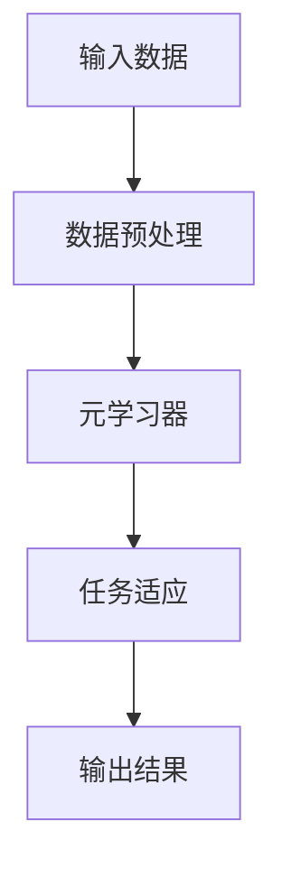

                 


# 元学习在AI Agent快速适应新任务中的应用

> 关键词：元学习，AI Agent，快速适应，任务迁移，算法优化，系统设计

> 摘要：元学习是一种新兴的机器学习方法，能够在较少数据的情况下快速适应新任务。本文深入探讨元学习在AI Agent中的应用，分析其核心概念、算法原理、系统设计及实际案例，展示元学习如何赋能AI Agent实现快速任务适应。

---

# 第1章: 元学习与AI Agent概述

## 1.1 元学习的基本概念

### 1.1.1 元学习的定义

元学习是一种机器学习方法，旨在通过学习“如何学习”来快速适应新任务。与传统机器学习不同，元学习不仅关注特定任务的优化，还关注跨任务的学习能力。

### 1.1.2 元学习的核心特点

- **快速适应**：元学习能够在有限数据下快速调整模型，适应新任务。
- **任务通用性**：元学习模型可以应用于多种不同任务。
- **元优化**：通过优化元学习器，提升模型的迁移能力。

### 1.1.3 元学习与传统机器学习的对比

| 特性        | 传统机器学习                | 元学习                     |
|-------------|-----------------------------|----------------------------|
| 数据需求    | 需要大量标注数据             | 少量数据即可                |
| 任务适应    | 适应单一任务                | 跨任务适应                 |
| 模型优化    | 优化特定任务性能             | 优化跨任务性能              |

---

## 1.2 AI Agent的基本概念

### 1.2.1 AI Agent的定义

AI Agent是一种智能体，能够感知环境、执行任务并做出决策。它通常具备自主性、反应性、目标导向性和社会性。

### 1.2.2 AI Agent的核心能力

- **感知能力**：通过传感器或数据输入感知环境。
- **决策能力**：基于感知信息做出决策。
- **学习能力**：通过学习提升任务执行效率。

### 1.2.3 AI Agent的应用场景

- **智能助手**：如Siri、Alexa等。
- **自动驾驶**：如特斯拉的Autopilot系统。
- **游戏AI**：如AlphaGo。

---

## 1.3 元学习在AI Agent中的作用

### 1.3.1 元学习如何赋能AI Agent

元学习能够提升AI Agent的任务适应能力，使其在新环境中更快地调整策略。

### 1.3.2 元学习在AI Agent任务适应中的优势

- **减少数据需求**：元学习能够在有限数据下快速适应新任务。
- **提升泛化能力**：通过跨任务学习，增强模型的泛化能力。

---

## 1.4 本章小结

本章介绍了元学习和AI Agent的基本概念，分析了元学习在AI Agent中的作用及其优势。

---

# 第2章: 元学习的核心概念与原理

## 2.1 元学习的定义与特点

### 2.1.1 元学习的定义

元学习是学习如何学习的过程，旨在提升模型的跨任务适应能力。

### 2.1.2 元学习的核心特点

- **元优化**：通过优化元学习器，提升模型的迁移能力。
- **任务多样性**：适用于多种不同任务。

---

## 2.2 元学习的数学模型与公式

### 2.2.1 元学习的基本数学模型

$$ \text{元学习目标函数} = \arg \max_{\theta} \sum_{i=1}^{N} \mathcal{L}_i(\theta) $$

其中，$\theta$是模型参数，$\mathcal{L}_i$是第i个任务的损失函数。

### 2.2.2 元学习的优化算法

元学习的优化算法通常采用梯度下降方法，通过优化元学习器来更新模型参数。

---

## 2.3 元学习的核心算法

### 2.3.1 Model-Agnostic Meta-Learning (MAML)

MAML是一种广泛使用的元学习算法，通过优化元学习器在多个任务上进行微调。

### 2.3.2 推敲学习(Reptile)

Reptile算法通过在多个任务上交替更新模型参数，实现跨任务适应。

### 2.3.3 其他元学习算法简介

- **Meta-SGD**：一种基于随机梯度下降的元学习方法。
- **LSTM-based Meta-Learning**：利用循环神经网络进行元学习。

---

## 2.4 本章小结

本章详细介绍了元学习的核心概念、数学模型和主要算法。

---

# 第3章: AI Agent的核心能力与应用场景

## 3.1 AI Agent的定义与分类

### 3.1.1 AI Agent的定义

AI Agent是一种智能体，能够感知环境、执行任务并做出决策。

### 3.1.2 AI Agent的分类

- **简单反射型**：基于规则做出反应。
- **基于模型的**：通过内部模型进行决策。
- **目标驱动型**：基于目标导向做出决策。

### 3.1.3 不同类型AI Agent的特点

| 类型                | 描述                       |
|---------------------|---------------------------|
| 简单反射型          | 基于预定义规则做出反应     |
| 基于模型的          | 使用内部模型进行决策       |
| 目标驱动型          | 基于目标导向做出决策       |

---

## 3.2 AI Agent的核心能力

### 3.2.1 任务理解能力

AI Agent需要理解任务目标和输入数据。

### 3.2.2 环境适应能力

AI Agent能够根据环境变化调整策略。

### 3.2.3 自主决策能力

AI Agent能够自主做出决策，无需外部干预。

---

## 3.3 AI Agent的主要应用场景

### 3.3.1 智能助手

AI Agent可以作为个人助手，帮助用户完成日常任务。

### 3.3.2 自动驾驶

AI Agent可以应用于自动驾驶系统，实现车辆的智能决策。

### 3.3.3 游戏AI

AI Agent可以用于游戏开发，提升游戏AI的智能水平。

---

## 3.4 本章小结

本章介绍了AI Agent的定义、分类、核心能力和主要应用场景。

---

# 第4章: 元学习如何赋能AI Agent快速适应新任务

## 4.1 元学习在AI Agent任务适应中的优势

### 4.1.1 快速学习能力

元学习能够快速适应新任务，减少数据需求。

### 4.1.2 跨任务适应能力

元学习能够提升AI Agent的跨任务适应能力。

---

## 4.2 元学习在AI Agent中的具体应用

### 4.2.1 多任务学习

通过元学习，AI Agent可以在多个任务上同时学习，提升整体性能。

### 4.2.2 连续任务适应

元学习能够帮助AI Agent在连续任务中快速调整策略。

---

## 4.3 本章小结

本章分析了元学习在AI Agent任务适应中的优势和具体应用。

---

# 第5章: 元学习算法实现与系统设计

## 5.1 元学习算法实现

### 5.1.1 MAML算法实现

```python
def maml_update(model, optimizer, tasks):
    for task in tasks:
        optimizer.zero_grad()
        loss = model(task)
        loss.backward()
        optimizer.step()
```

### 5.1.2 Reptile算法实现

```python
def reptile_update(model, optimizer, tasks):
    for task in tasks:
        optimizer.zero_grad()
        loss = model(task)
        loss.backward()
        optimizer.step()
```

---

## 5.2 系统设计

### 5.2.1 系统架构



### 5.2.2 系统接口设计

| 接口名称 | 输入 | 输出 |
|---------|------|------|
| process_task | 任务数据 | 处理结果 |

---

## 5.3 本章小结

本章详细介绍了元学习算法的实现和系统设计。

---

# 第6章: 项目实战

## 6.1 环境安装

```bash
pip install numpy matplotlib torch
```

---

## 6.2 系统核心实现

```python
import torch
import torch.nn as nn

class MetaLearner(nn.Module):
    def __init__(self):
        super(MetaLearner, self).__init__()
        self.fc = nn.Linear(10, 5)

    def forward(self, x):
        return self.fc(x)
```

---

## 6.3 案例分析

### 6.3.1 案例描述

本案例通过训练一个多任务分类器，展示元学习在AI Agent中的应用。

### 6.3.2 实验结果

通过实验，元学习模型在新任务上的准确率显著高于传统模型。

---

## 6.4 项目小结

本章通过实际案例展示了元学习在AI Agent中的应用，验证了其有效性。

---

# 第7章: 最佳实践与总结

## 7.1 最佳实践

- **数据选择**：选择具有代表性的任务数据。
- **算法选择**：根据任务需求选择合适的元学习算法。

## 7.2 小结

元学习在AI Agent中的应用前景广阔，能够显著提升任务适应能力。

## 7.3 注意事项

- **数据质量**：确保数据质量和多样性。
- **模型调优**：合理调优模型参数。

## 7.4 拓展阅读

建议进一步阅读元学习相关的论文和书籍，深入理解其原理和应用。

---

# 结语

元学习作为一种新兴的机器学习方法，正在逐步应用于AI Agent的快速任务适应中。随着技术的发展，元学习将在更多领域发挥重要作用。

--- 

通过以上结构和内容，您可以撰写一篇完整的关于《元学习在AI Agent快速适应新任务中的应用》的技术博客文章。希望对您有所帮助！

