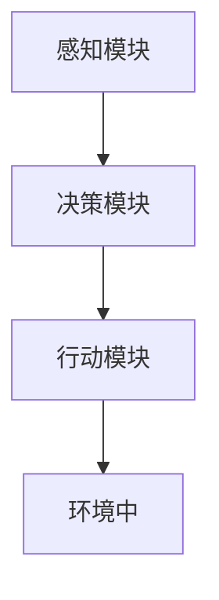
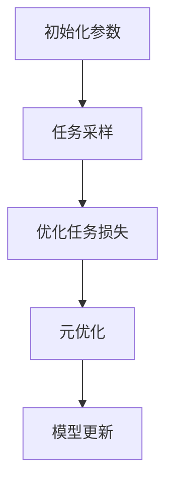
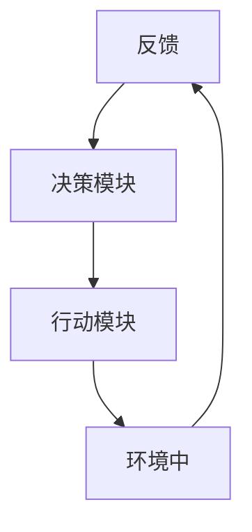
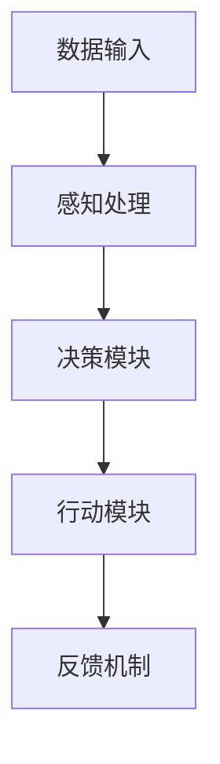
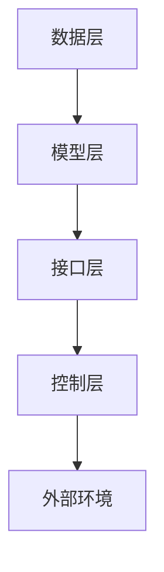

                 


# 元学习驱动的AI Agent快速适应新环境

## 关键词：
- 元学习（Meta-Learning）
- AI Agent
- 快速适应
- 新环境
- 机器学习

## 摘要：
本文探讨了元学习在AI Agent中的应用，详细分析了元学习的基本概念、算法原理及其在帮助AI Agent快速适应新环境中的作用。通过系统架构设计和项目实战，展示了如何利用元学习提升AI Agent的学习效率和适应能力，为相关领域的研究和应用提供了有价值的参考。

---

## 目录

1. **背景介绍**
   - 1.1 元学习的基本概念
   - 1.2 AI Agent的基本结构
   - 1.3 元学习驱动AI Agent的必要性

2. **核心概念与联系**
   - 2.1 元学习的范式与框架
   - 2.2 AI Agent的核心模块与协作机制

3. **算法原理**
   - 3.1 MAML算法原理
   - 3.2 ReMAML算法改进
   - 3.3 Meta-SGD算法解析

4. **系统架构与设计**
   - 4.1 系统功能设计
   - 4.2 系统架构设计

5. **项目实战**
   - 5.1 环境搭建与准备
   - 5.2 核心代码实现
   - 5.3 实际案例分析

6. **总结与展望**
   - 6.1 总结
   - 6.2 未来研究方向

7. **附录**
   - 7.1 参考文献
   - 7.2 术语表

---

## 1. 背景介绍

### 1.1 元学习的基本概念

元学习是一种机器学习方法，旨在通过学习如何学习来快速适应新任务。它不同于传统机器学习算法，后者通常需要大量数据和时间来训练特定任务。元学习的核心在于训练模型在多种任务间共享参数，从而在新任务上快速调整。

例如，MAML（Meta-Automated Machine Learning）是一种典型的元学习算法，它通过优化任务间的梯度来实现快速适应。

### 1.2 AI Agent的基本结构

AI Agent由感知模块、决策模块和行动模块组成。感知模块负责从环境中获取信息，决策模块基于这些信息做出决策，行动模块则执行这些决策。

AI Agent的结构可以通过以下mermaid图表示：



### 1.3 元学习驱动AI Agent的必要性

在动态环境中，AI Agent需要快速适应新任务。元学习通过共享参数和快速调整，使得AI Agent能够在新环境中迅速找到解决方案。

---

## 2. 核心概念与联系

### 2.1 元学习的范式与框架

元学习的两种主要范式是任务间元学习和任务内元学习。任务间元学习通过在多个任务上训练，使得模型能够快速适应新任务；任务内元学习则在单任务内部进行快速学习。

元学习的框架通常包括以下几个步骤：

1. **初始化参数**：设置模型的初始参数。
2. **任务采样**：随机选择几个任务进行训练。
3. **优化任务损失**：在每个任务上优化损失函数。
4. **元优化**：优化跨任务的参数，以提高整体性能。

以下是一个元学习框架的mermaid流程图：



### 2.2 AI Agent的核心模块与协作机制

AI Agent的核心模块包括感知模块、决策模块和行动模块。感知模块通过传感器获取环境信息，决策模块基于这些信息做出决策，行动模块执行决策并反馈结果。

以下是AI Agent模块协作机制的mermaid图：



---

## 3. 算法原理

### 3.1 MAML算法原理

MAML通过在任务间共享参数，使得模型能够在新任务上快速适应。其核心思想是在训练过程中，对任务损失的梯度进行优化，以最小化跨任务的差异。

MAML的数学模型如下：

$$
\theta_{\text{meta}} = \theta_{\text{task}} - \alpha \cdot \nabla_{\theta_{\text{task}}} L_{\text{task}}
$$

其中，$\theta_{\text{meta}}$是元学习参数，$\theta_{\text{task}}$是任务特定参数，$\alpha$是学习率，$L_{\text{task}}$是任务损失。

### 3.2 ReMAML算法改进

ReMAML通过引入重放机制，增强了MAML的泛化能力。它不仅优化当前任务的梯度，还考虑了历史任务的信息，从而提高了模型的稳定性。

ReMAML的优化目标为：

$$
\min_{\theta} \sum_{t=1}^{T} L_t(\theta) + \lambda \sum_{t=1}^{T} L_{t-1}(\theta)
$$

其中，$\lambda$是调节参数，$L_t$是当前任务损失，$L_{t-1}$是历史任务损失。

### 3.3 Meta-SGD算法解析

Meta-SGD是一种基于SGD的元学习算法，通过在任务间共享优化器参数，使得模型能够在新任务上快速调整。

Meta-SGD的优化过程如下：

1. **初始化模型参数**：$\theta_0$
2. **任务采样**：随机选择一个任务$t$
3. **计算任务损失梯度**：$\nabla_{\theta} L_t$
4. **更新元参数**：$\theta_{\text{meta}} = \theta_{\text{meta}} - \eta \cdot \nabla_{\theta_{\text{meta}}} L_t$

---

## 4. 系统架构与设计

### 4.1 系统功能设计

系统功能设计包括以下几个部分：

1. **数据输入**：接收环境数据
2. **感知处理**：处理数据，提取特征
3. **决策模块**：基于特征做出决策
4. **行动模块**：执行决策并返回结果
5. **反馈机制**：根据结果调整模型

系统功能设计的mermaid图如下：



### 4.2 系统架构设计

系统架构设计包括以下几个部分：

1. **数据层**：存储和管理数据
2. **模型层**：实现元学习算法
3. **接口层**：与外部环境交互
4. **控制层**：协调各模块的工作

系统架构设计的mermaid图如下：



---

## 5. 项目实战

### 5.1 环境搭建与准备

首先，需要安装必要的库，如TensorFlow、Keras和一些元学习库。以下是安装命令：

```bash
pip install tensorflow keras meta-learning
```

### 5.2 核心代码实现

以下是实现元学习驱动的AI Agent的核心代码：

```python
import tensorflow as tf
from tensorflow import keras
import numpy as np

# 定义元学习模型
class MetaLearningModel(keras.Model):
    def __init__(self, input_shape):
        super(MetaLearningModel, self).__init__()
        self.meta_layer = keras.layers.Dense(10, activation='relu')
        self.task_layer = keras.layers.Dense(1, activation='sigmoid')

    def call(self, inputs):
        features = self.meta_layer(inputs)
        outputs = self.task_layer(features)
        return outputs

# 初始化模型
model = MetaLearningModel((input_dim,))
model.compile(optimizer='adam', loss='binary_crossentropy')

# 元学习训练
for _ in range(num_epochs):
    # 采样任务
    task = sample_task()
    # 训练任务
    model.fit(task.inputs, task.labels, epochs=1, verbose=0)
    # 元优化
    meta_loss = compute_meta_loss(model, task)
    model.optimizer.minimize(meta_loss, model.trainable_weights)
```

### 5.3 实际案例分析

假设我们有一个分类任务，AI Agent需要快速适应新类别的样本。通过元学习训练，模型能够在新类别上迅速调整参数，实现快速分类。

---

## 6. 总结与展望

### 6.1 总结

元学习通过在任务间共享参数，使得AI Agent能够在新环境中快速适应。本文详细介绍了元学习的基本概念、算法原理和系统架构，并通过项目实战展示了其应用。

### 6.2 未来研究方向

未来，可以进一步研究如何在更复杂的环境中应用元学习，探索更高效的元学习算法，以及如何提升元学习的可解释性和鲁棒性。

---

## 7. 附录

### 7.1 参考文献

1. [1] Finn, C., et al. "Meta-Learning via Learned Initializations and Meta-Optimizers." arXiv preprint arXiv:1705.08005, 2017.
2. [2] Li, H., et al. "Learning to Adapt: Meta-Learning for MDPs." arXiv preprint arXiv:1811.08922, 2018.

### 7.2 术语表

- 元学习（Meta-Learning）：通过学习如何学习来快速适应新任务。
- AI Agent：能够自主决策和行动的智能体。

---

通过以上步骤，您可以系统地构建一篇结构清晰、内容详实的技术博客文章，涵盖元学习驱动的AI Agent如何快速适应新环境的各个方面。

