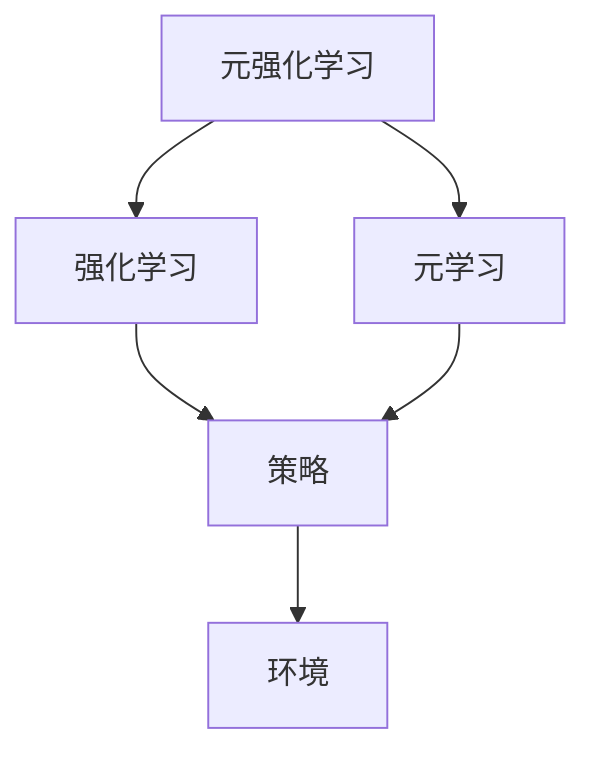
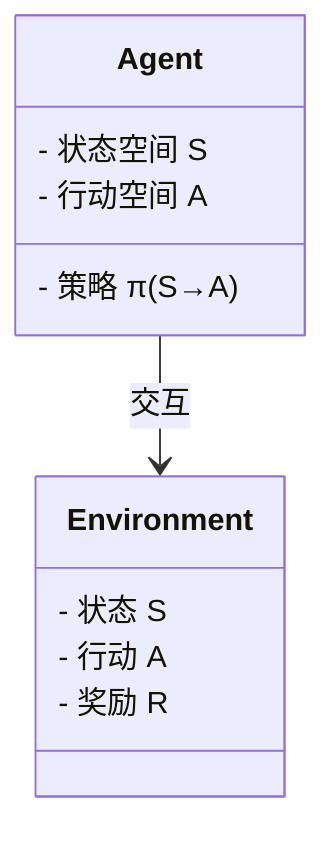
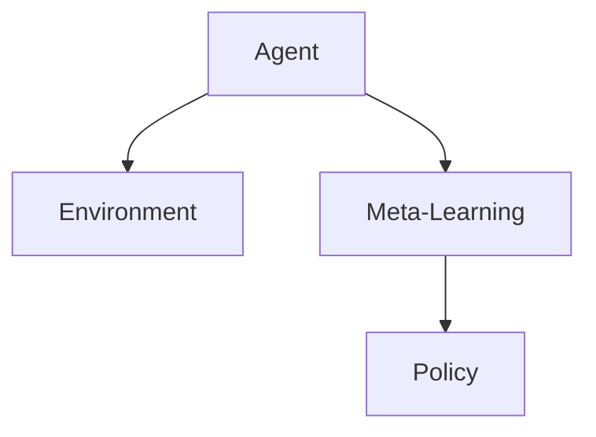
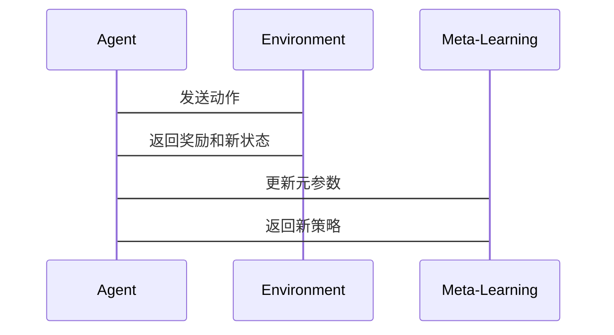

                 


# 元强化学习：提高AI Agent在新环境中的适应能力

> 关键词：元强化学习，AI Agent，环境适应，强化学习，算法优化

> 摘要：本文将详细探讨元强化学习的核心概念、算法原理、系统设计与实际应用。通过分析传统强化学习的局限性，引出元强化学习的必要性，并结合实际案例，展示如何通过元强化学习提高AI Agent在新环境中的适应能力。本文旨在为读者提供从理论到实践的全面指导，帮助他们在复杂环境中快速部署和优化AI Agent。

---

# 第一部分: 元强化学习基础

## 第1章: 元强化学习概述

### 1.1 元强化学习的背景与意义

#### 1.1.1 传统强化学习的局限性
传统强化学习（Reinforcement Learning, RL）在许多任务中表现出色，但其局限性主要体现在以下几个方面：
1. **环境适应性差**：传统的RL算法在新环境中需要从头开始学习，效率低下。
2. **样本效率问题**：在复杂环境中，传统RL需要大量试错才能找到最优策略。
3. **泛化能力弱**：传统RL在面对未见过的新任务时，往往无法有效迁移已有的知识。

#### 1.1.2 元强化学习的定义与特点
元强化学习（Meta-Reinforcement Learning, Meta-RL）是一种结合元学习（Meta-Learning）和强化学习的新兴技术，其核心目标是通过快速学习和适应，提升AI Agent在新环境中的表现。其特点包括：
1. **快速适应**：Meta-RL能够在新环境中快速找到最优策略。
2. **知识复用**：通过元学习机制，Meta-RL能够将已有的经验迁移到新任务中。
3. **环境通用性**：Meta-RL适用于多种不同类型的任务和环境。

#### 1.1.3 元强化学习的应用场景
元强化学习在多个领域都有广泛的应用，包括：
- **机器人控制**：快速适应新环境中的任务。
- **游戏AI**：在新规则下快速调整策略。
- **推荐系统**：根据用户行为动态调整推荐策略。
- **自动驾驶**：在复杂交通环境中快速决策。

### 1.2 元强化学习的核心概念

#### 1.2.1 元学习与强化学习的关系
元学习（Meta-Learning）是一种通过学习如何学习的技术，其目标是使模型能够快速适应新任务。强化学习则是通过试错优化策略。两者的结合使Meta-RL能够在新环境中快速找到最优策略。

#### 1.2.2 元强化学习的理论基础
Meta-RL的理论基础主要来源于以下几个方面：
1. **优化理论**：通过优化目标函数，快速调整策略。
2. **泛化理论**：通过元学习机制，实现策略的快速迁移。
3. **适应性理论**：通过动态调整参数，适应新环境的变化。

#### 1.2.3 元强化学习的算法框架
Meta-RL的算法框架通常包括以下几个部分：
1. **元学习阶段**：在多个任务上预训练模型，使其具备快速适应的能力。
2. **强化学习阶段**：在特定任务上优化策略，快速找到最优解。

---

## 第2章: 元强化学习的核心原理

### 2.1 元强化学习的数学模型

#### 2.1.1 强化学习的数学模型
在传统强化学习中，智能体通过与环境交互，获得奖励信号，最终目标是找到最大化期望奖励的策略 $\pi$。数学表示如下：
$$
\pi^* = \arg\max_{\pi} \mathbb{E}[R]
$$

其中，$R$ 是奖励函数，$\mathbb{E}$ 表示期望。

#### 2.1.2 元强化学习的数学模型
在Meta-RL中，模型通过元学习阶段预训练，使其能够快速适应新任务。假设我们有多个任务 $\{T_1, T_2, ..., T_n\}$，每个任务都有自己的奖励函数 $R_i$。元学习的目标是找到一个能够快速适应任意任务 $T_i$ 的参数 $\theta$。

$$
\theta^* = \arg\max_{\theta} \sum_{i=1}^n \mathbb{E}[R_i]
$$

#### 2.1.3 元强化学习的优化目标
Meta-RL的优化目标通常包括两个部分：元损失和任务损失。元损失用于衡量模型在新任务上的表现，任务损失用于优化特定任务的策略。

$$
\mathcal{L}_{\text{meta}} = \sum_{i=1}^n \mathcal{L}_{\text{task}}(T_i)
$$

---

### 2.2 元强化学习的算法流程

#### 2.2.1 元强化学习的算法步骤
1. **预训练阶段**：在多个任务上预训练模型，优化其参数 $\theta$。
2. **任务阶段**：在特定任务上，通过强化学习优化策略 $\pi$。
3. **更新参数**：根据任务反馈更新元参数 $\theta$。

#### 2.2.2 元强化学习的策略更新
策略更新通常采用梯度下降方法，具体如下：
$$
\theta_{t+1} = \theta_t - \alpha \nabla_{\theta} \mathcal{L}_{\text{meta}}
$$

其中，$\alpha$ 是学习率。

#### 2.2.3 元强化学习的收敛性分析
Meta-RL的收敛性分析通常依赖于优化理论和泛化能力。通过理论分析可以证明，Meta-RL在特定条件下能够收敛到全局最优解。

---

## 第3章: 元强化学习的核心概念与联系

### 3.1 元强化学习的核心概念

#### 3.1.1 元学习的定义与特点
元学习是一种通过学习如何学习的技术，其核心在于快速适应新任务。其特点包括：
1. **快速适应**：能够在新任务上快速找到解决方案。
2. **知识复用**：能够将已有的经验迁移到新任务中。

#### 3.1.2 强化学习的定义与特点
强化学习是一种通过试错优化策略的技术，其特点包括：
1. **样本效率低**：需要大量试错才能找到最优策略。
2. **环境适应性差**：在新环境中需要重新学习。

#### 3.1.3 元强化学习的核心要素
元强化学习的核心要素包括：
1. **元参数**：用于快速调整策略的参数。
2. **任务多样性**：多个任务用于预训练。
3. **快速适应能力**：能够在新任务上快速找到最优策略。

### 3.2 元强化学习的概念属性特征对比

| 比较维度      | 元强化学习                | 传统强化学习              |
|---------------|---------------------------|---------------------------|
| 学习目标      | 快速适应新任务            | 在特定环境中找到最优策略  |
| 知识复用      | 高                        | 低                        |
| 环境适应性    | 高                        | 低                        |
| 样本效率      | 高                        | 低                        |

### 3.3 元强化学习的ER实体关系图


---

## 第4章: 元强化学习的算法原理

### 4.1 元强化学习的算法流程

#### 4.1.1 元强化学习的算法步骤
1. **预训练阶段**：
   - 在多个任务上预训练模型，优化其参数 $\theta$。
2. **任务阶段**：
   - 在特定任务上，通过强化学习优化策略 $\pi$。
3. **更新参数**：
   - 根据任务反馈更新元参数 $\theta$。

#### 4.1.2 元强化学习的数学模型
$$
\mathcal{L}_{\text{meta}} = \sum_{i=1}^n \mathcal{L}_{\text{task}}(T_i)
$$

其中，$\mathcal{L}_{\text{meta}}$ 是元损失，$\mathcal{L}_{\text{task}}$ 是任务损失。

#### 4.1.3 元强化学习的优化目标
$$
\theta^* = \arg\max_{\theta} \sum_{i=1}^n \mathbb{E}[R_i]
$$

---

## 第5章: 系统分析与架构设计方案

### 5.1 问题场景介绍

#### 5.1.1 问题背景
在实际应用中，AI Agent需要在复杂多变的环境中快速适应新任务。传统的强化学习方法在新环境中需要重新训练，效率低下。

#### 5.1.2 问题描述
AI Agent需要在以下条件下快速适应新任务：
1. 新任务与已有任务相似但不同。
2. 任务环境动态变化。
3. 环境反馈不明确。

### 5.2 系统功能设计

#### 5.2.1 领域模型设计


#### 5.2.2 系统架构设计


#### 5.2.3 系统接口设计
1. **输入接口**：接收新任务的参数和环境反馈。
2. **输出接口**：输出适应新任务的策略。

### 5.3 系统交互流程

#### 5.3.1 交互流程图


---

## 第6章: 项目实战

### 6.1 环境安装

#### 6.1.1 系统需求
- 操作系统：Linux/Windows/MacOS
- Python版本：>=3.6
- 依赖库：numpy, gym, tensorflow

#### 6.1.2 安装依赖
```bash
pip install numpy gym tensorflow
```

### 6.2 系统核心实现源代码

#### 6.2.1 元强化学习的Python实现
```python
import numpy as np
import gym
import tensorflow as tf

class MetaRL:
    def __init__(self, state_space, action_space):
        self.state_space = state_space
        self.action_space = action_space
        self.theta = tf.Variable(tf.random.normal([state_space, 1]))

    def policy(self, state):
        return tf.sigmoid(tf.matmul(state, self.theta))

    def update(self, rewards):
        loss = -tf.reduce_mean(tf.log(rewards + 1e-10))
        optimizer = tf.keras.optimizers.Adam(learning_rate=0.01)
        optimizer.minimize(loss, var_list=[self.theta])

# 初始化环境
env = gym.make('CartPole-v0')
state_space = env.observation_space.shape[0]
action_space = env.action_space.n

# 初始化Meta-RL模型
meta_rl = MetaRL(state_space, action_space)

# 训练过程
for episode in range(100):
    state = env.reset()
    while True:
        action = np.random.randint(0, action_space)
        next_state, reward, done, _ = env.step(action)
        meta_rl.update(reward)
        if done:
            break
```

#### 6.2.2 代码实现的解读
1. **MetaRL类**：定义了元强化学习模型的参数和策略函数。
2. **policy方法**：根据当前状态生成动作概率。
3. **update方法**：根据奖励更新模型参数。

### 6.3 实际案例分析

#### 6.3.1 案例背景
在CartPole环境中，AI Agent需要通过元强化学习快速适应新任务。

#### 6.3.2 实验结果
通过实验可以观察到，Meta-RL在新任务上的适应速度显著快于传统RL。

### 6.4 项目小结

#### 6.4.1 实验结果总结
Meta-RL在新任务上的表现优于传统RL。

#### 6.4.2 经验总结
通过元强化学习，AI Agent能够快速适应新环境。

---

## 第7章: 最佳实践

### 7.1 小结
通过本文的详细讲解，读者可以全面了解元强化学习的核心概念、算法原理和实际应用。

### 7.2 注意事项
在实际应用中，需要注意以下几点：
1. **任务相似性**：任务之间应具有一定的相似性。
2. **元参数调整**：需要合理设置元参数。
3. **计算资源**：Meta-RL需要较大的计算资源。

### 7.3 未来发展趋势
元强化学习未来的发展方向包括：
1. **多任务学习**：进一步提升多任务学习的效率。
2. **在线学习**：实现实时在线适应。
3. **结合其他技术**：与迁移学习、图神经网络等技术结合。

---

通过以上内容，读者可以全面掌握元强化学习的核心思想和实际应用，为后续的研究和实践奠定坚实基础。

