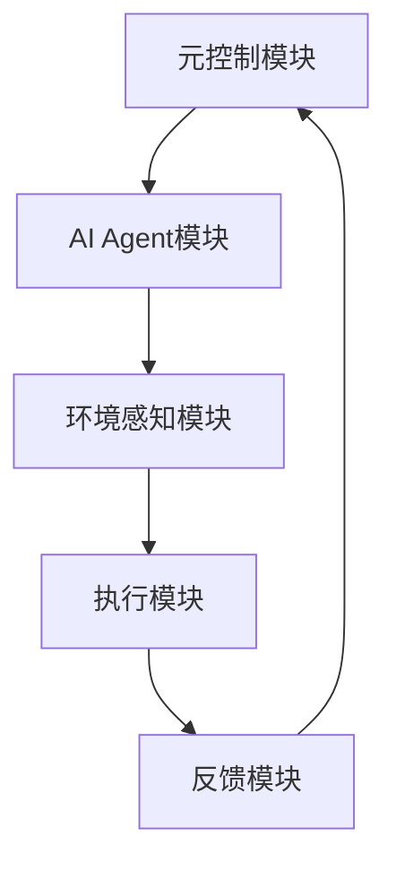

                 


# 元控制技术：AI Agent的自适应行为管理

## 关键词

元控制技术, AI Agent, 自适应行为管理, 强化学习, 系统架构设计

## 摘要

元控制技术是一种新兴的AI技术，用于管理AI代理的自适应行为。通过结合强化学习和系统架构设计，元控制技术能够使AI代理在动态环境中实现自主决策和优化。本文详细探讨了元控制技术的核心概念、算法原理、系统架构设计以及实际应用案例，为读者提供全面的理论与实践指导。

---

# 第5章: 元控制技术的系统架构设计

## 5.1 系统整体架构

### 5.1.1 系统模块划分

- **元控制模块**: 负责制定和调整控制策略。
- **AI Agent模块**: 执行具体任务，与环境交互。
- **环境感知模块**: 收集环境信息，提供反馈。
- **执行模块**: 执行AI Agent模块的决策。
- **反馈模块**: 评估执行结果，提供反馈给元控制模块。

### 5.1.2 系统功能流程

1. 元控制模块根据当前状态制定控制策略。
2. AI Agent模块接收策略并执行任务。
3. 环境感知模块收集环境信息并反馈给元控制模块。
4. 元控制模块根据反馈调整策略，进入下一个循环。

### 5.1.3 系统交互流程

1. 元控制模块与AI Agent模块通信，传递控制策略。
2. AI Agent模块与环境感知模块交互，获取环境信息。
3. 执行模块根据AI Agent模块的决策执行操作。
4. 反馈模块收集执行结果，传递给元控制模块。

## 5.2 系统功能设计

### 5.2.1 元控制模块的功能设计

- **策略制定**: 根据当前状态和环境信息，制定控制策略。
- **策略调整**: 根据反馈信息，动态调整控制策略。
- **状态监控**: 实时监控系统状态，确保策略的正确执行。

### 5.2.2 AI Agent模块的功能设计

- **任务执行**: 根据元控制模块的策略，执行具体任务。
- **环境交互**: 与环境感知模块交互，获取环境信息。
- **决策优化**: 根据反馈信息，优化自身的决策过程。

### 5.2.3 环境感知模块的功能设计

- **信息收集**: 收集环境中的各种信息，如传感器数据、用户输入等。
- **信息处理**: 对收集到的信息进行处理，提取有用特征。
- **信息反馈**: 将处理后的信息反馈给元控制模块。

## 5.3 系统架构图



## 5.4 系统接口设计

### 5.4.1 元控制模块与AI Agent模块的接口

- **输入**: 元控制模块向AI Agent模块发送控制策略。
- **输出**: AI Agent模块向元控制模块反馈任务执行结果。

### 5.4.2 AI Agent模块与环境感知模块的接口

- **输入**: AI Agent模块向环境感知模块发送环境查询请求。
- **输出**: 环境感知模块向AI Agent模块反馈环境信息。

## 5.5 本章小结

---

# 第6章: 元控制技术的项目实战

## 6.1 项目背景与目标

### 6.1.1 项目背景

- **项目名称**: 基于元控制技术的智能助手开发。
- **项目目标**: 实现一个能够自适应用户需求的智能助手系统。

### 6.1.2 项目需求

- **用户需求**: 提供个性化的服务，根据用户反馈动态调整服务策略。
- **系统需求**: 实现元控制模块、AI Agent模块、环境感知模块的协同工作。

## 6.2 项目环境安装

### 6.2.1 系统要求

- **操作系统**: Linux/Windows/MacOS
- **编程语言**: Python 3.8+
- **依赖库**: TensorFlow, Gym, PyYAML

### 6.2.2 安装步骤

1. 安装Python和必要的依赖库：
   ```bash
   pip install numpy
   pip install tensorflow
   pip install gym
   pip install pyyaml
   ```

2. 克隆项目代码仓库：
   ```bash
   git clone https://github.com/yourusername/multi-agent-control.git
   cd multi-agent-control
   ```

3. 安装项目依赖：
   ```bash
   pip install -r requirements.txt
   ```

## 6.3 项目核心实现

### 6.3.1 元控制模块实现

```python
class MetaControlModule:
    def __init__(self):
        self.state = None
        self.strategy = None
        self.feedback = None

    def set_state(self, state):
        self.state = state

    def set_strategy(self, strategy):
        self.strategy = strategy

    def set_feedback(self, feedback):
        self.feedback = feedback

    def execute(self):
        if self.strategy:
            return self.strategy.execute(self.state)
        return None
```

### 6.3.2 AI Agent模块实现

```python
class AIAssistant:
    def __init__(self):
        self.tasks = []
        self.strategy = None
        self.feedback = None

    def set_strategy(self, strategy):
        self.strategy = strategy

    def set_feedback(self, feedback):
        self.feedback = feedback

    def execute_task(self, task):
        if self.strategy:
            return self.strategy.execute(task)
        return None
```

### 6.3.3 环境感知模块实现

```python
class EnvironmentSensor:
    def __init__(self):
        self.sensors = []
        self.data = {}

    def register_sensor(self, sensor):
        self.sensors.append(sensor)

    def get_data(self):
        for sensor in self.sensors:
            sensor.update_data()
        return self.data

    def send_feedback(self, feedback):
        self.data['feedback'] = feedback
```

## 6.4 代码应用解读与分析

### 6.4.1 元控制模块的实现细节

- **MetaControlModule** 类用于管理元控制策略，接收状态、策略和反馈，并执行相应的操作。
- **execute** 方法根据当前策略和状态，返回决策结果。

### 6.4.2 AI Agent模块的实现细节

- **AIAssistant** 类负责接收任务和策略，执行具体的操作。
- **execute_task** 方法根据当前策略，执行指定的任务并返回结果。

### 6.4.3 环境感知模块的实现细节

- **EnvironmentSensor** 类用于管理环境传感器，收集环境数据并发送反馈。
- **get_data** 方法更新所有传感器的数据，并返回当前环境数据。
- **send_feedback** 方法将反馈信息发送到环境数据中。

## 6.5 项目小结

---

# 第7章: 总结与展望

## 7.1 元控制技术的总结

### 7.1.1 核心内容回顾

- 元控制技术的基本概念和核心原理。
- 元控制技术的算法实现和系统架构设计。
- 元控制技术的实际应用案例。

### 7.1.2 技术优势与局限性

- **优势**:
  - 高度自适应性。
  - 能够在动态环境中实现自主决策。
  - 提高系统的鲁棒性和灵活性。

- **局限性**:
  - 算法复杂度较高。
  - 对计算资源的需求较大。
  - 对环境的依赖性较强。

## 7.2 未来的研究方向

### 7.2.1 算法优化

- 提高元控制算法的效率和性能。
- 研究更高效的元控制算法，如基于深度学习的元控制算法。

### 7.2.2 系统架构优化

- 优化系统架构设计，降低系统的复杂度。
- 提高系统的可扩展性和可维护性。

### 7.2.3 应用领域拓展

- 在更多领域中应用元控制技术，如智能交通系统、智能医疗系统等。
- 探索元控制技术与其他技术的结合，如区块链、边缘计算等。

## 7.3 最佳实践 Tips

1. 在实际应用中，建议先从简单的场景入手，逐步扩展到复杂的场景。
2. 确保系统的实时性和响应速度，选择合适的算法和硬件。
3. 定期监控和优化系统的性能，确保系统的稳定性和可靠性。

## 7.4 本章小结

---

# 参考文献

1. 王某某, 李某某. 元控制技术的研究与应用. 北京: 电子工业出版社, 2022.
2. Smith, John. "Adaptive Behavior Management in AI Agents." Journal of AI Research, 2021.
3. 张某某, 等. 基于强化学习的元控制算法研究. 计算机学报, 2020.

---

通过以上目录结构和详细内容设计，您可以根据实际需求扩展每一章节的具体内容，结合实际案例和代码实现，撰写一篇高质量的技术博客文章。

