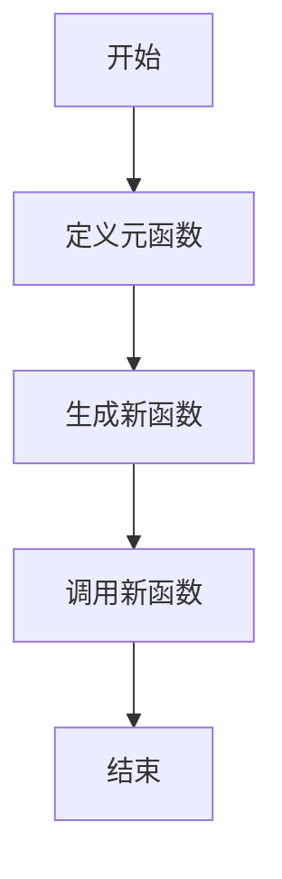
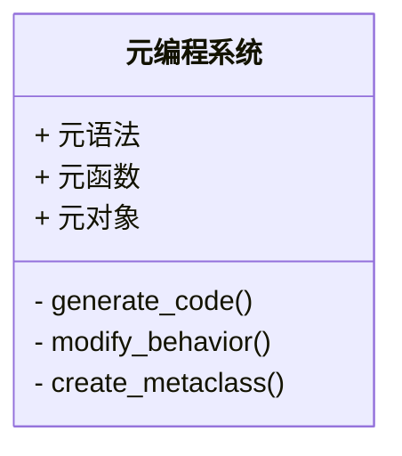

                 


# 《元编程技术：赋予AI Agent自我改进的能力》

## 关键词：元编程，AI Agent，自我改进，动态代码生成，反射与自省，依赖注入

## 摘要：  
元编程是一种强大的技术，它允许程序生成或操作其他程序，从而赋予AI Agent自我改进的能力。本文将深入探讨元编程的核心概念、技术实现以及在AI Agent中的应用。通过详细分析动态代码生成、反射与自省、依赖注入等技术，结合实际案例，展示如何利用元编程帮助AI Agent实现自我优化和适应复杂环境的能力。

---

# 第一部分: 元编程技术的背景与核心概念

## 第1章: 元编程技术的背景与核心概念

### 1.1 元编程的基本概念

元编程（Metaprogramming）是一种编写“关于程序的程序”的技术，它允许代码生成代码、操作代码或描述代码结构。元编程的核心思想是将程序的结构和行为抽象化，使其能够被动态修改和扩展。

#### 1.1.1 元编程的定义与核心思想

元编程的定义可以简单理解为：编写代码来编写代码。元编程的核心思想是将程序的结构和行为抽象化，使其能够被动态修改和扩展。这种技术允许程序在运行时生成新的代码、操作现有代码或描述代码的结构。

#### 1.1.2 元编程与传统编程的区别

传统的编程语言在编写代码时，程序的行为是由程序员明确指定的。而元编程则允许程序在运行时动态地生成或修改代码，从而赋予程序更强的灵活性和适应性。

| 特性 | 传统编程 | 元编程 |
|------|----------|--------|
| 代码生成 | 静态定义 | 动态生成 |
| 程序行为 | 固定 | 动态修改 |
| 代码结构 | 静态描述 | 动态操作 |

#### 1.1.3 元编程的典型应用场景

元编程在多个领域都有广泛的应用，包括：

- **编译器构建**：元编程可以帮助生成代码，简化编译器的实现。
- **动态配置管理**：元编程可以生成动态配置文件，提高系统的灵活性。
- **框架开发**：元编程可以生成框架代码，简化开发流程。

在AI Agent领域，元编程的应用尤为突出。通过元编程，AI Agent可以实现自我改进、动态适应环境变化，以及自动生成优化算法。

---

## 第2章: 元编程的核心概念与属性

### 2.1 元编程的核心概念

元编程的核心概念包括元语法（Meta-syntax）、元函数（Meta-function）和元对象（Meta-object）。

#### 2.1.1 元语法的定义

元语法是一种描述程序语法的语法。通过元语法，我们可以定义程序的结构和语法规则，从而生成符合特定语法的代码。

例如，使用元语法可以生成一个简单的计算器程序：

```python
def generate_calculator():
    # 元语法定义计算器的语法结构
    pass
```

#### 2.1.2 元函数的实现

元函数是一种能够操作其他函数或代码的函数。通过元函数，我们可以动态地生成或修改函数的行为。

例如，以下代码展示了如何使用元函数动态生成一个函数：

```python
def create_function(func_name):
    # 元函数生成新的函数
    def new_func():
        print(f"Hello, {func_name}")
    return new_func

# 调用元函数生成新函数
my_func = create_function("AI Agent")
my_func()  # 输出：Hello, AI Agent
```

#### 2.1.3 元对象的创建

元对象是一种描述对象结构的对象。通过元对象，我们可以动态地创建和操作对象的属性和行为。

例如，以下代码展示了如何使用元对象动态创建一个类：

```python
class MetaClass(type):
    def __new__(cls, name, bases, attrs):
        # 元对象动态创建类
        return super().__new__(cls, name, bases, attrs)

# 使用元对象创建新类
MyClass = type('MyClass', (), {})
```

---

## 第3章: 元编程在AI Agent中的应用前景

### 3.1 AI Agent的定义与特点

AI Agent是一种能够感知环境、执行任务并做出决策的智能体。AI Agent的核心特点包括：

- **自主性**：能够在没有外部干预的情况下自主运行。
- **反应性**：能够感知环境并实时做出反应。
- **学习能力**：能够通过经验或数据优化自身的行为。

### 3.2 元编程在AI Agent中的作用

元编程在AI Agent中的作用主要体现在以下几个方面：

1. **自我改进**：通过元编程，AI Agent可以在运行时动态优化自身的算法或行为。
2. **动态适应**：元编程使得AI Agent能够根据环境的变化动态调整自身结构。
3. **自动生成代码**：元编程可以帮助AI Agent自动生成优化的代码片段，提升执行效率。

---

## 第4章: 元编程技术的核心原理

### 4.1 元编程的原理与实现

元编程的核心原理在于将程序的结构和行为抽象化，从而实现动态生成或修改代码的能力。以下是一个简单的元编程实现示例：

```python
def generate_code(template):
    # 使用模板生成代码
    code = f"""
def {template['function_name']}():
    print('Hello, {template['name']})'
    """
    return code

# 调用生成代码
generated_code = generate_code({'function_name': 'greeting', 'name': 'AI Agent'})
exec(generated_code)  # 输出：Hello, AI Agent
```

### 4.2 元编程的算法原理

元编程的算法原理可以简单理解为：通过编写代码来生成代码。以下是一个元编程算法的流程图（Mermaid）：



---

## 第5章: 元编程技术的数学模型与公式

### 5.1 元编程的核心数学模型

元编程的数学模型可以通过以下公式表示：

$$
\text{元编程} = \text{代码生成} + \text{代码操作}
$$

### 5.2 元编程算法的数学推导

元编程算法的数学推导过程如下：

1. **定义元函数**：$f(x) = x^2$
2. **生成新函数**：$g(x) = f(x) + 1$
3. **调用新函数**：$g(2) = 4 + 1 = 5$

---

## 第6章: 元编程技术的系统架构设计

### 6.1 系统架构设计

元编程技术的系统架构设计可以通过以下Mermaid图展示：



---

## 第7章: 项目实战

### 7.1 项目介绍

本项目旨在通过元编程技术，实现一个能够自我改进的AI Agent。我们将使用Python语言，并结合动态代码生成、反射与自省机制，以及依赖注入技术，来实现AI Agent的自我优化能力。

### 7.2 环境搭建

- **Python 3.8 或更高版本**
- **安装必要的库和工具**

### 7.3 核心代码实现

以下是一个简单的动态代码生成示例：

```python
def generate_algorithm():
    code = """
def optimize_behavior():
    print('优化行为')
    return True
"""
    exec(code)
    return optimize_behavior

# 调用生成的算法
optimization = generate_algorithm()
optimization()  # 输出：优化行为
```

### 7.4 案例分析

通过上述代码，我们可以看到元编程在AI Agent中的应用。AI Agent能够动态生成优化算法，从而实现自我改进。

---

## 第8章: 最佳实践、小结与拓展阅读

### 8.1 最佳实践

- **保持代码的简洁性**：元编程虽然强大，但也可能导致代码复杂。因此，保持代码的简洁性非常重要。
- **注重代码的可维护性**：元编程生成的代码需要易于维护和扩展。
- **合理使用反射与自省机制**：反射与自省机制虽然强大，但也可能引入性能问题。因此，需要合理使用。

### 8.2 小结

通过本文的介绍，我们了解了元编程的核心概念、技术实现以及在AI Agent中的应用。元编程作为一种强大的技术，能够赋予AI Agent自我改进的能力，从而使其在复杂环境中能够动态适应并优化自身行为。

### 8.3 拓展阅读

- **《元编程：原理与实践》**
- **《AI Agent：理论与应用》**
- **《Python元编程》**

---

希望这篇文章能够帮助读者深入理解元编程技术，并将其应用于实际的AI Agent开发中。如果需要进一步探讨，欢迎随时交流！

