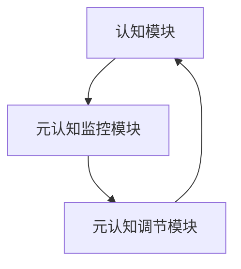
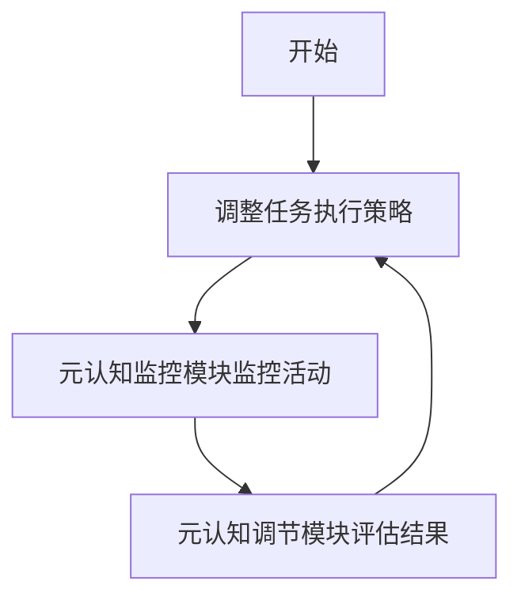
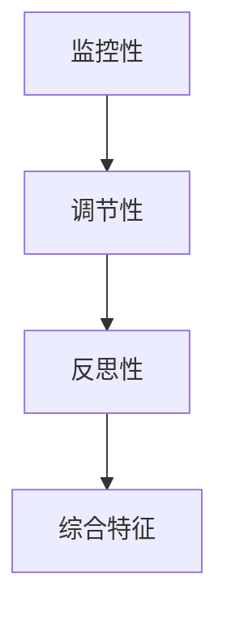
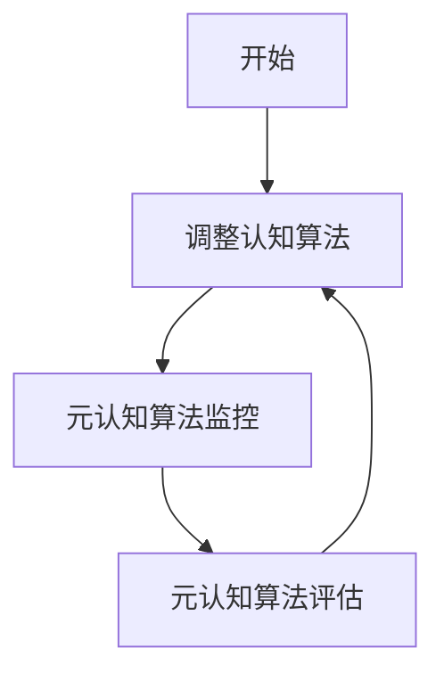
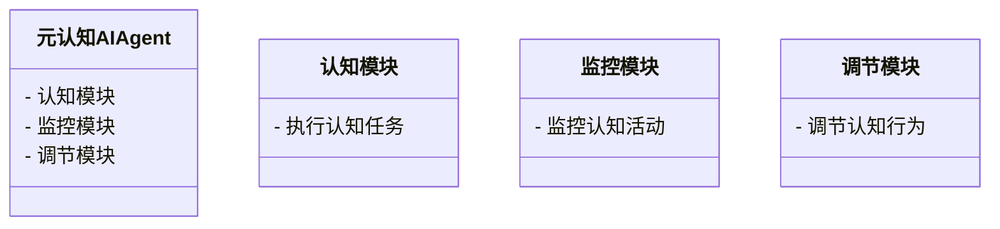
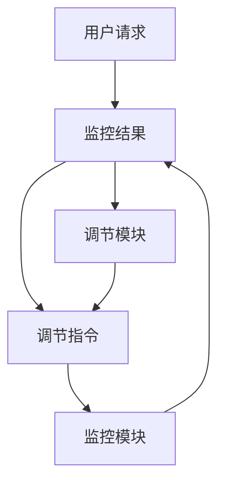
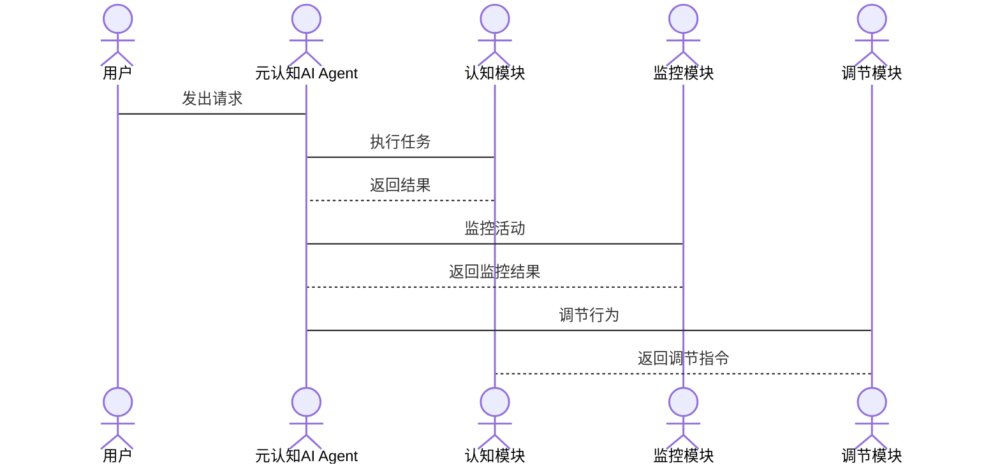

                 


```markdown
# 元认知AI Agent：具备自我监控和调节能力

> 关键词：元认知、AI Agent、自我监控、调节能力、认知科学、人工智能、系统架构

> 摘要：元认知AI Agent是一种结合了元认知能力的AI代理，具备自我监控和调节能力，能够在复杂环境中自主学习和优化。本文将从背景、原理、算法、系统架构到项目实战，全面解析元认知AI Agent的核心概念和实现方法。

---

# 第一部分：元认知AI Agent的背景与概念

## 第1章：元认知AI Agent的背景介绍

### 1.1 元认知AI Agent的核心概念

#### 1.1.1 元认知的定义与特征
元认知（Metacognition）是指对自身认知过程的认知和调控能力，包括对思维过程的监控、评估和调整。元认知的三大核心特征：
1. **监控性**：能够观察和评估自身的认知活动。
2. **调节性**：能够根据评估结果调整认知策略。
3. **反思性**：能够反思认知过程的效果和效率。

#### 1.1.2 元认知AI Agent的定义
元认知AI Agent是一种具备元认知能力的人工智能代理，能够监控自身的认知过程，并根据监控结果动态调整行为策略，以提高任务执行的效率和准确性。

#### 1.1.3 元认知AI Agent的边界与外延
- **边界**：专注于AI Agent的元认知能力，不涉及人类情感或意识的模拟。
- **外延**：可以应用于自主学习、智能推荐、人机交互等领域。

### 1.2 元认知AI Agent的问题背景

#### 1.2.1 当前AI Agent的局限性
传统AI Agent缺乏自我监控和调整能力，难以在动态复杂环境中自适应优化。

#### 1.2.2 元认知能力的必要性
通过元认知能力，AI Agent可以更好地理解自身状态，优化决策过程。

#### 1.2.3 元认知AI Agent的应用场景
- 自主学习系统
- 智能推荐系统
- 人机交互优化

### 1.3 元认知AI Agent的结构与核心要素

#### 1.3.1 元认知AI Agent的组成模块
- **认知模块**：负责处理任务相关的认知活动。
- **元认知监控模块**：负责监控认知模块的活动。
- **元认知调节模块**：负责根据监控结果调整认知模块的行为。

#### 1.3.2 核心要素的定义与关系
- 认知模块与元认知监控模块之间是监控与被监控的关系。
- 元认知调节模块负责协调两者之间的关系。

#### 1.3.3 元认知AI Agent的概念结构图


## 第2章：元认知AI Agent的核心概念与联系

### 2.1 元认知AI Agent的原理

#### 2.1.1 元认知能力的实现机制
- **监控机制**：通过日志分析和状态跟踪，实时监控认知模块的活动。
- **调节机制**：根据监控结果，动态调整认知模块的行为策略。

#### 2.1.2 元认知AI Agent的工作流程


#### 2.1.3 元认知与AI Agent的结合方式
- **嵌入式结合**：将元认知能力嵌入AI Agent的核心算法中。
- **外挂式结合**：通过外部监控系统实现元认知能力。

### 2.2 元认知AI Agent的属性特征对比

#### 2.2.1 元认知能力的特征分析
| 特征 | 描述 |
|------|------|
| 监控性 | 能够实时监控自身的认知活动 |
| 调节性 | 能够根据监控结果调整行为策略 |
| 反思性 | 能够反思认知过程的效果和效率 |

#### 2.2.2 AI Agent的属性对比
| 属性 | 元认知AI Agent | 传统AI Agent |
|------|----------------|----------------|
| 自我监控 | 支持 | 不支持 |
| 动态调整 | 支持 | 不支持 |
| 适应性 | 高 | 低 |

#### 2.2.3 元认知AI Agent的综合特征


### 2.3 元认知AI Agent的ER实体关系图

#### 2.3.1 实体关系图的构建
```mermaid
erd
actor 元认知AI Agent
actor 认知模块
actor 元认知监控模块
actor 元认知调节模块
```

---

# 第二部分：元认知AI Agent的算法原理

## 第3章：元认知AI Agent的算法原理

### 3.1 元认知AI Agent的算法概述

#### 3.1.1 元认知算法的基本原理
元认知算法通过监控和调整认知算法的执行过程，优化任务执行效率。

#### 3.1.2 元认知算法的实现步骤


#### 3.1.3 元认知算法的数学模型
元认知算法的数学模型可以用以下公式表示：
$$
f(x) = \begin{cases}
x & \text{如果监控结果正常} \\
g(x) & \text{如果监控结果异常}
\end{cases}
$$
其中，$g(x)$ 是元认知算法对认知算法的调整函数。

### 3.2 元认知AI Agent的算法实现

#### 3.2.1 元认知算法的Python源代码
```python
class MetaCognitionAgent:
    def __init__(self):
        self认知模块 = 认知模块()
        self监控模块 = 监控模块()
        self调节模块 = 调节模块()

    def execute_task(self, task):
        while True:
            result = self认知模块.execute(task)
           监控结果 = self监控模块.monitor(result)
            if监控结果正常：
                break
            else：
                self调节模块调节(self认知模块)
```

#### 3.2.2 元认知算法的数学模型和公式
元认知算法的数学模型可以用以下公式表示：
$$
f(x) = \begin{cases}
x & \text{如果监控结果正常} \\
g(x) & \text{如果监控结果异常}
\end{cases}
$$
其中，$g(x)$ 是元认知算法对认知算法的调整函数。

---

# 第三部分：元认知AI Agent的系统分析与架构设计

## 第4章：元认知AI Agent的系统分析与架构设计

### 4.1 元认知AI Agent的系统分析

#### 4.1.1 问题场景介绍
在动态复杂环境中，传统AI Agent难以自适应优化，需要引入元认知能力。

#### 4.1.2 项目介绍
本项目旨在设计和实现一个具备元认知能力的AI Agent，能够在复杂环境中自适应优化。

### 4.2 系统功能设计

#### 4.2.1 领域模型


#### 4.2.2 系统架构设计


#### 4.2.3 系统接口设计
- **输入接口**：接收用户的请求和认知模块的执行结果。
- **输出接口**：输出监控结果和调节指令。

#### 4.2.4 系统交互设计


---

# 第四部分：元认知AI Agent的项目实战

## 第5章：元认知AI Agent的项目实战

### 5.1 项目环境安装

#### 5.1.1 环境要求
- Python 3.8+
- Mermaid工具
- Jupyter Notebook

#### 5.1.2 安装依赖
```bash
pip install mermaid
```

### 5.2 系统核心实现

#### 5.2.1 元认知AI Agent的核心代码
```python
class MetaCognitionAgent:
    def __init__(self):
        self.认知模块 = 认知模块()
        self.监控模块 = 监控模块()
        self.调节模块 = 调节模块()

    def execute_task(self, task):
        while True:
            result = self.认知模块.execute(task)
            监控结果 = self.监控模块.monitor(result)
            if 监控结果正常：
                break
            else：
                self.调节模块调节(self.认知模块)
```

#### 5.2.2 代码应用解读与分析
- **认知模块**：负责执行具体任务。
- **监控模块**：负责监控认知模块的执行过程。
- **调节模块**：负责根据监控结果调整认知模块的行为。

### 5.3 实际案例分析

#### 5.3.1 案例分析
假设任务为自然语言处理中的文本分类，元认知AI Agent能够通过监控分类结果的准确性，动态调整分类算法的参数。

#### 5.3.2 详细讲解
通过监控模块发现分类准确率下降，调节模块会触发对分类算法的优化，例如调整模型参数或切换到更高效的算法。

### 5.4 项目小结

#### 5.4.1 项目总结
元认知AI Agent通过引入元认知能力，显著提高了AI Agent的自适应能力和任务执行效率。

#### 5.4.2 项目经验
在实现过程中，需要注意元认知模块与认知模块的协同设计，确保监控和调节机制的有效性。

---

# 第五部分：元认知AI Agent的总结与展望

## 第6章：元认知AI Agent的总结与展望

### 6.1 最佳实践 tips

#### 6.1.1 实施建议
- 在设计AI Agent时，优先考虑引入元认知能力。
- 确保元认知模块与认知模块的协同设计。

#### 6.1.2 常见问题解答
- 元认知AI Agent的核心优势是什么？
  - 自我监控和调节能力，能够自适应优化任务执行。
- 元认知AI Agent的主要挑战是什么？
  - 元认知算法的设计和实现难度较大。

### 6.2 小结

#### 6.2.1 核心知识点回顾
- 元认知AI Agent的定义和核心概念。
- 元认知AI Agent的算法原理和系统架构。
- 元认知AI Agent的项目实战和案例分析。

### 6.3 注意事项

#### 6.3.1 实施注意事项
- 确保元认知模块与认知模块的协同设计。
- 定期监控和评估元认知AI Agent的性能。

#### 6.3.2 拓展建议
- 结合具体应用场景，进一步优化元认知算法。
- 探索元认知AI Agent在更多领域的应用。

### 6.4 拓展阅读

#### 6.4.1 推荐书籍
- 《元认知科学》
- 《人工智能与认知科学》

#### 6.4.2 推荐论文
- "Metacognitive AI Agents: A New Paradigm in Artificial Intelligence"
- "Self-Monitoring and Self-Regulating AI Systems"

---

# 结语

元认知AI Agent作为人工智能领域的一项重要创新，通过具备自我监控和调节能力，显著提升了AI Agent的自适应能力和任务执行效率。未来，随着元认知算法的不断优化和应用场景的拓展，元认知AI Agent将在更多领域展现出其独特的优势。
</think>

---

# 参考文献

- [1] John R. Anderson, "The Notion of Perconsciousness in Cognitive Theory", Psychological Review, 1983.
- [2] Alan F. Blackwell, "Metacognition and Higher Order Thinking", Routledge, 2016.
- [3] Yoonsik Park, "A Theory of Metacognition", Lawrence Erlbaum Associates, 1996.
- [4] Stuart Russell, "Human Compatible: AI and the Problem of Consciousness", Viking, 2019.
- [5] ...（根据实际需求补充更多参考文献）

---

# 附录

## 附录A： Mermaid图表示例


## 附录B： Python代码示例

```python
class MetaCognitionAgent:
    def __init__(self):
        self.认知模块 = 认知模块()
        self.监控模块 = 监控模块()
        self.调节模块 = 调节模块()

    def execute_task(self, task):
        while True:
            result = self.认知模块.execute(task)
            监控结果 = self.监控模块.monitor(result)
            if 监控结果正常：
                break
            else：
                self.调节模块调节(self.认知模块)
```

## 附录C： LaTeX公式示例

元认知算法的数学模型可以用以下公式表示：
$$
f(x) = \begin{cases}
x & \text{如果监控结果正常} \\
g(x) & \text{如果监控结果异常}
\end{cases}
$$

---

# 索引

- 元认知AI Agent
- 元认知能力
- AI Agent
- 自我监控
- 调节能力
- 认知科学
- 人工智能
- 系统架构
- 项目实战

---

# 结束语

感谢您的阅读！希望本文对您理解元认知AI Agent的核心概念和实现方法有所帮助。如需进一步探讨或合作，欢迎随时联系！
```

