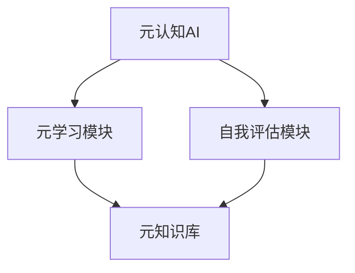
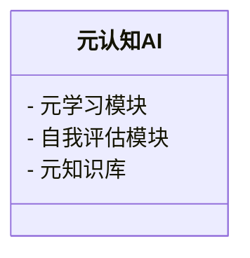
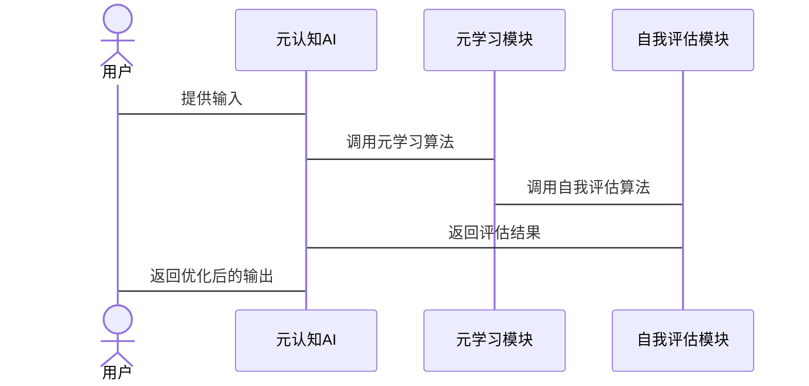

                 

# 元认知AI：具有自我评估能力的AI Agent

## 关键词：
- 元认知AI、AI Agent、自我评估、元学习、智能系统

## 摘要：
元认知AI是一种具备自我评估和反思能力的AI代理，它能够通过元学习机制不断优化自身的决策和行为。本文将从元认知AI的基本概念、核心算法、系统架构设计到实际项目实现进行全面解析，深入探讨其在智能系统中的应用潜力。

---

## 目录

### 第1章 元认知AI的背景与核心概念

#### 1.1 元认知AI的定义与背景
- 1.1.1 元认知的定义与特点  
- 1.1.2 元认知AI的定义与特点  
- 1.1.3 元认知AI的应用场景  

#### 1.2 AI Agent的基本概念  
- 1.2.1 AI Agent的定义  
- 1.2.2 AI Agent的分类与特点  
- 1.2.3 AI Agent在实际应用中的表现形式  

#### 1.3 元认知AI的核心要素  
- 1.3.1 元认知AI的元学习机制  
- 1.3.2 元认知AI的自我评估机制  
- 1.3.3 元认知AI的自适应优化机制  

### 第2章 元认知AI的核心概念与联系

#### 2.1 元认知AI的核心原理  
- 2.1.1 元学习的基本原理  
- 2.1.2 元认知AI的自我评估机制  
- 2.1.3 元认知AI的自适应优化机制  

#### 2.2 元认知AI的核心概念对比  
- 2.2.1 元认知AI与传统AI的对比  
- 2.2.2 元认知AI与强化学习的对比  
- 2.2.3 元认知AI与知识图谱的对比  

#### 2.3 元认知AI的ER实体关系图  

### 第3章 元认知AI的算法原理

#### 3.1 元学习算法的基本原理  
- 3.1.1 元学习的定义与目标  
- 3.1.2 元学习的核心算法流程  
- 3.1.3 元学习的数学模型  

#### 3.2 元认知AI的自我评估机制  
- 3.2.1 自我评估的基本原理  
- 3.2.2 自我评估的实现方法  
- 3.2.3 自我评估的数学模型  

#### 3.3 元认知AI的算法实现  
- 3.3.1 元学习算法的实现步骤  
- 3.3.2 自我评估算法的实现步骤  
- 3.3.3 元认知AI的联合优化算法  

### 第4章 元认知AI的数学模型与公式

#### 4.1 元学习的数学模型  
- 4.1.1 元学习的元模型  
$$ \theta = f_{\theta}(\theta_{prev}, x) $$  
- 4.1.2 元学习的优化目标  
$$ L = \sum_{i=1}^{n} f(x_i, y_i) $$  

#### 4.2 元认知AI的自我评估模型  
- 4.2.1 自我评估的数学表达  
$$ \text{评估结果} = g(\text{输入}, \text{模型参数}) $$  
- 4.2.2 元认知AI的联合优化公式  
$$ \theta_{new} = \theta_{old} + \alpha \nabla L $$  

### 第5章 元认知AI的系统架构设计

#### 5.1 问题场景介绍  
- 5.1.1 元认知AI的应用场景分析  
- 5.1.2 系统功能需求分析  

#### 5.2 系统功能设计  
- 5.2.1 系统功能模块划分  
- 5.2.2 系统功能流程设计  

#### 5.3 系统架构设计  
- 5.3.1 系统架构的Mermaid类图  

- 5.3.2 系统架构的Mermaid架构图  

#### 5.4 系统接口设计  
- 5.4.1 系统接口的定义  
- 5.4.2 系统接口的交互流程  

#### 5.5 系统交互设计  
- 5.5.1 系统交互的Mermaid序列图  

### 第6章 元认知AI的项目实战

#### 6.1 环境安装与配置  
- 6.1.1 开发环境的选择与安装  
- 6.1.2 依赖库的安装与配置  

#### 6.2 系统核心实现源代码  
- 6.2.1 元学习模块的实现代码  
- 6.2.2 自我评估模块的实现代码  

#### 6.3 代码应用解读与分析  
- 6.3.1 代码功能的详细解读  
- 6.3.2 代码实现的优化建议  

#### 6.4 实际案例分析与详细讲解  
- 6.4.1 案例背景介绍  
- 6.4.2 案例实现过程  
- 6.4.3 案例结果分析  

#### 6.5 项目小结  
- 6.5.1 项目实现的关键点总结  
- 6.5.2 项目实现的难点与解决方法  

### 第7章 元认知AI的最佳实践

#### 7.1 最佳实践 tips  
- 7.1.1 元认知AI的开发建议  
- 7.1.2 元认知AI的优化技巧  

#### 7.2 小结  
- 7.2.1 元认知AI的核心思想回顾  
- 7.2.2 元认知AI的未来发展展望  

#### 7.3 注意事项  
- 7.3.1 元认知AI的开发风险提示  
- 7.3.2 元认知AI的使用注意事项  

#### 7.4 拓展阅读  
- 7.4.1 元认知AI相关文献推荐  
- 7.4.2 元认知AI领域的最新研究进展  

---

以上是《元认知AI：具有自我评估能力的AI Agent》的技术博客文章的目录大纲，按照要求分为7章，每章包含详细的子主题，并结合了背景介绍、核心概念、算法原理、系统架构设计、项目实战和最佳实践等内容。

