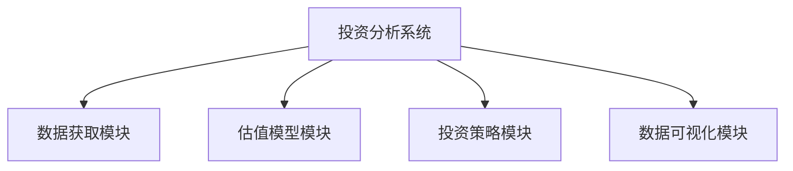

                 


# 克里斯·布朗的深度价值投资：寻找极度低估的股票

## 关键词：深度价值投资、克里斯·布朗、股票估值、安全边际、内在价值、投资策略

## 摘要：  
深度价值投资是一种以寻找市场价格低于其内在价值的股票为核心的投资策略，强调安全边际和长期持有的理念。本文将详细探讨深度价值投资的背景、核心概念、估值方法、投资组合构建、风险管理以及系统化实践，通过克里斯·布朗的投资理念，帮助投资者理解和应用这一策略。

---

# 第一部分: 深度价值投资的背景与核心概念

## 第1章: 深度价值投资的起源与发展

### 1.1 深度价值投资的起源  
深度价值投资的起源可以追溯到20世纪初，由本杰明·格雷厄姆和大卫·多德提出的“价值投资”理念。该理念强调以低于内在价值的价格购买股票，通过长期持有实现收益。  

#### 1.1.1 价值投资的定义与历史  
- 价值投资：通过分析企业的基本面，寻找市场价格低于其内在价值的股票。  
- 格雷厄姆与多德的贡献：提出了“安全边际”和“内在价值”的概念，奠定了深度价值投资的理论基础。  

#### 1.1.2 深度价值投资的兴起  
- 深度价值投资的兴起：20世纪70年代，投资者开始更加系统地应用格雷厄姆的理论，注重对企业内在价值的深入分析。  
- 克里斯·布朗的贡献：通过量化分析和系统化的方法，进一步发展了深度价值投资的理念。  

#### 1.1.3 克里斯·布朗的投资理念  
- 理论基础：市场先生理论（Market先生）——将市场波动视为机会，而非风险。  
- 投资策略：通过系统化的方法，寻找那些市场价格远低于其内在价值的股票。  

---

### 1.2 深度价值投资的核心概念  

#### 1.2.1 内在价值的定义与计算  
- 内在价值：股票的真实价值，基于企业的盈利能力、资产质量、成长潜力等因素。  
- 计算方法：  
  - 现金流折现法（DCF模型）：通过未来现金流的现值计算企业价值。  
  - 市盈率（P/E）与市净率（P/B）分析：基于相对估值方法。  

#### 1.2.2 安全边际的概念与重要性  
- 安全边际：市场价格与内在价值之间的差距，用于降低投资风险。  
- 重要性：确保在市场波动中，投资者不会因短期价格波动而遭受损失。  

#### 1.2.3 市场先生理论  
- 市场先生：象征市场的波动性和不确定性，投资者应利用市场情绪低谷时的机会。  

---

### 1.3 深度价值投资与其他投资策略的对比  

#### 1.3.1 股票投资的主要策略分类  
| 投资策略 | 核心理念 | 适用场景 |  
|----------|----------|----------|  
| 价值投资 | 寻找低估股票 | 市场低迷或个股被低估时 |  
| 成长投资 | 投资高成长企业 | 高成长行业或企业 |  
| 指数投资 | 按比例投资指数基金 | 市场波动较大时 |  

#### 1.3.2 深度价值投资与成长投资的差异  
- 深度价值投资：注重低估值，强调安全边际。  
- 成长投资：注重高成长性，愿意为未来增长支付较高估值。  

#### 1.3.3 深度价值投资与趋势投资的对比  
- 深度价值投资：基于内在价值，逆市场周期投资。  
- 趋势投资：基于市场趋势，顺势而为。  

---

## 第2章: 内在价值的评估方法  

### 2.1 基本的估值方法  

#### 2.1.1 现金流折现法（DCF模型）  
- 原理：将未来现金流折现，计算企业价值。  
- 计算公式：  
  $$ V = \frac{CF_1}{(1+r)^1} + \frac{CF_2}{(1+r)^2} + \cdots + \frac{CF_n}{(1+r)^n} $$  
  其中，\( V \) 为企业价值，\( CF \) 为未来现金流，\( r \) 为折现率。  

#### 2.1.2 市盈率与市净率分析  
- 市盈率（P/E）：股价与每股收益的比率。  
- 市净率（P/B）：股价与每股净资产的比率。  

#### 2.1.3 股息率与股息增长分析  
- 股息率：股息与股价的比率，反映分红能力。  
- 股息增长模型：  
  $$ D_1 = D_0 \times (1+g) $$  
  其中，\( D_1 \) 为第1年的股息，\( D_0 \) 为初始股息，\( g \) 为股息增长率。  

---

### 2.2 高级估值方法  

#### 2.2.1 股权自由现金流模型  
- 定义：企业产生的现金流，在满足再投资需求后可用于分配的部分。  
- 计算公式：  
  $$ FCFF = EBIT(1 - T) + Depreciation - Capital Expenditure $$  
  其中，\( EBIT \) 为息税前利润，\( T \) 为税率，\( Depreciation \) 为折旧，\( Capital Expenditure \) 为资本支出。  

#### 2.2.2 经济利润（EVA）分析  
- 定义：企业税后净利润与资本成本的差额。  
- 计算公式：  
  $$ EVA = Net\ Operating\ Profit\ After\ Tax - Weighted\ Average\ Cost\ of\ Capital \times Capital Employed $$  

#### 2.2.3 行业比较法与相对估值法  
- 行业比较法：将企业与同行业公司进行对比，寻找估值洼地。  
- 相对估值法：基于行业平均估值水平，评估企业价值。  

---

### 2.3 估值中的常见误区  

#### 2.3.1 过度依赖历史数据的误区  
- 风险：忽视未来增长潜力和行业变化。  
- 解决：结合历史数据与未来预期，进行动态估值。  

#### 2.3.2 忽略行业特性的误区  
- 风险：不同行业具有不同的估值逻辑。  
- 解决：根据行业特性调整估值模型。  

#### 2.3.3 过度乐观或悲观的误区  
- 风险：估值偏差导致投资决策错误。  
- 解决：保持理性，结合市场情绪进行调整。  

---

## 第3章: 构建深度价值投资组合  

### 3.1 投资组合的构建原则  

#### 3.1.1 分散投资的重要性  
- 分散投资：通过投资多个低估股票，降低特定股票的风险。  
- 示例：投资组合中包含5-10只股票，覆盖不同行业。  

#### 3.1.2 安全边际的动态调整  
- 动态调整：根据市场变化，定期评估股票的安全边际。  
- 信号：当市场价格接近或低于内在价值时，增加持仓比例。  

#### 3.1.3 长期持有的策略  
- 长期持有：避免频繁交易，降低交易成本和税收负担。  
- 信号：当市场出现大幅波动时，保持耐心，等待价值回归。  

---

### 3.2 投资组合的动态管理  

#### 3.2.1 定期复盘与调整  
- 复盘频率：每季度或每半年进行一次复盘。  
- 调整策略：根据市场变化和企业基本面，调整持仓比例。  

#### 3.2.2 行业轮动的策略  
- 行业轮动：根据经济周期和行业趋势，调整投资组合的行业分布。  
- 示例：在经济衰退期，增加防御性行业的权重。  

#### 3.2.3 风险控制的措施  
- 风险控制：设定止损点，避免重大损失。  
- 止损策略：当股价跌破内在价值的一定比例时，卖出股票。  

---

### 3.3 投资组合的案例分析  

#### 3.3.1 典型案例一：低估的蓝筹股投资  
- 股票：例如，某银行股，市盈率低于行业平均水平，股息率较高。  
- 分析：企业基本面稳定，具有较高的安全边际。  

#### 3.3.2 典型案例二：中小盘股的价值发现  
- 股票：某中小盘股，市场价格远低于其内在价值。  
- 分析：企业具有较高的成长潜力，行业地位稳固。  

---

## 第4章: 风险管理与投资心理  

### 4.1 投资风险的分类  

#### 4.1.1 系统性风险  
- 系统性风险：由市场整体波动引起的，例如经济衰退、政策变化等。  
- 应对策略：通过分散投资和长期持有降低风险。  

#### 4.1.2 非系统性风险  
- 非系统性风险：由特定股票或行业引起的，例如企业业绩下滑、管理问题等。  
- 应对策略：通过深入研究和分散投资降低风险。  

---

### 4.2 风险管理的具体措施  

#### 4.2.1 安全边际的建立  
- 安全边际：市场价格与内在价值之间的差距，用于缓冲市场波动带来的影响。  

#### 4.2.2 定期复盘与调整  
- 复盘：每季度或每半年进行一次投资组合复盘，评估个股表现和整体风险。  
- 调整：根据市场变化和企业基本面，动态调整持仓比例。  

#### 4.2.3 长期思维的培养  
- 长期思维：避免短期市场波动的干扰，坚持价值投资理念。  
- 信号：当市场出现恐慌时，寻找低估股票进行布局。  

---

## 第5章: 深度价值投资的系统化实践  

### 5.1 系统架构设计  

#### 5.1.1 投资分析系统的功能模块  
- 数据获取模块：收集股票的财务数据和市场数据。  
- 估值模型模块：基于DCF模型、市盈率等方法计算内在价值。  
- 投资策略模块：根据安全边际和市场情况生成投资建议。  
- 数据可视化模块：展示分析结果和投资组合表现。  

#### 5.1.2 系统架构图  


---

### 5.2 项目实战  

#### 5.2.1 环境安装与配置  
- 环境：Python 3.8以上版本，安装Jupyter Notebook。  
- 库：pandas、numpy、matplotlib、scikit-learn。  

#### 5.2.2 核心代码实现  

##### 1. 数据获取与清洗  
```python
import pandas as pd
import numpy as np

# 获取股票数据
def get_stock_data(ticker):
    # 模拟数据获取，实际应从数据库或API获取
    data = pd.DataFrame({
        'Date': ['2023-01-01', '2023-01-02', '2023-01-03'],
        'Close': [100, 102, 98]
    })
    return data

# 示例：获取股票数据
stock_data = get_stock_data('AAPL')
print(stock_data)
```

##### 2. 内在价值计算  
```python
def calculate_intrinsic_value(revenue, profit_margin, growth_rate, discount_rate):
    # 简单的DCF模型计算
    value = revenue * profit_margin / (discount_rate - growth_rate)
    return value

# 示例：计算内在价值
revenue = 1000000000
profit_margin = 0.1
growth_rate = 0.05
discount_rate = 0.08
intrinsic_value = calculate_intrinsic_value(revenue, profit_margin, growth_rate, discount_rate)
print(f"内在价值：{intrinsic_value}")
```

##### 3. 投资策略生成  
```python
def generate_investment_strategy(portfolio, intrinsic_values):
    # 简单策略：买入内在价值高于市场价格的股票
    strategy = []
    for stock in portfolio:
        if intrinsic_values[stock] > portfolio[stock]['Close']:
            strategy.append(stock)
    return strategy

# 示例：生成投资策略
portfolio = {
    'AAPL': {'Close': 150},
    'MSFT': {'Close': 120},
    'GOOGL': {'Close': 90}
}
intrinsic_values = {'AAPL': 160, 'MSFT': 130, 'GOOGL': 100}
strategy = generate_investment_strategy(portfolio, intrinsic_values)
print(f"投资策略：{strategy}")
```

##### 4. 数据可视化  
```python
import matplotlib.pyplot as plt

# 示例：绘制股价与内在价值对比图
stocks = ['AAPL', 'MSFT', 'GOOGL']
prices = [150, 120, 90]
intrinsic = [160, 130, 100]

plt.figure(figsize=(10, 6))
plt.plot(stocks, prices, 'o-', label='Market Price')
plt.plot(stocks, intrinsic, 's-', label='Intrinsic Value')
plt.title('股价与内在价值对比')
plt.xlabel('股票')
plt.ylabel('价格')
plt.legend()
plt.show()
```

---

## 第6章: 最佳实践与投资心理培养  

### 6.1 投资心理的重要性  
- 避免情绪化决策：市场波动时，保持冷静，遵循价值投资理念。  
- 培养长期思维：避免短期收益的诱惑，坚持长期持有的策略。  

### 6.2 小结  
深度价值投资是一种系统化、长期化的投资策略，通过寻找市场价格低于其内在价值的股票，实现超额收益。投资者需要具备扎实的分析能力、严格的风险管理意识以及强大的心理素质。  

---

## 第7章: 拓展阅读与进一步学习  

### 7.1 推荐书籍  
- 《证券分析》——本杰明·格雷厄姆  
- 《投资学原理》——理查德·A·阿什沃斯  
- 《价值投资实战》——克里斯·布朗  

### 7.2 在线资源  
- 网站：投资分析论坛、财经博客  
- 工具：金融数据分析平台（如FactSet、Morningstar）  

---

## 附录: 深度价值投资的常见问题解答  

### 1. 深度价值投资适合什么样的投资者？  
- 适合具备长期投资理念、愿意深入研究企业基本面的投资者。  

### 2. 如何应对市场崩盘？  
- 保持冷静，寻找低估股票进行布局，避免恐慌性抛售。  

### 3. 投资组合中的股票数量应如何控制？  
- 通常建议5-10只股票，确保分散化同时便于管理。  

---

# 结语  
深度价值投资是一种需要耐心、纪律和深入研究的投资策略。通过系统化的方法和长期持有的理念，投资者可以在市场波动中找到机会，实现财富的稳健增长。希望本文能为您提供有价值的见解和实践指导。  

---

