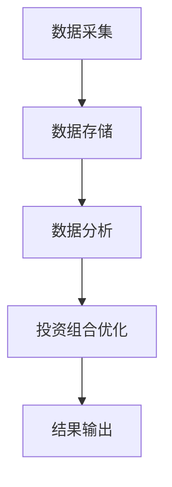

                 


# 小盘价值投资：发现市场盲点的策略与实践

## 关键词：价值投资、小盘股、市场盲点、投资策略、量化分析、系统设计

## 摘要：  
本文探讨了小盘价值投资的核心理念、数学模型、系统设计与实际应用。通过分析小盘股的特点，结合量化方法和系统设计，提出了一套发现市场盲点的有效策略。文章从价值投资的背景出发，深入探讨了小盘股的投资逻辑，并通过数学模型和算法优化，展示了如何在小盘股中发现潜在投资机会。

---

## 第一部分：价值投资的背景与核心概念

### 第1章：价值投资的基本概念

#### 1.1 价值投资的定义与核心理念
- **价值投资**是一种以内在价值为导向的投资策略，旨在通过分析企业的基本面，找到市场价格低于其内在价值的股票进行投资。
- **内在价值**：企业未来现金流的现值，通过DCF模型计算得出。

#### 1.2 小盘股的定义与特点
- **小盘股**：市值在50亿至500亿美元之间的股票，流动性较低，市场关注度较低。
- **特点**：
  - 市值小、流动性低、波动性高。
  - 市场关注少，容易被忽视，存在市场盲点。
  - 估值较低，具备较高的成长潜力。

#### 1.3 市场盲点的概念与形成机制
- **市场盲点**：由于市场关注度低，部分优质小盘股的市场价格未能反映其真实价值。
- **形成机制**：
  - 投资者对小盘股的关注度低，研究不足。
  - 市场情绪化，小盘股容易被市场忽视。

### 第2章：小盘价值投资的核心逻辑

#### 2.1 小盘股的价值评估标准
- **市盈率（P/E）**：股价与每股收益的比率，衡量股价是否被高估或低估。
- **市净率（P/B）**：股价与每股净资产的比率，反映股价相对于资产价值的高低。
- **自由现金流（FCF）**：企业经营活动产生的现金流，反映企业的盈利能力和现金流健康状况。

#### 2.2 小盘股投资的优劣势分析
- **优势**：
  - 市场关注度低，容易发现低估机会。
  - 成长空间大，具备较高的增值潜力。
- **劣势**：
  - 流动性低，买卖价差大。
  - 市场波动性高，风险较大。

---

## 第二部分：小盘价值投资的数学模型与算法

### 第3章：小盘股价值评估的数学模型

#### 3.1 现金流折现模型（DCF模型）
- **DCF模型原理**：通过预测企业未来现金流，将其折现为现值，计算企业的内在价值。
- **公式**：
  $$
  DCF = \frac{CF_1}{(1+r)^1} + \frac{CF_2}{(1+r)^2} + \cdots + \frac{CF_n}{(1+r)^n}
  $$
  其中，CF为现金流，r为折现率，n为预测年数。

#### 3.2 市盈率与市净率分析
- **市盈率（P/E）**：
  $$
  P/E = \frac{\text{股价}}{\text{每股收益}}
  $$
- **市净率（P/B）**：
  $$
  P/B = \frac{\text{股价}}{\text{每股净资产}}
  $$

#### 3.3 自由现金流模型
- **自由现金流（FCF）**：
  $$
  FCF = \text{营业收入} - \text{运营成本} - \text{税费}
  $$

### 第4章：小盘股投资的量化分析算法

#### 4.1 数据采集与预处理
- 数据来源：股票历史数据、财务报表、行业分析报告。
- 数据清洗：处理缺失值、异常值，标准化数据格式。

#### 4.2 基于机器学习的预测模型
- **算法选择**：使用随机森林或支持向量机（SVM）进行分类预测。
- **特征选择**：基于财务指标（如ROE、ROA）和市场指标（如Beta值）进行特征提取。

#### 4.3 投资组合优化
- **优化目标**：最大化收益，最小化风险。
- **数学模型**：
  $$
  \text{收益} = \sum w_i \times r_i
  $$
  $$
  \text{风险} = \sum w_i^2 \times \sigma_i^2
  $$
  其中，\( w_i \)为投资权重，\( r_i \)为预期收益，\( \sigma_i \)为收益波动率。

---

## 第三部分：系统设计与项目实战

### 第5章：小盘股投资系统的设计与实现

#### 5.1 系统功能设计
- 数据采集模块：爬取小盘股数据，包括历史价格、财务报表等。
- 数据分析模块：基于量化模型进行估值分析，识别潜在投资机会。
- 投资组合管理模块：优化投资组合，动态调整持仓。

#### 5.2 系统架构设计


#### 5.3 代码实现
- **环境安装**：
  ```bash
  pip install pandas numpy sklearn matplotlib
  ```
- **数据采集与处理**：
  ```python
  import pandas as pd
  import requests

  # 数据获取
  url = "https://example.com/stock_data"
  response = requests.get(url)
  data = response.json()
  df = pd.DataFrame(data)
  ```

- **量化分析**：
  ```python
  from sklearn.ensemble import RandomForestClassifier

  # 特征提取
  features = df[['P/E', 'P/B', 'ROE']]
  target = df['is_undervalued']

  # 模型训练
  model = RandomForestClassifier()
  model.fit(features, target)
  ```

### 第6章：项目实战与案例分析

#### 6.1 环境搭建
- **工具选择**：使用Python、Pandas、Scikit-learn等工具。
- **数据来源**：从金融数据平台获取小盘股数据。

#### 6.2 数据分析与建模
- **数据清洗**：处理缺失值和异常值。
- **模型训练**：使用随机森林模型进行分类预测，筛选出潜在的低估股票。

#### 6.3 投资组合优化
- **权重分配**：根据模型预测结果，分配投资权重。
- **风险控制**：设置止损点，动态调整持仓。

---

## 第四部分：总结与展望

### 第7章：总结与最佳实践

#### 7.1 投资策略总结
- 小盘股投资需要结合量化分析与基本面研究。
- 通过系统化的方法，发现市场盲点，挖掘潜在机会。

#### 7.2 最佳实践
- 定期更新数据，保持模型的准确性。
- 结合市场环境，动态调整投资策略。
- 严格控制风险，避免过度集中投资。

### 7.3 小结与展望
- 小盘价值投资是一种高风险高回报的投资方式。
- 通过系统化的方法和量化模型，可以提高投资成功的概率。
- 未来，随着技术的进步，小盘股投资将更加依赖于智能化的分析工具。

---

## 参考文献与拓展阅读
1. 《投资之道》——彼得·林奇
2. 《小盘股投资策略》——约翰·邓普勒
3. 《量化投资入门》——马里亚纳·霍恩

---

通过本文的系统分析与实战案例，我们可以看到，小盘价值投资不仅仅是一种投资策略，更是一种需要结合技术、数据和市场的综合能力。希望本文能够为投资者提供有价值的参考与启发。

