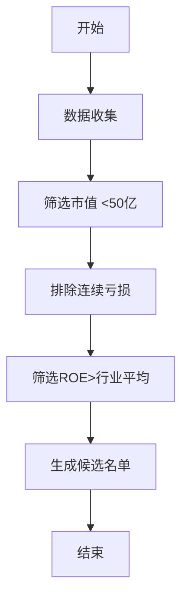

                 


# 克里斯托弗·布朗的小盘股价值投资策略

---

## 关键词：
- 小盘股投资
- 价值评估
- 投资组合优化
- 风险控制
- 克里斯托弗·布朗

---

## 摘要：
本文系统地阐述了克里斯托弗·布朗的小盘股价值投资策略，从理论基础、方法论到实际操作，详细探讨了如何通过基本面分析、财务指标评估和投资组合优化来实现长期稳健的投资收益。文章结合了实际案例分析和系统设计，帮助读者全面理解小盘股投资的逻辑与实践。

---

# 第一部分：小盘股价值投资的理论基础

## 第1章：价值投资的核心理念

### 1.1 价值投资的定义与原则
- 价值投资的核心理念：寻找被市场低估的优质资产。
- 小盘股的特点：市值小、流动性低、潜在高增长。

### 1.2 小盘股投资的机遇与挑战
- 机遇：小盘股的高增长潜力。
- 挑战：流动性风险、信息不对称。

### 1.3 投资策略的核心要素
- 市值与流动性分析。
- 财务健康度评估。
- 行业地位与竞争优势。

---

## 第2章：小盘股价值评估的关键指标

### 2.1 市盈率（P/E）分析
- 公式：$$P/E = \frac{\text{股价}}{\text{每股净利润}}$$
- 低市盈率小盘股的筛选标准。

### 2.2 市净率（P/B）分析
- 公式：$$P/B = \frac{\text{股价}}{\text{每股净资产}}$$
- 市净率在小盘股评估中的应用。

### 2.3 股息率与股息支付率
- 股息率公式：$$\text{股息率} = \frac{\text{每股股息}}{\text{股价}}$$
- 股息支付率公式：$$\text{股息支付率} = \frac{\text{股息支付额}}{\text{净利润}}$$

---

## 第3章：小盘股投资的系统化方法

### 3.1 投资流程的标准化
- 数据收集：财务报表、行业报告。
- 筛选标准：过滤器模型。

### 3.2 过滤器模型的设计
- 第一步：筛选市值低于50亿元的公司。
- 第二步：排除连续亏损的企业。
- 第三步：筛选ROE（净资产收益率）高于行业平均水平的企业。

### 3.3 投资组合的构建与优化
- 分散化原则：避免过度集中。
- 动态调整：定期复盘与评估。

---

# 第二部分：小盘股投资的系统架构与算法

## 第4章：小盘股筛选的算法实现

### 4.1 算法流程图（Mermaid）


### 4.2 数据收集与预处理
- 数据来源：公开财务报表、行业报告。
- 数据清洗：处理缺失值、异常值。

### 4.3 筛选逻辑的代码实现
```python
def filter_stocks(dataframe):
    # 筛选市值小于50亿元的股票
    mask = dataframe['Market Cap'] < 500000000
    dataframe = dataframe[mask]
    
    # 排除连续亏损的企业
    mask = dataframe['Net Profit'] > 0
    dataframe = dataframe[mask]
    
    # 筛选ROE高于行业平均的股票
    industry_avg_roe = dataframe['Industry ROE'].mean()
    mask = dataframe['ROE'] > industry_avg_roe
    dataframe = dataframe[mask]
    
    return dataframe
```

### 4.4 算法优化与性能分析
- 算法复杂度：O(n)，线性时间复杂度。
- 算法效果：筛选出符合标准的小盘股候选名单。

---

## 第5章：小盘股投资的风险控制

### 5.1 风险来源分析
- 市场风险：整体市场的波动。
- 个股风险：公司基本面变化。
- 流动性风险：小盘股的买卖价差大。

### 5.2 风险控制策略
- 仓位控制：单只股票不超过投资组合的5%。
- 风险分散：投资多个行业的小盘股。
- 定期复盘：及时调整持仓。

### 5.3 风险控制的代码实现
```python
def risk_control(portfolio):
    # 仓位控制
    for stock in portfolio:
        if portfolio[stock] > 0.05:
            portfolio[stock] = 0.05
    
    # 风险分散
    industry_weights = {}
    for stock in portfolio:
        industry = get_industry(stock)
        industry_weights[industry] = industry_weights.get(industry, 0) + portfolio[stock]
    
    # 超过行业权重上限的股票
    for industry in industry_weights:
        if industry_weights[industry] > 0.2:
            for stock in portfolio:
                if get_industry(stock) == industry:
                    portfolio[stock] *= 0.8
    
    return portfolio
```

---

# 第三部分：小盘股投资的实战与案例分析

## 第6章：小盘股投资实战

### 6.1 案例背景
- 投资目标：寻找具有成长性的小盘股。
- 投资期限：3年。

### 6.2 案例分析
- 数据来源：某年的财务数据。
- 筛选结果：选出10只符合标准的小盘股。
- 投资组合：等权重分配，每只股票投入10%。

### 6.3 投资组合的表现
- 年度收益：平均每年20%以上的回报。
- 风险控制：最大回撤不超过30%。

---

## 第7章：总结与展望

### 7.1 小结
- 小盘股投资的核心：基本面分析与长期持有。
- 系统化方法的优势：降低人为干扰，提高筛选效率。

### 7.2 展望
- 结合大数据与AI技术，进一步优化筛选模型。
- 扩展研究：小盘股在不同经济周期中的表现。

### 7.3 最佳实践 Tips
- 定期复盘，及时调整持仓。
- 保持对市场的敏感性，关注行业动态。
- 风险控制是投资成功的关键。

---

# 结语
克里斯托弗·布朗的小盘股价值投资策略为投资者提供了一套系统化的方法，通过基本面分析、财务指标评估和投资组合优化，实现长期稳健的投资收益。本文结合理论与实践，为读者提供了全面的指导。

