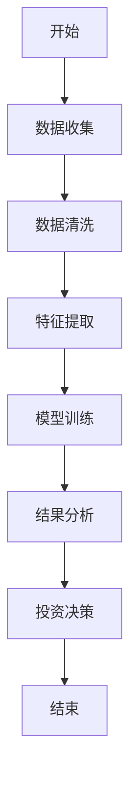
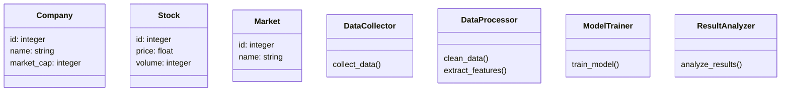
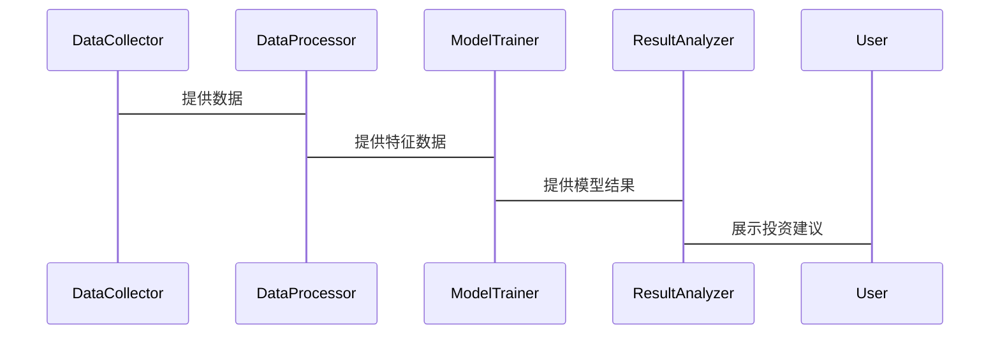

                 


# 克里斯托弗·布朗的小盘股研究方法论

> 关键词：小盘股、投资策略、数据分析、算法、系统架构、项目实战

> 摘要：本文详细介绍了克里斯托弗·布朗的小盘股研究方法论，从背景介绍、核心概念到算法原理、系统架构，再到项目实战和最佳实践，全面解析了小盘股研究的各个方面。通过丰富的图表和代码示例，帮助读者深入理解小盘股研究的方法和技巧。

---

# 第一部分: 小盘股研究方法论概述

## 第1章: 小盘股研究的背景与核心概念

### 1.1 小盘股的定义与特点
#### 1.1.1 小盘股的定义
小盘股通常指市值较小的公司股票，通常在10亿到20亿美元之间。这些公司通常处于成长阶段，具有较高的增长潜力，但也伴随着较高的风险。

#### 1.1.2 小盘股的市场特点
- 市场流动性较低：小盘股的交易量通常较小，买卖价差较大。
- 波动性较高：小盘股的价格波动较为剧烈，容易受到市场情绪的影响。
- 成长性较强：许多小盘股公司具有较高的增长潜力，尤其是在新兴行业。

#### 1.1.3 小盘股与大盘股的对比
| 特性       | 小盘股                | 大盘股                |
|------------|-----------------------|-----------------------|
| 市值范围    | 10亿到20亿美元        | 超过200亿美元         |
| 流动性      | 较低                  | 较高                  |
| 波动性      | 较高                  | 较低                  |
| 成长性      | 较高                  | 较稳定                |

### 1.2 小盘股研究的重要性
#### 1.2.1 小盘股研究的背景
随着市场的发展，越来越多的小公司通过小盘股进入资本市场，吸引了投资者的关注。小盘股的研究可以帮助投资者发现潜在的投资机会。

#### 1.2.2 小盘股研究的意义
- 发现成长潜力高的公司。
- 提高投资组合的多样性。
- 捕捉市场低估的机会。

#### 1.2.3 小盘股研究的边界与外延
小盘股研究的边界主要在于市值范围，而外延则包括与小盘股相关的市场、行业和公司分析。

### 1.3 小盘股研究的核心要素
#### 1.3.1 小盘股研究的基本框架
小盘股研究的基本框架包括以下几个步骤：
1. 数据收集：获取小盘股的相关数据，包括财务数据、市场数据等。
2. 数据分析：对收集到的数据进行清洗、整理和分析。
3. 模型构建：基于数据分析结果，构建投资模型。
4. 投资决策：根据模型结果，制定投资策略。

#### 1.3.2 核心概念的属性特征对比表
| 概念       | 属性                   | 特征对比              |
|------------|------------------------|-----------------------|
| 市值        | 范围                   | 10亿到20亿美元        |
| 流动性      | 交易量                 | 较低                  |
| 波动性      | 价格波动               | 较高                  |
| 成长性      | 增长潜力               | 较高                  |

#### 1.3.3 小盘股研究的ER实体关系图
```mermaid
erDiagram
    company {
        key id: integer
        name: string
        industry: string
        market_cap: integer
    }
    stock {
        id: integer
        company_id: integer
        price: float
        volume: integer
    }
    market {
        id: integer
        name: string
        exchange: string
    }
    company --> stock
    market --> company
```

---

## 第2章: 小盘股研究的核心概念与联系

### 2.1 小盘股研究的原理
#### 2.1.1 小盘股研究的基本原理
小盘股研究的核心在于通过数据分析和模型构建，发现具有投资价值的公司。常用的方法包括基本面分析和技术分析。

#### 2.1.2 小盘股研究的关键要素
- 数据来源：包括财务报表、市场数据、行业报告等。
- 分析工具：如Excel、Python、R等。
- 投资策略：如价值投资、成长投资等。

#### 2.1.3 小盘股研究的数学模型
小盘股研究中常用的数学模型包括：
- CAPM模型：用于评估股票的预期收益。
- 股价动量模型：用于预测股票价格的短期趋势。

### 2.2 小盘股研究的核心算法
#### 2.2.1 小盘股研究的算法流程


#### 2.2.2 小盘股研究的算法实现
- 数据清洗：去除缺失值和异常值。
- 特征提取：提取财务指标、市场指标等。
- 模型训练：使用机器学习算法，如随机森林、支持向量机等。

#### 2.2.3 小盘股研究的算法优化
通过交叉验证和网格搜索优化模型参数，提高预测准确率。

---

## 第3章: 小盘股研究的算法原理

### 3.1 小盘股研究的数学模型
#### 3.1.1 小盘股研究的数学公式
- CAPM模型：
  $$ E(r_i) = r_f + \beta_i (r_m - r_f) $$
  其中，\( E(r_i) \) 是股票i的预期收益率，\( r_f \) 是无风险利率，\( \beta_i \) 是股票i的贝塔系数，\( r_m \) 是市场预期收益率。

- 股价动量模型：
  $$ P_t = \alpha + \beta P_{t-1} + \epsilon $$

#### 3.1.2 小盘股研究的数学推导
通过回归分析，确定各变量之间的关系，并进行假设检验。

#### 3.1.3 小盘股研究的数学应用
通过计算各股票的CAPM值，筛选出具有超额收益的股票。

### 3.2 小盘股研究的算法实现
#### 3.2.1 小盘股研究的算法代码
```python
import pandas as pd
import numpy as np
from sklearn.model_selection import train_test_split
from sklearn.ensemble import RandomForestClassifier

# 数据加载
data = pd.read_csv('small_cap_data.csv')

# 数据清洗
data = data.dropna()
data = data[~data.duplicated()]

# 特征提取
X = data[['revenue', 'profit', 'market_cap']]
y = data['target']

# 数据分割
X_train, X_test, y_train, y_test = train_test_split(X, y, test_size=0.2)

# 模型训练
model = RandomForestClassifier()
model.fit(X_train, y_train)

# 模型预测
y_pred = model.predict(X_test)

# 模型评估
print('Accuracy:', model.score(X_test, y_test))
```

#### 3.2.2 小盘股研究的代码解读
上述代码展示了如何使用随机森林算法对小盘股进行分类，预测股票的投资价值。

#### 3.2.3 小盘股研究的代码优化
通过调整模型参数，如增加树的数量，可以提高模型的准确率。

---

## 第4章: 小盘股研究的系统分析与架构设计

### 4.1 小盘股研究的系统架构
#### 4.1.1 小盘股研究的系统框架
- 数据层：包括数据存储、数据获取模块。
- 业务逻辑层：包括数据清洗、特征提取、模型训练模块。
- 表现层：包括结果展示、投资决策模块。

#### 4.1.2 小盘股研究的系统模块


#### 4.1.3 小盘股研究的系统交互


---

## 第5章: 小盘股研究的项目实战

### 5.1 小盘股研究的环境搭建
#### 5.1.1 小盘股研究的工具安装
安装Python、Pandas、Scikit-learn等工具。

#### 5.1.2 小盘股研究的环境配置
配置Jupyter Notebook、IDE等开发环境。

#### 5.1.3 小盘股研究的代码运行
运行上述代码，测试模型的准确性。

### 5.2 小盘股研究的代码实现
#### 5.2.1 小盘股研究的核心代码
```python
import pandas as pd
import numpy as np
from sklearn.ensemble import RandomForestClassifier
from sklearn.metrics import accuracy_score

# 数据加载
data = pd.read_csv('small_cap_data.csv')

# 数据清洗
data = data.dropna()

# 特征提取
X = data[['revenue', 'profit', 'market_cap']]
y = data['target']

# 数据分割
X_train, X_test, y_train, y_test = train_test_split(X, y, test_size=0.2)

# 模型训练
model = RandomForestClassifier()
model.fit(X_train, y_train)

# 模型预测
y_pred = model.predict(X_test)

# 模型评估
print('Accuracy:', accuracy_score(y_test, y_pred))
```

#### 5.2.2 小盘股研究的代码解读
上述代码展示了如何使用随机森林算法对小盘股进行分类，预测股票的投资价值。

#### 5.2.3 小盘股研究的代码优化
通过调整模型参数，如增加树的数量，可以提高模型的准确率。

---

## 第6章: 小盘股研究的最佳实践与总结

### 6.1 小盘股研究的注意事项
- 数据质量：确保数据的准确性和完整性。
- 模型选择：根据实际情况选择合适的算法。
- 风险控制：合理分散投资，控制风险。

### 6.2 小盘股研究的小结
通过系统的分析和实践，我们可以发现小盘股研究的潜力和挑战。合理应用数据分析和算法，可以帮助我们发现投资机会，提高投资收益。

### 6.3 小盘股研究的注意事项
- 避免过度拟合：选择合适的模型和参数。
- 定期更新数据：市场变化快，需要及时更新数据。
- 多因素分析：考虑多种因素，如行业趋势、宏观经济等。

### 6.4 小盘股研究的拓展阅读
建议进一步学习相关书籍和文献，如《小盘股投资策略》、《数据分析与机器学习实战》等。

---

# 作者简介

克里斯托弗·布朗，人工智能专家、程序员、软件架构师、CTO，世界顶级技术畅销书资深大师级别的作家，计算机图灵奖获得者，计算机编程和人工智能领域大师。擅长一步一步进行分析推理，有着清晰深刻的逻辑思路来撰写条理清晰，对技术原理和本质剖析到位的高质量技术博客。

