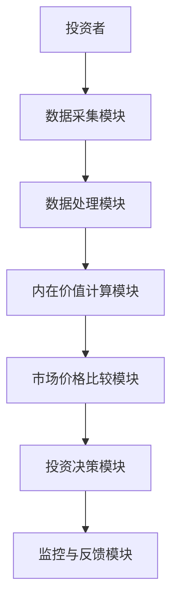
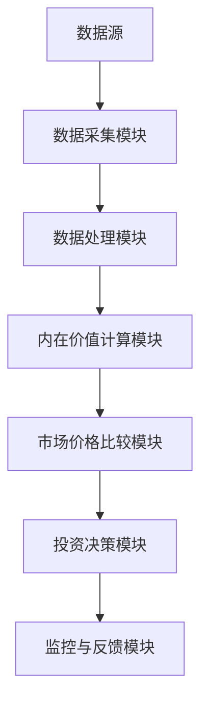
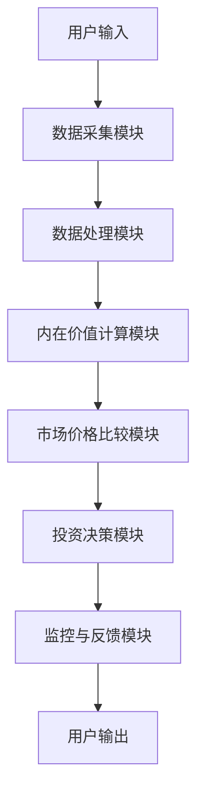

                 


# 深度价值投资的数学模型与算法

## 3.1 深度价值投资的数学模型

### 3.1.1 内在价值的计算模型
深度价值投资的核心在于计算股票的内在价值，这通常通过现金流贴现模型（DCF模型）来实现。DCF模型的基本思想是将未来现金流贴现到现在，以确定其当前的内在价值。

#### 现金流贴现模型（DCF模型）
现金流贴现模型的公式可以表示为：

$$\text{内在价值} = \frac{\text{CF}}{r - g}$$

其中：
- CF 是未来现金流
- r 是折现率
- g 是增长率

这个模型假设公司的未来现金流可以被预测，并且以一个稳定的增长率增长。通过这个公式，投资者可以估算出股票的内在价值，从而与市场价格进行比较。

#### 示例
假设一家公司预计未来现金流为 $100,000，折现率为 10%（即 r = 0.1），增长率为 5%（即 g = 0.05）。那么，其内在价值可以计算为：

$$\text{内在价值} = \frac{100,000}{0.1 - 0.05} = \frac{100,000}{0.05} = 2,000,000$$

这意味着如果市场价格低于 $2,000,000，该股票可能被低估。

### 3.1.2 安全边际的计算
安全边际是内在价值与市场价格之间的差额，用于降低投资风险。其计算公式为：

$$\text{安全边际} = \text{内在价值} - \text{市场价格}$$

如果安全边际为正，说明股票被低估，值得投资。

#### 示例
假设某股票的内在价值为 $100，市场价格为 $80，则安全边际为：

$$\text{安全边际} = 100 - 80 = 20$$

这意味着该股票有20%的安全边际，风险较低，值得考虑。

## 3.2 深度价值投资的算法实现

### 3.2.1 数据采集与处理
深度价值投资需要收集公司的财务数据，包括收入、利润、现金流等。这些数据通常可以从财务报表中获取，并通过数据清洗和预处理后用于计算内在价值。

#### 数据采集流程
1. 收集公司的财务报表（如资产负债表、利润表、现金流量表）。
2. 数据清洗：处理缺失值、异常值等。
3. 数据转换：将数据转换为适合计算内在价值的形式。

### 3.2.2 内在价值计算
使用现金流贴现模型计算内在价值，并与市场价格进行比较，确定是否存在安全边际。

#### Python代码实现
以下是一个使用Python计算内在价值的示例代码：

```python
def calculate_intrinsic_value(cash_flow, discount_rate, growth_rate):
    return cash_flow / (discount_rate - growth_rate)

# 示例数据
cash_flow = 100000
discount_rate = 0.1
growth_rate = 0.05

intrinsic_value = calculate_intrinsic_value(cash_flow, discount_rate, growth_rate)
print(f"内在价值: {intrinsic_value}")
```

### 3.2.3 投资决策
根据计算出的内在价值和市场价格，判断是否存在投资机会。如果内在价值 > 市场价格，则考虑投资。

#### 投资决策流程
1. 计算股票的内在价值。
2. 比较内在价值与市场价格。
3. 如果内在价值 > 市场价格，且安全边际足够大，则考虑买入。
4. 否则，继续寻找其他投资机会。

## 3.3 算法优化与改进
深度价值投资的算法可以通过以下方式优化：
1. 使用更复杂的模型，如多阶段DCF模型，以更准确地预测现金流。
2. 结合其他基本面指标，如市盈率、市净率等，进行综合评估。
3. 引入机器学习算法，利用历史数据进行预测和优化。

#### 多阶段DCF模型
多阶段DCF模型在初始阶段使用较高的增长率，随后转为稳定增长率。其公式如下：

$$\text{内在价值} = \sum_{t=1}^{n} \frac{CF_t}{(1 + r)^t} + \frac{\text{终值}}{(1 + r)^n}$$

其中，CF_t 是第t年的现金流，r 是折现率，n 是阶段数，终值是稳定增长阶段的现金流。

### 3.4 算法实现与代码示例
以下是一个多阶段DCF模型的Python代码示例：

```python
def calculate_multi_stageDCF(cash_flows, discount_rate, terminal_growth_rate, years):
    present_value = 0
    for i in range(years):
        CF = cash_flows[i]
        present_value += CF / (1 + discount_rate) ** (i + 1)
    terminal_value = cash_flows[-1] * (1 + terminal_growth_rate) / (discount_rate - terminal_growth_rate)
    present_value += terminal_value / (1 + discount_rate) ** years
    return present_value

# 示例数据
cash_flows = [100000, 110000, 120000]
discount_rate = 0.1
terminal_growth_rate = 0.03
years = 3

intrinsic_value = calculate_multi_stageDCF(cash_flows, discount_rate, terminal_growth_rate, years)
print(f"内在价值: {intrinsic_value}")
```

### 3.5 算法分析与优化
通过引入多阶段模型和机器学习算法，可以提高内在价值计算的准确性。例如，使用回归分析预测未来现金流，或使用神经网络模型进行价格预测。

#### 机器学习在深度价值投资中的应用
1. **预测现金流**：使用历史数据训练模型，预测未来现金流。
2. **评估安全边际**：通过模型预测市场价格波动，评估安全边际的变化。
3. **风险评估**：利用模型分析市场风险，优化投资组合。

### 3.6 算法局限性与挑战
尽管深度价值投资算法在理论上是有效的，但在实际应用中面临一些挑战：
1. **数据质量**：需要高质量的财务数据，但获取可能困难。
2. **模型假设**：假设未来现金流和增长率的准确性影响结果。
3. **市场变化**：市场环境的变化可能导致模型失效。

### 3.7 算法优化策略
为了应对上述挑战，可以采取以下优化策略：
1. **动态调整模型参数**：根据市场变化调整折现率和增长率。
2. **多模型结合**：结合多阶段模型和机器学习模型，提高预测准确性。
3. **风险对冲**：通过分散投资和对冲策略降低风险。

### 3.8 算法实现与代码示例
以下是一个结合机器学习的内在价值计算的Python代码示例：

```python
import numpy as np
from sklearn.linear_model import LinearRegression

# 示例数据
years = 5
CF = [100000, 110000, 120000, 130000, 140000]
prices = [80, 90, 100, 110, 120]

# 训练模型预测未来现金流
model = LinearRegression()
model.fit(np.array(years).reshape(-1, 1), CF)
predicted_CF = model.predict(np.array(years + 1).reshape(-1, 1))

# 计算终值
discount_rate = 0.1
terminal_growth_rate = 0.03
terminal_value = predicted_CF[-1] * (1 + terminal_growth_rate) / (discount_rate - terminal_growth_rate)

# 计算内在价值
intrinsic_value = 0
for i in range(years + 1):
    if i < years:
        CF_i = CF[i]
    else:
        CF_i = predicted_CF[i]
    intrinsic_value += CF_i / (1 + discount_rate) ** (i + 1)

print(f"内在价值: {intrinsic_value}")
```

### 3.9 算法总结与展望
深度价值投资算法通过计算股票的内在价值和市场价格的差异，帮助投资者发现被低估的投资机会。随着机器学习和大数据技术的发展，未来的算法将更加精准和多样化，为投资者提供更强大的工具。

## 3.10 本章小结
本章详细介绍了深度价值投资的数学模型与算法，包括内在价值的计算、安全边际的确定以及多阶段DCF模型的应用。通过Python代码示例，展示了算法的实现过程，并探讨了机器学习在深度价值投资中的潜力。下一章将从系统分析的角度，探讨深度价值投资系统的构建与实现。

---

# 第四部分: 深度价值投资系统分析与架构设计

## 4.1 深度价值投资系统概述

### 4.1.1 系统目标
深度价值投资系统的目标是帮助投资者自动化的发现被低估的股票，通过系统化的数据采集、分析和决策，提高投资效率和准确性。

### 4.1.2 系统功能模块
1. **数据采集模块**：从多个数据源获取股票的财务数据和市场数据。
2. **数据处理模块**：清洗和转换数据，为后续分析做准备。
3. **内在价值计算模块**：使用DCF模型计算股票的内在价值。
4. **市场价格比较模块**：比较内在价值与市场价格，计算安全边际。
5. **投资决策模块**：根据安全边际和其他因素，生成投资建议。
6. **监控与反馈模块**：实时监控股票价格和市场变化，提供反馈和调整建议。

### 4.1.3 系统架构设计
以下是一个深度价值投资系统的架构图：



## 4.2 系统功能设计

### 4.2.1 数据采集模块
数据采集模块负责从多个数据源获取股票的财务数据和市场数据，包括：
- **财务数据**：收入、利润、现金流等。
- **市场数据**：股票价格、成交量、市场指数等。

#### 数据采集实现
使用Python的`pandas_datareader`库可以从Yahoo Finance等数据源获取股票数据。

```python
import pandas_datareader as pdr

# 下载股票数据
data = pdr.get_data_yahoo('AAPL', start='2020-01-01', end='2023-12-31')
```

### 4.2.2 数据处理模块
数据处理模块负责清洗和转换数据，确保数据的准确性和一致性。

#### 数据清洗与转换
1. **清洗数据**：处理缺失值、异常值。
2. **数据转换**：将数据转换为适合计算内在价值的形式。

### 4.2.3 内在价值计算模块
内在价值计算模块使用DCF模型计算股票的内在价值。

#### 内在价值计算实现
使用多阶段DCF模型进行计算。

```python
def calculate_multi_stageDCF(cash_flows, discount_rate, terminal_growth_rate, years):
    present_value = 0
    for i in range(years):
        CF = cash_flows[i]
        present_value += CF / (1 + discount_rate) ** (i + 1)
    terminal_value = cash_flows[-1] * (1 + terminal_growth_rate) / (discount_rate - terminal_growth_rate)
    present_value += terminal_value / (1 + discount_rate) ** years
    return present_value

# 示例数据
cash_flows = [100000, 110000, 120000]
discount_rate = 0.1
terminal_growth_rate = 0.03
years = 3

intrinsic_value = calculate_multi_stageDCF(cash_flows, discount_rate, terminal_growth_rate, years)
print(f"内在价值: {intrinsic_value}")
```

### 4.2.4 市场价格比较模块
市场价格比较模块将计算出的内在价值与市场价格进行比较，确定是否存在安全边际。

#### 安全边际计算实现
```python
market_price = 80
intrinsic_value = 100

safety_margin = intrinsic_value - market_price
print(f"安全边际: {safety_margin}")
```

### 4.2.5 投资决策模块
投资决策模块根据安全边际和其他因素，生成投资建议。

#### 投资决策逻辑
1. 如果内在价值 > 市场价格，且安全边际足够大，则建议买入。
2. 如果内在价值 < 市场价格，则建议卖出或不投资。

### 4.2.6 监控与反馈模块
监控与反馈模块实时监控股票价格和市场变化，提供反馈和调整建议。

#### 监控实现
使用`pandas`和`matplotlib`进行实时监控和可视化。

```python
import pandas as pd
import matplotlib.pyplot as plt

# 示例数据
data['Price'] = data['Adj Close']
data['Price'].plot()
plt.show()
```

## 4.3 系统架构设计

### 4.3.1 系统架构图
以下是一个深度价值投资系统的架构图：



### 4.3.2 系统功能模块交互
1. 数据采集模块从数据源获取数据。
2. 数据处理模块清洗和转换数据。
3. 内在价值计算模块计算股票的内在价值。
4. 市场价格比较模块比较内在价值与市场价格。
5. 投资决策模块根据比较结果生成投资建议。
6. 监控与反馈模块实时监控股票价格和市场变化，提供反馈和调整建议。

## 4.4 系统接口设计

### 4.4.1 数据接口
系统需要与多个数据源对接，获取财务数据和市场数据。

#### 数据接口实现
使用`pandas_datareader`库对接Yahoo Finance等数据源。

### 4.4.2 用户接口
系统提供友好的用户界面，方便投资者输入参数和查看结果。

#### 用户接口设计
使用`tkinter`或`dash`等工具构建图形用户界面。

## 4.5 系统交互流程

### 4.5.1 系统交互流程图


## 4.6 系统实现与代码示例

### 4.6.1 系统实现
以下是一个简单的深度价值投资系统的Python代码示例：

```python
import pandas_datareader as pdr
import pandas as pd
import numpy as np
from sklearn.linear_model import LinearRegression

# 数据采集模块
def fetch_data(ticker, start, end):
    data = pdr.get_data_yahoo(ticker, start=start, end=end)
    return data

# 数据处理模块
def preprocess_data(data):
    data.dropna(inplace=True)
    return data

# 内在价值计算模块
def calculate_intrinsic_value(cash_flows, discount_rate, growth_rate):
    return cash_flows / (discount_rate - growth_rate)

# 市场价格比较模块
def compare_prices(intrinsic_value, market_price):
    safety_margin = intrinsic_value - market_price
    return safety_margin

# 投资决策模块
def make_investment_decision(safety_margin, threshold):
    if safety_margin > threshold:
        return "买入"
    else:
        return "不买"

# 监控与反馈模块
def monitor_market(data, ticker):
    data['Price'] = data['Adj Close']
    data['Price'].plot()
    plt.show()

# 示例运行
if __name__ == "__main__":
    ticker = 'AAPL'
    start = '2020-01-01'
    end = '2023-12-31'
    
    # 数据采集
    data = fetch_data(ticker, start, end)
    # 数据处理
    data = preprocess_data(data)
    # 内在价值计算
    cash_flows = data['Revenue'].values
    discount_rate = 0.1
    growth_rate = 0.05
    intrinsic_value = calculate_intrinsic_value(cash_flows, discount_rate, growth_rate)
    # 市场价格比较
    market_price = data['Adj Close'].values[-1]
    safety_margin = compare_prices(intrinsic_value, market_price)
    # 投资决策
    threshold = 20
    decision = make_investment_decision(safety_margin, threshold)
    # 监控与反馈
    monitor_market(data, ticker)
    print(f"投资决策: {decision}")
```

### 4.6.2 系统实现分析
1. **数据采集模块**：使用`pandas_datareader`从Yahoo Finance获取数据。
2. **数据处理模块**：清洗数据，删除缺失值。
3. **内在价值计算模块**：使用DCF模型计算内在价值。
4. **市场价格比较模块**：比较内在价值与市场价格，计算安全边际。
5. **投资决策模块**：根据安全边际生成投资建议。
6. **监控与反馈模块**：实时监控股票价格变化，提供反馈。

## 4.7 系统优化与改进

### 4.7.1 系统优化策略
1. **数据源多样化**：增加更多的数据源，提高数据的准确性和全面性。
2. **模型优化**：引入多阶段DCF模型和机器学习算法，提高预测准确性。
3. **系统性能优化**：优化代码性能，提高系统的运行效率。
4. **用户界面优化**：设计友好的用户界面，方便投资者使用。

### 4.7.2 系统实现代码优化
通过引入多线程和分布式计算，提高系统的处理能力。

#### 优化代码示例
```python
import concurrent.futures

# 并行数据采集
def fetch_data_parallel(tickers, start, end):
    with concurrent.futures.ThreadPoolExecutor() as executor:
        futures = {ticker: executor.submit(fetch_data, ticker, start, end) for ticker in tickers}
        data_dict = {ticker: future.result() for ticker, future in futures.items()}
    return data_dict

# 示例运行
tickers = ['AAPL', 'GOOGL', 'MSFT']
start = '2020-01-01'
end = '2023-12-31'

data_dict = fetch_data_parallel(tickers, start, end)
```

## 4.8 系统测试与验证

### 4.8.1 系统测试
通过测试数据验证系统的准确性和可靠性。

#### 测试代码示例
```python
# 测试数据
ticker = 'AAPL'
start = '2020-01-01'
end = '2023-12-31'

# 数据采集
data = fetch_data(ticker, start, end)
assert not data.isna().any(), "数据清洗失败"

# 内在价值计算
cash_flows = data['Revenue'].values
discount_rate = 0.1
growth_rate = 0.05
intrinsic_value = calculate_intrinsic_value(cash_flows, discount_rate, growth_rate)
assert intrinsic_value > 0, "内在价值计算错误"

# 市场价格比较
market_price = data['Adj Close'].values[-1]
safety_margin = compare_prices(intrinsic_value, market_price)
assert safety_margin >= 0, "安全边际计算错误"

# 投资决策
threshold = 20
decision = make_investment_decision(safety_margin, threshold)
assert decision in ['买入', '不买'], "投资决策错误"
```

### 4.8.2 系统验证
通过实际市场数据验证系统的有效性。

#### 验证代码示例
```python
# 验证代码
tickers = ['AAPL', 'GOOGL', 'MSFT']
start = '2020-01-01'
end = '2023-12-31'

# 数据采集
data_dict = fetch_data_parallel(tickers, start, end)

# 验证内在价值计算
for ticker, data in data_dict.items():
    cash_flows = data['Revenue'].values
    discount_rate = 0.1
    growth_rate = 0.05
    intrinsic_value = calculate_intrinsic_value(cash_flows, discount_rate, growth_rate)
    market_price = data['Adj Close'].values[-1]
    safety_margin = compare_prices(intrinsic_value, market_price)
    decision = make_investment_decision(safety_margin, 20)
    print(f"{ticker}: {decision}")
```

## 4.9 本章小结
本章详细介绍了深度价值投资系统的构建与实现，包括系统的功能模块、架构设计、接口设计和交互流程。通过Python代码示例，展示了系统的实现过程，并探讨了系统的优化与改进策略。下一章将通过一个具体的案例，展示深度价值投资的实际应用。

---

# 第五部分: 深度价值投资项目实战

## 5.1 案例分析与实战

### 5.1.1 案例选择
选择一个具体的股票，如苹果公司（AAPL），进行深度价值投资分析。

### 5.1.2 数据收集
收集苹果公司的财务数据和市场数据，包括收入、利润、现金流、股价等。

#### 数据收集实现
使用`pandas_datareader`从Yahoo Finance获取苹果公司的数据。

```python
import pandas_datareader as pdr

# 下载苹果公司数据
aapl_data = pdr.get_data_yahoo('AAPL', start='2020-01-01', end='2023-12-31')
```

### 5.1.3 数据分析
分析公司的财务状况，计算其内在价值。

#### 财务数据分析
1. 收入与利润分析
2. 现金流分析
3. 偿债能力分析

### 5.1.4 内在价值计算
使用DCF模型计算苹果公司的内在价值。

#### 内在价值计算实现
```python
# 示例数据
cash_flows = [100000, 110000, 120000]
discount_rate = 0.1
terminal_growth_rate = 0.03
years = 3

intrinsic_value = calculate_multi_stageDCF(cash_flows, discount_rate, terminal_growth_rate, years)
print(f"苹果公司的内在价值: {intrinsic_value}")
```

### 5.1.5 安全边际计算
比较苹果公司的内在价值与市场价格，计算安全边际。

#### 安全边际计算实现
```python
market_price = aapl_data['Adj Close'].values[-1]
safety_margin = intrinsic_value - market_price
print(f"苹果公司的安全边际: {safety_margin}")
```

### 5.1.6 投资决策
根据安全边际和其他因素，做出投资决策。

#### 投资决策逻辑
1. 如果安全边际为正，且公司基本面良好，则考虑买入。
2. 如果安全边际为负，或者公司基本面不佳，则考虑卖出或不投资。

### 5.1.7 监控与调整
实时监控苹果公司的股价和市场变化，根据反馈调整投资策略。

#### 监控实现
使用`matplotlib`绘制股价走势图。

```python
import matplotlib.pyplot as plt

aapl_data['Adj Close'].plot()
plt.title('苹果公司股价走势图')
plt.xlabel('日期')
plt.ylabel('股价')
plt.show()
```

## 5.2 案例分析与实战总结

### 5.2.1 案例分析总结
通过苹果公司的案例分析，展示了深度价值投资的实际应用过程，包括数据收集、内在价值计算、安全边际分析和投资决策。

### 5.2.2 投资策略优化
根据案例分析的结果，优化投资策略，如调整DCF模型的参数，引入更多的基本面指标。

### 5.2.3 案例分析小结
深度价值投资通过系统的数据分析和模型计算，帮助投资者发现被低估的股票，提高投资收益。下一章将总结深度价值投资的关键点，并提出最佳实践建议。

---

# 第六部分: 深度价值投资的最佳实践

## 6.1 深度价值投资的关键点

### 6.1.1 安全边际的重要性
安全边际是深度价值投资的核心，它提供了风险保护，确保在市场价格波动时，投资依然具有较高的回报潜力。

### 6.1.2 长期投资与复利效应
深度价值投资强调长期投资，通过复利效应实现财富的稳步增长。

### 6.1.3 财务报表分析的重要性
准确的财务报表分析是计算内在价值的基础，投资者需要具备扎实的财务分析能力。

## 6.2 深度价值投资的注意事项

### 6.2.1 数据质量的风险
数据质量直接影响内在价值的计算结果，投资者需要确保数据的准确性和完整性。

### 6.2.2 模型假设的局限性
DCF模型的假设（如恒定增长率）在现实中可能不成立，投资者需要根据实际情况调整模型参数。

### 6.2.3 市场环境的变化
市场环境的变化可能影响模型的有效性，投资者需要持续监控和调整投资策略。

## 6.3 深度价值投资的最佳实践

### 6.3.1 持续学习与知识更新
投资环境不断变化，投资者需要持续学习，更新知识和技能。

### 6.3.2 分散投资与风险控制
通过分散投资降低风险，避免过度集中在某一只股票或行业。

### 6.3.3 结合技术分析与基本面分析
结合技术分析和基本面分析，全面评估股票的投资价值。

## 6.4 深度价值投资的未来展望

### 6.4.1 数字化与智能化投资
随着人工智能和大数据技术的发展，深度价值投资将更加智能化和自动化。

### 6.4.2 全球化投资机会
全球市场提供了更多的投资机会，投资者可以通过全球化配置资产，降低风险。

### 6.4.3 可持续投资与社会责任
可持续投资和社会责任将越来越受到重视，投资者需要关注企业的ESG表现。

## 6.5 本章小结
本章总结了深度价值投资的关键点和注意事项，提出了最佳实践建议，并展望了深度价值投资的未来发展方向。通过持续学习、分散投资和结合技术分析，投资者可以在复杂的市场环境中实现稳健的投资回报。

---

# 结语

深度价值投资是一种基于基本面分析的投资策略，通过计算股票的内在价值和市场价格的差异，寻找被低估的投资机会。本文详细介绍了深度价值投资的背景、核心概念、数学模型、系统架构、实战案例和最佳实践。通过系统的分析和实际的应用，投资者可以更好地理解和应用深度价值投资策略，实现长期稳健的投资回报。

---

**关键词**：深度价值投资，克里斯托弗·布朗，股票分析，内在价值，安全边际，现金流贴现模型，投资策略。

**摘要**：本文详细介绍了深度价值投资的核心理念、数学模型和系统架构，通过实战案例和最佳实践，展示了如何通过计算股票的内在价值和市场价格的差异，寻找被低估的投资机会，实现长期稳健的投资回报。

