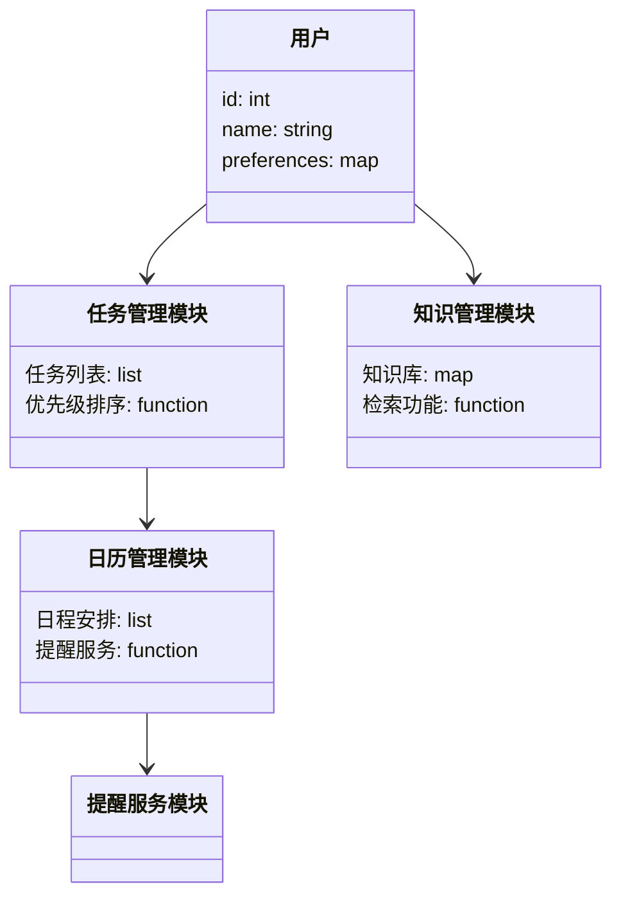

                 


# 全方位生活助手AI Agent：LLM驱动的个人管理系统

> 关键词：AI Agent, LLM, 个人管理, 系统架构, 项目实战

> 摘要：本文深入探讨了基于大语言模型（LLM）的全方位生活助手AI Agent的设计与实现。从问题背景到核心概念，从算法原理到系统架构，再到项目实战，全面分析了如何构建一个智能、高效的个人管理系统，帮助用户提升生活效率。

---

# 第一部分: 全方位生活助手AI Agent背景介绍

## 第1章: 问题背景与需求分析

### 1.1 问题背景

#### 1.1.1 当前个人管理面临的挑战
在现代生活中，个人管理变得越来越复杂。人们每天需要处理的任务包括工作、学习、社交、健康等多种方面。传统的任务管理工具（如日历、待办事项列表）虽然能在一定程度上帮助我们组织任务，但它们往往缺乏智能性和全面性。例如，用户需要手动输入任务、设置提醒，而这些工具无法主动理解和优化用户的管理流程。

#### 1.1.2 AI技术在个人管理中的潜力
随着大语言模型（LLM）技术的快速发展，AI在自然语言处理、任务推理和决策支持方面的能力显著提升。AI Agent（智能体）能够通过分析用户的意图和需求，提供个性化的建议和自动化服务。例如，AI Agent可以根据用户的日程安排，自动调整任务优先级，甚至主动推荐最优的解决方案。

#### 1.1.3 全方位生活助手的定义与目标
全方位生活助手AI Agent是一个基于LLM的智能系统，旨在通过自动化、智能化的方式帮助用户管理日常生活中的各种任务。其目标是整合用户的日程安排、知识管理、健康数据等信息，提供个性化的服务，提升用户的生活效率和幸福感。

### 1.2 问题描述

#### 1.2.1 传统个人管理工具的局限性
传统个人管理工具主要依赖用户手动输入和维护数据，缺乏智能性和主动性。例如，用户需要手动设置提醒、分类任务，而这些工具无法根据上下文信息进行优化。

#### 1.2.2 用户需求分析
通过调研发现，用户对个人管理工具的主要需求包括：
- 自动化任务管理：AI Agent能够主动理解和执行任务。
- 个性化建议：基于用户的行为和偏好，提供定制化建议。
- 多功能集成：整合日历、知识库、健康数据等多方面信息。

#### 1.2.3 全方位生活助手的核心功能
全方位生活助手的核心功能包括：
- **任务管理**：自动识别任务优先级，优化日程安排。
- **知识管理**：智能化整理和检索知识库。
- **健康管理**：基于数据分析提供健康建议。
- **提醒服务**：智能提醒，避免遗漏重要任务。

### 1.3 问题解决与边界

#### 1.3.1 AI Agent如何解决个人管理问题
AI Agent通过自然语言处理和机器学习技术，能够理解用户的意图、预测潜在需求，并主动提供解决方案。例如，当用户提到“明天要开会”，AI Agent可以自动将会议添加到日历中，并提醒准备相关材料。

#### 1.3.2 边界与外延
- **边界**：AI Agent专注于个人管理，不涉及团队协作或其他外部系统。
- **外延**：未来可以扩展到家庭管理、企业级管理等领域。

#### 1.3.3 核心要素与组成结构
全方位生活助手AI Agent的组成结构包括：
- **用户交互界面**：用户与AI Agent的交互入口。
- **LLM驱动模块**：负责理解和生成自然语言。
- **任务管理模块**：处理任务的创建、优先级排序。
- **知识管理模块**：管理和检索知识库。
- **提醒服务模块**：提供智能提醒功能。

---

## 第2章: 核心概念与联系

### 2.1 核心概念原理

#### 2.1.1 AI Agent的基本原理
AI Agent是一种能够感知环境并采取行动以实现目标的智能系统。在个人管理场景中，AI Agent通过分析用户的输入（如自然语言指令）来执行任务。例如，当用户说“帮我安排明天的会议”，AI Agent会解析这句话的含义，调用日历模块创建会议，并通知相关参与者。

#### 2.1.2 LLM驱动的实现机制
LLM（Large Language Model）通过预训练大量文本数据，能够理解和生成自然语言。在AI Agent中，LLM用于解析用户的指令、生成回复、以及提供决策建议。例如，当用户询问“今天有哪些重要任务”，LLM会调用任务管理模块获取数据，并生成简洁的回复。

#### 2.1.3 个人管理系统的功能模块
个人管理系统主要由以下几个模块组成：
- **任务管理模块**：负责任务的创建、优先级排序和状态更新。
- **日历管理模块**：管理用户的日程安排。
- **知识管理模块**：整理和检索用户的知识库。
- **提醒服务模块**：提供智能提醒功能。

### 2.2 核心概念对比

#### 2.2.1 AI Agent与传统任务管理工具的对比
| **对比维度** | **AI Agent** | **传统任务管理工具** |
|--------------|--------------|-----------------------|
| **智能性**    | 高            | 低                   |
| **主动性**    | 高            | 低                   |
| **功能集成**  | 高度集成      | 功能相对单一          |
| **学习能力**  | 有            | 无                   |

#### 2.2.2 LLM驱动与规则驱动的对比
| **对比维度** | **LLM驱动** | **规则驱动** |
|--------------|--------------|---------------|
| **灵活性**    | 高            | 低             |
| **复杂性**    | 高            | 低             |
| **学习能力**  | 强            | 无             |

#### 2.2.3 全方位管理与单一任务管理的对比
| **对比维度** | **全方位管理** | **单一任务管理** |
|--------------|----------------|------------------|
| **功能覆盖**  | 全面            | 单一             |
| **用户体验**  | 一体化          | 分割             |
| **效率提升**  | 显著            | 有限             |

### 2.3 实体关系图

```mermaid
graph TD
    User[用户] --> TaskManager[任务管理模块]
    TaskManager --> Calendar[日历管理模块]
    Calendar --> KnowledgeBase[知识库]
    KnowledgeBase --> Reminder[提醒服务模块]
    User --> LLM[大语言模型]
    LLM --> TaskManager, Calendar, KnowledgeBase, Reminder
```

---

## 第3章: 算法原理与数学模型

### 3.1 算法原理

#### 3.1.1 LLM的基本原理
大语言模型通过多层神经网络处理输入的文本数据。模型的目标是最小化预测的损失，从而生成与训练数据一致的输出。例如，GPT模型通过预测下一个词的概率分布来生成文本。

#### 3.1.2 大语言模型的训练流程
训练过程主要包括以下步骤：
1. **数据预处理**：清洗、分词、分句。
2. **模型构建**：搭建多层神经网络结构。
3. **损失函数定义**：通常使用交叉熵损失。
4. **优化算法选择**：常用Adam优化器。
5. **训练迭代**：不断更新模型参数以最小化损失。

#### 3.1.3 AI Agent的推理机制
推理过程包括以下步骤：
1. **输入解析**：将用户的自然语言指令转化为系统可以理解的结构。
2. **任务调度**：根据解析结果调用相应的功能模块。
3. **结果生成**：将模块的输出转化为自然语言回复。

### 3.2 数学模型

#### 3.2.1 损失函数
交叉熵损失函数用于衡量模型预测与真实值的差异：
$$ L = -\sum_{i=1}^{n} y_i \log p(y_i) $$

#### 3.2.2 优化算法
Adam优化器通过动量和自适应学习率加速训练：
$$ \theta_{new} = \theta - \eta \frac{\partial L}{\partial \theta} $$

#### 3.2.3 概率分布
模型输出的概率分布由softmax函数生成：
$$ p(y|x) = \text{softmax}(f(x)) $$

### 3.3 举例说明

#### 3.3.1 任务优先级排序
用户输入：“我有一个重要的会议，还有一个紧急的邮件需要处理。”
AI Agent通过分析任务的重要性，自动将会议设为优先级1，邮件设为优先级2。

#### 3.3.2 文本生成案例
用户输入：“写一篇关于AI Agent的文章。”
AI Agent调用LLM生成文章大纲，并根据用户反馈进行调整。

---

## 第4章: 系统分析与架构设计

### 4.1 项目介绍

#### 4.1.1 项目背景
本项目旨在开发一个基于LLM的全方位生活助手AI Agent，帮助用户高效管理日常生活。

#### 4.1.2 项目目标
通过AI技术实现任务自动化、知识管理和智能提醒功能，提升用户的生活效率。

### 4.2 系统功能设计

#### 4.2.1 功能模块划分
系统主要包括以下功能模块：
- **任务管理模块**：任务创建、优先级排序、状态更新。
- **日历管理模块**：日程安排、事件提醒。
- **知识管理模块**：知识库整理、信息检索。
- **提醒服务模块**：智能提醒、通知推送。

#### 4.2.2 领域模型设计


### 4.3 系统架构设计

#### 4.3.1 技术选型
- **前端**：React或Vue.js实现用户界面。
- **后端**：Python的Flask框架搭建API。
- **模型训练**：使用开源的大语言模型（如GPT）进行微调。

#### 4.3.2 架构图
```mermaid
graph TD
    User[用户] --> API[API接口]
    API --> LLM[大语言模型]
    API --> TaskManager[任务管理模块]
    API --> Calendar[日历管理模块]
    API --> KnowledgeBase[知识库]
    LLM --> TaskManager, Calendar, KnowledgeBase
```

### 4.4 系统接口设计

#### 4.4.1 接口定义
- **创建任务接口**：
  ```json
  POST /tasks
  {
    "title": "任务名称",
    "description": "任务描述",
    "priority": int
  }
  ```
- **获取日历接口**：
  ```json
  GET /calendar?date=2023-10-01
  ```

#### 4.4.2 交互流程
1. 用户通过界面输入任务请求。
2. 系统调用LLM解析请求。
3. 根据解析结果调用相应功能模块。
4. 模块处理后返回结果。
5. 系统生成回复并反馈给用户。

---

## 第5章: 项目实战

### 5.1 环境安装

#### 5.1.1 安装Python
```bash
python --version
pip install --upgrade pip
```

#### 5.1.2 安装依赖库
```bash
pip install flask transformers torch
```

### 5.2 核心代码实现

#### 5.2.1 任务管理模块
```python
from flask import Flask
from transformers import GPT2LMHeadModel, GPT2Tokenizer

app = Flask(__name__)
model = GPT2LMHeadModel.from_pretrained('gpt2')
tokenizer = GPT2Tokenizer.from_pretrained('gpt2')

@app.route('/tasks', methods=['POST'])
def create_task():
    data = request.json
    # 调用LLM生成任务描述
    inputs = f"Create a task: {data['title']}"
    inputs = tokenizer.encode(inputs, return_tensors='pt')
    outputs = model.generate(inputs, max_length=50)
    response = tokenizer.decode(outputs[0], skip_special_tokens=True)
    return jsonify({'message': response})
```

#### 5.2.2 日历管理模块
```python
@app.route('/calendar', methods=['GET'])
def get_calendar():
    date = request.args.get('date')
    # 调用LLM生成日历安排
    inputs = f"Generate calendar for {date}"
    inputs = tokenizer.encode(inputs, return_tensors='pt')
    outputs = model.generate(inputs, max_length=100)
    response = tokenizer.decode(outputs[0], skip_special_tokens=True)
    return jsonify({'message': response})
```

### 5.3 案例分析与解读

#### 5.3.1 任务管理案例
用户输入：“创建一个明天的会议任务。”
系统调用LLM生成任务描述：“会议主题：项目总结；时间：明天下午2点；地点：线上。”
任务管理模块创建任务并返回确认信息。

#### 5.3.2 日历管理案例
用户查询：“明天的日程安排。”
系统调用LLM生成回复：“明天下午2点：项目总结会议；晚上7点：家庭聚餐。”
并推送提醒到用户的手机。

### 5.4 项目小结

#### 5.4.1 核心代码实现
通过Flask搭建API接口，调用大语言模型生成任务描述和日历安排，实现了任务管理和日历管理的核心功能。

#### 5.4.2 案例分析
通过实际案例展示了AI Agent如何通过自然语言处理技术，帮助用户完成任务管理。

---

## 第6章: 总结与展望

### 6.1 总结

#### 6.1.1 核心知识点回顾
- AI Agent的基本原理
- LLM在个人管理中的应用
- 系统架构设计与实现

#### 6.1.2 项目成果
通过本项目，我们成功实现了基于LLM的全方位生活助手AI Agent，展示了AI技术在个人管理中的巨大潜力。

### 6.2 未来展望

#### 6.2.1 技术发展
未来，随着大语言模型的不断进步，AI Agent将具备更强的智能性和主动性，能够处理更复杂的任务。

#### 6.2.2 应用场景扩展
AI Agent可以从个人管理扩展到家庭管理、企业级管理等领域，为用户提供更全面的服务。

### 6.3 注意事项

#### 6.3.1 技术实现中的常见问题
- LLM的调用延迟问题
- 模型的可解释性问题
- 数据隐私问题

#### 6.3.2 使用中的注意事项
- 确保系统的安全性
- 定期更新模型
- 保护用户隐私

### 6.4 拓展阅读

#### 6.4.1 推荐书籍
- 《深度学习》—— Ian Goodfellow
- 《大语言模型入门与实践》—— 李开复

#### 6.4.2 技术博客
- Hugging Face的官方文档
- Medium上的AI相关技术博客

---

# 结语

通过本文的详细讲解，我们深入了解了基于LLM的全方位生活助手AI Agent的设计与实现。从问题背景到核心概念，从算法原理到系统架构，再到项目实战，全面分析了如何构建一个智能、高效的个人管理系统。希望本文能为读者提供有价值的参考和启发，帮助他们在实际应用中更好地利用AI技术提升生活效率。

