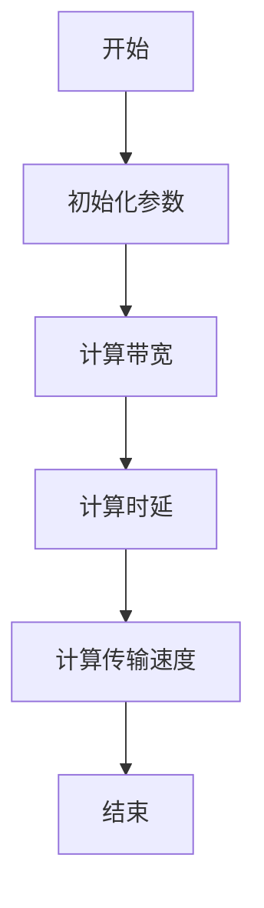
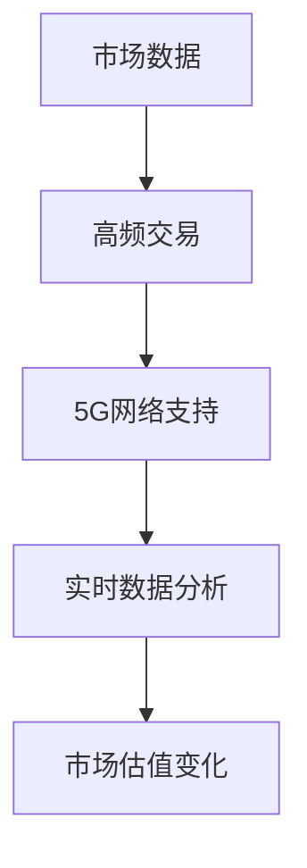
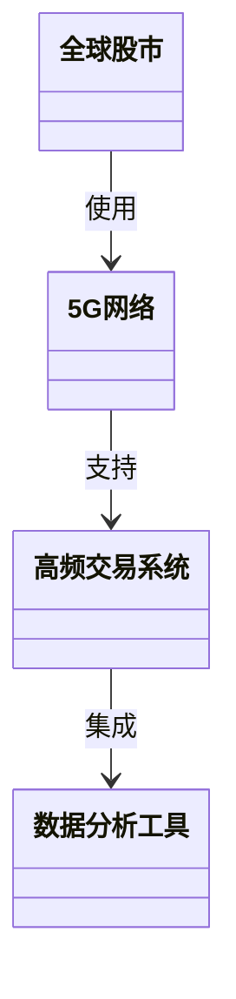
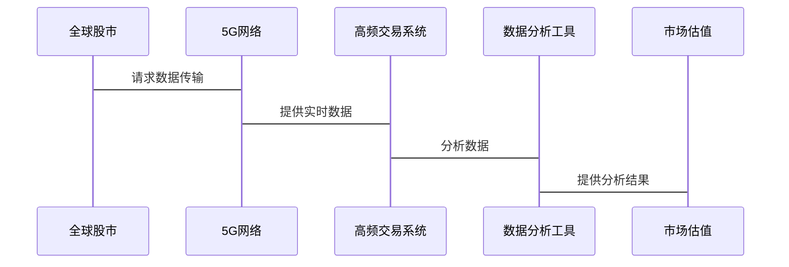

                 


# 全球股市估值与5G技术应用的关系

## 关键词：全球股市估值、5G技术、股市分析、技术应用、经济影响

## 摘要：本文探讨了5G技术如何影响全球股市估值，分析了5G技术与股市之间的相互作用机制，从技术特点、应用场景、系统架构等多个角度详细阐述了5G技术对股市估值的具体影响，并通过实际案例和数学模型进行深入分析。

---

# 第1章: 全球股市估值与5G技术应用的背景介绍

## 1.1 问题背景与问题描述

### 1.1.1 全球股市估值的基本概念

股市估值是衡量市场整体价值的重要指标，通常通过股票指数（如标普500、纳斯达克指数等）来反映。股市估值受到多种因素影响，包括宏观经济指标、企业盈利状况、市场情绪等。

### 1.1.2 5G技术的定义与特点

5G技术是第五代移动通信技术，具有高速度、低延迟、大带宽的特点。5G不仅提升了移动通信的速度，还为物联网、人工智能、大数据等技术提供了更强大的支持。

### 1.1.3 5G技术对全球经济与产业的影响

5G技术的应用将推动多个行业的发展，包括制造业、 healthcare、金融服务业等，从而对全球经济结构和产业布局产生深远影响。

---

## 1.2 问题解决与边界分析

### 1.2.1 5G技术如何影响股市估值

5G技术通过提升企业生产效率、优化业务流程，进而影响企业的盈利能力和市场竞争力，从而影响股市估值。

### 1.2.2 全球化视角下的股市与5G技术关系

从全球化视角看，5G技术的普及和应用将影响全球产业链的布局和整合，从而对全球股市产生深远影响。

### 1.2.3 问题的边界与外延分析

本文主要探讨5G技术对股市估值的直接影响，不涉及股市波动的其他因素，如宏观经济政策、地缘政治等。

---

## 1.3 核心概念与联系

### 1.3.1 核心概念原理

5G技术通过提升数据传输速度和处理能力，优化企业的运营效率，进而影响企业的盈利能力和市场估值。

### 1.3.2 核心概念属性特征对比表格

| **属性**       | **5G技术**               | **股市估值**              |
|-----------------|--------------------------|---------------------------|
| 核心作用         | 提升数据传输效率         | 反映市场整体价值          |
| 影响因素         | 网络速度、技术应用       | 企业盈利、市场情绪          |
| 发展趋势         | 高速化、智能化           | 数据化、全球化              |

### 1.3.3 ER实体关系图架构（Mermaid流程图）

```mermaid
er
  actor 全球股市
  actor 5G技术
  actor 经济影响
  actor 市场估值
  全球股市 --> 5G技术: 受影响
  5G技术 --> 经济影响: 产生
  经济影响 --> 市场估值: 影响
```

---

# 第2章: 5G技术对股市估值的影响机制

## 2.1 5G技术的核心原理

### 2.1.1 5G网络的技术特点

5G网络具有高速度、低延迟、大带宽的特点，能够支持大规模的物联网连接和实时数据传输。

### 2.1.2 5G技术的数学模型与公式

5G网络的传输速度可以通过以下公式计算：

$$
\text{传输速度} = \frac{\text{带宽}}{\text{时延}}
$$

### 2.1.3 5G技术的算法原理（Mermaid流程图）



### 2.1.4 算法实现的Python源代码

```python
def calculate_5g_speed(bandwidth, delay):
    return bandwidth / delay

bandwidth = 1000  # 假设带宽为1000 MHz
delay = 0.001      # 假设时延为0.001秒
speed = calculate_5g_speed(bandwidth, delay)
print(f"5G传输速度为: {speed} Gbps")
```

---

## 2.2 5G技术对股市的影响路径

### 2.2.1 5G技术对企业盈利的影响

5G技术可以提高企业的运营效率，降低运营成本，从而提高企业的盈利能力，进而影响股市估值。

### 2.2.2 5G技术对市场流动性的潜在影响

5G技术通过提高数据传输速度，使得高频交易更加高效，从而可能影响市场的流动性。

### 2.2.3 5G技术对投资者行为的影响

5G技术提供了更实时的市场数据和分析工具，投资者可以更快地做出决策，从而影响市场的交易行为。

---

## 2.3 算法原理与数学模型

### 2.3.1 算法原理的Mermaid流程图



### 2.3.2 数学模型的详细讲解与举例说明

假设某企业的盈利增长率为G，5G技术的应用可以将G提升到G+ΔG，其中ΔG是由于5G技术应用带来的增长提升。股市估值可以通过以下公式计算：

$$
\text{股市估值} = \text{企业盈利} \times (1 + G)
$$

---

# 第3章: 5G技术在股市中的应用场景

## 3.1 5G技术在金融领域的应用场景

### 3.1.1 高频交易与5G技术的结合

5G技术的高速度和低延迟使得高频交易更加高效，能够捕捉市场中的微小波动。

### 3.1.2 5G技术在金融数据传输中的应用

5G技术可以实现实时数据传输，使得金融数据的处理更加迅速。

### 3.1.3 5G技术在智能投顾中的作用

5G技术支持智能投顾系统，通过实时数据分析为投资者提供个性化投资建议。

---

## 3.2 5G技术对股市估值的具体影响

### 3.2.1 5G技术对企业估值的影响

5G技术的应用可以提升企业的竞争力，从而提高企业的市场估值。

### 3.2.2 5G技术对市场情绪的影响

5G技术提供了更多的市场数据和分析工具，可能影响投资者的市场情绪，从而影响股市估值。

### 3.2.3 5G技术对市场结构的影响

5G技术的应用可能改变市场的结构，例如推动更多企业采用5G技术，从而影响整体市场估值。

---

## 3.3 系统分析与架构设计方案

### 3.3.1 问题场景介绍

假设某证券公司希望利用5G技术提升其高频交易和数据分析能力，从而提高其市场竞争力。

### 3.3.2 系统功能设计（Mermaid类图）



### 3.3.3 系统架构设计（Mermaid架构图）

```mermaid
container 全球股市
    container 5G网络
        component 高频交易系统
        component 数据分析工具
    container 市场估值
        component 企业估值
        component 市场情绪
```

### 3.3.4 系统接口设计与交互（Mermaid序列图）



---

# 第4章: 5G技术对全球经济与股市的长期影响

## 4.1 5G技术的经济影响分析

### 4.1.1 5G技术对全球经济的推动作用

5G技术将推动多个行业的发展，如物联网、人工智能、云计算等，从而促进全球经济的增长。

### 4.1.2 5G技术对产业链的重构影响

5G技术的应用可能改变产业链的结构，推动企业之间的合作和竞争格局的变化。

### 4.1.3 5G技术对就业市场的潜在影响

5G技术的应用可能创造新的就业机会，同时也可能取代部分传统工作岗位。

---

## 4.2 5G技术对股市估值的长期影响

### 4.2.1 5G技术对股市结构的长期影响

5G技术的应用可能改变股市的结构，例如推动更多科技企业的上市，从而影响股市的整体估值。

### 4.2.2 5G技术对市场参与者的长期影响

5G技术的应用将使得更多的机构投资者和个人投资者能够参与高频交易，从而影响市场的流动性。

### 4.2.3 5G技术对市场波动性的长期影响

5G技术的应用可能增加市场的波动性，因为高频交易和实时数据分析可能导致市场的短期波动加剧。

---

## 4.3 项目实战与案例分析

### 4.3.1 环境安装与系统核心实现

假设我们开发一个基于5G技术的高频交易系统，首先需要安装5G网络设备，然后开发交易算法。

### 4.3.2 代码应用解读与分析

```python
def高频交易算法(市场数据):
    计算价格走势
    判断买卖时机
    执行交易
    return 交易结果

市场数据 = 获取实时数据()
结果 = 高频交易算法(市场数据)
打印结果
```

### 4.3.3 实际案例分析与详细讲解

以某家采用5G技术的企业为例，分析其股价在5G技术应用前后的变化，从而验证5G技术对股市估值的影响。

---

# 第5章: 5G技术与股市估值的最佳实践

## 5.1 最佳实践与小结

### 5.1.1 关键经验总结

5G技术的应用将对股市估值产生深远影响，企业和投资者需要积极适应这种变化。

### 5.1.2 未来研究方向

未来可以进一步研究5G技术对不同行业股市估值的具体影响，以及如何利用5G技术优化投资策略。

### 5.1.3 读者思考与实践建议

读者可以结合实际案例，分析5G技术对不同企业的具体影响，从而更好地理解5G技术与股市估值的关系。

---

## 5.2 注意事项与拓展阅读

### 5.2.1 实践中的注意事项

在实际应用中，需要注意5G技术的成本和实施难度，避免盲目跟风。

### 5.2.2 拓展阅读推荐

推荐阅读关于5G技术的书籍和相关研究报告，以获取更深入的理解。

### 5.2.3 未来趋势与挑战

未来，随着5G技术的普及，股市估值的波动性可能增加，投资者需要更加谨慎。

---

# 第6章: 数学模型与公式详解

## 6.1 数学模型的详细讲解

### 6.1.1 数学模型的构建过程

股市估值与5G技术应用的关系可以通过数学模型进行建模和分析，例如通过回归分析方法，将5G技术应用指标作为自变量，股市估值作为因变量进行分析。

### 6.1.2 公式的推导与验证

假设我们建立一个简单的线性回归模型：

$$
\text{股市估值} = \beta_0 + \beta_1 \times \text{5G技术应用指数} + \epsilon
$$

其中，$\beta_0$ 是截距，$\beta_1$ 是斜率，$\epsilon$ 是误差项。

### 6.1.3 数学模型的实际应用案例

通过收集某段时间内5G技术应用指数和对应的股市估值数据，进行回归分析，验证模型的准确性。

---

## 6.2 数学模型的代码实现

### 6.2.1 数据获取与处理

```python
import pandas as pd
import numpy as np
import statsmodels.api as sm

data = pd.read_csv('stock_data.csv')
X = data[['5G应用指数']]
y = data['股市估值']
```

### 6.2.2 模型构建与验证

```python
model = sm.OLS(y, sm.add_constant(X))
results = model.fit()
print(results.summary())
```

---

### 总结

本文通过详细的分析和实际案例，探讨了5G技术对全球股市估值的影响，从技术原理、应用场景、系统架构等多个角度进行了深入分析。未来的研究可以进一步结合具体行业和市场环境，探索5G技术对股市估值的更深层次影响。

