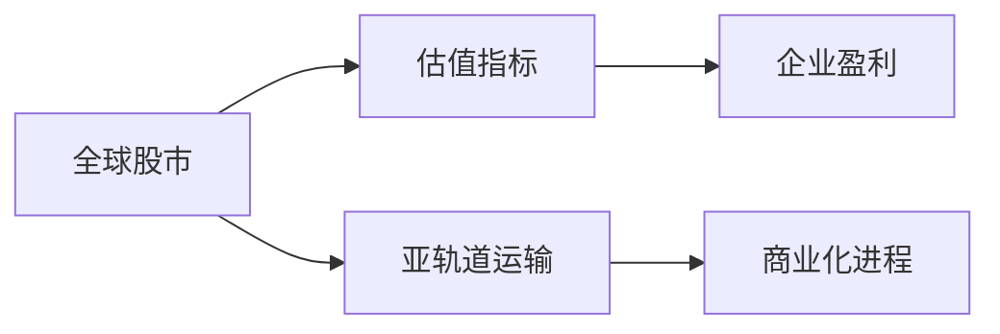
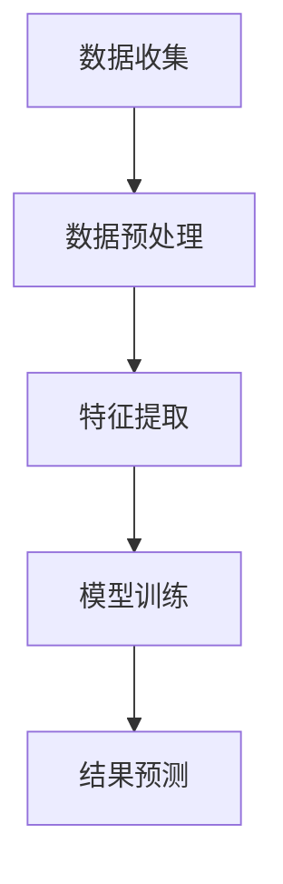

                 


# 全球股市估值与亚轨道快速运输商业化的关系

> 关键词：全球股市估值，亚轨道运输，商业化，回归分析，系统架构

> 摘要：本文探讨了全球股市估值与亚轨道快速运输商业化之间的关系，分析了股市估值的关键因素，亚轨道运输的技术特点及其商业化模式，并构建了一个数学模型，通过算法和系统架构设计展示了如何量化两者之间的联系。

---

## 第一部分: 背景介绍与核心概念

### 第1章: 背景介绍与核心概念

#### 1.1 问题背景
全球股市估值受多种因素影响，包括经济指标、政策变化和技术进步。亚轨道运输作为新兴技术，具有高速和高效的特点，可能对经济和股市产生显著影响。研究两者的关系有助于投资者和企业制定更有效的策略。

#### 1.2 核心概念与定义
- **股市估值**：衡量企业市场价值的标准，反映投资者对公司的信心。
- **亚轨道运输**：利用太空技术实现快速运输的新兴领域，涉及高技术门槛和高投资。

#### 1.3 研究意义
探讨亚轨道运输的商业化如何影响股市估值，为投资者提供新的视角，帮助企业优化战略。

### 第2章: 核心概念与联系

#### 2.1 股市估值的核心要素
- **企业盈利**：直接影响股市估值的核心因素。
- **市场情绪**：投资者情绪波动影响股市的短期走势。
- **宏观经济指标**：如GDP、利率等影响整体市场表现。

#### 2.2 亚轨道运输的商业化模式
- **技术开发**：依赖先进的太空技术。
- **成本控制**：高投入和运营成本影响商业化进程。
- **市场需求**：依赖于客户对快速运输的需求。

#### 2.3 ER实体关系图


---

## 第二部分: 算法原理讲解

### 第3章: 算法原理

#### 3.1 算法流程


#### 3.2 算法实现
```python
import pandas as pd
from sklearn.linear_model import LinearRegression

# 数据预处理
data = pd.read_csv('data.csv')
X = data[['GDP', 'tech_investment']]
y = data['market_value']

# 模型训练
model = LinearRegression()
model.fit(X, y)

# 预测
predictions = model.predict(X)
```

---

## 第三部分: 数学模型与公式

### 第4章: 数学模型

#### 4.1 股市估值模型
$$ market\_value = \beta_0 + \beta_1 \times GDP + \beta_2 \times tech\_investment + \epsilon $$

#### 4.2 亚轨道运输商业化模型
$$ revenue = \alpha_0 + \alpha_1 \times capacity + \alpha_2 \times cost\_efficiency + \delta $$

---

## 第四部分: 系统分析与架构设计

### 第5章: 系统架构设计

#### 5.1 问题场景介绍
- **数据来源**：收集全球股市数据和亚轨道运输项目数据。
- **模型应用场景**：预测股市估值变化，评估商业化影响。

#### 5.2 系统架构设计


---

## 第五部分: 项目实战与案例分析

### 第6章: 项目实战

#### 6.1 环境安装
安装所需的Python库，如Pandas、Scikit-learn。

#### 6.2 核心实现
```python
import pandas as pd
from sklearn.linear_model import LinearRegression
import matplotlib.pyplot as plt

# 数据加载
data = pd.read_csv('data.csv')

# 特征选择
X = data[['GDP', 'tech_investment']]
y = data['market_value']

# 模型训练
model = LinearRegression()
model.fit(X, y)

# 预测与可视化
predictions = model.predict(X)
plt.scatter(y, predictions)
plt.xlabel('Actual')
plt.ylabel('Predicted')
plt.show()
```

#### 6.3 案例分析
分析某地区的股市数据，结合亚轨道运输的商业化进程，展示模型的应用和结果。

---

## 第六部分: 总结与展望

### 第7章: 总结与小结

#### 7.1 总结
- 股市估值受宏观经济和技术进步影响。
- 亚轨道运输商业化对股市有显著影响。
- 构建数学模型有助于量化两者关系。

#### 7.2 注意事项
- 数据质量和模型假设影响预测准确性。
- 结合实际情况调整模型参数。

#### 7.3 拓展阅读
推荐相关领域的书籍和论文，如《金融科技与投资分析》、《太空运输经济分析》。

---

通过以上分析，我们详细探讨了全球股市估值与亚轨道快速运输商业化的关系，从背景介绍、算法原理到系统架构设计，再到项目实战，为读者提供了全面的理解和应用指导。

