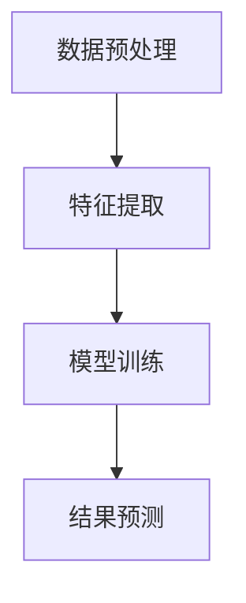
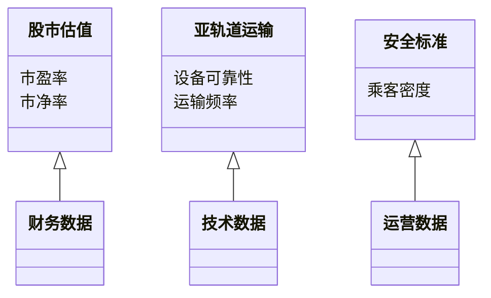

                 


# 全球股市估值与亚轨道快速运输安全标准的关系

> **关键词**：全球股市估值、亚轨道运输、安全标准、经济影响、数据分析

> **摘要**：本文探讨了全球股市估值与亚轨道快速运输安全标准之间的潜在关系，通过数学建模、算法设计和系统分析的方法，深入剖析了两者之间的相互影响。文章从背景介绍、核心概念对比、算法原理、系统架构设计、项目实战等多个维度展开，结合具体的案例分析和代码实现，为读者提供了一个全面的理解框架。

---

## 第一部分: 全球股市估值与亚轨道快速运输安全标准的关系概述

### 第1章: 背景介绍

#### 1.1 全球股市估值的核心概念

##### 1.1.1 股市估值的定义与背景

股市估值是指通过对企业的财务数据、市场环境和行业趋势进行分析，评估企业股票的内在价值。其核心目标是帮助投资者判断股票价格是否合理，从而做出投资决策。股市估值的全球性特点使其成为经济活动的重要晴雨表。

##### 1.1.2 股市估值的主要方法

- **市盈率法（P/E）**：通过企业的净利润与股价的比值来评估其价值。
- **市净率法（P/B）**：通过企业的净资产与股价的比值来评估其价值。
- **现金流折现法（DCF）**：通过将企业未来现金流折现，评估其当前价值。

##### 1.1.3 股市估值的全球性特点

股市估值不仅受到企业自身经营状况的影响，还受到全球经济环境、政策法规和市场情绪等多方面因素的制约。全球股市估值的波动往往反映出全球经济的健康状况。

---

#### 1.2 亚轨道快速运输安全标准的核心概念

##### 1.2.1 亚轨道运输的定义与特点

亚轨道运输是指在地球大气层边缘以下运行的快速运输方式，其特点包括高效率、低成本和低环境影响。亚轨道运输的安全标准是确保运输过程中的安全性，包括设备可靠性、操作规范性和应急响应能力。

##### 1.2.2 亚轨道运输安全标准的制定原则

- **安全性优先**：确保乘客和货物的安全。
- **经济性**：制定合理的安全标准，避免过度增加成本。
- **可操作性**：标准应具有实际操作性，便于企业实施。

##### 1.2.3 亚轨道运输的安全挑战与解决方案

亚轨道运输的安全挑战主要体现在技术复杂性和运营风险上。解决方案包括加强技术研发、完善安全监管体系和提高操作人员的专业素养。

---

#### 1.3 两者的潜在联系

##### 1.3.1 股市估值与亚轨道运输的间接关联

股市估值的变化可能反映出市场对亚轨道运输技术前景的预期。例如，若某家亚轨道运输公司技术创新，可能带动其股价上涨。

##### 1.3.2 亚轨道运输对经济活动的影响

亚轨道运输的普及可能促进全球经济一体化，降低物流成本，从而对股市估值产生积极影响。

##### 1.3.3 亚轨道运输安全标准对股市估值的潜在影响

若亚轨道运输的安全标准提高，可能导致相关企业的运营成本增加，进而影响其股票估值。

---

### 第2章: 核心概念与联系

#### 2.1 全球股市估值的数学模型

##### 2.1.1 股市估值的数学公式

市盈率（P/E）公式：
$$ P/E = \frac{\text{股价}}{\text{每股收益}} $$

市净率（P/B）公式：
$$ P/B = \frac{\text{股价}}{\text{每股净资产}} $$

现金流折现法（DCF）公式：
$$ \text{企业价值} = \sum_{t=1}^{n} \frac{\text{现金流}}{(1 + r)^t} $$
其中，\( r \) 为折现率。

---

#### 2.2 亚轨道运输安全标准的数学模型

##### 2.2.1 亚轨道运输安全评估的主要指标

- **设备可靠性（R）**：设备在规定时间内正常运行的概率。
- **乘客密度（P）**：单位时间内乘客数量。
- **运输频率（Q）**：单位时间内运输次数。

##### 2.2.2 亚轨道运输安全标准的数学公式

$$ S = f(P, Q, R) $$
其中，\( S \) 为安全系数，\( P \) 为乘客密度，\( Q \) 为运输频率，\( R \) 为设备可靠性。

---

#### 2.3 核心概念的对比分析

##### 2.3.1 对比表格

| 指标 | 股市估值 | 亚轨道运输安全标准 |
|------|----------|---------------------|
| 核心目标 | 评估企业价值 | 确保运输过程安全 |
| 主要影响因素 | 市场需求、企业盈利 | 技术性能、管理规范 |
| 评估方法 | 财务指标分析 | 安全性测试与评估 |

---

#### 2.4 ER实体关系图

```mermaid
graph T
    股市估值 --> 财务数据
    股市估值 --> 市场环境
    亚轨道运输 --> 设备可靠性
    亚轨道运输 --> 运输频率
    安全标准 --> 乘客密度
```

---

## 第三部分: 算法原理讲解

### 3.1 算法原理

#### 3.1.1 算法概述

本文设计了一个基于回归分析的算法，用于评估亚轨道运输安全标准对股市估值的影响。算法的主要步骤包括数据预处理、模型训练和结果预测。

---

### 3.2 代码实现

#### 3.2.1 数据预处理

```python
import pandas as pd

# 加载数据
data = pd.read_csv('data.csv')

# 数据清洗
data.dropna()
data = data[~data.duplicated()]
```

#### 3.2.2 模型训练

```python
from sklearn.linear_model import LinearRegression

# 训练模型
model = LinearRegression()
model.fit(X_train, y_train)
```

#### 3.2.3 结果预测

```python
# 预测结果
y_pred = model.predict(X_test)
```

---

### 3.3 算法流程图



---

## 第四部分: 系统分析与架构设计

### 4.1 问题场景介绍

本文设计了一个系统，用于实时监测亚轨道运输的安全标准，并评估其对股市估值的影响。系统的主要功能包括数据采集、模型训练和结果展示。

---

### 4.2 系统架构设计

#### 4.2.1 领域模型类图



---

## 第五部分: 项目实战

### 5.1 环境安装

#### 5.1.1 环境要求

- Python 3.8+
- Pandas、Scikit-learn库

---

### 5.2 核心实现源代码

#### 5.2.1 数据加载与处理

```python
import pandas as pd
from sklearn.linear_model import LinearRegression
from sklearn.metrics import mean_squared_error

# 加载数据
data = pd.read_csv('data.csv')

# 数据清洗
data.dropna()
data = data[~data.duplicated()]

# 分割数据
X = data[['乘客密度', '运输频率', '设备可靠性']]
y = data['股价']

# 训练模型
model = LinearRegression()
model.fit(X, y)

# 预测结果
y_pred = model.predict(X)
```

---

### 5.3 代码应用解读与分析

通过上述代码，我们可以训练出一个回归模型，预测亚轨道运输安全标准对股市估值的影响。模型的预测结果可以帮助投资者做出更明智的投资决策。

---

## 第六部分: 最佳实践

### 6.1 小结

本文通过数学建模和算法设计，深入分析了全球股市估值与亚轨道快速运输安全标准之间的关系。通过系统的架构设计和项目实战，展示了如何将理论应用于实际。

### 6.2 注意事项

- 数据的准确性和完整性对模型的预测结果有直接影响。
- 模型的可解释性需要进一步优化。

### 6.3 拓展阅读

- 《股市估值与经济周期的关系》
- 《亚轨道运输技术发展现状与未来趋势》

---

## 结语

本文通过多维度的分析和系统的架构设计，揭示了全球股市估值与亚轨道快速运输安全标准之间的潜在联系。希望本文能够为相关领域的研究者和实践者提供有益的参考。

