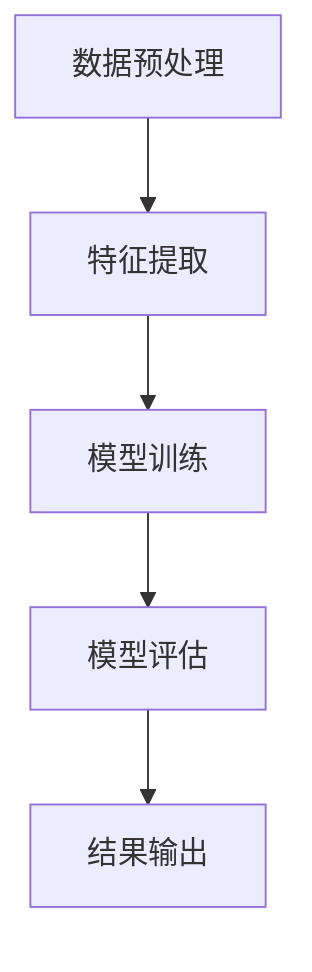

                 


# 全球股市估值与人工智能伦理的关联

## 关键词
全球股市估值，人工智能伦理，数据分析，算法设计，系统架构，风险管理，伦理框架

## 摘要
本文探讨了全球股市估值与人工智能伦理之间的关联，分析了人工智能技术在股市估值中的应用及其带来的伦理挑战。文章从背景介绍、核心概念、算法原理、系统架构、项目实战等多维度展开，深入剖析了如何在优化股市估值的同时，确保人工智能应用的伦理合规性。通过实际案例分析和最佳实践分享，为读者提供了全面的技术与伦理视角。

---

## 第一部分：引言

### 第1章：主题背景与研究意义

#### 1.1 问题背景
- **1.1.1 全球股市估值的重要性**  
  股市估值是投资者评估企业价值的核心工具，决定了投资决策的成败。随着全球化进程的加速，股市的复杂性不断提高，传统的估值方法逐渐暴露出局限性。
  
- **1.1.2 人工智能在金融领域的应用现状**  
  人工智能技术（如机器学习、深度学习）正在改变金融行业的运作方式，尤其是在数据处理和预测分析方面表现突出。然而，人工智能的应用也带来了新的伦理挑战。

- **1.1.3 人工智能伦理问题的普遍性**  
  从算法偏见到数据隐私，人工智能的伦理问题日益成为公众关注的焦点。如何在技术创新与伦理合规之间找到平衡，是当前亟需解决的问题。

#### 1.2 问题描述
- **1.2.1 全球股市估值的核心挑战**  
  股市估值需要考虑宏观经济、行业动态和公司基本面等多种因素，传统的估值方法难以应对数据量大、实时性强的需求。
  
- **1.2.2 人工智能在估值中的作用**  
  人工智能可以通过大数据分析和预测模型，提高估值的准确性和效率。然而，算法的“黑箱”特性也让其在决策过程中缺乏透明度。

- **1.2.3 伦理问题对人工智能应用的影响**  
  人工智能的算法偏见可能导致不公平的估值结果，同时数据隐私问题也可能引发法律风险。

#### 1.3 问题解决
- **1.3.1 通过人工智能优化股市估值**  
  引入机器学习算法，利用历史数据和实时信息，构建更精准的估值模型。

- **1.3.2 通过伦理框架规范人工智能应用**  
  制定伦理准则，确保人工智能的应用符合公平、透明和隐私保护的原则。

#### 1.4 边界与外延
- **1.4.1 全球股市估值的边界**  
  估值模型的适用范围和数据来源需要明确界定，避免因数据偏差导致的错误结论。

- **1.4.2 人工智能伦理的适用范围**  
  伦理框架需要覆盖算法设计、数据使用和结果解释等全过程，确保技术应用的合规性。

- **1.4.3 二者的相互作用与影响**  
  人工智能技术的进步推动了估值方法的创新，而伦理问题的解决则为技术创新提供了方向。

#### 1.5 概念结构与核心要素组成
- **1.5.1 全球股市估值的核心要素**  
  包括宏观经济指标、行业数据、公司基本面和市场情绪等。

- **1.5.2 人工智能伦理的关键要素**  
  包括算法透明度、数据隐私、结果公平性和责任归属等。

- **1.5.3 二者的关联机制**  
  通过数据共享、算法优化和结果解释，实现技术与伦理的有机结合。

---

## 第二部分：核心概念与联系

### 第2章：全球股市估值的核心原理

#### 2.1 全球股市估值的定义与特点
- **2.1.1 估值的定义**  
  股市估值是指通过对企业财务数据和市场信息的分析，估算其内在价值的过程。

- **2.1.2 估值的关键特点**  
  - 数据驱动性：依赖历史数据和实时信息。
  - 实时性：需要快速响应市场变化。
  - 不确定性：受宏观经济和行业动态的影响较大。

#### 2.2 估值的核心算法与模型
- **2.2.1 常用估值模型**  
  - 市盈率（PE）模型：通过市盈率和净利润预测企业价值。
  - 现金流折现模型（DCF）：通过现金流的现值估算企业价值。

- **2.2.2 人工智能在估值中的应用**  
  - 使用机器学习算法（如随机森林、神经网络）预测股价走势。
  - 利用自然语言处理技术分析新闻和社交媒体情绪。

#### 2.3 估值的关键影响因素
- **2.3.1 宏观经济因素**  
  利率、通货膨胀、政策变化等宏观经济指标对股市估值有直接影响。

- **2.3.2 行业因素**  
  行业竞争格局、政策法规和技术创新对企业的估值有重要影响。

- **2.3.3 公司基本面因素**  
  收入、利润、资产负债表等公司财务数据是估值的核心依据。

---

### 第3章：人工智能伦理的核心原理

#### 3.1 人工智能伦理的定义与特点
- **3.1.1 伦理的定义**  
  伦理是指行为的道德准则和规范，确保技术应用的公平性和透明性。

- **3.1.2 人工智能伦理的特点**  
  - 技术性：与算法设计和数据使用密切相关。
  - 社会性：涉及公众利益和法律合规。
  - 动态性：随着技术进步和法规变化而不断更新。

#### 3.2 人工智能伦理的核心原则
- **3.2.1 透明性**  
  算法的决策过程需要可解释，避免“黑箱”操作。

- **3.2.2 公平性**  
  算法不应存在偏见，确保所有参与者公平受益。

- **3.2.3 隐私保护**  
  数据的收集和使用必须符合隐私保护法规。

---

## 第三部分：算法原理讲解

### 第4章：人工智能在股市估值中的算法实现

#### 4.1 算法原理
- **4.1.1 算法流程**  
  - 数据预处理：清洗和标准化数据。
  - 特征提取：选择影响估值的关键特征。
  - 模型训练：使用机器学习算法训练估值模型。
  - 模型评估：通过回测和验证确保模型的准确性。

#### 4.2 算法流程图


#### 4.3 算法实现
```python
import pandas as pd
from sklearn.ensemble import RandomForestRegressor
from sklearn.metrics import mean_absolute_error

# 数据预处理
data = pd.read_csv('stock_data.csv')
data = data.dropna()

# 特征提取
features = data.drop('target', axis=1)
target = data['target']

# 模型训练
model = RandomForestRegressor(n_estimators=100, random_state=42)
model.fit(features, target)

# 模型评估
predictions = model.predict(features)
mae = mean_absolute_error(target, predictions)
print(f"平均绝对误差: {mae}")
```

#### 4.4 数学模型与公式
- **4.4.1 回归分析公式**  
  $$ y = \beta_0 + \beta_1x_1 + \beta_2x_2 + \ldots + \beta_nx_n + \epsilon $$
  其中，$y$ 是目标变量，$x_i$ 是自变量，$\beta_i$ 是回归系数，$\epsilon$ 是误差项。

- **4.4.2 机器学习模型公式**  
  使用随机森林算法进行预测，模型通过多棵决策树的集成结果进行投票或平均。

---

## 第四部分：系统分析与架构设计方案

### 第5章：系统架构设计

#### 5.1 项目背景
- 系统目标：构建一个基于人工智能的全球股市估值平台，实现高效、准确的估值服务。
- 项目需求：支持多市场数据接入、实时估值计算和结果可视化。

#### 5.2 系统功能设计
- **领域模型**  
  ```mermaid
  classDiagram
  class 股市数据 {
    市场指数
    公司基本面
    市场情绪
  }
  class 估值模型 {
    特征提取
    模型训练
    结果输出
  }
  class 用户界面 {
    数据输入
    结果展示
  }
  股市数据 --> 估值模型
  估值模型 --> 用户界面
  ```

- **系统架构**  
  ```mermaid
  architecture
  股市数据处理模块 --> 数据存储模块 --> 估值模型模块 --> 结果展示模块
  ```

- **系统接口设计**  
  - 数据接口：提供API用于数据接入和传输。
  - 模型接口：提供API用于模型训练和预测。

- **系统交互流程**  
  ```mermaid
  sequenceDiagram
  用户 --> 数据接口: 请求数据
  数据接口 --> 数据存储模块: 存储数据
  用户 --> 模型接口: 请求估值
  模型接口 --> 估值模型模块: 训练模型
  估值模型模块 --> 结果展示模块: 输出结果
  用户 <-- 结果展示模块: 显示结果
  ```

---

## 第五部分：项目实战

### 第6章：环境安装与核心代码实现

#### 6.1 环境安装
- 安装Python和必要的库：`pandas`, `scikit-learn`, `matplotlib`.
- 数据集准备：从公开数据源获取全球股市数据。

#### 6.2 核心代码实现
```python
import pandas as pd
from sklearn.ensemble import RandomForestRegressor
from sklearn.metrics import mean_absolute_error

# 数据预处理
data = pd.read_csv('global_stock_data.csv')
data = data.dropna()

# 特征提取
features = data.drop('target', axis=1)
target = data['target']

# 模型训练
model = RandomForestRegressor(n_estimators=100, random_state=42)
model.fit(features, target)

# 模型评估
predictions = model.predict(features)
mae = mean_absolute_error(target, predictions)
print(f"平均绝对误差: {mae}")
```

#### 6.3 代码解读与分析
- 数据预处理：清洗数据，去除缺失值。
- 特征提取：选择影响估值的关键特征。
- 模型训练：使用随机森林算法训练估值模型。
- 模型评估：通过平均绝对误差评估模型的准确性。

#### 6.4 实际案例分析
- 数据来源：全球主要股市的实时数据和历史数据。
- 案例分析：通过具体案例展示模型的应用效果和结果解读。

---

## 第六部分：伦理挑战与解决方案

### 第7章：人工智能伦理的挑战与解决方案

#### 7.1 伦理挑战
- **算法偏见**：不同市场的数据差异可能导致估值模型的偏见。
- **数据隐私**：跨市场数据的使用可能引发隐私问题。
- **透明性不足**：复杂的算法让决策过程难以解释。

#### 7.2 解决方案
- **算法优化**：引入可解释性机器学习技术，提高算法的透明度。
- **数据治理**：建立数据隐私保护机制，确保数据使用的合规性。
- **伦理审查**：在模型上线前进行伦理审查，确保符合相关法规。

---

## 第七部分：结论与展望

### 第8章：结论与未来展望

#### 8.1 研究小结
- 本文探讨了全球股市估值与人工智能伦理的关联，分析了人工智能技术在股市估值中的应用及其带来的伦理挑战。
- 通过算法实现和系统设计，展示了如何在优化估值的同时，确保人工智能应用的伦理合规性。

#### 8.2 未来展望
- 随着人工智能技术的不断发展，股市估值的精度和效率将进一步提升。
- 未来的研究需要更加关注算法的透明性和数据的隐私保护，推动技术与伦理的协调发展。

---

## 第八部分：最佳实践与注意事项

### 第9章：最佳实践

#### 9.1 小结
- 在实际应用中，需结合具体场景选择合适的算法和模型。
- 数据的清洗和特征的选择对模型的性能有重要影响。

#### 9.2 注意事项
- 算法的透明性和可解释性是确保伦理合规的关键。
- 数据隐私保护是跨市场应用中不可忽视的问题。

#### 9.3 拓展阅读
- 建议读者进一步阅读相关领域的经典文献，如《机器学习实战》和《人工智能伦理指南》。

---

## 结语
通过本文的分析，读者可以全面了解全球股市估值与人工智能伦理的关联，掌握人工智能技术在金融领域的应用方法，同时也能意识到伦理问题的重要性，并找到解决之道。希望本文能为相关领域的研究和实践提供有价值的参考。

