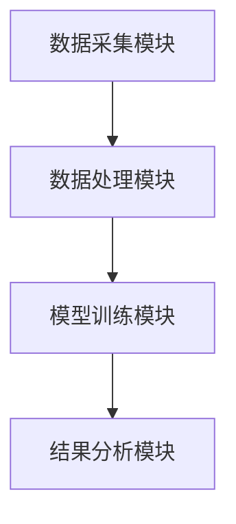
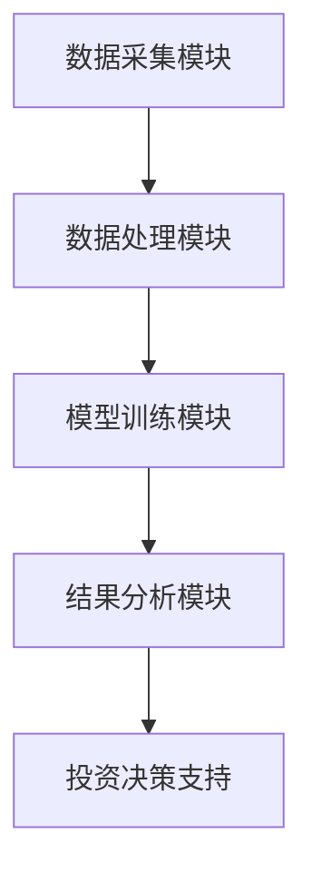
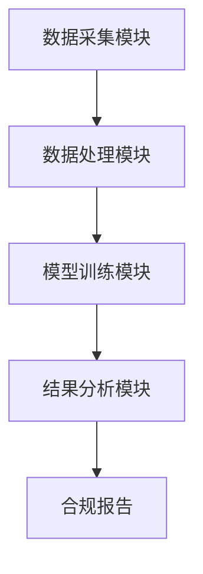

                 


# 全球股市估值与人工智能在法律合规中的应用

## 关键词：
- 全球股市估值
- 人工智能
- 法律合规
- 量化投资
- 自然语言处理
- 机器学习
- 深度学习

## 摘要：
本文旨在探讨人工智能在全球股市估值与法律合规领域的应用，分析其技术原理和实际应用场景。通过结合股市估值的基本概念、人工智能的核心算法以及法律合规的文本分析，为读者提供全面的视角，深入解读AI技术如何助力金融与法律领域的创新。

---

# 第一部分: 全球股市估值与人工智能的结合

## 第1章: 全球股市估值概述

### 1.1 股市估值的核心概念

#### 1.1.1 股票估值的基本定义
股票估值是指通过分析公司财务数据、市场环境和行业趋势，确定其内在价值和市场价值的过程。股票的内在价值是公司未来现金流的现值，而市场价值则是投资者对股票的定价。

#### 1.1.2 市场价值与内在价值的区分
- 市场价值：反映市场参与者对股票的定价，受市场情绪、宏观经济环境等外部因素影响。
- 内在价值：基于公司基本面的分析，反映公司的真实价值，是长期投资者关注的核心。

#### 1.1.3 股市估值的边界与外延
股市估值不仅包括对公司财务数据的分析，还涉及对其未来盈利能力的预测。外延则包括对宏观经济、行业趋势和市场情绪的综合考量。

### 1.2 股市估值的关键要素

#### 1.2.1 财务指标分析
- 市盈率（P/E）：股价与每股净利润的比率，反映市场对公司的估值。
- 市净率（P/B）：股价与每股净资产的比率，适用于评估资产密集型行业。
- 股息率：股息与股价的比率，反映股票的分红能力。

#### 1.2.2 市场情绪与投资者行为
市场情绪是影响股市估值的重要因素，投资者行为（如恐慌性抛售或贪婪性买入）会放大市场的波动。

#### 1.2.3 宏观经济环境的影响
宏观经济指标（如GDP增长率、利率、通货膨胀率）直接影响股市估值，尤其是系统性风险。

### 1.3 股市估值的常见方法

#### 1.3.1 市盈率法
$$ \text{市盈率} = \frac{\text{股价}}{\text{每股净利润}} $$

#### 1.3.2 市净率法
$$ \text{市净率} = \frac{\text{股价}}{\text{每股净资产}} $$

#### 1.3.3 现金流折现法
$$ \text{内在价值} = \sum_{t=1}^{n} \frac{\text{自由现金流}_t}{(1 + r)^t} $$

---

## 第2章: 人工智能在股市估值中的应用

### 2.1 人工智能与金融的结合

#### 2.1.1 AI在金融领域的核心应用
- 数据分析：处理海量金融数据，提取有用信息。
- 预测模型：基于历史数据预测股票价格和市场趋势。
- 自动交易：算法交易和高频交易的应用。

#### 2.1.2 AI在股市分析中的优势
- 高效性：快速处理和分析数据，提高决策效率。
- 精准性：通过机器学习算法，提高预测的准确性。
- 多维度分析：整合财务数据、市场情绪、宏观经济等多种因素。

#### 2.1.3 AI在股市估值中的潜在价值
- 提供数据驱动的估值模型，优化投资决策。
- 发现市场中的非线性关系，捕捉传统方法难以察觉的规律。

### 2.2 基于AI的股市估值模型

#### 2.2.1 机器学习模型在股市估值中的应用
- 监督学习：回归模型用于预测股票价格。
- 非监督学习：聚类分析用于识别市场中的相似股票。

#### 2.2.2 深度学习模型的优势
- CNN用于图像识别和文本分析。
- RNN用于时间序列分析，捕捉股票价格的波动趋势。

#### 2.2.3 混合模型的综合应用
将机器学习和深度学习模型结合，利用各自的优势，提高预测的准确性和稳定性。

---

## 第3章: 人工智能驱动的量化投资策略

### 3.1 量化投资的基本原理

#### 3.1.1 量化投资的定义与特点
- 量化投资：基于数学模型的投资方法，通过算法进行交易决策。
- 数据驱动：依赖大量的历史数据和实时数据。
- 系统化：建立完整的交易系统，减少人为干扰。

#### 3.1.2 数据驱动的投资决策
- 数据清洗：去除噪声数据，提取有效信息。
- 特征提取：从海量数据中提取有助于预测的特征。
- 模型构建：基于特征构建预测模型。

#### 3.1.3 量化模型的构建与优化
- 回归模型：用于预测股票价格。
- 分类模型：用于判断股票的涨跌趋势。
- 算法优化：通过网格搜索和随机搜索优化模型参数。

### 3.2 基于AI的量化策略实现

#### 3.2.1 数据清洗与特征提取
- 数据清洗：处理缺失值、异常值和重复值。
- 特征提取：使用PCA等降维方法提取主要特征。

#### 3.2.2 模型训练与参数调优
- 使用交叉验证优化模型参数。
- 模型评估：通过准确率、召回率和F1值评估模型性能。

#### 3.2.3 策略回测与风险控制
- 回测：验证量化策略的可行性。
- 风险控制：通过止盈止损和头寸控制降低投资风险。

---

## 第4章: 全球股市估值的系统架构设计

### 4.1 系统功能模块划分

#### 4.1.1 数据采集模块
- 数据源：包括股票价格、财务数据、市场情绪等。
- 采集方式：实时采集和批量采集。

#### 4.1.2 数据处理模块
- 数据清洗：处理缺失值和异常值。
- 特征提取：从数据中提取有助于预测的特征。

#### 4.1.3 模型训练模块
- 模型选择：选择合适的机器学习或深度学习模型。
- 参数调优：优化模型参数，提高预测精度。

#### 4.1.4 结果分析模块
- 预测结果分析：评估模型的预测效果。
- 投资决策支持：基于预测结果制定投资策略。

### 4.2 系统架构设计

#### 4.2.1 模块间关系的ER图


#### 4.2.2 系统架构的Mermaid流程图


#### 4.2.3 系统交互的序列图
```mermaid
sequenceDiagram
参与者：用户
参与者->数据采集模块：请求数据
数据采集模块->数据处理模块：传递数据
数据处理模块->模型训练模块：传递特征
模型训练模块->结果分析模块：传递预测结果
结果分析模块->用户：返回投资建议
```

---

# 第二部分: 人工智能在法律合规中的应用

## 第5章: 法律合规的核心概念

### 5.1 法律合规的基本定义
法律合规是指企业或个人在经营活动中遵守相关法律法规和行业规范。

### 5.2 法律合规的关键要素
- 合规风险：可能引发法律纠纷的风险点。
- 合规义务：企业必须遵守的法律法规和行业规范。
- 合规管理：对企业合规风险的识别、评估和控制。

### 5.3 法律合规的常见方法
- 法律文本分析：通过文本挖掘技术分析法律条文。
- 合规监控：实时监控企业经营行为，确保符合法律法规。

---

## 第6章: 人工智能在法律合规中的应用

### 6.1 自然语言处理在法律文本中的应用

#### 6.1.1 法律文本分析
- 文本分类：识别法律文本的类型（如合同、法规）。
- 信息抽取：提取关键信息（如合同条款、法律责任）。

#### 6.1.2 基于NLP的法律合规分析
- 合同审查：自动识别合同中的潜在法律风险。
- 法律咨询：基于NLP技术提供法律建议。

### 6.2 基于机器学习的法律合规监控

#### 6.2.1 合规监控系统
- 数据采集：收集企业经营数据。
- 数据分析：识别潜在的合规风险。
- 报告生成：生成合规报告，提出改进建议。

#### 6.2.2 合规风险评估
- 风险识别：识别可能引发法律纠纷的风险点。
- 风险评估：评估风险的影响程度和发生概率。

### 6.3 法律合规的案例分析

#### 6.3.1 企业合规管理案例
- 某公司通过AI技术优化合规管理，降低法律风险。

#### 6.3.2 个人合规管理案例
- 个体通过AI工具进行法律咨询，确保行为合法合规。

---

## 第7章: 人工智能在法律合规中的系统架构设计

### 7.1 系统功能模块划分

#### 7.1.1 数据采集模块
- 数据来源：企业经营数据、法律文本数据。
- 数据类型：结构化数据和非结构化数据。

#### 7.1.2 数据处理模块
- 数据清洗：处理缺失值和异常值。
- 特征提取：从文本中提取关键词和短语。

#### 7.1.3 模型训练模块
- 文本分类模型：用于识别法律文本的类型。
- 信息抽取模型：用于提取关键信息。

#### 7.1.4 结果分析模块
- 合规风险评估：识别潜在的合规风险。
- 合规报告生成：生成合规报告，提出改进建议。

### 7.2 系统架构设计

#### 7.2.1 模块间关系的ER图


#### 7.2.2 系统架构的Mermaid流程图


#### 7.2.3 系统交互的序列图
```mermaid
sequenceDiagram
参与者：用户
参与者->数据采集模块：请求数据
数据采集模块->数据处理模块：传递数据
数据处理模块->模型训练模块：传递特征
模型训练模块->结果分析模块：传递预测结果
结果分析模块->用户：返回合规报告
```

---

## 结语

人工智能在全球股市估值和法律合规中的应用前景广阔。通过结合机器学习、深度学习和自然语言处理等技术，可以提高金融和法律领域的效率和准确性。未来，随着技术的不断发展，AI在这些领域的应用将更加深入，推动行业的创新发展。

