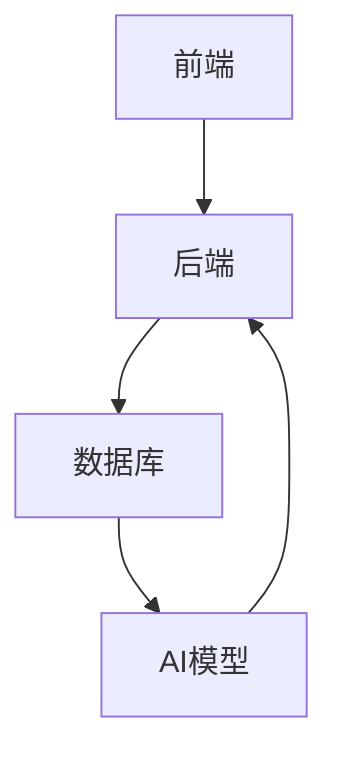
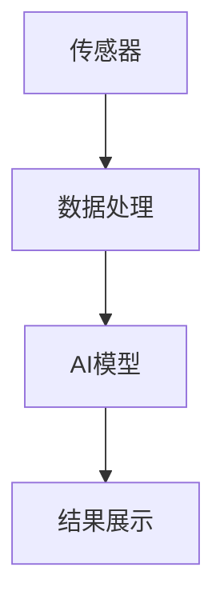

                 


# 全球股市估值与人工智能在环境保护中的应用

> 关键词：全球股市估值、人工智能、环境保护、机器学习、算法原理、系统架构

> 摘要：本文深入探讨了全球股市估值的传统方法及其局限性，结合人工智能技术在环境保护中的应用前景。通过分析人工智能的核心算法原理、系统架构设计以及实际项目案例，展示了如何利用AI技术提升股市估值的准确性和效率，同时推动环境保护领域的创新发展。文章内容涵盖背景介绍、算法实现、系统设计和项目实战，旨在为技术爱好者和行业从业者提供有价值的参考。

---

# 第一部分：全球股市估值的背景与方法

## 第1章：全球股市估值的背景与传统方法

### 1.1 全球股市估值的背景

#### 1.1.1 股市估值的核心概念
股市估值是指通过对上市公司的财务数据、市场环境和行业趋势等多方面因素的分析，对股票的内在价值进行评估的过程。传统的股市估值方法主要依赖财务指标（如市盈率、市净率）和宏观经济分析。

#### 1.1.2 传统股市估值方法的局限性
传统估值方法存在以下问题：
- 数据维度单一，难以捕捉市场波动的复杂性。
- 依赖人工经验，难以快速适应市场变化。
- 计算复杂，难以实现自动化和实时性。

#### 1.1.3 人工智能在股市估值中的潜力
AI技术可以通过以下方式提升股市估值：
- 处理海量数据，发现传统方法难以察觉的模式。
- 实现实时分析和预测，提高决策效率。
- 优化投资组合，降低风险。

### 1.2 环境保护的背景与传统方法

#### 1.2.1 环境保护的核心概念
环境保护是指通过技术手段和管理措施，减少人类活动对自然环境的破坏，保护生态平衡。

#### 1.2.2 传统环境保护方法的局限性
传统环境保护方法存在以下问题：
- 数据收集成本高，难以实现大规模监测。
- 分析手段单一，难以应对复杂的环境问题。
- 缺乏实时性和智能化。

#### 1.2.3 人工智能在环境保护中的应用前景
AI技术在环境保护中的应用前景广阔：
- 实现实时环境监测，快速识别污染源。
- 分析环境数据，预测环境变化趋势。
- 优化环保方案，提高治理效率。

---

# 第二部分：人工智能的基本原理与应用

## 第2章：人工智能的核心概念与算法原理

### 2.1 人工智能的基本原理

#### 2.1.1 机器学习的定义与分类
- 机器学习是一种通过数据训练模型，使其能够从数据中学习并做出预测的技术。
- 分类包括：监督学习、无监督学习、半监督学习和强化学习。

#### 2.1.2 深度学习的定义与特点
- 深度学习是一种通过多层神经网络模型，模拟人脑学习过程的技术。
- 特点包括：非线性特征提取、自动特征学习、计算能力要求高。

#### 2.1.3 人工智能在股市与环保中的应用
- 股市：预测股价波动、识别市场趋势。
- 环保：分析环境数据、优化治理方案。

### 2.2 人工智能在股市与环保中的应用

#### 2.2.1 股市数据分析中的AI应用
- 数据特征提取：通过NLP分析新闻和社交媒体数据。
- 模型训练：使用LSTM预测股价波动。

#### 2.2.2 环境数据处理中的AI应用
- 环境监测：通过图像识别技术分析卫星数据。
- 污染预测：使用机器学习模型预测空气质量。

---

# 第三部分：算法原理与实现

## 第3章：常用算法原理与实现

### 3.1 线性回归算法

#### 3.1.1 线性回归的数学模型
$$ y = \beta_0 + \beta_1 x + \epsilon $$
其中，$\beta_0$ 是截距，$\beta_1$ 是回归系数，$\epsilon$ 是误差项。

#### 3.1.2 算法实现的步骤
1. 数据预处理：标准化和去噪。
2. 模型训练：使用最小二乘法求解回归系数。
3. 模型评估：计算R²值和残差分析。

#### 3.1.3 示例代码与结果分析
```python
import numpy as np
from sklearn.linear_model import LinearRegression

# 示例数据
X = np.array([1, 2, 3, 4, 5]).reshape(-1, 1)
y = np.array([2, 4, 5, 4, 6])

# 模型训练
model = LinearRegression()
model.fit(X, y)

# 预测结果
print(model.predict(X))
```

### 3.2 随机森林算法

#### 3.2.1 随机森林的原理
随机森林是一种基于决策树的集成学习算法，通过随机采样数据和特征，构建多个决策树并进行投票或平均预测。

#### 3.2.2 算法实现的步骤
1. 数据预处理：特征选择和数据分割。
2. 模型训练：构建多棵决策树。
3. 模型评估：计算准确率和F1分数。

#### 3.2.3 示例代码与结果分析
```python
from sklearn.ensemble import RandomForestClassifier
from sklearn.datasets import make_classification

# 示例数据
X, y = make_classification(n_samples=100, n_features=4, n_classes=2)

# 模型训练
model = RandomForestClassifier()
model.fit(X, y)

# 预测结果
print(model.predict(X))
```

### 3.3 神经网络算法

#### 3.3.1 神经网络的基本结构
神经网络由输入层、隐藏层和输出层组成，通过激活函数和权重调整实现特征学习。

#### 3.3.2 算法实现的步骤
1. 数据预处理：归一化和数据分割。
2. 模型训练：使用反向传播算法优化权重。
3. 模型评估：计算准确率和混淆矩阵。

#### 3.3.3 示例代码与结果分析
```python
import keras
from keras.layers import Dense, Input
from keras.models import Model

# 示例数据
X = np.random.random((100, 4))
y = np.random.random((100, 1))

# 模型定义
input_tensor = Input(shape=(4,))
hidden_layer = Dense(8, activation='relu')(input_tensor)
output_layer = Dense(1, activation='sigmoid')(hidden_layer)
model = Model(inputs=input_tensor, outputs=output_layer)

# 模型训练
model.compile(optimizer='adam', loss='binary_crossentropy')
model.fit(X, y, epochs=10)
```

---

# 第四部分：系统分析与架构设计

## 第4章：系统架构设计与实现

### 4.1 系统功能设计

#### 4.1.1 股市估值系统功能
- 数据采集：实时获取股票数据。
- 数据处理：清洗和特征提取。
- 模型训练：训练AI模型并进行预测。
- 结果展示：可视化预测结果。

#### 4.1.2 环境保护系统功能
- 数据采集：获取环境监测数据。
- 数据处理：分析环境数据。
- 模型训练：预测环境变化趋势。
- 结果展示：可视化分析结果。

### 4.2 系统架构设计

#### 4.2.1 股市估值系统架构


#### 4.2.2 环境保护系统架构


---

# 第五部分：项目实战

## 第5章：项目实战与分析

### 5.1 股市估值项目实战

#### 5.1.1 环境安装
安装必要的库：
```bash
pip install numpy pandas scikit-learn
```

#### 5.1.2 核心代码实现
```python
import pandas as pd
from sklearn.model import LinearRegression

# 加载数据
data = pd.read_csv('stock_data.csv')

# 数据处理
X = data[['open', 'close', 'volume']]
y = data['price']

# 模型训练
model = LinearRegression()
model.fit(X, y)

# 预测结果
print(model.predict(X))
```

#### 5.1.3 结果分析
分析模型的预测结果，评估其准确性和稳定性。

### 5.2 环境保护项目实战

#### 5.2.1 环境数据收集
通过传感器或公开数据集获取环境数据。

#### 5.2.2 模型训练
使用随机森林算法预测空气质量指数。

#### 5.2.3 结果分析
评估模型的预测精度，优化模型参数。

---

# 第六部分：总结与展望

## 第6章：总结与展望

### 6.1 总结
本文深入探讨了人工智能在全球股市估值和环境保护中的应用，展示了AI技术如何提升传统方法的效率和准确性。

### 6.2 展望
未来，AI技术将在金融和环保领域发挥更大的作用，特别是在实时分析和复杂预测方面。

---

# 结语

通过本文的详细分析，读者可以全面了解人工智能在全球股市估值与环境保护中的应用，掌握相关算法的实现方法，并能够将其应用到实际项目中。希望本文能够为技术爱好者和行业从业者提供有价值的参考。

