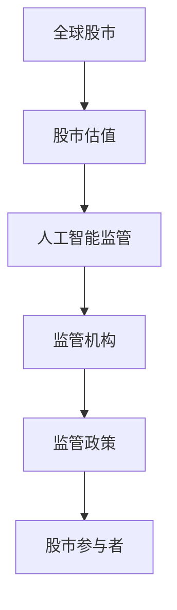
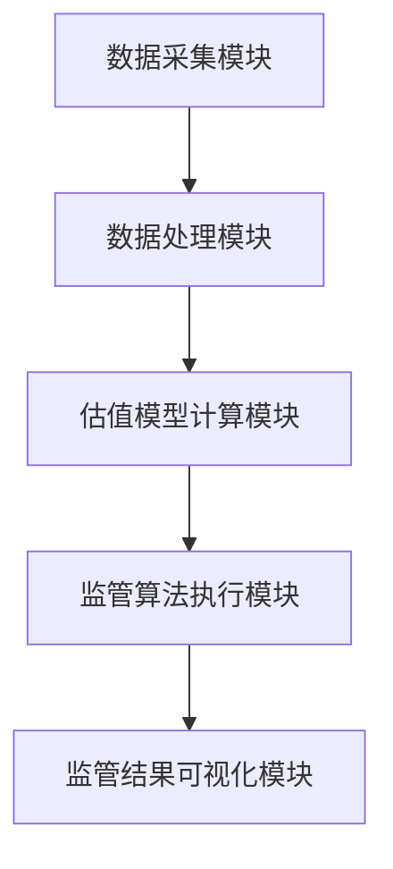

                 


# 全球股市估值与人工智能监管的关系

> 关键词：全球股市估值、人工智能监管、算法原理、系统架构、项目实战

> 摘要：本文探讨了全球股市估值与人工智能监管之间的关系，分析了两者的核心概念、算法原理和系统架构，并通过具体案例展示了如何利用人工智能技术提升股市估值的准确性和监管的有效性。

---

## 第一部分: 全球股市估值与人工智能监管的背景与核心概念

### 第1章: 全球股市估值与人工智能监管的背景介绍

#### 1.1 全球股市估值的现状与挑战

##### 1.1.1 全球股市估值的基本概念
全球股市估值是指对上市公司价值的评估，通常基于财务指标（如市盈率、市净率）和市场表现。传统估值方法依赖历史数据和经验判断，但在复杂多变的市场环境中，其局限性日益显现。

##### 1.1.2 股市估值的主要方法与工具
- **市盈率（P/E）**：股价与每股净利润的比值，衡量市场对公司的估值。
- **市净率（P/B）**：股价与每股净资产的比值，适用于评估资产密集型行业。
- **现金流折现模型（DCF）**：通过预测未来现金流的现值来评估公司价值。

##### 1.1.3 股市估值面临的挑战
- 数据复杂性：市场波动、宏观经济因素和公司基本面变化交织。
- 信息滞后性：传统估值方法依赖历史数据，难以捕捉实时变化。
- 监管不足：部分市场存在操纵和不透明交易，影响估值准确性。

#### 1.2 人工智能监管的核心概念

##### 1.2.1 人工智能监管的定义与目标
人工智能监管是指利用AI技术（如机器学习、自然语言处理）对金融市场行为进行实时监控和预测，以识别异常交易、欺诈行为和市场操纵。

##### 1.2.2 人工智能在金融领域的应用现状
- **交易预测**：通过算法交易优化投资决策。
- **风险控制**：利用AI识别市场风险，辅助监管机构制定政策。
- **合规监控**：实时监测市场行为，确保交易符合法规。

##### 1.2.3 人工智能监管的必要性与重要性
- 提高监管效率：AI能够快速处理大量数据，发现传统方法难以察觉的异常。
- 降低市场风险：通过预测和识别潜在的市场操纵行为，维护市场稳定。
- 促进公平竞争：减少信息不对称，保护投资者利益。

#### 1.3 全球股市估值与人工智能监管的关系

##### 1.3.1 股市估值与人工智能监管的相互作用
- 监管框架影响估值方法：严格的监管政策可能改变市场参与者的交易行为，从而影响估值模型。
- 估值结果影响监管决策：准确的估值结果有助于监管机构更好地识别市场风险。

##### 1.3.2 人工智能如何影响股市估值的准确性与效率
- 提高预测精度：AI算法能够分析更多的数据维度，提升估值模型的准确性。
- 实时监控：通过实时数据分析，AI能够快速捕捉市场变化，优化估值结果。

##### 1.3.3 全球化视角下股市估值与人工智能监管的协同发展
- 全球化市场需要全球化的监管框架。
- 人工智能技术的跨国应用推动了监管合作与信息共享。

---

## 第2章: 全球股市估值与人工智能监管的核心概念与联系

### 2.1 股市估值模型的核心要素

#### 2.1.1 市盈率模型
$$ P/E = \frac{\text{股价}}{\text{每股净利润}} $$
该模型适用于盈利稳定的公司，但对周期性行业可能不够准确。

#### 2.1.2 市净率模型
$$ P/B = \frac{\text{股价}}{\text{每股净资产}} $$
适用于资产密集型行业，但在公司盈利状况不佳时可能失准。

#### 2.1.3 现金流折现模型（DCF）
$$ \text{企业价值} = \sum_{t=1}^{n} \frac{\text{自由现金流}}{(1 + r)^t} $$
该模型基于未来现金流的预测，但对预测的准确性要求较高。

### 2.2 人工智能监管框架的核心要素

#### 2.2.1 数据采集与处理
- 数据来源：交易数据、市场新闻、社交媒体。
- 数据清洗：去除噪声数据，确保数据质量。

#### 2.2.2 监管算法与模型
- 机器学习模型：用于异常交易检测和市场情绪分析。
- 图论算法：用于构建监管网络，识别关联交易。

#### 2.2.3 监管结果的可视化与反馈
- 可视化工具：实时监控面板、风险地图。
- 反馈机制：根据监管结果调整算法参数，优化监管策略。

### 2.3 股市估值与人工智能监管的实体关系图



---

## 第3章: 股市估值与人工智能监管的算法原理

### 3.1 股市估值的核心算法

#### 3.1.1 基于机器学习的股市预测模型
- **线性回归**：用于预测股价趋势。
- **随机森林**：通过特征重要性分析，识别影响股价的关键因素。

#### 3.1.2 时间序列分析模型
- **ARIMA**：适用于具有趋势和季节性的数据。
- **LSTM**：适合捕捉时间序列中的长期依赖关系。

#### 3.1.3 聚类分析在股市估值中的应用
- **K-means**：将股票按相似性分组，识别潜在的投资机会。

### 3.2 人工智能监管的核心算法

#### 3.2.1 基于深度学习的异常交易检测
- **卷积神经网络（CNN）**：用于图像识别，可以应用于交易数据的异常检测。
- **自动编码器（Autoencoder）**：通过重建数据，识别异常点。

#### 3.2.2 基于图论的监管网络构建
- **图嵌入**：将交易数据转化为图结构，识别关联的异常交易。

#### 3.2.3 基于强化学习的监管策略优化
- **Q-learning**：通过试错学习，优化监管策略。

### 3.3 算法实现的Python代码示例

#### 示例：基于机器学习的股市预测模型

```python
import pandas as pd
from sklearn.model_selection import train_test_split
from sklearn.linear_model import LinearRegression
import numpy as np

# 数据准备
data = pd.DataFrame({
    'feature1': np.random.randn(100),
    'feature2': np.random.randn(100),
    'target': np.random.randn(100)
})

X = data[['feature1', 'feature2']]
y = data['target']

# 模型训练
X_train, X_test, y_train, y_test = train_test_split(X, y, test_size=0.2)
model = LinearRegression()
model.fit(X_train, y_train)

# 预测
y_pred = model.predict(X_test)
print('预测值:', y_pred[:5])
print('真实值:', y_test[:5])
```

---

## 第4章: 股市估值与人工智能监管的系统分析与架构设计

### 4.1 问题场景介绍

#### 4.1.1 股市估值的实时性与准确性问题
- 实时性：传统估值方法依赖历史数据，无法实时反映市场变化。
- 准确性：复杂市场环境导致传统模型预测误差较大。

#### 4.1.2 人工智能监管的实时性与可解释性问题
- 实时性：需要快速处理大量数据，确保监管的及时性。
- 可解释性：复杂的算法可能导致监管结果难以解释。

### 4.2 系统功能设计

#### 4.2.1 股市数据采集模块
- 数据来源：交易数据、市场新闻、社交媒体。
- 数据清洗：去除噪声数据，确保数据质量。

#### 4.2.2 估值模型计算模块
- 算法选择：根据数据特点选择合适的估值模型。
- 模型优化：通过调参和交叉验证提高预测精度。

#### 4.2.3 监管算法执行
- 异常检测：识别潜在的市场操纵行为。
- 反馈机制：根据监管结果调整算法参数。

### 4.3 系统架构设计



---

## 第5章: 项目实战

### 5.1 环境安装

```bash
pip install numpy pandas scikit-learn matplotlib
```

### 5.2 系统核心实现源代码

#### 示例：基于Python的股市预测模型

```python
import pandas as pd
from sklearn.linear_model import LinearRegression
import numpy as np

# 数据准备
data = pd.DataFrame({
    'feature1': np.random.randn(100),
    'feature2': np.random.randn(100),
    'target': np.random.randn(100)
})

X = data[['feature1', 'feature2']]
y = data['target']

# 模型训练
X_train, X_test, y_train, y_test = train_test_split(X, y, test_size=0.2)
model = LinearRegression()
model.fit(X_train, y_train)

# 预测
y_pred = model.predict(X_test)
print('预测值:', y_pred[:5])
print('真实值:', y_test[:5])
```

---

## 第6章: 最佳实践与小结

### 6.1 小结
- 全球股市估值与人工智能监管的结合是未来的趋势。
- 人工智能技术能够提升股市估值的准确性和监管的效率。

### 6.2 注意事项
- 数据隐私和安全问题需要高度重视。
- 监管算法的可解释性是实际应用中的重要挑战。

### 6.3 拓展阅读
- 《机器学习在金融中的应用》
- 《人工智能与金融监管的融合》

---

通过本文的分析与讲解，我们深入探讨了全球股市估值与人工智能监管的关系，从理论到实践，展示了如何利用人工智能技术提升股市估值的准确性和监管的有效性。希望本文能为读者提供有价值的参考和启发。

