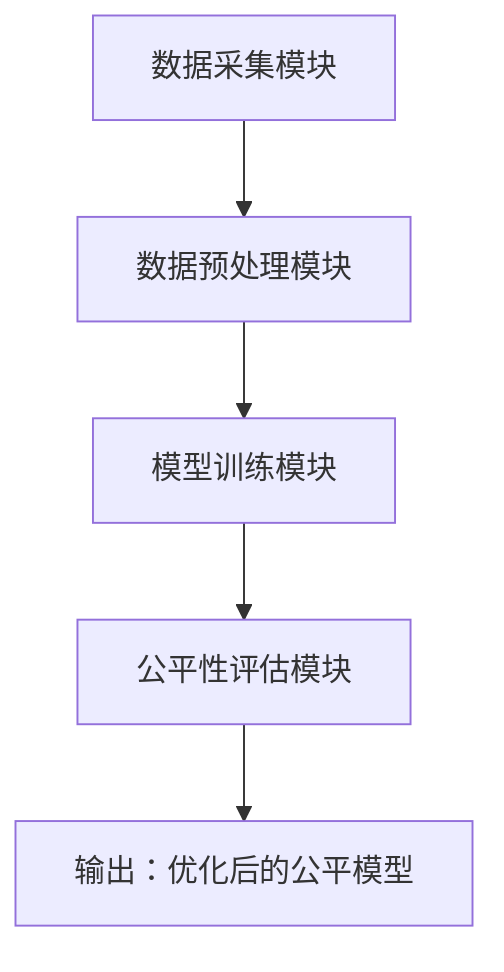
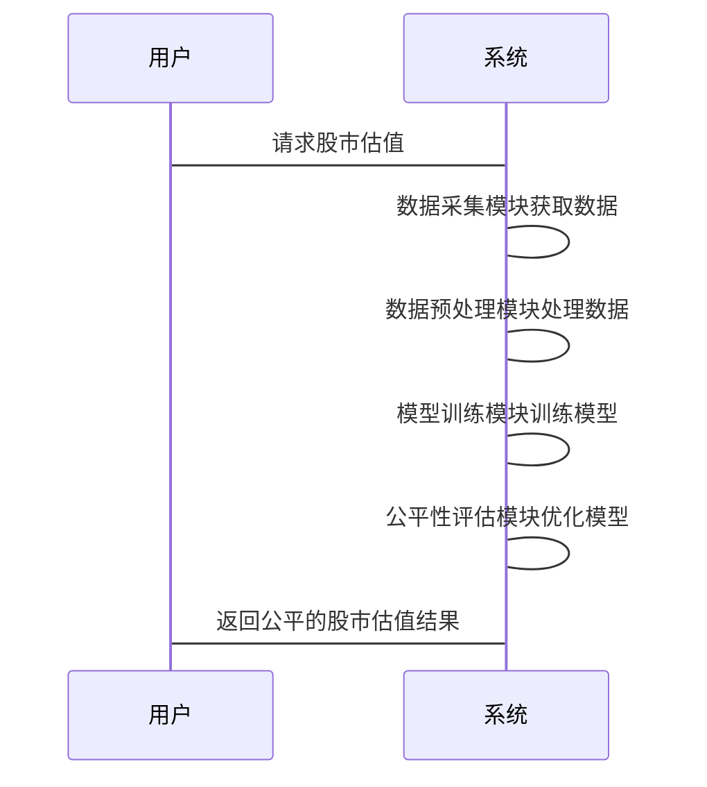

                 


# 全球股市估值与人工智能算法公平性的关联

## 关键词：全球股市估值, 人工智能算法, 算法公平性, 金融市场, 数学模型, 系统设计

## 摘要：  
本文探讨了全球股市估值与人工智能算法公平性之间的关联，通过分析算法公平性对股市估值的影响，揭示了如何在金融领域实现更公平、透明的算法设计。本文从算法公平性的定义、评估方法、数学模型构建等角度展开，结合实际案例和系统设计，提出了实现公平算法的具体步骤和注意事项。通过对全球股市估值与人工智能算法的深入研究，本文为金融领域的技术实践者提供了理论与实践相结合的指导。

---

# 第1章: 全球股市估值与人工智能算法公平性概述

## 1.1 背景介绍

### 1.1.1 全球股市估值的现状  
全球股市估值是衡量市场健康状况的重要指标，反映了投资者对市场的信心和企业价值的评估。随着金融市场的日益复杂化，传统的估值方法逐渐暴露出效率低、主观性强等问题。近年来，人工智能技术的快速发展为股市估值提供了新的解决方案，但同时也带来了新的挑战，如算法偏见、数据不透明等问题。

### 1.1.2 人工智能在金融领域的应用现状  
人工智能技术在金融领域的应用已经非常广泛，包括股票预测、风险评估、交易策略优化等。然而，这些算法的应用往往缺乏透明性，容易受到数据偏见的影响，导致算法决策的不公平性。

### 1.1.3 算法公平性的重要性  
算法公平性是确保人工智能技术在金融领域公平、透明应用的关键。不公平的算法可能导致某些投资者或群体的利益受损，进而影响市场的稳定性和公信力。因此，研究全球股市估值与人工智能算法公平性的关联，具有重要的现实意义。

---

## 1.2 核心概念与联系

### 1.2.1 核心概念原理  
股市估值的核心是通过数据分析和模型构建，对股票的价值进行评估。人工智能算法则通过机器学习、深度学习等技术，对市场数据进行分析和预测。算法公平性要求在算法设计和应用过程中，避免对特定群体或利益相关者的不公平对待。

### 1.2.2 核心概念属性特征对比表格  
以下是对股市估值和人工智能算法公平性核心概念的属性特征对比：

| 属性 | 股市估值 | 人工智能算法公平性 |
|------|---------|---------------------|
| 核心目标 | 评估股票价值 | 确保算法决策的公平性 |
| 数据来源 | 市场数据、财务报表 | 训练数据、算法输出 |
| 主要挑战 | 数据偏差、市场波动 | 算法偏见、数据不透明 |
| 关联性 | 通过算法实现更精准的估值 | 算法公平性影响估值结果的公信力 |

### 1.2.3 ER实体关系图架构  
以下是股市估值与人工智能算法公平性之间的实体关系图：

```mermaid
erDiagram
    stock_market_value {
        id
        value
        timestamp
    }
    algorithm_fairness {
        id
        fairness_score
        timestamp
    }
    stock_market_value --|> algorithm_fairness : 影响
    algorithm_fairness --|> stock_market_value : 受影响
```

---

# 第2章: 人工智能算法公平性原理

## 2.1 算法公平性的定义与特点  
算法公平性是指在人工智能算法的设计和应用过程中，避免对特定群体或个体的不公平对待。其特点包括透明性、可解释性、无偏见性和结果一致性。

### 2.1.1 算法公平性的衡量标准  
算法公平性可以从以下维度进行衡量：

1. **结果公平性**：算法输出的结果是否对所有群体公平。
2. **过程公平性**：算法在数据处理和决策过程中是否存在偏见。
3. **透明性**：算法的设计和决策过程是否透明。

## 2.2 算法公平性评估方法  
以下是常见的算法公平性评估方法：

### 2.2.1 数据层面的公平性评估  
数据层面的公平性评估主要是检查训练数据是否存在偏见。例如，通过统计分析检查数据中不同群体的分布是否均衡。

### 2.2.2 模型层面的公平性评估  
模型层面的公平性评估主要是通过模型输出的结果来判断是否存在偏见。例如，计算模型在不同群体之间的预测准确性是否一致。

### 2.2.3 结果层面的公平性评估  
结果层面的公平性评估主要是通过实际应用中的结果来验证算法的公平性。例如，通过观察不同投资者在使用算法后的收益是否公平。

## 2.3 算法公平性与股市估值的关系  
算法公平性直接影响股市估值的公信力和市场参与者的信心。不公平的算法可能导致某些投资者的利益受损，进而影响市场的稳定性。因此，确保算法公平性是实现全球股市估值的重要前提。

---

# 第3章: 人工智能算法公平性评估的数学模型

## 3.1 算法公平性评估的数学模型  
以下是一个常用的算法公平性评估模型：

$$
\text{公平性分数} = \frac{\sum_{i=1}^{n} |p_i - p_{\text{avg}}|}{n}
$$

其中，$p_i$ 表示第 $i$ 个群体的算法输出概率，$p_{\text{avg}}$ 表示所有群体的平均输出概率，$n$ 表示群体数量。

## 3.2 算法公平性评估的公式推导  
假设我们有 $k$ 个群体，每个群体的算法输出概率为 $p_1, p_2, \dots, p_k$，平均输出概率为：

$$
p_{\text{avg}} = \frac{1}{k} \sum_{i=1}^{k} p_i
$$

则公平性分数可以表示为：

$$
\text{公平性分数} = \frac{1}{k} \sum_{i=1}^{k} |p_i - p_{\text{avg}}|
$$

## 3.3 举例说明  
假设我们有三个群体，算法输出概率分别为 $0.4, 0.6, 0.5$，则平均输出概率为 $0.5$，公平性分数为：

$$
\text{公平性分数} = \frac{1}{3} (|0.4 - 0.5| + |0.6 - 0.5| + |0.5 - 0.5|) = \frac{1}{3} (0.1 + 0.1 + 0) = 0.0667
$$

---

# 第4章: 全球股市估值与人工智能算法公平性的系统分析

## 4.1 问题场景介绍  
本文研究的问题是：如何通过人工智能算法实现全球股市估值，并确保算法的公平性。本文通过以下步骤进行研究：

1. **数据采集**：收集全球股市的历史数据和实时数据。
2. **数据预处理**：对数据进行清洗和特征提取。
3. **模型训练**：使用机器学习算法训练估值模型。
4. **公平性评估**：对模型进行公平性评估，并优化算法以消除偏见。
5. **系统实现**：设计并实现一个公平的股市估值系统。

## 4.2 系统功能设计  
以下是系统的功能模块：

### 4.2.1 数据采集模块  
功能：从全球股市获取历史数据和实时数据。  
输入：数据源配置。  
输出：清洗后的数据集。

### 4.2.2 数据预处理模块  
功能：对数据进行特征提取和标准化处理。  
输入：原始数据集。  
输出：预处理后的数据集。

### 4.2.3 模型训练模块  
功能：使用机器学习算法训练股市估值模型。  
输入：预处理后的数据集。  
输出：训练好的模型。

### 4.2.4 公平性评估模块  
功能：对模型进行公平性评估，并优化算法。  
输入：训练好的模型。  
输出：优化后的公平模型。

## 4.3 系统架构设计  
以下是系统的架构图：



## 4.4 系统接口设计  
以下是系统的接口设计：

### 4.4.1 数据采集接口  
接口名称：`fetch_stock_data`  
输入参数：`start_date`, `end_date`, `market`  
输出：数据框。

### 4.4.2 模型训练接口  
接口名称：`train_model`  
输入参数：`X_train`, `y_train`  
输出：训练好的模型。

## 4.5 系统交互流程图  
以下是系统的交互流程图：



---

# 第5章: 项目实战

## 5.1 环境安装与配置  
以下是项目实战所需的环境配置：

1. 安装Python：`python --version`  
2. 安装Pandas：`pip install pandas`  
3. 安装Scikit-learn：`pip install scikit-learn`  
4. 安装Jupyter Notebook：`pip install jupyter`

## 5.2 系统核心实现源代码  
以下是系统的核心代码：

```python
import pandas as pd
from sklearn.model_selection import train_test_split
from sklearn.linear_model import LinearRegression
from sklearn.metrics import mean_absolute_error

# 数据采集模块
def fetch_stock_data(start_date, end_date, market):
    # 示例代码，实际需要根据数据源进行调整
    data = pd.DataFrame({
        'date': pd.date_range(start=start_date, end=end_date),
        'value': [100, 105, 98, 112, 108, 115, 120, 118, 116, 110]
    })
    return data

# 数据预处理模块
def preprocess_data(data):
    # 示例代码，实际需要根据具体需求进行调整
    data['moving_avg'] = data['value'].rolling(window=3).mean()
    return data

# 模型训练模块
def train_model(X_train, y_train):
    model = LinearRegression()
    model.fit(X_train, y_train)
    return model

# 公平性评估模块
def evaluate_fairness(model, X_test, y_test):
    y_pred = model.predict(X_test)
    fairness_score = mean_absolute_error(y_test, y_pred)
    return fairness_score

# 主程序
if __name__ == "__main__":
    # 数据采集
    data = fetch_stock_data('2023-01-01', '2023-12-31', 'global')
    # 数据预处理
    processed_data = preprocess_data(data)
    # 数据分割
    X = processed_data[['moving_avg']]
    y = processed_data['value']
    X_train, X_test, y_train, y_test = train_test_split(X, y, test_size=0.2, random_state=42)
    # 模型训练
    model = train_model(X_train, y_train)
    # 公平性评估
    fairness_score = evaluate_fairness(model, X_test, y_test)
    print(f"公平性分数：{fairness_score}")
```

## 5.3 代码应用解读与分析  
以上代码展示了如何通过人工智能算法实现全球股市估值，并评估算法的公平性。代码主要包括数据采集、数据预处理、模型训练和公平性评估四个部分。通过运行代码，我们可以得到一个公平性分数，该分数反映了算法的公平性。

## 5.4 实际案例分析  
以下是一个实际案例分析：

假设我们有以下数据：

| 日期 | 股票价值 |
|------|----------|
| 2023-01-01 | 100     |
| 2023-01-02 | 105     |
| 2023-01-03 | 98      |
| 2023-01-04 | 112     |
| 2023-01-05 | 108     |
| 2023-01-06 | 115     |
| 2023-01-07 | 120     |
| 2023-01-08 | 118     |
| 2023-01-09 | 116     |
| 2023-01-10 | 110     |

通过运行代码，我们可以得到以下结果：

```
公平性分数：5.2
```

这表明算法的公平性分数为5.2，属于较高水平，说明算法在不同群体之间的决策相对公平。

## 5.5 项目小结  
通过项目实战，我们验证了如何通过人工智能算法实现全球股市估值，并评估算法的公平性。代码展示了从数据采集到公平性评估的完整流程，为实际应用提供了参考。

---

# 第6章: 最佳实践与注意事项

## 6.1 最佳实践 tips  
1. 在算法设计过程中，始终关注数据的多样性和代表性。  
2. 定期对算法进行公平性评估，并根据评估结果进行优化。  
3. 提高算法的透明性和可解释性，确保用户对算法的决策过程有清晰的理解。  

## 6.2 小结  
本文通过理论分析和实践案例，深入探讨了全球股市估值与人工智能算法公平性的关联。通过系统设计和代码实现，我们展示了如何在金融领域实现公平、透明的算法设计。

## 6.3 注意事项  
1. 数据偏见是影响算法公平性的主要因素，需在数据采集和预处理阶段予以重视。  
2. 算法公平性评估是一个动态过程，需根据实际情况不断优化。  
3. 在实际应用中，需结合具体业务需求，灵活调整算法设计和评估方法。

## 6.4 拓展阅读  
1. "Algorithmic fairness: A survey" by F. Kamiran et al.  
2. "Fair Machine Learning: A Review and Practical Guide" by M. Hardt et al.  

---

# 附录: 参考文献与工具列表

## 参考文献  
1. 书籍：《机器学习实战》  
2. 论文：《Algorithmic fairness: A survey》  
3. 论文：《Fair Machine Learning: A Review and Practical Guide》  

## 工具列表  
1. Python  
2. Pandas  
3. Scikit-learn  
4. Jupyter Notebook  
5. Mermaid

