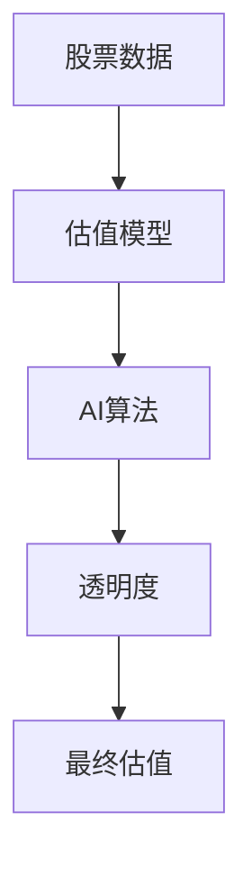
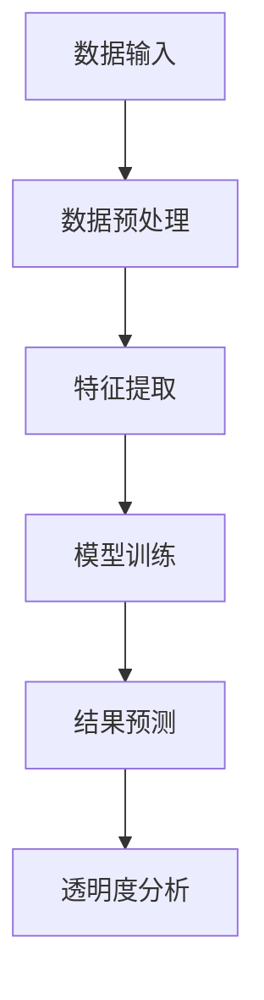
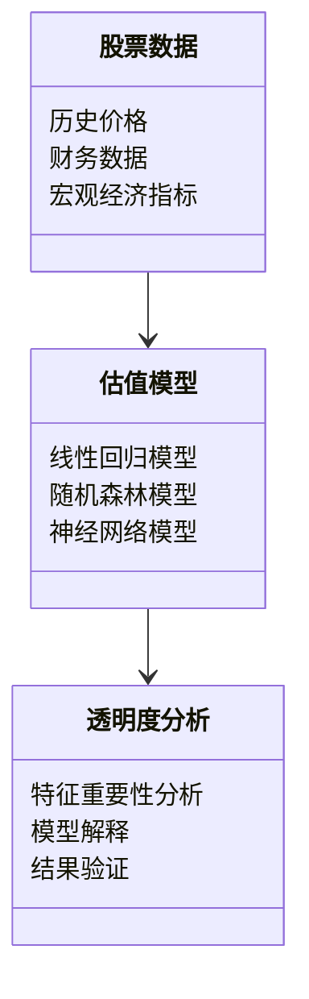
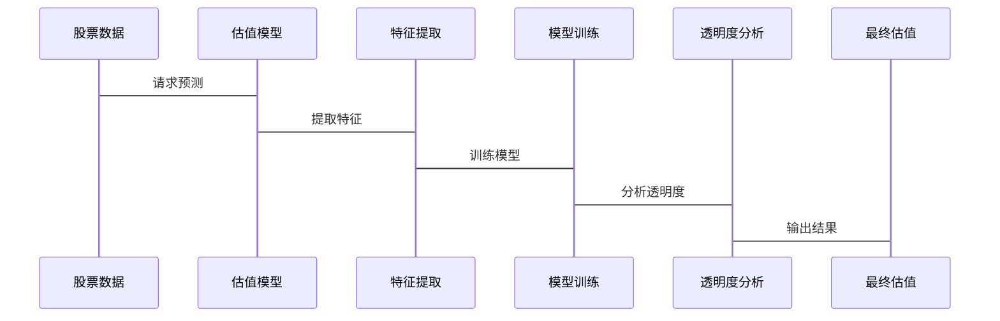

                 


# 全球股市估值与人工智能透明度的关联

## 关键词：全球股市、人工智能、透明度、股市估值、AI算法、金融建模

## 摘要：本文探讨人工智能在金融领域中的应用，特别是其在股市估值中的透明度问题。通过分析AI算法的透明度与股市估值结果之间的关联，本文旨在揭示透明度对投资决策的影响，并提出提升AI透明度的方法。

---

# 第1章: 全球股市估值与人工智能透明度的背景介绍

## 1.1 全球股市估值的重要性
### 1.1.1 股市估值的基本概念
股市估值是通过分析公司财务数据、市场趋势和宏观经济指标，评估股票的内在价值。传统方法包括市盈率（P/E比率）、市净率（P/B比率）等。

### 1.1.2 股市估值的传统方法
传统方法依赖于历史数据和经验判断，存在主观性强、效率低下的问题。

### 1.1.3 数字化时代下的股市估值挑战
随着大数据和AI技术的发展，股市估值需要更高效、准确的方法，但同时也面临数据过载和模型复杂性的挑战。

## 1.2 人工智能在金融领域的应用现状
### 1.2.1 人工智能技术在金融领域的应用领域
AI技术广泛应用于股票预测、风险管理、交易优化等领域。

### 1.2.2 AI在股市分析中的优势
AI能够快速处理海量数据，发现隐藏的模式，提供实时分析。

### 1.2.3 当前AI在股市估值中的局限性
模型的“黑箱”特性导致缺乏透明度，影响投资者的信任和决策。

## 1.3 人工智能透明度的核心概念
### 1.3.1 透明度的定义与重要性
透明度指的是模型的决策过程和结果可解释的程度。高透明度的AI系统有助于增强信任，便于调试和优化。

### 1.3.2 AI透明度的多维度属性
透明度包括可解释性、可追溯性、可验证性和可控制性。

### 1.3.3 AI透明度与股市估值的关联性
透明度高的AI估值模型能够提供可靠的解释，帮助投资者理解估值依据，降低风险。

## 1.4 本章小结
本章介绍了股市估值的重要性，分析了AI在金融中的应用现状，并强调了透明度在AI股市估值中的关键作用。

---

# 第2章: 全球股市估值与人工智能透明度的核心概念与联系

## 2.1 核心概念原理
### 2.1.1 股市估值的数学模型
常用的模型包括CAPM（资本资产定价模型）和APT（ Arbitrage Pricing Theory）。

### 2.1.2 人工智能算法的基本原理
机器学习算法如随机森林、神经网络等用于预测股市走势。

### 2.1.3 透明度对AI算法的影响
算法的透明度影响其可解释性和可信度，进而影响投资者的决策。

## 2.2 核心概念属性对比表格
| 属性          | 股市估值         | AI透明度         |
|---------------|------------------|------------------|
| 输入数据      | 财务数据、市场数据 | 结构化数据、非结构化数据 |
| 输出结果      | 股票价值         | 可解释的预测结果 |
| 依赖性        | 历史数据         | 数据质量和算法设计 |
| 透明度要求    | 中等             | 高               |

## 2.3 ER实体关系图架构


## 2.4 本章小结
本章通过对比分析，展示了AI透明度与股市估值的核心关联，并通过ER图展示了各实体的关系。

---

# 第3章: 基于人工智能的股市估值算法原理

## 3.1 算法原理概述
### 3.1.1 机器学习在股市估值中的应用
机器学习通过训练数据预测股票价格，帮助投资者做出决策。

### 3.1.2 常见的AI估值算法介绍
- **线性回归**：简单线性模型，适用于数据线性关系明显的情况。
- **随机森林**：集成学习方法，能够处理高维数据，抗过拟合能力强。
- **神经网络**：深度学习模型，适用于复杂非线性关系。

### 3.1.3 算法选择的依据
根据数据特性、计算资源和预测精度要求选择合适的算法。

## 3.2 算法流程图


## 3.3 数学模型与公式
### 3.3.1 线性回归模型
$$ y = \beta_0 + \beta_1x + \epsilon $$

### 3.3.2 随机森林模型
$$ y = \sum_{i=1}^{n} \text{Tree}(x) $$

## 3.4 举例说明
### 3.4.1 线性回归的应用
假设使用线性回归模型预测股票价格，输入数据包括市盈率和市净率，输出为预测股价。

### 3.4.2 随机森林的实际案例
使用随机森林模型训练股票数据，评估各特征的重要性，预测股票涨跌。

## 3.5 本章小结
本章详细介绍了常用AI算法的原理，并通过流程图和公式展示了其在股市估值中的应用。

---

# 第4章: 全球股市估值与人工智能透明度的系统分析与架构设计

## 4.1 问题场景介绍
### 4.1.1 股市估值的复杂性
股市受多种因素影响，包括宏观经济、行业动态和突发事件。

### 4.1.2 AI透明度的重要性
确保AI模型的决策过程可解释，避免“黑箱”问题。

## 4.2 项目介绍
本项目旨在开发一个基于AI的股市估值系统，强调模型的透明度和可解释性。

## 4.3 系统功能设计
### 4.3.1 领域模型mermaid类图


## 4.4 系统架构设计
### 4.4.1 mermaid架构图


## 4.5 系统接口设计
接口包括数据输入接口、模型调用接口和结果输出接口。

## 4.6 系统交互mermaid序列图


## 4.7 本章小结
本章通过系统架构设计，展示了AI透明度在股市估值系统中的实现，强调了各模块的交互和协作。

---

# 第5章: 全球股市估值与人工智能透明度的项目实战

## 5.1 项目环境配置
### 5.1.1 安装Python环境
使用Anaconda安装Python 3.8及以上版本。

### 5.1.2 安装依赖库
安装pandas、numpy、scikit-learn、xgboost等库。

## 5.2 系统核心实现源代码
### 5.2.1 数据预处理
```python
import pandas as pd
data = pd.read_csv('stock_data.csv')
data = data.dropna()
```

### 5.2.2 特征提取与模型训练
```python
from sklearn.ensemble import RandomForestRegressor
model = RandomForestRegressor(n_estimators=100)
model.fit(X_train, y_train)
```

### 5.2.3 透明度分析
```python
importances = model.feature_importances_
```

## 5.3 代码应用解读与分析
### 5.3.1 数据预处理代码解读
读取数据并删除缺失值，确保数据完整性。

### 5.3.2 模型训练代码解读
使用随机森林模型训练数据，提取特征重要性，评估模型透明度。

## 5.4 实际案例分析
分析某公司的股票数据，预测其估值并解释模型决策过程。

## 5.5 本章小结
本章通过实际案例展示了AI透明度在股市估值中的应用，验证了模型的有效性。

---

# 第6章: 全球股市估值与人工智能透明度的最佳实践与总结

## 6.1 提升透明度的方法
### 6.1.1 增强AI算法的可解释性
使用可解释性AI（XAI）技术，如LIME和SHAP，解释模型决策。

### 6.1.2 提供交互式解释工具
开发用户友好的可视化工具，帮助用户理解模型输出。

## 6.2 总结与反思
本项目展示了AI透明度在股市估值中的重要性，但也面临数据质量和模型解释的挑战。

## 6.3 未来展望
未来的研究方向包括开发更高效的透明度提升算法，探索AI与人类决策的结合。

## 6.4 小结
透明度是AI在金融领域应用的关键，提升透明度将增强投资者信任，推动技术进步。

---

# 第7章: 全球股市估值与人工智能透明度的总结与展望

## 7.1 回顾全文
本文探讨了AI透明度与股市估值的关联，分析了其重要性及实现方法。

## 7.2 总结与展望
未来，随着技术进步，AI透明度将在金融领域发挥更大作用，为投资决策提供更可靠的支持。

## 7.3 最终小结
透明度是AI在金融领域应用的核心，本文为相关研究提供了理论和实践参考。

---

# 结语

通过系统分析和实际案例，本文揭示了AI透明度对股市估值的重要性。未来，随着技术的发展，透明度将成为AI在金融领域应用的关键因素，推动更智能、更可信的金融决策。

--- 

感谢您的耐心阅读，希望这篇文章能为您提供有价值的见解和启示。

