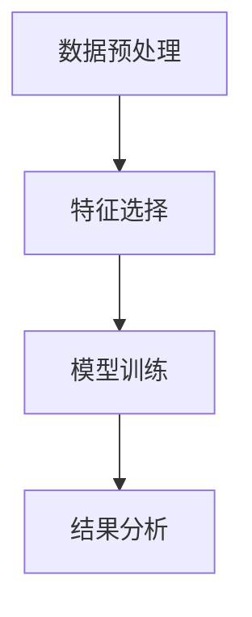
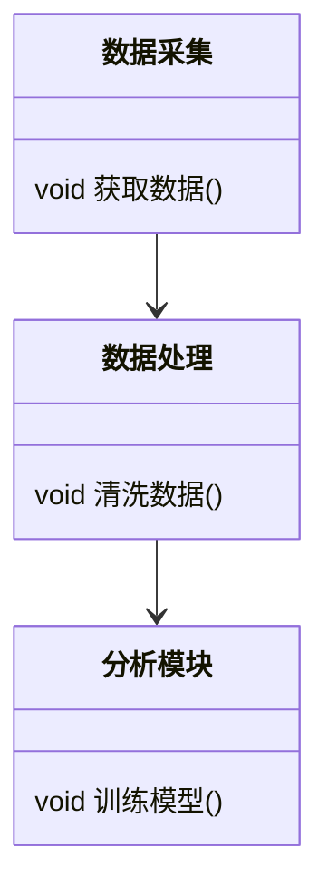
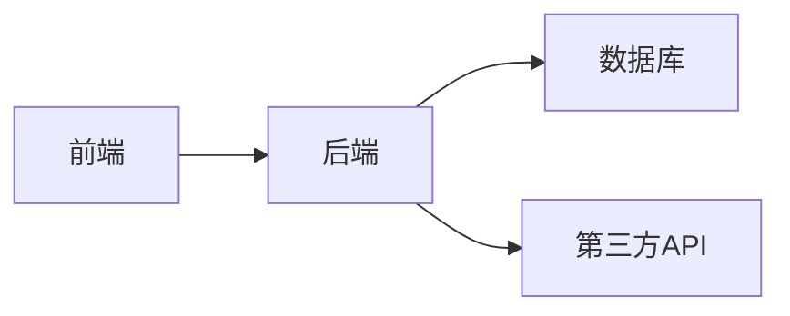
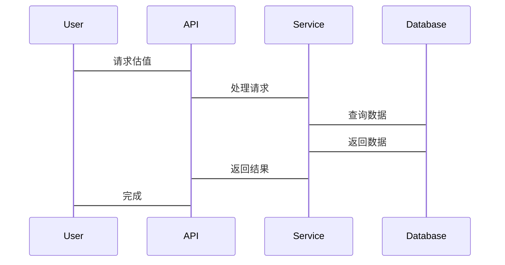

                 


# 全球股市估值与人机协作技术的关系

## 关键词：
全球股市估值、人机协作技术、机器学习、金融分析、大数据

## 摘要：
本文探讨了全球股市估值与人机协作技术之间的关系，分析了传统估值方法的局限性，以及人工智能和大数据技术如何革新股市估值。通过详细阐述人机协作技术的核心概念、算法原理和系统架构，结合实际案例，展示了如何利用技术提升股市估值的准确性。文章还总结了当前的研究成果，并展望了未来的发展趋势。

---

# 第1章: 全球股市估值与人机协作技术的背景介绍

## 1.1 全球股市估值的历史演变

### 1.1.1 传统股市估值方法的局限性
传统的股市估值方法，如市盈率（P/E）、市净率（P/B）和股息率，虽然简单易懂，但存在以下局限性：
- 数据维度单一，难以捕捉市场动态。
- 忽略了时间序列数据和非结构化数据（如新闻、社交媒体）的影响。
- 无法实时更新，导致估值滞后。

### 1.1.2 数字化与智能化时代的股市估值需求
随着数字化和智能化的推进，金融行业对实时、精准的估值需求日益增长。投资者需要更高效的工具来处理海量数据，提取有价值的信息。

### 1.1.3 全球化背景下的股市估值挑战
全球化导致股市数据量激增，跨市场的波动性增加，传统的估值方法难以应对复杂的市场环境。

## 1.2 人机协作技术的发展背景

### 1.2.1 人工智能与大数据技术的崛起
人工智能和大数据技术的结合，为金融行业提供了强大的数据分析能力。机器学习算法能够处理结构化和非结构化数据，提取隐藏的模式。

### 1.2.2 机器学习在金融领域的应用
机器学习在金融领域的应用包括股票价格预测、风险评估、交易策略优化等。例如，使用LSTM模型预测股价波动。

### 1.2.3 人机协作技术的核心优势
人机协作结合了人类的创造力和机器的高效性，能够快速处理大量数据，提供实时反馈。

## 1.3 全球股市估值与人机协作技术的关系

### 1.3.1 技术如何影响股市估值
- 提供实时数据处理能力。
- 增强数据的准确性和完整性。

### 1.3.2 股市数据如何驱动人机协作技术
- 数据量和复杂性推动了技术的进步。
- 人机协作技术通过分析数据优化估值模型。

### 1.3.3 两者的相互作用与协同效应
- 技术进步推动估值方法创新。
- 估值需求促进人机协作技术的应用和发展。

---

# 第2章: 全球股市估值与人机协作技术的核心概念

## 2.1 全球股市估值方法

### 2.1.1 市盈率法
公式：P/E = 市场价 / 每股收益。
适用于成长型企业，但需考虑行业差异和市场环境。

### 2.1.2 市净率法
公式：P/B = 市场价 / 每股净资产。
适用于资产密集型企业，如银行和房地产公司。

### 2.1.3 股息率法
公式：股息率 = 每股股息 / 市场价。
适用于成熟企业，反映投资回报率。

### 2.1.4 现金流折现法
公式：DCF = 现金流入的现值。
适用于评估具有稳定现金流的企业。

## 2.2 人机协作技术的定义与特点

### 2.2.1 人机协作的定义
人机协作是指人类与机器协同工作，结合各自优势完成任务。

### 2.2.2 人机协作的核心特征
- 智能化：利用AI技术进行决策。
- 实时性：快速响应数据变化。
- 高效率：减少重复劳动，提高生产力。

### 2.2.3 人机协作与传统自动化技术的区别
| 特性 | 人机协作 | 传统自动化 |
|------|----------|------------|
| 交互性 | 高       | 低         |
| 灵活性 | 高       | 低         |
| 智能性 | 高       | 低         |

## 2.3 全球股市估值与人机协作技术的联系

### 2.3.1 数据驱动的股市估值
机器学习通过分析海量数据，发现传统方法难以捕捉的模式。

### 2.3.2 人机协作在金融分析中的应用
- 数据清洗和特征工程。
- 模型训练和优化。

### 2.3.3 技术如何提升股市估值的准确性
通过实时数据分析和预测模型，提高估值的准确性和及时性。

---

# 第3章: 人机协作技术在股市估值中的算法原理

## 3.1 算法流程图



## 3.2 Python代码实现

```python
import pandas as pd
from sklearn.ensemble import RandomForestRegressor

# 数据预处理
data = pd.read_csv('stock_data.csv')
data = data.dropna()
data = (data - data.mean()) / data.std()

# 特征选择
features = data.drop('target', axis=1)
target = data['target']

# 模型训练
model = RandomForestRegressor()
model.fit(features, target)

# 预测与评估
predictions = model.predict(features)
print('预测值:', predictions)
```

## 3.3 数学模型与公式

- 随机森林算法：通过集成多个决策树模型，提高预测准确性。
- 线性回归模型：$y = \beta_0 + \beta_1x + \epsilon$。

---

# 第4章: 系统架构设计

## 4.1 系统功能设计



## 4.2 系统架构设计



## 4.3 接口与交互设计



---

# 第5章: 项目实战

## 5.1 环境安装

- Python 3.8+
- Jupyter Notebook
- pandas、scikit-learn

## 5.2 核心代码实现

```python
import pandas as pd
from sklearn.model_selection import train_test_split
from sklearn.metrics import mean_squared_error

# 数据加载与预处理
data = pd.read_csv('stock.csv')
data = data.dropna()
data = (data - data.mean()) / data.std()

# 特征选择与模型训练
X = data.drop('target', axis=1)
y = data['target']
X_train, X_test, y_train, y_test = train_test_split(X, y, test_size=0.2)

model = RandomForestRegressor()
model.fit(X_train, y_train)

# 模型评估
y_pred = model.predict(X_test)
print(mean_squared_error(y_test, y_pred))
```

## 5.3 案例分析

- 使用历史数据训练模型。
- 分析模型预测与实际值的差异，优化特征选择和模型参数。

## 5.4 项目小结

- 关键点：数据预处理、特征选择、模型优化。
- 问题解决：数据不平衡、模型过拟合。

---

# 第6章: 总结与展望

## 6.1 总结

- 人机协作技术提升了股市估值的准确性和实时性。
- 数据驱动和算法优化是未来的重要方向。

## 6.2 未来展望

- 深度学习和强化学习在股市估值中的应用。
- 实时估值和个性化投资策略的发展。

## 6.3 读者建议

- 深入学习机器学习和金融知识。
- 关注行业动态和技术进步。

---

以上是《全球股市估值与人机协作技术的关系》的技术博客文章内容，希望对您有所帮助！

