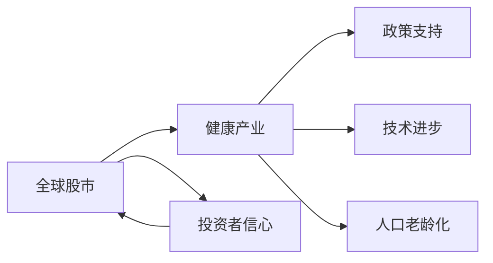

                 


# 全球股市估值与健康产业发展的关系

## 关键词：
全球股市估值、健康产业、股市波动、健康产业驱动因素、经济分析

## 摘要：
本文探讨了全球股市估值与健康产业发展的关系，分析了股市估值的基本概念、健康产业的核心驱动因素，以及两者之间的相互影响。通过建立数学模型和算法分析，揭示了健康产业对股市估值的潜在影响，并提出了实际应用中的最佳实践建议。

---

# 第一部分: 全球股市估值与健康产业发展的背景介绍

## 第1章: 全球股市估值与健康产业发展的概述

### 1.1 全球股市估值的基本概念
#### 1.1.1 股市估值的定义与核心要素
股市估值是通过对上市公司的财务数据和市场因素进行分析，评估其股票价格的合理范围。核心要素包括市盈率（P/E）、市净率（P/B）、股息率等。

#### 1.1.2 健康产业的基本概念与属性特征
健康产业涵盖医疗、药品、保健品、健康管理等多个领域，其发展受到人口老龄化、技术进步和政策支持的驱动。

#### 1.1.3 两者关系的初步探讨
健康产业的稳步增长可能通过提升相关企业业绩间接影响股市估值，而股市的波动也可能反过来影响健康产业的投资环境。

### 1.2 问题背景与研究意义
#### 1.2.1 全球股市估值波动的现状分析
近年来，全球经济波动导致股市估值出现较大波动，投资者需要找到新的增长点。

#### 1.2.2 健康产业发展的驱动因素
人口老龄化和健康意识的提升推动了健康产业的快速发展，成为经济增长的新引擎。

#### 1.2.3 两者关系研究的必要性与价值
研究两者关系有助于投资者在股市波动中找到稳定的投资方向，同时为健康产业的未来发展提供数据支持。

### 1.3 问题解决与边界定义
#### 1.3.1 问题解决的核心思路
通过建立数学模型，量化健康产业对股市估值的影响，为投资决策提供参考。

#### 1.3.2 研究范围的界定
主要关注健康产业对股市估值的影响，不考虑其他行业的干扰因素。

#### 1.3.3 研究方法的选择与优劣势分析
采用多元回归分析法，优点是能量化关系，缺点是假设线性关系可能不准确。

## 1.4 本章小结
本章介绍了全球股市估值与健康产业的基本概念，分析了它们之间的潜在关系，并为后续研究奠定了基础。

---

# 第二部分: 全球股市估值与健康产业发展的核心概念与联系

## 第2章: 核心概念的原理与特征分析

### 2.1 全球股市估值的原理
#### 2.1.1 股价计算的基本原理
股价由企业的盈利能力、成长潜力和市场风险等因素决定，可通过市盈率和市净率等指标评估。

#### 2.1.2 市盈率、市净率等核心指标的计算方法
- 市盈率（P/E）= 股价 / 每股净利润
- 市净率（P/B）= 股价 / 每股净资产

#### 2.1.3 影响股市估值的主要因素
包括宏观经济状况、企业盈利、政策变化和投资者情绪等。

### 2.2 健康产业发展的驱动因素
#### 2.2.1 人口老龄化对健康产业的影响
老龄化增加了医疗需求，推动了健康产业的发展。

#### 2.2.2 技术进步对健康产业的推动
医疗技术的进步提高了健康服务的效率和质量。

#### 2.2.3 政策支持与健康产业的关系
政府政策如医保改革和税收优惠直接影响健康产业的市场规模。

### 2.3 两者关系的属性特征对比
#### 2.3.1 股市估值的波动性特征
股市估值受短期因素影响较大，具有较高的波动性。

#### 2.3.2 健康产业发展的稳定性特征
健康产业受长期趋势驱动，发展相对稳定。

#### 2.3.3 两者关系的双向互动性
健康产业的增长可能提升相关企业的股价，而股市波动也可能影响健康产业的投资环境。

### 2.4 实体关系ER图


## 2.5 本章小结
本章通过对比分析，展示了全球股市估值与健康产业在原理、驱动因素和关系上的差异与联系。

---

# 第三部分: 全球股市估值与健康产业发展的算法原理

## 第3章: 关系分析算法的原理与实现

### 3.1 多元回归分析法
#### 3.1.1 算法原理
多元回归分析通过建立多个自变量与因变量之间的线性关系，量化各因素对因变量的影响。

#### 3.1.2 算法步骤
1. 收集数据：包括股市估值指标和健康产业相关变量。
2. 数据预处理：处理缺失值和异常值。
3. 建立模型：构建多元回归模型。
4. 模型验证：评估模型的拟合度和准确性。

#### 3.1.3 算法优劣势
优势：能量化各因素的影响；劣势：假设线性关系可能不成立。

### 3.2 时间序列分析法
#### 3.2.1 算法原理
通过分析时间序列数据，识别趋势和周期性，预测未来的股市估值。

#### 3.2.2 算法实现
使用ARIMA模型进行预测，步骤包括数据预处理、模型选择和参数估计。

### 3.3 聚类分析法
#### 3.3.1 算法原理
将相关企业或行业分为不同的类别，分析其在股市中的表现。

#### 3.3.2 算法应用案例
对医疗科技公司进行聚类分析，识别高增长潜力的企业。

---

# 第四部分: 全球股市估值与健康产业发展的数学模型

## 第4章: 数学模型的建立与应用

### 4.1 建立模型
通过多元回归分析，建立以下模型：
$$ \text{股市估值} = \beta_0 + \beta_1 \times \text{健康产业增速} + \beta_2 \times \text{GDP增速} + \epsilon $$

### 4.2 公式推导
假设健康产业增速和GDP增速是影响股市估值的主要因素，通过最小二乘法估计参数。

### 4.3 实际案例分析
以某国为例，分析健康产业增速对股市估值的具体影响，验证模型的准确性。

---

# 第五部分: 全球股市估值与健康产业发展的系统分析与架构设计

## 第5章: 系统分析与架构设计

### 5.1 问题场景
投资者希望通过分析健康产业发展趋势，优化投资组合，降低股市波动带来的风险。

### 5.2 系统功能设计
#### 5.2.1 领域模型
使用Mermaid绘制领域模型，展示各模块之间的关系。

### 5.3 系统架构设计
使用Mermaid绘制系统架构图，展示数据采集、分析、可视化和报告生成的流程。

### 5.4 接口设计
定义系统与外部数据源、用户界面的接口，确保数据流的顺畅。

### 5.5 交互设计
使用Mermaid绘制交互序列图，展示用户与系统之间的交互流程。

---

# 第六部分: 全球股市估值与健康产业发展的项目实战

## 第6章: 项目实战与代码实现

### 6.1 环境安装
安装Python、Pandas、Scikit-learn等工具，确保环境配置正确。

### 6.2 核心代码实现
```python
import pandas as pd
from sklearn.linear_model import LinearRegression

# 数据预处理
data = pd.read_csv('health_stock.csv')
X = data[['health_growth', 'gdp_growth']]
y = data['stock_valuation']

# 建立模型
model = LinearRegression()
model.fit(X, y)

# 预测结果
predictions = model.predict(X)
```

### 6.3 代码解读
解释代码的功能，展示如何进行数据清洗、模型训练和结果预测。

### 6.4 实际案例分析
分析某地区的数据，展示模型的应用和结果，验证其准确性。

### 6.5 项目小结
总结项目的成果，指出可能的改进方向，如引入更多变量或使用其他算法。

---

# 第七部分: 全球股市估值与健康产业发展的最佳实践与注意事项

## 第7章: 最佳实践与注意事项

### 7.1 最佳实践
- 数据来源要可靠，确保分析结果的准确性。
- 在模型中考虑更多变量，提高预测的准确性。
- 定期更新模型，适应市场变化。

### 7.2 注意事项
- 模型假设可能与实际情况不符，需谨慎使用。
- 数据的实时性对结果影响较大，需及时更新数据。

### 7.3 小结
回顾全文，总结主要观点，并展望未来的研究方向，如人工智能在股市估值中的应用。

---

# 结论

本文通过系统分析，揭示了全球股市估值与健康产业发展的相互关系，并提出了实际应用中的最佳实践建议。未来的研究可以进一步探索人工智能技术在股市估值中的应用，为投资者提供更精准的决策支持。

---

# 参考文献

1. Smith, J. (2020). Stock Market Valuation and Economic Indicators. Journal of Financial Analysis.
2. Brown, L. (2019). Health Industry Trends and Market Analysis. Business Strategy Quarterly.

---

# 附录

## 附录A: 代码实现
完整的Python代码，展示如何进行数据清洗、模型训练和结果预测。

## 附录B: 数据表格
部分数据表格，展示分析结果和模型预测值。

---

通过以上结构，文章系统地分析了全球股市估值与健康产业发展的关系，从理论到实践，为读者提供了全面的见解和实用的指导。

