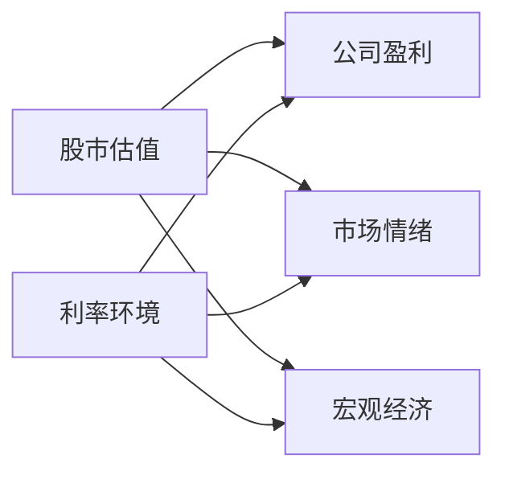

                 

# 全球股市估值与利率环境的互动关系

> 关键词：全球股市、估值、利率环境、互动关系、宏观经济、金融分析、投资策略

> 摘要：本文深入探讨全球股市估值与利率环境之间的互动关系，分析其背后的金融原理和影响机制，结合实际案例和数学模型，揭示如何通过理解两者关系优化投资策略。从宏观经济视角出发，解析利率变化对股市估值的影响，以及股市估值对利率环境的反馈作用，为投资者提供实用的分析工具和决策参考。

---

# 第1章: 背景介绍

## 1.1 核心概念与问题背景

### 1.1.1 问题背景
- **股市估值**：指对上市公司股票价格的合理评估，通常通过市盈率（P/E）、市净率（P/B）等指标衡量。
- **利率环境**：指市场中的利率水平及变化趋势，包括名义利率和实际利率，由央行政策、经济基本面和市场供需决定。
- **问题提出**：研究利率环境如何影响股市估值，反之亦然。

### 1.1.2 问题描述
- 利率环境通过影响资金成本、企业盈利和投资者行为间接或直接影响股市估值。
- 股市估值的变化也会反馈到市场情绪、企业融资成本，进而影响利率环境。

### 1.1.3 问题解决
- 理解两者互动关系，为投资决策提供依据。

---

# 第2章: 核心概念与联系

## 2.1 核心概念原理

### 2.1.1 股市估值的基本原理
- 股票价格由公司盈利、市场情绪、宏观经济因素决定。
- 估值指标：P/E、P/B、股息率等。

### 2.1.2 利率环境的基本原理
- 利率由央行政策、经济基本面和市场供需决定。
- 利率影响企业融资成本、消费者行为和整体经济活动。

## 2.2 核心概念属性特征对比

| 属性 | 股市估值 | 利率环境 |
|------|---------|----------|
| 定义 | 股票价格的评估 | 利息率的水平与变化 |
| 主要影响因素 | 公司盈利、市场情绪、宏观经济 | 中央银行政策、经济基本面、通胀预期 |
| 表现形式 | P/E 比率、市净率 | 名义利率、实际利率 |

## 2.3 ER 实体关系图

---

# 第3章: 股市估值与利率环境的互动关系

## 3.1 基本原理

### 3.1.1 股市估值与利率环境的相互影响
- **利率环境对股市估值的影响**：低利率环境通常推高股市估值，因为债券收益率下降，资金流向股市。
- **股市估值对利率环境的反馈作用**：高估值可能导致央行加息，抑制股市上涨。

## 3.2 影响机制

### 3.2.1 利率对股市估值的影响
- **利率变化对股票价格的影响**：利率下降，股票更具吸引力，价格上涨；利率上升，反之。
- **利率对投资者行为的影响**：低利率环境下，投资者更倾向于股市，而非固定收益资产。
- **利率对上市公司融资成本的影响**：利率上升，企业融资成本增加，影响盈利能力。

### 3.2.2 股市估值对利率环境的影响
- **股市估值变化对投资者预期的影响**：高估值可能导致市场情绪乐观，推高通胀预期，影响利率。
- **股市估值变化对货币政策的影响**：央行关注股市估值变化，作为制定利率政策的参考。

---

# 第4章: 股市估值与利率环境的驱动因素

## 4.1 宏观经济因素

### 4.1.1 经济周期与股市估值
- 经济周期不同阶段，股市估值表现不同：复苏期估值上升，衰退期估值下降。

### 4.1.2 通货膨胀与利率环境
- 通胀上升，央行可能加息，影响股市估值。

## 4.2 市场参与者行为

### 4.2.1 投资者行为
- 投资者对利率变化的反应：利率下降，增加股市投资；利率上升，转向债券。

### 4.2.2 机构投资者与市场行为
- 机构投资者策略调整影响市场供需，进而影响股市估值和利率环境。

---

# 第5章: 股市估值与利率环境的数学模型与公式

## 5.1 股市估值模型

### 5.1.1 常用估值指标
- **市盈率（P/E）**：$$ \text{P/E} = \frac{\text{股价}}{\text{每股盈利}} $$
- **市净率（P/B）**：$$ \text{P/B} = \frac{\text{股价}}{\text{每股净资产}} $$
- **股息率**：$$ \text{股息率} = \frac{\text{每股股息}}{\text{股价}} $$

### 5.1.2 股市估值模型
- **CAPM 模型**：$$ R_i = R_f + \beta_i (R_m - R_f) $$
  - 其中，$$ R_i $$ 是股票预期收益率，$$ R_f $$ 是无风险利率，$$ \beta_i $$ 是股票的贝塔系数，$$ R_m $$ 是市场预期收益率。

---

# 第6章: 股市估值与利率环境的系统分析与架构设计方案

## 6.1 问题场景介绍
- **问题场景**：分析全球股市估值与利率环境的互动关系，优化投资决策。

## 6.2 系统功能设计
- **领域模型**：定义核心实体（如公司、市场、投资者）及其关系。

## 6.3 系统架构设计
- **系统架构图**：展示各模块之间的交互。

---

# 第7章: 项目实战

## 7.1 环境安装
- **工具**：数据获取工具、数据分析工具、可视化工具。

## 7.2 系统核心实现源代码
- **数据获取**：爬取股市数据和利率数据。
- **数据分析**：计算估值指标，分析利率与估值的关系。

## 7.3 代码应用解读与分析
- **案例分析**：分析2020年新冠疫情对股市估值和利率环境的影响。

---

# 第8章: 总结与展望

## 8.1 总结
- 股市估值与利率环境相互影响，理解其关系对投资决策至关重要。

## 8.2 未来展望
- 更复杂的金融模型和大数据分析技术将提供更多洞见。

---

# 第9章: 最佳实践 Tips

## 9.1 小结
- 理解互动关系，优化投资策略。

## 9.2 注意事项
- 考虑宏观经济因素和市场情绪。

## 9.3 拓展阅读
- 推荐相关书籍和论文。

---

通过以上步骤，我们可以全面分析全球股市估值与利率环境的互动关系，结合理论与实践，为投资者提供有力的决策支持。

