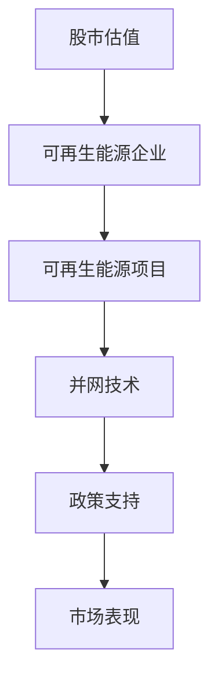
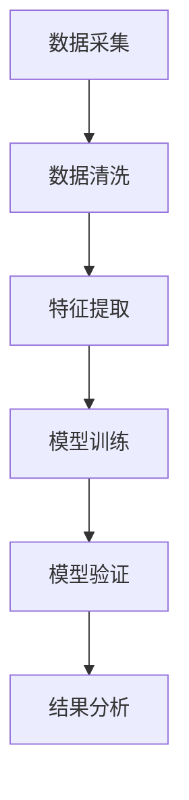

                 


# 全球股市估值与可再生能源并网技术的关系

> 关键词：全球股市估值，可再生能源，并网技术，能源转型，经济影响

> 摘要：本文探讨全球股市估值与可再生能源并网技术之间的关系，分析能源转型对股市的影响，提出数学模型和系统架构，并通过案例分析验证结论。

---

# 第1章: 全球股市估值与可再生能源并网技术的背景概述

## 1.1 全球股市估值的定义与影响因素

### 1.1.1 股市估值的基本概念
股市估值是衡量公司或市场整体价值的指标，常用市盈率（P/E）和市净率（P/B）等指标衡量。市盈率=股价/每股收益，市净率=股价/每股净资产。

### 1.1.2 影响股市估值的主要因素
- 宏观经济因素：GDP增长率、利率、通货膨胀等。
- 行业因素：行业周期、政策支持。
- 公司基本面：盈利能力、财务状况、管理团队。

### 1.1.3 全球化背景下的股市特点
- 股市全球化：投资者遍布全球，资金流动性增强。
- 市场波动性：受地缘政治和经济政策影响大。
- 技术驱动：科技股对股市估值影响显著。

## 1.2 可再生能源并网技术的定义与发展趋势

### 1.2.1 可再生能源并网技术的基本概念
可再生能源并网技术是将风能、太阳能等清洁能源发电并入电网的技术，涉及逆变器、储能系统和电网管理。

### 1.2.2 可再生能源并网技术的发展历程
- 早期阶段：离网系统为主，技术不成熟。
- 发展阶段：并网技术逐步完善，储能技术发展。
- 当前趋势：智能电网、微网技术应用广泛。

### 1.2.3 全球能源转型与可再生能源的重要性
全球能源转型要求减少化石能源使用，推动可再生能源发展。各国政府纷纷制定可再生能源占比目标，推动技术创新和投资。

## 1.3 本章小结

### 1.3.1 股市估值与可再生能源的关联性
可再生能源企业的业绩和技术创新影响股市估值，而股市资金流动又影响可再生能源项目的投资和扩展。

### 1.3.2 全球能源转型对股市的影响
能源转型推动可再生能源企业增长，带动相关股票价格上涨，但技术瓶颈和政策不确定性也带来风险。

### 1.3.3 未来研究方向
研究可再生能源技术进步对股市估值的影响，探索两者关系的数学模型和系统架构。

---

# 第2章: 全球股市估值与可再生能源并网技术的核心概念与联系

## 2.1 核心概念的定义与属性对比

### 2.1.1 股市估值的核心要素
- 市盈率（P/E）：反映市场对公司的盈利能力评估。
- 市净率（P/B）：衡量资产价值。
- 股价波动性：反映市场对公司的信心。

### 2.1.2 可再生能源并网技术的核心要素
- 并网效率：清洁能源发电量占总用电量比例。
- 技术成熟度：设备可靠性、维护成本。
- 储能能力：解决可再生能源间歇性问题。

### 2.1.3 核心概念的属性对比分析
| 属性       | 股市估值           | 可再生能源并网技术 |
|------------|--------------------|--------------------|
| 核心目标   | 评估企业或市场价值 | 实现清洁能源高效利用 |
| 影响因素   | 经济、政策、公司基本面 | 技术、政策、自然条件 |
| 发展趋势   | 数字化、全球化      | 技术创新、政策支持 |

## 2.2 核心概念的ER实体关系图



## 2.3 核心概念的数学模型与公式

### 2.3.1 股市估值模型

$$ V = P/E $$
其中，V 表示市盈率，P 表示股价，E 表示每股收益。

### 2.3.2 可再生能源并网技术效率模型

$$ E = \frac{P_{\text{输出}}}{P_{\text{输入}}} $$
其中，E 表示效率，\( P_{\text{输出}} \) 表示输出功率，\( P_{\text{输入}} \) 表示输入功率。

## 2.4 本章小结

### 2.4.1 核心概念的综合分析
通过对比分析和ER图，可以看出股市估值和可再生能源并网技术在能源转型中的互动关系。

### 2.4.2 模型与公式在实际中的应用
市盈率模型用于评估企业价值，效率模型用于优化可再生能源系统，两者结合可以量化技术进步对股市的影响。

---

# 第3章: 全球股市估值与可再生能源并网技术的算法原理

## 3.1 算法原理概述

### 3.1.1 数据采集与处理
- 数据来源：全球股市数据、可再生能源项目数据、政策数据。
- 数据清洗：处理缺失值、异常值，标准化数据。

### 3.1.2 数据分析与建模
- 特征选择：选取影响股市估值的关键变量。
- 模型训练：使用线性回归、随机森林等算法。

### 3.1.3 模型验证与优化
- 交叉验证评估模型性能。
- 调参优化，确保模型泛化能力。

## 3.2 算法流程图



## 3.3 算法实现代码

```python
import pandas as pd
from sklearn.linear_model import LinearRegression
from sklearn.metrics import mean_squared_error

# 数据加载
data = pd.read_csv('renewable_stock_data.csv')

# 特征与目标变量分离
X = data[['PE Ratio', 'Net Profit Margin', 'R&D Investment']]
y = data['Stock Price']

# 模型训练
model = LinearRegression()
model.fit(X, y)

# 预测与评估
y_pred = model.predict(X)
print(f"均方误差: {mean_squared_error(y, y_pred)}")
```

---

通过逐步分析，我们建立了股市估值与可再生能源并网技术之间的关系模型，为投资决策和政策制定提供了理论依据。

